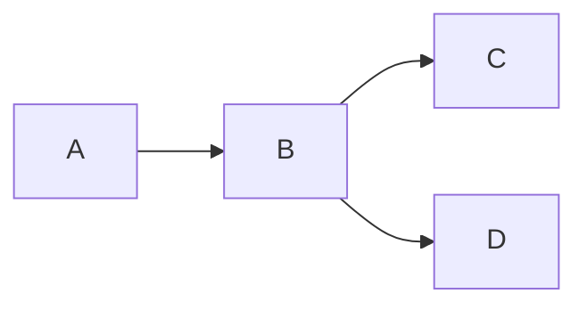

# For installation use bash script
[dtlf sh](dtlf.sh)
```bash
./dtlf.sh
```

# vim locations
*dofiles configs*
~/.config/nvim/* - user config files

*coc files and lsp servers*
~/.config/coc/* - coc config and items

*plugins stored*
~/.local/share/nvim/* - vim plug

*sessions*
~/.local/share/nvim/session/* - startify sessions

*mason*
~/.local/share/nvim/mason/packages/* - lsps servers

*plugin manager*
~/.vim/plugged/* - vim plug

clean nvim settings
```bash
mv ~/.config/nvim ~/.config/nvim_back # - user config files
mv ~/.config/coc ~/.config/coc_back # - coc config and items
mv ~/.local/share/nvim ~/.local/share/nvim_back # - vim plug
mv ~/.vim ~/.vim_back # vim plug
```

# Updating
## Python

pip install outdated items
```bash
python -m pip install pip --upgrade
for i in $(python -m pip list --outdated --format=columns |tail -n +3|cut -d" " -f1)
do python -m pip install $i --upgrade

done
```

# Scratches
```bash
#comment
echo something
echo "something \
      aggg"
echo something
```
spelling error
```bash
echo anything
echo anything
```

```bash
echo anything
# export VAR1='abc'
ak list --public
# echo $VAR1
echo $PROJECT_ROOT
echo $PROJECT_PATH_TMUX
echo $NOTES_ROOT
```

```lua
vim.fn.writefile({'echo header'}, '/tmp/file_write.txt', 'a')
```
call powershell
```bash
#powershell.exe c:\\Users\\czJaBeck\\Dev\\Repositories\\AccessVCS\\tests\\test14.ps1
powershell.exe 'c:\Users\czJaBeck\Dev\Repositories\AccessVCS\tests\test14.ps1'
#cat '/mnt/c/Users/czJaBeck/Dev/Repositories/AccessVCS/tests/test14.ps1'
```

```bash
cd /mnt/c/ && cmd.exe /c echo %TEMP% && cd - | grep C: | sed 's/\xEF\xBB\xBF//g'
```

```powershell
Write-Host 'test2'
```

```pwsh
Write-Host 'test2'
```

```csharp
Console.WriteLine("Hello, World!x4");
```

```cs
if( true ){
  Console.WriteLine("Hello, World!x3");
}
```
testing startifier
```bash
#ls ~/.local/share/nvim/session/
testx=$(find ~/.local/share/nvim/session/ -mindepth 1 -maxdepth 1 -printf '%f\n')
echo $testx
```

```vim
if index(['a','b'],'c') ==-1
  " echom expand('<cword>')
  let fname = tempname()
  let fname = substitute(fname,'/','','g') . '.ps1'
  let win_tmpps = trim(system('cd /mnt/c/ && cmd.exe /c echo %TEMP% && cd - | grep C: ')) . '\'

  let unx_tmpps = substitute(win_tmpps,'\\','/','g')
  let unx_tmpps = substitute(unx_tmpps,'C:','/mnt/c','g')
  ""let unx_tmpps = '/mnt/c/Users/czJaBeck/AppData/Local/Temp/' . fname
  let win_tmpps = win_tmpps . fname
  let unx_tmpps = unx_tmpps . fname
  echom win_tmpps
  echom unx_tmpps
  call writefile(['Write-Host hello'], unx_tmpps)

  let cmd = 'powershell.exe ''' . win_tmpps . ''''
  call VimuxRunCommand(cmd)

endif
```
```lua
-- print('hello')
print('hello')
```

```vim
function! MyBuffprint()
  let tpbl = []
  let tpbl = tabpagebuflist()

  for buf in filter(range(1, bufnr('$')), 'bufexists(bufname(v:val)) && index(tpbl, v:val)>=0')
  ""  if getbufvar(buf, '&buftype') ==? 'terminal'

      echom "******"
      echom bufname(buf)
      echom getbufvar(buf, '&filetype')
      echom getbufvar(buf, '&filetype') == "fugitive"

      let bfname = bufname(buf)
      let posm = matchstrpos(bfname,'\.git\/\/0\/')
      " if bufname(buf) == ".git/index"
      echom "----"
      echom posm
      echom bfname[posm[2]:]
      " set switchbuf=useopen
      " execute "sb" bufname(buf)
      ""echom getbufvar(buf, '&')
      ""return
     " endif
  endfor
""echom expand('%')
endfunction
call MyBuffprint()
```

```vim
let tpbl = []
let tpbl = tabpagebuflist()

let wttgtbufid = -1
let wtbufid = -1
let stagebuf = -1
let wttgtbufname = ""

for buf in filter(range(1, bufnr('$')), 'bufexists(bufname(v:val)) && index(tpbl, v:val)>=0')
""  if getbufvar(buf, '&buftype') ==? 'terminal'
""   echom getbufvar(buf, '&filetype')
if bufname(buf) == "README.md"
echom len(win_findbuf(buf))
endif

echom bufname(buf)
if bufname(buf) == ".git/index"
""set switchbuf=useopen
""execute "sb" bufname(buf)
echom "main"
""return
let stagebuf = buf
endif

fu! StartsWith(longer, shorter) abort
  return a:longer[0:len(a:shorter)-1] ==# a:shorter
endfunction

if StartsWith(bufname(buf),"fugitive://" )
""echom expand(bufname(buf):e)
echom matchstrpos(bufname(buf),'\.git\/\/0\/')
let posm = matchstrpos(bufname(buf),'\.git\/\/0\/')
let wttgtbufname = bufname(buf)[posm[2]:]
let wttgtbufid = bufnr(wtbufname)
let wtbufid = buf
echom len(win_findbuf(wttgtbufid))
""set switchbuf=useopen
""echom getbufvar(buf, '&')

""execute "sb" bufname(buf)
echom "worktree"


""return
endif

endfor
""echom expand('%')
set switchbuf=useopen
execute "sb" bufname(stagebuf)

if wtbufid != -1

execute "bd" wtbufid
execute "bd" wttgtbufid

endif

echom expand("<cfile>")
if expand("<cfile>") != wttgtbufname
echom 'ndiff'
normal o
execute "Gdiffsplit"
""set switchbuf=useopen
""execute "sb" bufname(stagebuf)
""normal dd
set switchbuf=useopen
execute "sb" bufname(stagebuf)
else
echom 'none'
endif


""execute "sp"
""normal gg
""normal jj


```

```vim
""execute "wincmd" "K"
""exe "normal! |<c-w>|s"
echom expand("<cfile>")
```

```org
* Heading
#+begin_src bash
#code goes here
echo bash_comment

#+end_src
```


```vim
echom 'paragarph first command'
echom getline('.')[2:] "command line content current cursor
echom getline(line("'{")+1) "line content on the beginning of paragraph
```

test lua embedded in vim
```vim
lua << EOF

print('abf')

EOF
```

```lua

function get_bufnr_by_name(buf_name)

    if (vim.fn.bufexists(buf_name) == 1 )then

        local buf_nr = vim.fn.filter(
            vim.fn.map(
                vim.api.nvim_list_bufs()
                , function(k,v) return {v,vim.api.nvim_buf_get_name(v)} end
                )
            , function(k,v) return v[2] == buf_name  end
            -- , function(k,v) return v[1] > 24 end
            )[1][1]
        return buf_nr
    else
        return -1
    end

end

function remove_buf_by_name(buf_name)

    local buf_nr=get_bufnr_by_name(buf_name)

    if (buf_nr ~= -1) then
        --fully remove buffer
        print(vim.api.nvim_buf_delete(buf_nr,{force=1}))

        --remove file
        print('removed - ' .. buf_name)
        return -1
    else
        print('not found - ' .. buf_name)
        return 0
    end

end

function add_buf(buf_name)

    local buf_nr=get_bufnr_by_name(buf_name)

    if (buf_nr == -1) then

        -- print(vim.fn.filewritable(buf_name))
        -- print(vim.fn.filereadable(buf_name))
        -- print(vim.fn.bufexists(buf_name))

        print('added - ' .. buf_name)
        return vim.fn.bufadd(buf_name)
    else

        print('already opened - ' .. buf_name)
        return buf_nr
    end

end


function vertical_split_win(win_nr)
    win_nr = win_nr or 0

    vim.api.nvim_set_current_win(win_nr)
    vim.cmd('split')
    local win = vim.api.nvim_get_current_win()
    return win

end

-- pri

local journal_file = vim.fn.expand('~/wiki/org/journals/' .. os.date('%y%m-%d-%w.org') .. '.org')

local win_nr= vertical_split_win(1014)

print(get_bufnr_by_name(journal_file))

local buf_nr = add_buf(journal_file)

print(vim.api.nvim_win_set_buf(win_nr, buf_nr))

-- print(remove_buf_by_name(journal_file))


-- print(winnr)
print(journal_file)
```

list all windows in diff mode
```vim
echo filter(range(1, winnr('$')), 'getwinvar(v:val, "&diff") == 1')
```

```vim
echom expand('./nvim/init.vim')
echom filereadable('./nvim/init.vim')
```

buffer status
```vim
source ./nvim/scripts/vim/fugidiff.vim
let r = Checkdiff()
echom r
```



Current buffer items
```vim
source ./nvim/scripts/vim/fugidiff.vim
call DiffTog(0)
```

Switch to window do action and do back
```vim
let currwin = winnr()
execute 3 . 'wincmd w'
normal ]c
execute currwin . 'wincmd w'

```

switch to next item
```vim
source ./nvim/fugidiff.vim
call NextItem()
```
```vim
source ./nvim/fugidiff.vim
echo EndsWith('cd','cd')
```

test lua embedded in vim
```vim
lua << EOF
local hydrastatus = require('hydra.statusline')

      local modes = {
        n = {name = 'NORMAL',bg = 'abc'},
        i = {name = 'INSERT',bg = 'abc'},
        v = {name = 'VISUAL',bg = 'abc'},
        [''] = {name = 'V-Block',bg = 'abc'},
        V = {name = 'V-Line',bg = 'abc'},
        c = {name = 'COMMAND', bg = 'abc'},
        R = {name = 'REPLACE', bg = 'abc'},
        Rv = {name = 'V-Replace', bg = 'abc'},
        t = {name = 'TERMINAL', bg = 'abc'},
      }
     -- modes.n = 'NORMAL'
mode = 'n'

--print(modes[vim.fn.mode()].name)
print(modes[mode].name)

EOF
```

```vim
echo 'abc'
```
