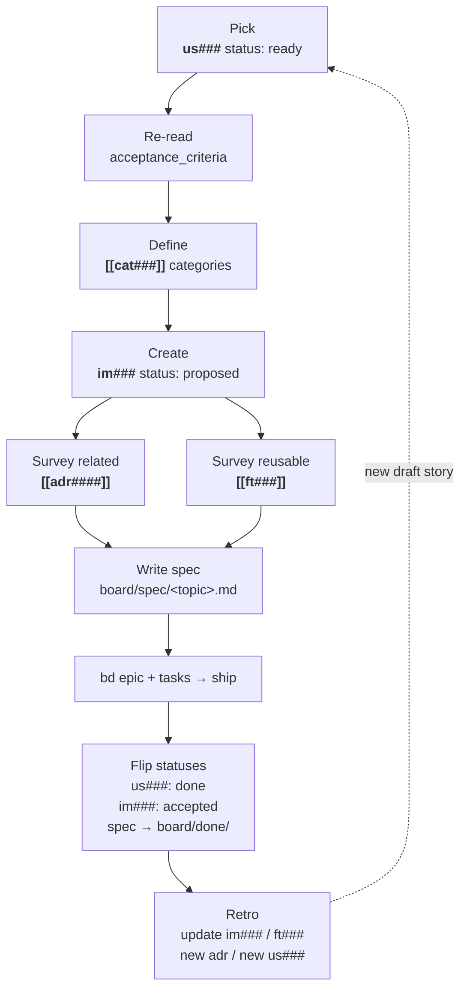

---
aliases:
  - agentic knowledge model
  - knowledge model
status: stable
created: 2026-05-14
---
# AKM — Agentic Knowledge Model [[product]]

Catalog of every data object in the `docs/` PKM. One row per object type:
purpose, location, naming, frontmatter, body schema, required wikilinks,
lifecycle. Use this when adding a new note so the shape stays consistent
and tools (moxide LSP, grep, wikilink graph) keep working.

**Workspace layout.**

```text
docs/
├── .markdownlint.json   ← lint relaxations (MD022, MD032)
├── .moxide.toml         ← markdown-oxide LSP workspace config
├── product.md           ← singleton hub (workspace landing)
├── assets/              ← images / diagrams / attachments
│   └── .gitkeep             (moxide-excluded; not indexed)
└── notes/               ← every zettel lives here
    ├── .gitkeep
    ├── akm.md               ← this knowledge model
    ├── daily/               ← daily journal (YYYY-MM-DD.md)
    ├── us###.md             ← Stories
    ├── pn###.md             ← Personas
    ├── ft###.md             ← Features
    ├── im###.md             ← Implementations
    ├── adr####.md           ← ADRs
    └── cat###.md            ← Categories
```

**`docs/.moxide.toml` — markdown-oxide LSP config.** Workspace tuning
for the editor (LSP). Raw file at the bottom of this doc; setting
walkthrough:

- `dailynote = "%Y-%m-%d"` — daily-note filename template.
- `new_file_folder_path = "notes"` — new zettel land in `notes/`.
- `daily_notes_folder = "notes/daily"` — daily notes go under
  `notes/daily/`.
- `link_filenames_only = true` — `[[us001]]` resolves anywhere in
  the workspace; no path prefix required.
- `include_md_extension_md_link = false` /
  `include_md_extension_wikilink = false` — wikilinks omit the
  `.md` suffix.
- `case_matching = "Smart"` — `[[us001]]` ≡ `[[US001]]` unless mixed
  case is explicit.
- `unresolved_diagnostics = true` — surface dangling wikilinks as
  diagnostics (the source of truth for link health).
- `heading_completions = true` / `title_headings = true` — H1
  contributes to link completion.
- `inlay_hints`, `semantic_tokens`, `block_transclusion` — editor
  niceties; leave on.
- `excluded_folders = ["assets"]` — keep binary attachments out of
  the indexed graph.

**`docs/.markdownlint.json` — lint relaxations.** Two rules muted
(raw file at the bottom of this doc):

- `MD022` (blanks-around-headings) — off. Some schemas pack
  metadata directly under H2s without a blank.
- `MD032` (blanks-around-lists) — off. Same reason: tight zettel
  bodies.

Everything else stays at markdownlint defaults.

**Mapping to [[product]] sections.** The hub groups zettel under
section headings; this catalog defines their schemas:

| `[[product]]` section | Zettel types defined below |
|---|---|
| Stories               | [Story](#story--usmd)               |
| Features              | [Feature](#feature--ftmd) (reusable building blocks) |
| Implementations (consumed by stories) | [Implementation](#implementation--immd) |
| Architecture Decision Records | [ADR](#adr--adrmd)         |
| Categories            | [Category](#category--catmd)        |
| (subordinate to Stories) | [Persona](#persona--pnmd)        |
| (the hub itself)      | [Product](#product--productmd)      |

---

## Product — `product.md` *(singleton hub)*

**Purpose.** Central navigation hub for the workspace. Lists every
typed zettel grouped under section headings (Stories by persona,
Features, ADRs by category, Categories, plus a reference link to this
catalog). One file per workspace; not a typed zettel — it has no id
and no `Index:` footer (it *is* the index).

**Location.** `docs/product.md` (workspace root, **not** under
`docs/notes/`).

**Frontmatter.** None required.

**Body schema.**

```markdown
# Product

<one-paragraph mission statement of the workspace>

## Stories

### [[pn###|<persona>]]

- [[us###|<want clause>]]
- [[us###|<want clause>]] >> [[im###]]   # `>>` marks an implementation link

## Features

- [[ft###|<capability>]]
- [[ft###|<capability>]]

## Architecture Decision Records

### [[cat###|<category>]]

- [[adr####|<decision>]]
- [[adr####|<decision>]]

## AKM Reference

- [[akm]] — knowledge model: every zettel type, its schema and life-cycle
```

**Required wikilinks.** Every typed zettel (`us###`, `pn###`, `ft###`,
`adr####`, `cat###`) that exists in `docs/notes/` should appear under
exactly one section heading. The `[[akm]]` reference at the bottom is
mandatory.

**Conventions.**

- Stories grouped by persona (H3 = persona link, bullets = stories).
- A story that already has an implementation can be annotated with
  `>> [[im###]]` after its wikilink. Optional.
- ADRs carry their `— [[cat###]]` taxonomy on the same line.
- Categories listed flat on one line (single visual chain).
- No `Index:` footer — Product is the index.

**Lifecycle.**

- **Living.** Updated by hand each time a typed zettel is added,
  retired, or supersedes another. Append to the right section, remove
  retired entries. Treat as the workspace's home page.
- **Singleton.** Never duplicate. If the hub gets too long, split
  sections into sub-pages but keep `docs/product.md` as the top-level
  entry point.

---

## Story — `us###.md`

**Purpose.** Connextra-style user story. Single deliverable unit of
user-visible behavior.

**Location.** `docs/notes/us###.md` (three-digit zero-padded id).

**Frontmatter.**

```yaml
aliases:
  - <human-readable want clause>
status: <draft|ready|in_progress|done|dropped>
created: YYYY-MM-DD
```

**Body schema.**

```markdown
# Story [[<flow-or-area>]] [[<theme>]] [[product]]

## role
[[pn###|<persona-alias>]]

## want
<want clause>

## because
<motivation>

## acceptance_criteria
- <criterion>
- <criterion>

---

Index: [[product]]
```

**Required wikilinks.** `[[product]]` in the H1, the `role` link to a
[[pn###]] persona, and the `Index: [[product]]` footer. Additional
flow/theme tag wikilinks in the H1 (e.g. `[[requestor-flow]]
[[catalog]]`) are optional grouping tags — they may dangle until a
backing zettel exists.

**Lifecycle.**
- `draft` — captured, not refined. Acceptance criteria may be incomplete.
- `ready` — refined, sized, ready for spec-writing.
- `in_progress` — bd epic exists and is being worked.
- `done` — merged. Implementation card carries the bd-epic link.
- `dropped` — abandoned. Keep file for history; mark status, no delete.

---

## Feature — `ft###.md`

**Purpose.** Stable, reusable common implementation — a horizontal
capability the system provides once and many Implementations consume.
Think notification service, authentication, database access,
audit-log. Decoupled from stories on purpose: a feature is a building
block, not a deliverable. Maps to the `## Features` section in
[[product]].

**Why it exists.**

- Avoid redeploying the same code under different names.
- Surface shared constraints (rate limits, retention, SLAs) in one
  place so downstream Implementations inherit them.
- Make reuse visible: "this Implementation uses [[ft003]]" instead of
  re-describing notification plumbing each time.

**Location.** `docs/notes/ft###.md` (three-digit zero-padded id).

**Relationship to other objects.**

- No direct `solves` link to a story. Features serve Implementations,
  Implementations serve stories.
- Consumed via the Implementation `features` field (back-refs surface
  through moxide / grep, not stored on the Feature itself).
- H1 categories — one or more [[cat###]] taxonomy buckets that locate
  the capability (security, data, infrastructure, etc.), ADR-style.
- May `depends_on` another Feature when capabilities layer
  (e.g. notifications → templating).

**Frontmatter.**

```yaml
aliases:
  - <human-readable capability one-liner>
status: <proposed|stable|deprecated|superseded>
created: YYYY-MM-DD
```

**Body schema.**

```markdown
# Feature [[cat###]] [[cat###]] [[product]]

## providing
<one-paragraph: what capability this provides, who/what consumes it>

## api_surface
<how consumers invoke it: function, endpoint, message contract>

## data_model
<own state, if any — schema, retention, ownership>

## sample
<sample code snippet or link to a sample file showing how to implement / consume the feature>

## components
- <module / file / path>
- <module / file / path>

## superseded_by
[[ft###|<replacement>]]        # only when status = superseded

---

Index: [[product]]
```

**Required wikilinks.** At least one `[[cat###]]` in the H1,
`[[product]]` in the H1, and the `Index: [[product]]` footer.

**Lifecycle.**

- `proposed` — design under discussion. No production consumers yet.
- `stable` — at least one Implementation consumes it; constraints are
  the contract.
- `deprecated` — no longer recommended; existing consumers may stay
  until migrated. No forward link.
- `superseded` — replaced by a newer feature. Frontmatter `status` is
  `superseded`; the `## superseded_by` body section carries the
  `[[ft###]]` wikilink. Existing consumers should migrate.

Features are append-only like ADRs. Tighten the `providing` /
`api_surface` contract only when reality demands; widening means a
new Feature.

---

## Implementation — `im###.md`

**Purpose.** Stable record of *how* a story's problem was solved by
composing Features plus the story-specific glue. Persistent
counterpart to the transient board-level spec: the spec is the plan +
acceptance criteria for execution; the implementation card is the
resulting solution shape that outlives the spec. Sits between Story
(problem) and Spec (plan): a story should not be specced until an
implementation card exists for it.

**Location.** `docs/notes/im###.md` (three-digit zero-padded id).

**Relationship to other objects.**

- `solves` — back-link to the [[us###]] story whose problem this
  card answers.
- `features` — [[ft###]] capabilities this implementation consumes.
  Each listed Feature's constraints become this Implementation's
  inherited constraints; the Feature is not re-described here.
- H1 categories — one or more [[cat###]] taxonomy buckets relevant
  to the proposed solution (architecture, data, security, etc.) live
  directly in the H1, ADR-style. Replaces a flat ADR dependency list
  — ADRs that matter surface via the category, not by direct link.
- `specs` — board specs that touched or delivered this
  implementation (`board/spec/<topic>.md` while active,
  `board/done/<topic>.md` once archived). The spec is transient; the
  implementation card persists the resulting solution shape.

**Frontmatter.**

```yaml
aliases:
  - <human-readable solution one-liner>
status: <proposed|accepted|superseded>
created: YYYY-MM-DD
```

**Body schema.**

```markdown
# Implementation [[cat###]] [[cat###]]

## solves
[[us###|<story-alias>]]

## approach
<one-paragraph chosen solution shape: pattern, layering, key trade-off>

## features
- [[ft###|<feature>]]
- [[ft###|<feature>]]

## data_model
<schema deltas / glue tables this implementation owns; features carry their own state>

## api_surface
<endpoints, payloads, contracts this implementation adds — exclude what features already expose>

## components
- <story-specific glue: module / file / path>
- <story-specific glue: module / file / path>

## specs
- [[sp###|<spec-title>]]
- [[sp###|<spec-title>]]

## superseded_by
[[im###|<replacement>]]        # only when status = superseded

---

Index: [[product]]
```

**Required wikilinks.** `solves` to a `[[us###]]`, at least one
`[[cat###]]` in the H1, every consumed Feature in `features` as
`[[ft###]]`, and the `Index: [[product]]` footer.

**Lifecycle.**

- `proposed` — drafted before spec is written. May still be revised.
  Spec-writing should reference this card and not start until it
  exists.
- `accepted` — the spec(s) listed in `specs` shipped. Body stays as
  the persistent solution record. Mutate only `components` /
  `data_model` / `api_surface` if reality drifts, never the
  historical narrative.
- `superseded` — replaced by a newer implementation. Frontmatter
  `status` is `superseded`; the `## superseded_by` body section
  carries the `[[im###]]` wikilink.

Implementation cards are append-only in spirit, like ADRs. Reshape
the codebase by writing a new card and superseding, never by
rewriting history on an `accepted` card.

---

## ADR — `adr####.md`

**Purpose.** Architectural Decision Record. One immutable decision per
file. Numbered sequentially (`adr0001` …).

**Location.** `docs/notes/adr####.md` (four-digit zero-padded).

**Frontmatter.**

```yaml
aliases:
  - <decision one-liner, same as ## title>
status: <Proposed|Accepted|Deprecated|Superseded>
created: YYYY-MM-DD
```

**Body schema.**

```markdown
# ADR [[cat###]] [[product]]

## title
<decision one-liner>

## context
<forces, constraints, problem>

## decision
<what we chose>

## consequences
<positive + negative; what it locks us into>

## superseded_by
[[adr####|<replacement>]]      # only when status = Superseded

---

Index: [[product]]
```

**Required wikilinks.** Exactly one `[[cat###]]` category link in H1,
`[[product]]` in H1, `Index: [[product]]` footer. ADRs are filed under
a single primary category — pick the most accurate bucket rather than
listing several. If superseded, link the replacing ADR via the
`## superseded_by` body section.

**Lifecycle.**
- `Proposed` — under review.
- `Accepted` — current. Mutate only `consequences` if reality drifts.
- `Deprecated` — no longer apply, no replacement.
- `Superseded` — replaced. Frontmatter `status` is `Superseded`; the
  `## superseded_by` body section carries the `[[adr####]]` wikilink.

ADRs are append-only in spirit: never rewrite history. Create a new ADR
to overturn a decision.

---

## Category — `cat###.md`

**Purpose.** Taxonomy bucket for ADRs (and reusable as a tag for any
zettel). Stable, slow-changing.

**Location.** `docs/notes/cat###.md`.

**Frontmatter.**

```yaml
aliases:
  - <category name>
status: stable
created: YYYY-MM-DD
```

**Body schema.**

```markdown
# Category [[product]]

## name
<category name>

## summary
<one-liner: what kinds of decisions belong here>

---

Index: [[product]]
```

**Lifecycle.** Add when needed, never delete. Rename triggers wikilink
audit across all ADRs.

---

## Persona — `pn###.md` *(supporting type)*

**Purpose.** A user role the system serves. Anchors stories via
`role`. Not surfaced as its own section in [[product]]; personas
appear as subheadings under `## Stories` to group the backlog.

**Location.** `docs/notes/pn###.md`.

**Frontmatter.**

```yaml
aliases:
  - <short role label, e.g. requestor>
status: <draft|validated|retired>
created: YYYY-MM-DD
```

**Body schema.**

```markdown
# Persona [[product]]

## name
<full role name, e.g. Field Sales Rep>

## summary
<one-paragraph context: who, where, why they touch the system>

## primary_goals
- <goal>
- <goal>

## open_questions
- <unresolved discovery question>

---

Index: [[product]]
```

**Required wikilinks.** `[[product]]` in H1, `Index: [[product]]` footer.

**Lifecycle.**

- `draft` — captured but `open_questions` still populated.
- `validated` — `open_questions` empty (or moved to ADR/decision log).
- `retired` — role no longer served. Keep file; add `## retired` section.

---

## Board zettel types

Specs are board citizens: transient deliverables that move idea → spec →
ready → done across the workflow. They use `[[board]]` as Index while
active, `[[archive]]` once shipped. Distinct from product zettel (us,
pn, ft, im, adr, cat) which point at `[[product]]`.

---

## Spec — `sp###.md`

**Purpose.** Single deliverable workstream. Carries the problem,
chosen solution, execution plan, and structured task breakdown for
one shippable unit. Persistent counterpart to ad-hoc `board/*.md`
files: same lifecycle (idea→spec→ready→done), now an addressable
zettel with stable id.

**Location.** `docs/notes/sp###.md` (three-digit zero-padded).

**Relationship to other objects.**

- `solves` — back-link to the [[us###]] story (or stories) this spec
  delivers.
- `implements` — [[im###]] solution shape this spec executes.
- `features` — [[ft###]] capabilities the plan touches.
- `adrs` — [[adr####]] decisions the spec leans on.
- H1 categories — one or more [[cat###]] taxonomy buckets.

**Frontmatter.**

```yaml
aliases:
  - <spec one-liner>
status: <idea|spec|ready|done>
created: YYYY-MM-DD
```

**Body schema.** Sections grow with lifecycle. `## problem` lands at
`idea`; `## solution` at `spec`; `## plan` + `## tasks` at `ready`;
`bd` ids attach to each task at `ready` (by spec-ready). Lifecycle
owner column shows which infinifu skill writes each section.

```markdown
# Spec [[cat###]] [[board]]

## solves
[[us###|<story-alias>]]

## implements
[[im###|<solution-alias>]]

## problem
<goal + motivation; written at idea stage>

## solution
<approach, ADR references, consumed features; written at spec stage>

## plan
<file tree, conventions, anti-patterns, known limitations; written at refinement>

## tasks

### Task 1: <name>

#### type
task | feature | bug

#### effort
<Xh, ≤8h ideal — break down if larger>

#### depends
- <task-id or — none>

#### files_touched
- <path>

#### success_criteria
- <verifiable criterion>

#### edge_cases
- <failure mode>

#### test_plan
- <test name + what it catches>

#### bd
<id>   ← attached by spec-ready

### Task 2: <name>
...

## superseded_by
[[sp###|<replacement>]]        # only when status = done and a follow-up spec replaces it

---

Index: [[board]]      # while status ∈ {idea, spec, ready}
Index: [[archive]]    # once status = done
```

**Required wikilinks.** `[[board]]` or `[[archive]]` in H1 + footer
(state-driven), at least one `[[cat###]]` in H1, `solves` to a
`[[us###]]`, `implements` to an `[[im###]]`.

**Lifecycle.**

- `idea` — captured via idea-brainstorming. `## problem` populated.
  Listed under `## idea` in [[board]].
- `spec` — solution chosen via spec-writing. `## solution` populated.
  Listed under `## spec` in [[board]].
- `ready` — refined via spec-refinement (SRE 8-category pass); bd ids
  attached via spec-ready. `## plan` + `## tasks` populated. Listed
  under `## ready` in [[board]].
- `done` — merged via work-merge. Footer flipped to `[[archive]]`.
  Removed from [[board]], added to [[archive]].

---

## Board — `board.md` *(singleton hub)*

**Purpose.** Active-work index. Lists every `sp###` whose status is
`idea`, `spec`, or `ready`, grouped under section headings matching
those states. Replaces the legacy `board/idea/` / `board/spec/` /
`board/ready/` directory layout: one hub file, sections instead of
subdirs.

**Location.** `docs/board.md` (workspace root, not under
`docs/notes/`).

**Frontmatter.** None required.

**Body schema.**

```markdown
# Board

<one-paragraph what's in flight right now>

## idea

- [[sp###|<spec-title>]]
- [[sp###|<spec-title>]]

## spec

- [[sp###|<spec-title>]]

## ready

- [[sp###|<spec-title>]]
```

**Required wikilinks.** Every `sp###` whose status ∈ {idea, spec,
ready} should appear under exactly one section heading matching its
status. Move between sections when `sp###.status` flips.

**Lifecycle.** Living. No `Index:` footer — Board is its own index.

---

## Archive — `archive.md` *(singleton hub)*

**Purpose.** Done-work index. Lists every `sp###` whose status is
`done`. Mirror of [[board]] for shipped work.

**Location.** `docs/archive.md` (workspace root).

**Frontmatter.** None required.

**Body schema.**

```markdown
# Archive

<one-paragraph what shipped, optionally grouped by quarter / theme>

## done

- [[sp###|<spec-title>]]
- [[sp###|<spec-title>]]
```

**Lifecycle.** Append-only. `sp###` enters here on work-merge; never
removed. No `Index:` footer — Archive is its own index.

---

## Schema invariants (apply across all zettel)

1. Filename = stable id. Aliases carry the human label.
2. `# <Type>` H1 carries `[[product]]` plus any taxonomy wikilinks
   (e.g. `[[cat###]]`).
3. `Index: [[product]]` footer on every typed zettel.
4. Use `[[id|label]]` form when label differs from filename slug.
5. Dates in ISO `YYYY-MM-DD`.
6. `status` and `created` live in YAML frontmatter (machine-queryable),
   not in the body. `superseded_by` stays in the body as a
   `## superseded_by` section carrying a `[[…]]` wikilink — YAML
   doesn't parse wikilinks, so the forward pointer is body-side.
7. Never delete a `done` or `Accepted` zettel — supersede in place.
8. moxide LSP is the source of truth for link health
   (`unresolved_diagnostics = true`).

---

## Process flow — implementing a Story

How a Story moves from `ready` to `done` through the catalog. Each
step lands a concrete artifact in the PKM or on the board.



Detailed steps below.


1. **Pick a Story.** Open [[product]] `## Stories`. Choose a
   `[[us###]]` whose frontmatter `status: ready` (or pull a `draft`
   and refine first — fill `## acceptance_criteria`, then flip to
   `ready`).

2. **Re-read acceptance criteria.** Confirm the story's
   `## acceptance_criteria` is complete and testable. If anything is
   vague, refine before moving on — no point in implementing against
   a moving target.

3. **Define categories.** Decide which `[[cat###]]` taxonomy buckets
   the solution touches (data, security, infrastructure, testing,
   …). These will live in the Implementation H1 (one or more, unlike
   ADRs which require exactly one).

4. **Create the Implementation zettel.** New
   `docs/notes/im###.md` following the
   [Implementation](#implementation--immd) schema:
   - H1: `# Implementation [[cat###]] [[cat###]]`
   - `solves: [[us###|<story-alias>]]`
   - Frontmatter `status: proposed`, `created: <today>`

5. **Survey related ADRs.** From [[product]] `## Architecture
   Decision Records` under the same categories, scan for accepted
   decisions that constrain the solution. Capture the chosen
   approach in the Implementation `## approach` (mention the ADRs
   that bind the trade-offs).

6. **Survey available Features.** Check [[product]] `## Features`
   for reusable building blocks (notification, auth, database,
   audit-log, …). For every one consumed, list `[[ft###]]` in the
   Implementation `## features` — each Feature's `constraints` are
   inherited automatically, no re-stating in this card.

7. **Prepare the Spec.** With the Implementation in place, write
   `board/spec/<topic>.md`: the *plan + execution-level acceptance
   criteria* (transient, board-side). Back-reference it from the
   Implementation `## specs` list. The Spec is what bd carves into
   epics + tasks.

When the Spec ships:

- Implementation `status: proposed` → `accepted`
- Story `status: ready` → `done`
- Spec moves from `board/spec/` → `board/done/`

8. **Retro the Implementation.** End-of-lifecycle pass once the bd
   epic is closed and the spec is archived:
   - Rewrite the Implementation `## approach` / `## components` /
     `## data_model` / `## api_surface` to match what actually
     shipped. The `proposed` narrative is now history — the
     `accepted` card is the source of truth.
   - For every `[[ft###]]` Feature touched (constraints loosened,
     api_surface changed, new consumer added), update that Feature
     zettel. Features are append-only in spirit, so widen
     intentionally and consider a `superseded_by` chain when the
     contract genuinely changed.
   - For every `[[adr####]]` whose decision shifted during
     execution, file a *new* ADR overturning or extending it. ADRs
     are immutable; the retro produces new entries, not edits.
   - File any newly-discovered work as a fresh `[[us###]]` story in
     `status: draft`. The retro is the cheapest moment to capture
     scope that surfaced during implementation.

---

## Appendix — config file snippets

### `docs/.moxide.toml`

```toml
# markdown-oxide PKM workspace config
# Workspace root: ./docs/
# Notes (zettel) live in ./docs/notes/
# Assets live in ./docs/assets/ (managed outside moxide — Obsidian attachmentFolderPath if used)

dailynote = "%Y-%m-%d"

new_file_folder_path = "notes"
daily_notes_folder = "notes/daily"

heading_completions = true
title_headings = true
unresolved_diagnostics = true
semantic_tokens = true

link_filenames_only = true

include_md_extension_md_link = false
include_md_extension_wikilink = false

case_matching = "Smart"

inlay_hints = true
block_transclusion = true
block_transclusion_length = "Full"

excluded_folders = ["assets"]
```

### `docs/.markdownlint.json`

```json
{
  "MD022": false,
  "MD032": false
}
```

---

Index: [[product]]
