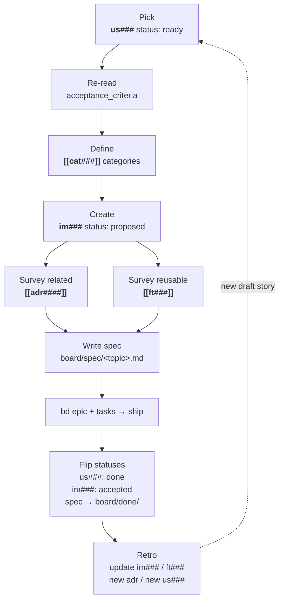

---
aliases:
  - agentic knowledge model
  - knowledge model
status: stable
created: 2026-05-14
---
# AKM — Agentic Knowledge Model [[product]]

Top-level overview of the `docs/` PKM: which zettel types exist, where
they live, how they relate to the singleton hubs (`product.md`,
`board.md`, `archive.md`), and how a story flows from idea to shipped.
Use this for cross-type perspective.

Per-type schemas (frontmatter shape, body sections, required wikilinks,
lifecycle states, ID generation) are owned by the typed writer skills —
this file points at them, it does not duplicate them. Cross-type styling
(atomicity, 80-char wrap, link discipline, post-write audit) is owned
by `infinifu:zettel-write`. See the mapping table below.

**Workspace layout.**

```text
docs/
├── .markdownlint.json   ← lint relaxations (MD022, MD032)
├── .moxide.toml         ← markdown-oxide LSP workspace config
├── product.md           ← singleton hub (workspace landing)
├── board.md             ← singleton hub (active sp###: idea/spec/ready)
├── archive.md           ← singleton hub (shipped sp###: done)
├── assets/              ← images / diagrams / attachments
│   └── .gitkeep             (moxide-excluded; not indexed)
└── notes/               ← every zettel lives here
    ├── .gitkeep
    ├── akm.md               ← this knowledge model
    ├── daily/               ← daily journal (YYYY-MM-DD.md)
    ├── spec/                ← board-citizen specs
    │   └── sp###.md             Specs
    ├── us###.md             ← Stories
    ├── pn###.md             ← Personas
    ├── ft###.md             ← Features
    ├── im###.md             ← Implementations
    ├── adr####.md           ← ADRs
    └── cat###.md            ← Categories
```

**`docs/.moxide.toml` — markdown-oxide LSP config.** Workspace tuning
for the editor (LSP). Raw file at the bottom of this doc; setting
walkthrough:

- `dailynote = "%Y-%m-%d"` — daily-note filename template.
- `new_file_folder_path = "notes"` — new zettel land in `notes/`.
- `daily_notes_folder = "notes/daily"` — daily notes go under
  `notes/daily/`.
- `link_filenames_only = true` — `[[us001]]` resolves anywhere in
  the workspace; no path prefix required.
- `include_md_extension_md_link = false` /
  `include_md_extension_wikilink = false` — wikilinks omit the
  `.md` suffix.
- `case_matching = "Smart"` — `[[us001]]` ≡ `[[US001]]` unless mixed
  case is explicit.
- `unresolved_diagnostics = true` — surface dangling wikilinks as
  diagnostics (the source of truth for link health).
- `heading_completions = true` / `title_headings = true` — H1
  contributes to link completion.
- `inlay_hints`, `semantic_tokens`, `block_transclusion` — editor
  niceties; leave on.
- `excluded_folders = ["assets"]` — keep binary attachments out of
  the indexed graph.

**`docs/.markdownlint.json` — lint relaxations.** Two rules muted
(raw file at the bottom of this doc):

- `MD022` (blanks-around-headings) — off. Some schemas pack
  metadata directly under H2s without a blank.
- `MD032` (blanks-around-lists) — off. Same reason: tight zettel
  bodies.

Everything else stays at markdownlint defaults.

**Mapping to [[product]] sections + schema owners.** The hub groups
zettel under section headings; per-type schemas live with the typed
writer skills (each one owns frontmatter shape, body sections, lifecycle,
and ID generation for its type). This catalog only carries the
type's role inside the AKM model and points at the writer skill.

| `[[product]]` section | Type | Schema owner |
|---|---|---|
| Stories               | `us###` | `infinifu:story-write` |
| Features              | `ft###` | `infinifu:feature-write` |
| Implementations       | `im###` | `infinifu:implementation-write` |
| Architecture Decision Records | `adr####` | `infinifu:adr-write` |
| Categories            | `cat###` | `infinifu:category-write` |
| (subordinate to Stories) | `pn###` | `infinifu:persona-write` |
| (the hub itself)      | `product.md` | this file (singleton hub schema below) |
| (board citizen)       | `sp###` | `infinifu:spec-writing` / `spec-refinement` / `spec-ready` |

Cross-type styling (atomicity, 80-char wrap, link discipline, post-write
audit) is owned by `infinifu:zettel-write` and applied uniformly by every
typed writer.

---

## Workspace Resolution — main worktree only (strict)

AKM zettels (`us###`, `pn###`, `ft###`, `im###`, `adr####`, `cat###`)
plus the singleton hubs (`product.md`, `board.md`, `archive.md`) describe
shared product knowledge. They live on **main**, never on feature branches.

**Strict-mode rule.** Every AKM operation — read, search, *and* write — must
run from inside the main worktree. Feature worktrees exist solely for code
work (`work-do` / `work-audit` cycle); they have no AKM access at all. This
keeps the agent's mental model honest: when AKM is involved you are on main,
when AKM is silent you are coding in a worktree.

Earlier iterations let `akm-root` silently redirect feature-worktree writes
to the main worktree path. That ergonomic shortcut masked accidents — agents
could stage on main without context switching, and stray AKM mutations could
go un-committed because the agent's `git add .` ran in the wrong worktree.
Strict mode collapses that surface: the resolver refuses outright.

**Rule for skills that touch AKM files:** call `akm-root`, *check the exit
code*, surface its stderr to the user, and abort on non-zero. Anchor every
path to `<akm-root>/docs/...` only after a successful resolution.

```bash
AKM_ROOT="$(akm-root)" || {
    # akm-root already printed the reason on stderr — relay and stop.
    exit $?
}
# write a story: $AKM_ROOT/docs/notes/us015.md
# read a feature: $AKM_ROOT/docs/notes/ft003.md
```

`akm-root` resolution:
1. `AKM_ROOT_OVERRIDE` env set → print it (test/override escape hatch).
2. cwd not in a git repo → print `pwd` (non-git AKM workspaces).
3. cwd in a git repo:
   a. determine default branch (origin/HEAD → init.defaultBranch → main → master),
   b. find the worktree on that branch,
   c. if current worktree's toplevel matches the main worktree → print path (exit 0),
   d. otherwise → **exit 2** with stderr explaining where to `cd` to.

Exit code 2 distinguishes "wrong worktree — switch to main" from exit 1
"no AKM workspace at all". Both are aborts; only the message differs.

**Commit policy.** Because every write now runs from inside main, the per-
skill staging/committing rule simplifies — `git add` works on cwd, no
`git -C "$AKM_ROOT"` ceremony needed. The lifecycle commits AKM on stage
transitions that mark a stable artifact:

| Stage transition                          | Commit on main |
|-------------------------------------------|----------------|
| story `draft` born (story-write)          | stage only     |
| story `draft → ready` (spec-writing)      | commit         |
| spec `idea → spec → ready` (spec-ready)   | commit         |
| spec `done` and archived (work-merge)     | commit         |
| ADR added or superseded (adr-write)       | commit         |
| im### / ft### finalize (spec-refinement)  | commit         |

Skills outside those transitions stage the file and leave the commit for
the next stage skill, so the main-branch history reads as one commit per
lifecycle event rather than a stream of micro-edits.

---

## Typed CLI API — `akm <type> read|list|write`

Each typed namespace exposes the same file-I/O triple so the owning
writer skill never hand-composes a `docs/notes/<id>.md` body. The CLI
owns id allocation, frontmatter, the H1 categorization line, the footer,
and staging on the default branch; the skill composes only the body
sections and pipes them in.

- `akm <type> read <id>` — validate the id against the type prefix, then
  print the raw markdown (delegates to the shared `find_zettel` resolver).
- `akm <type> list [--json]` — filtered view of that type; `--json` for
  pipelines.
- `akm <type> write <name> [--stdin]` — allocate the next id, compose
  frontmatter + H1 + footer, stage the file, and print `Id: <id>` on
  stdout for capture. With `--stdin` the body markdown is read from
  stdin; without it a stub with empty sections is minted.

Per-type flags vary with the schema: `adr` carries `--category` (required)
/ `--title` / `--status`; `cat` is tagless and append-only at `status:
stable`, so it drops all three. The pattern is otherwise identical.

**Migration status** (sp004 — propagate the adr guinea-pig template to
all six typed namespaces; one commit per type, scope is file-I/O only —
lifecycle verbs stay at the skill layer):

| Type | `read` | `list` | `write --stdin` | Owning skill migrated |
|------|--------|--------|-----------------|-----------------------|
| adr  | ✓      | ✓      | ✓               | `infinifu:adr-write`      |
| cat  | ✓      | ✓      | ✓               | `infinifu:category-write` |
| pn   | —      | —      | —               | pending                   |
| sp   | —      | —      | —               | pending                   |
| ft   | —      | —      | —               | pending                   |
| us   | —      | —      | —               | pending                   |
| im   | —      | —      | —               | pending                   |

Pending types still ride the flat `akm write <type> <name>` form (stub
output) and their owning skills still compose bodies via raw
`$AKM_ROOT/docs/notes/...` writes. Both forms coexist until every type
has migrated; the flat form is retired in a later cleanup spec.

---

## Product — `product.md` *(singleton hub)*

**Purpose.** Central navigation hub for the workspace. Lists every
typed zettel grouped under section headings (Stories by persona,
Features, ADRs by category, Categories, plus a reference link to this
catalog). One file per workspace; not a typed zettel — it has no id
and no `Index:` footer (it *is* the index).

**Location.** `docs/product.md` (workspace root, **not** under
`docs/notes/`).

**Frontmatter.** None required.

**Body schema.**

```markdown
# Product

<one-paragraph mission statement of the workspace>

## Stories

### [[pn###|<persona>]]

- [[us###|<want clause>]]
- [[us###|<want clause>]] >> [[im###]]   # `>>` marks an implementation link

## Features

- [[ft###|<capability>]]
- [[ft###|<capability>]]

## Architecture Decision Records

### [[cat###|<category>]]

- [[adr####|<decision>]]
- [[adr####|<decision>]]

## AKM Reference

- [[akm]] — knowledge model: every zettel type, its schema and life-cycle
```

**Required wikilinks.** Every typed zettel (`us###`, `pn###`, `ft###`,
`adr####`, `cat###`) that exists in `docs/notes/` should appear under
exactly one section heading. The `[[akm]]` reference at the bottom is
mandatory.

**Conventions.**

- Stories grouped by persona (H3 = persona link, bullets = stories).
- A story that already has an implementation can be annotated with
  `>> [[im###]]` after its wikilink. Optional.
- ADRs carry their `— [[cat###]]` taxonomy on the same line.
- Categories listed flat on one line (single visual chain).
- No `Index:` footer — Product is the index.

**Lifecycle.**

- **Living.** Updated by hand each time a typed zettel is added,
  retired, or supersedes another. Append to the right section, remove
  retired entries. Treat as the workspace's home page.
- **Singleton.** Never duplicate. If the hub gets too long, split
  sections into sub-pages but keep `docs/product.md` as the top-level
  entry point.

---

## Story — `us###.md`

**Purpose.** Connextra-style user story. Single deliverable unit of
user-visible behavior. Anchors stories on personas; feeds Implementation
zettels and bd epics downstream.

**Location.** `docs/notes/us###.md` (three-digit zero-padded id).

**Schema, ID generation, write workflow, lifecycle, edit/supersede flow.**
Owned by `infinifu:story-write`. Shared styling (atomicity, 80-char wrap,
link discipline, post-write audit) lives in `infinifu:zettel-write` and
applies to every Story. This catalog carries only the type's role inside
the AKM model; per-type schema details live with the writer skill.

---

## Feature — `ft###.md`

**Purpose.** Stable, reusable horizontal capability — notification service,
authentication, database access, audit-log. The system provides one
Feature; many Implementations consume it. Decoupled from stories: a
Feature is a building block, not a deliverable. Maps to the `## Features`
section in [[product]].

**Location.** `docs/notes/ft###.md` (three-digit zero-padded id).

**Schema, ID generation, write workflow, lifecycle, edit/supersede flow.**
Owned by `infinifu:feature-write`. Shared styling (atomicity, 80-char
wrap, link discipline, post-write audit) lives in `infinifu:zettel-write`
and applies to every Feature.

---

## Implementation — `im###.md`

**Purpose.** Stable record of *how* a story's problem was solved by
composing Features plus the story-specific glue. Persistent counterpart
to the transient board-level spec: the spec is the plan + acceptance
criteria for execution; the implementation card is the resulting solution
shape that outlives the spec. Sits between Story (problem) and Spec
(plan): a story should not be specced until an implementation card
exists for it.

**Location.** `docs/notes/im###.md` (three-digit zero-padded id).

**Schema, ID generation, write workflow, lifecycle, supersession flow.**
Owned by `infinifu:implementation-write`. Shared styling (atomicity,
80-char wrap, link discipline, post-write audit) lives in
`infinifu:zettel-write` and applies to every Implementation.

---

## ADR — `adr####.md`

**Purpose.** Architectural Decision Record. One immutable decision per
file. Numbered sequentially (`adr0001` …); four-digit space because
ADRs accumulate forever.

**Location.** `docs/notes/adr####.md` (four-digit zero-padded).

**Schema, ID generation, write workflow, lifecycle, supersession flow.**
Owned by `infinifu:adr-write`. Shared styling (atomicity, 80-char wrap,
link discipline, post-write audit) lives in `infinifu:zettel-write` and
applies to every ADR.

---

## Category — `cat###.md`

**Purpose.** Taxonomy bucket for ADRs (and reusable as a tag for any
zettel). Stable, slow-changing. Rename triggers a wikilink audit across
all ADRs.

**Location.** `docs/notes/cat###.md`.

**Schema, ID generation, write workflow, duplicate-check, rename audit.**
Owned by `infinifu:category-write`. Shared styling (atomicity, 80-char
wrap, link discipline, post-write audit) lives in `infinifu:zettel-write`
and applies to every Category.

---

## Persona — `pn###.md` *(supporting type)*

**Purpose.** A user role the system serves. Anchors stories via `role`.
Not surfaced as its own section in [[product]]; personas appear as
subheadings under `## Stories` to group the backlog.

**Location.** `docs/notes/pn###.md`.

**Schema, ID generation, write workflow, lifecycle.** Owned by
`infinifu:persona-write`. Shared styling (atomicity, 80-char wrap, link
discipline, post-write audit) lives in `infinifu:zettel-write` and
applies to every Persona.

---

## Board zettel types

Specs are board citizens: transient deliverables that move idea → spec →
ready → done across the workflow. They use `[[board]]` as Index while
active, `[[archive]]` once shipped. Distinct from product zettel (us,
pn, ft, im, adr, cat) which point at `[[product]]`.

---

## Spec — `sp###.md`

**Purpose.** Single deliverable workstream. Carries the problem,
chosen solution, execution plan, and structured task breakdown for
one shippable unit. Persistent counterpart to ad-hoc `board/*.md`
files: same lifecycle (idea→spec→ready→done), now an addressable
zettel with stable id.

**Location.** `docs/notes/spec/sp###.md` (three-digit zero-padded).
Lives in its own subfolder under `notes/` to keep board-citizen zettel
visually separated from product zettel. Wikilinks still resolve flat
(`[[sp001]]`) thanks to moxide `link_filenames_only = true`.

**Relationship to other objects.**

- `solves` — back-link to the [[us###]] story (or stories) this spec
  delivers.
- `implements` — [[im###]] solution shape this spec executes.
- `features` — [[ft###]] capabilities the plan touches.
- `adrs` — [[adr####]] decisions the spec leans on.
- H1 categories — one or more [[cat###]] taxonomy buckets.

**Frontmatter.**

```yaml
aliases:
  - <spec one-liner>
status: <idea|spec|ready|done>
created: YYYY-MM-DD
```

**Body schema.** Sections grow with lifecycle. `## problem` lands at
`idea`; `## solution` at `spec`; `## plan` + `## tasks` at `ready`;
`bd` ids attach to each task at `ready` (by spec-ready). Lifecycle
owner column shows which infinifu skill writes each section.

```markdown
# Spec [[cat###]] [[board]]

## solves
[[us###|<story-alias>]]

## implements
[[im###|<solution-alias>]]

## problem
<goal + motivation; written at idea stage>

## solution
<approach, ADR references, consumed features; written at spec stage>

## plan
<file tree, conventions, anti-patterns, known limitations; written at refinement>

## tasks

### Task 1: <name>

#### type
task | feature | bug

#### effort
<Xh, ≤8h ideal — break down if larger>

#### depends
- <task-id or — none>

#### files_touched
- <path>

#### success_criteria
- <verifiable criterion>

#### edge_cases
- <failure mode>

#### test_plan
- <test name + what it catches>

#### bd
<id>   ← attached by spec-ready

### Task 2: <name>
...

## superseded_by
[[sp###|<replacement>]]        # only when status = done and a follow-up spec replaces it

---

Index: [[board]]      # while status ∈ {idea, spec, ready}
Index: [[archive]]    # once status = done
```

**Required wikilinks.** `[[board]]` or `[[archive]]` in H1 + footer
(state-driven), at least one `[[cat###]]` in H1, `solves` to a
`[[us###]]`, `implements` to an `[[im###]]`.

**Lifecycle.**

- `idea` — captured via idea-brainstorming. `## problem` populated.
  Listed under `## idea` in [[board]].
- `spec` — solution chosen via spec-writing. `## solution` populated.
  Listed under `## spec` in [[board]].
- `ready` — refined via spec-refinement (SRE 8-category pass); bd ids
  attached via spec-ready. `## plan` + `## tasks` populated. Listed
  under `## ready` in [[board]].
- `done` — merged via work-merge. Footer flipped to `[[archive]]`.
  Removed from [[board]], added to [[archive]].

---

## Board — `board.md` *(singleton hub)*

**Purpose.** Active-work index. Lists every `sp###` whose status is
`idea`, `spec`, or `ready`, grouped under section headings matching
those states. Replaces the legacy `board/idea/` / `board/spec/` /
`board/ready/` directory layout: one hub file, sections instead of
subdirs.

**Location.** `docs/board.md` (workspace root, not under
`docs/notes/`).

**Frontmatter.** None required.

**Body schema.**

```markdown
# Board

<one-paragraph what's in flight right now>

## idea

- [[sp###|<spec-title>]]
- [[sp###|<spec-title>]]

## spec

- [[sp###|<spec-title>]]

## ready

- [[sp###|<spec-title>]]
```

**Required wikilinks.** Every `sp###` whose status ∈ {idea, spec,
ready} should appear under exactly one section heading matching its
status. Move between sections when `sp###.status` flips.

**Lifecycle.** Living. No `Index:` footer — Board is its own index.

---

## Archive — `archive.md` *(singleton hub)*

**Purpose.** Done-work index. Lists every `sp###` whose status is
`done`. Mirror of [[board]] for shipped work.

**Location.** `docs/archive.md` (workspace root).

**Frontmatter.** None required.

**Body schema.**

```markdown
# Archive

<one-paragraph what shipped, optionally grouped by quarter / theme>

## done

- [[sp###|<spec-title>]]
- [[sp###|<spec-title>]]
```

**Lifecycle.** Append-only. `sp###` enters here on work-merge; never
removed. No `Index:` footer — Archive is its own index.

---

## Schema invariants (apply across all zettel)

Cross-type styling rules (filename = stable id, `[[product]]` in H1,
`Index: [[product]]` footer, ISO dates, frontmatter vs body split,
supersession semantics, moxide as link source of truth, 80-char prose
wrap) are owned by `infinifu:zettel-write`. Each typed writer enforces
them on write; load `infinifu:zettel-write` when the styling rule is
unclear.

---

## Process flow — implementing a Story

How a Story moves from `ready` to `done` through the catalog. Each
step lands a concrete artifact in the PKM or on the board.



Detailed steps below.


1. **Pick a Story.** Open [[product]] `## Stories`. Choose a
   `[[us###]]` whose frontmatter `status: ready` (or pull a `draft`
   and refine first — fill `## acceptance_criteria`, then flip to
   `ready`).

2. **Re-read acceptance criteria.** Confirm the story's
   `## acceptance_criteria` is complete and testable. If anything is
   vague, refine before moving on — no point in implementing against
   a moving target.

3. **Define categories.** Decide which `[[cat###]]` taxonomy buckets
   the solution touches (data, security, infrastructure, testing,
   …). These will live in the Implementation H1 (one or more, unlike
   ADRs which require exactly one).

4. **Create the Implementation zettel.** New
   `docs/notes/im###.md` following the
   [Implementation](#implementation--immd) schema:
   - H1: `# Implementation [[cat###]] [[cat###]]`
   - `solves: [[us###|<story-alias>]]`
   - Frontmatter `status: proposed`, `created: <today>`

5. **Survey related ADRs.** From [[product]] `## Architecture
   Decision Records` under the same categories, scan for accepted
   decisions that constrain the solution. Capture the chosen
   approach in the Implementation `## approach` (mention the ADRs
   that bind the trade-offs).

6. **Survey available Features.** Check [[product]] `## Features`
   for reusable building blocks (notification, auth, database,
   audit-log, …). For every one consumed, list `[[ft###]]` in the
   Implementation `## features` — each Feature's `constraints` are
   inherited automatically, no re-stating in this card.

7. **Prepare the Spec.** With the Implementation in place, write
   `board/spec/<topic>.md`: the *plan + execution-level acceptance
   criteria* (transient, board-side). Back-reference it from the
   Implementation `## specs` list. The Spec is what bd carves into
   epics + tasks.

When the Spec ships:

- Implementation `status: proposed` → `accepted`
- Story `status: ready` → `done`
- Spec moves from `board/spec/` → `board/done/`

8. **Retro the Implementation.** End-of-lifecycle pass once the bd
   epic is closed and the spec is archived:
   - Rewrite the Implementation `## approach` / `## components` /
     `## data_model` / `## api_surface` to match what actually
     shipped. The `proposed` narrative is now history — the
     `accepted` card is the source of truth.
   - For every `[[ft###]]` Feature touched (constraints loosened,
     api_surface changed, new consumer added), update that Feature
     zettel. Features are append-only in spirit, so widen
     intentionally and consider a `superseded_by` chain when the
     contract genuinely changed.
   - For every `[[adr####]]` whose decision shifted during
     execution, file a *new* ADR overturning or extending it. ADRs
     are immutable; the retro produces new entries, not edits.
   - File any newly-discovered work as a fresh `[[us###]]` story in
     `status: draft`. The retro is the cheapest moment to capture
     scope that surfaced during implementation.

---

## Appendix — config file snippets

### `docs/.moxide.toml`

```toml
# markdown-oxide PKM workspace config
# Workspace root: ./docs/
# Notes (zettel) live in ./docs/notes/
# Assets live in ./docs/assets/ (managed outside moxide — Obsidian attachmentFolderPath if used)

dailynote = "%Y-%m-%d"

new_file_folder_path = "notes"
daily_notes_folder = "notes/daily"

heading_completions = true
title_headings = true
unresolved_diagnostics = true
semantic_tokens = true

link_filenames_only = true

include_md_extension_md_link = false
include_md_extension_wikilink = false

case_matching = "Smart"

inlay_hints = true
block_transclusion = true
block_transclusion_length = "Full"

excluded_folders = ["assets"]
```

### `docs/.markdownlint.json`

```json
{
  "MD022": false,
  "MD032": false
}
```

---

Index: [[product]]
