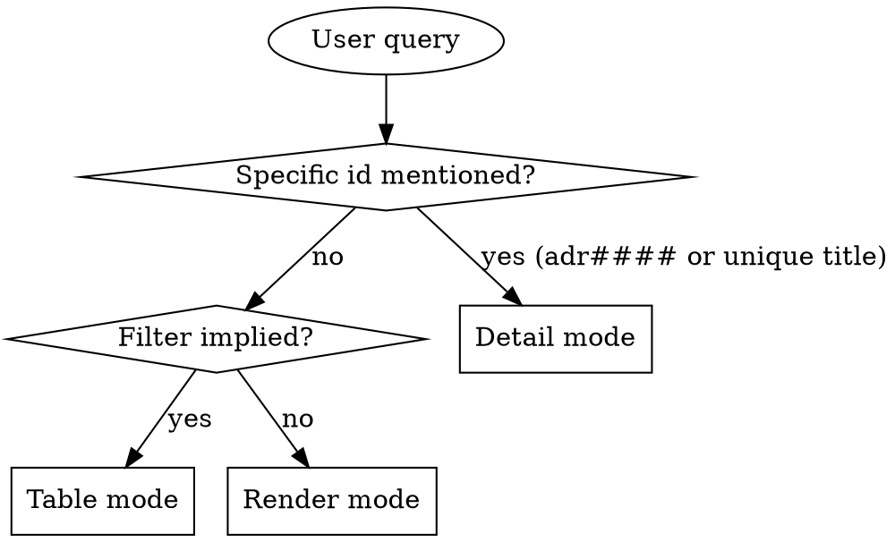

# ADR Read

## Overview

Read ADR zettels under `docs/notes/adr####.md` and present them in the format that best fits the user's question. Three output modes — pick one, don't combine.

**Announce at start:** "Using adr-read skill to surface decisions."

## Data source

All reads go through the `akm` CLI — never resolve `AKM_ROOT` or parse
frontmatter by hand. The CLI is the single gatekeeper: it enforces the
strict main-worktree rule (refuses from feature worktrees with exit 2)
and returns canonical state.

```bash
# All ADRs as structured rows: columns type, id, name (first alias),
# status, created, categories (list of cat ids parsed from H1 wikilinks).
akm list adr --json | from json

# Full markdown of a single ADR:
akm read adr0007
```

If `akm` refuses with exit 2, surface its stderr verbatim and stop —
that's the strict-mode gate, not a transient failure.

If `akm list adr --json` returns `[]`: tell the user "No ADRs found. Use
adr-write to add one."

## Schema (this skill's slice)

ADRs are immutable in spirit: never edited in place, only superseded by
a new ADR. Status captures lifecycle stages.

### Zettel slice this skill needs

```markdown
---
aliases:
  - <decision one-liner>
status: <Proposed|Accepted|Deprecated|Superseded>
created: YYYY-MM-DD
---
# ADR [[cat###]] [[product]]

## title
<decision one-liner>

## context
<forces, constraints, problem>

## decision
<what we chose>

## consequences
<positive + negative>

## superseded_by
[[adr####|<replacement>]]   # only when status = Superseded
```

**Key extraction rules:**

- `id` — filename slug (`adr0007`). Note: four digits, not three.
- `title` — text under `## title` (also mirrored in the first alias).
- `category` — the **single** `[[cat###]]` wikilink in the H1 (ADRs file under exactly one primary category; if multiple appear, render all but flag the convention drift).
- `context`, `decision`, `consequences` — sections.
- `superseded_by` — wikilink under that H2; meaningful only when status=Superseded.

Note: ADR status values are **capitalised** (`Proposed`, `Accepted`, `Deprecated`, `Superseded`), distinct from the lowercase used by stories/personas/implementations.

## Mode Selection



### Detail mode triggers
- Query contains `adr####` (case-insensitive).
- "show me adr0007", "what did we decide about X".

### Table mode triggers
- Status filters: `Proposed`, `Accepted`, `Deprecated`, `Superseded` (case-insensitive in the user prompt).
- Category filters: "ADRs in cat002", "security decisions".
- Keyword search: "ADRs about caching", "decisions covering auth".

### Render mode triggers
- "Show me all decisions", "print the ADR log".

## Reading the zettels

- **Detail** — `akm read <id>`.
- **Table / Render** — `akm list adr --json | from json` returns
  everything the modes need without parsing files. Apply filters as
  nu pipeline stages:
  ```
  akm list adr --json | from json | where status == 'Accepted'
  akm list adr --json | from json | where { |r| 'cat002' in $r.categories }
  ```

Sort by id ascending (numeric, since zero-padded) — `akm list` already
sorts by `type status id`, so the natural order works.

## Mode 1: Detail

```markdown
## [id] — [title]

**Category:** [cat###]    **Status:** [status]    **Created:** [created]

**Context:** [context]

**Decision:** [decision]

**Consequences:** [consequences]

**Superseded by:** [adr####]    *(only if status = Superseded)*
```

If id not found: "ADR `adr0007` not found. Closest matches: ..." with 1-3 candidates.

If multiple categories appear in H1: render all but add a one-line note: "Convention drift — ADR uses multiple categories. Pick one in adr-write to fix." (ADR schema is exactly-one-category.)

## Mode 2: Table

| id | status | category | title |

Sort by id ascending. After the table: `N ADRs matched (X Accepted, Y Proposed, Z Deprecated, W Superseded).` Omit zero buckets.

## Mode 3: Render

Grouped by status: `Accepted` → `Proposed` → `Deprecated` → `Superseded`. Within each group sort by id ascending.

Within each status, optionally sub-group by category if more than 5 ADRs.

```markdown
# Architectural Decision Records

## Accepted

### cat001 — workflow

#### adr0001 — Use event sourcing for state changes
**Context:** ...

**Decision:** ...

**Consequences:** ...

### cat002 — data

#### adr0003 — ...
```

End: `Total: N ADRs (X Accepted, Y Proposed, Z Deprecated, W Superseded).`

## Filter Parsing

| User says | Match against |
|---|---|
| "proposed", "draft" | `status: Proposed` |
| "accepted", "active", "current" | `status: Accepted` |
| "deprecated" | `status: Deprecated` |
| "superseded", "replaced", "overturned" | `status: Superseded` |
| "in cat###", "category X", "security ADRs" | H1 category matches id or category alias |
| "about X", "covering Y" | any text field (title, context, decision, consequences) |

Multiple filters compose with AND.

For "what overturned adr0007", look at every ADR whose `## superseded_by` points at `adr0007`. That's the inverse query; it's a one-shot grep.

## What This Skill Does NOT Do

- It does not modify ADRs. To file a new ADR or supersede an existing one, use `adr-write`. ADRs are immutable; never edit a Proposed/Accepted body in place.
- It does not validate cross-references. If `## superseded_by` points at a non-existent ADR, render it as-is and rely on moxide diagnostics.

## When to Defer to Other Skills

- File a new ADR / supersede an existing one → `adr-write`.
- List the categories ADRs file under → `category-read`.
- See which implementations a decision shaped → `implementation-read` (filter by category, then read approach).
