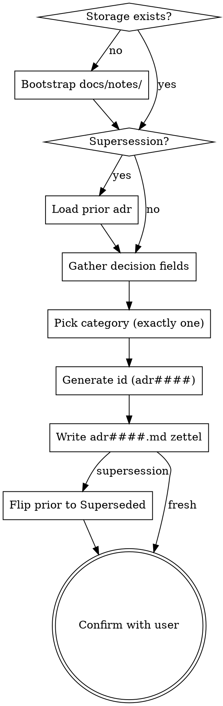

<skill_overview>
Capture a single Architectural Decision Record as a new AKM zettel under `docs/notes/adr####.md`. ADRs document *what* the team chose, *why*, and *what it locks in* — one decision per file, immutable once accepted. Storage backend is AKM; schema lives in `docs/notes/akm.md`. Announce at start: "Using adr-write skill to record this architectural decision."
</skill_overview>

<rigidity_level>
LOW FREEDOM on the structural rules (one decision per file, four-digit id, exactly one `[[cat###]]` in H1, immutability of `Accepted` ADRs, supersession via new file + status flip). These are the constraints that make the ADR set auditable years later — under pressure to "just fix the old one" or "lump two decisions together", the value of the corpus collapses. MEDIUM FREEDOM on phrasing, length of `## context`, and how much interview the user wants.
</rigidity_level>

<quick_reference>
| Aspect | Convention |
|--------|-----------|
| File | `docs/notes/adr####.md` — four-digit zero-padded (`adr0001`, `adr0042`, `adr1024`) |
| ID rule | max existing + 1; gaps preserved; superseded/deprecated keep their number forever |
| H1 | `# ADR [[cat###]] [[product]]` — exactly one category, no pipe label |
| Frontmatter | `aliases:` (one entry, matches `## title`), `status:`, `created:` (ISO) |
| Status values | `Proposed` / `Accepted` / `Deprecated` / `Superseded` (capitalized) |
| Body sections | `## title`, `## context`, `## decision`, `## consequences` (+ `## superseded_by` only when Superseded) |
| Footer | `---` rule then `Index: [[product]]` |
| Default status | `Accepted` (decision already taken) — `Proposed` only if user says still under review |
| Immutability | `Accepted` ADRs are append-only; never rewrite — supersede with a new file |
</quick_reference>

<when_to_use>
**Use when:**
- User says "write an ADR", "log a decision", "record an architectural decision", "ADR for X"
- User reports a design commitment already taken ("we decided to use Y instead of Z")
- User wants to supersede a prior ADR with a new one
- `infinifu:zettel-write` routed an architectural-decision-shaped capture here

**Don't use for:**
- Exploring a decision space before commitment → `infinifu:idea-brainstorming`
- Capturing a requirement (as-a / I want / because) → `infinifu:story-write`
- Generic concept note or unsure which AKM type fits → `infinifu:zettel-write`
- Reading / listing existing ADRs → `adr-read` (not yet built)
- Adding or removing tags on a zettel → `infinifu:tag-manage`
- Mapping code paths to a decision → use `infinifu:story-map` on the `im###` zettel (ADRs don't carry component lists)
</when_to_use>

<the_process>

1. **Check storage.** If `docs/notes/` is missing, create it. If `docs/product.md` is missing, warn the user the AKM workspace isn't initialized and either proceed (zettel will reference a non-existent `[[product]]`) or abort per their preference.
2. **Supersession?** If the user is overturning a prior ADR, identify and read it; confirm its `status` is `Accepted`. If already `Superseded`, ask whether to chain or point at the head.
3. **Gather decision fields.** Title (one declarative sentence), context (forces + constraints + options surveyed), decision (active voice), consequences (positive + *honest* negative). Don't over-interview — if the design hasn't been discussed yet, redirect to `infinifu:idea-brainstorming`. If everything was provided upfront, write it; otherwise ask only for missing fields.
4. **Pick category — exactly one.** Match against existing `cat###` aliases (case-insensitive). If none match, ask once with the existing list or create a new `cat###.md` inline (minimal: `## name`, `## summary`, `status: stable`). If two categories tempt, pick the one where a future engineer would look first.
5. **Generate id.** List `docs/notes/adr*.md`, extract numerics, take max + 1, zero-pad to 4 digits. Start at `0001` if none exist.
6. **Write the zettel** per the schema in `docs/notes/akm.md` § *ADR — `adr####.md`*. See `references/examples.md` for a fully worked fresh ADR and a supersession pair.
7. **On supersession**, patch the prior ADR: flip frontmatter `status: Accepted` → `Superseded` and append a `## superseded_by` body section with `[[adr<new-id>|<new-title>]]`. Do **not** edit the prior ADR's `## title` / `## context` / `## decision` / `## consequences`.
8. **Update `docs/product.md`** (the hub): append `[[adr####|<title>]]` under the matching category H3 inside `## Architecture Decision Records`. Add the category subheading if it doesn't yet exist. If the hub doesn't exist, skip and tell the user.
9. **Confirm with the user.** Show id + path, decision one-liner, category, status, supersession info (if any), and whether the hub was updated. Ask once: "Anything to revise?" — but push back on edits to an `Accepted` ADR's content.

For schema details (exact frontmatter shape, lifecycle status semantics, superseded_by invariants) load `docs/notes/akm.md`. For worked examples (fresh ADR markdown, supersession patch, good vs bad consequences), load `references/examples.md`.

</the_process>

<critical_rules>

- **One decision per file.** Compound requests get split; if two decisions are entangled, you usually have two ADRs, not one.
- **Exactly one `[[cat###]]` in the H1** — unlike Implementations or Features which allow multiple. A decision that "spans categories" compresses two decisions; split it.
- **Four-digit zero-padded id** (`adr####`) — wider than the three-digit `us###` / `ft###` / `im###` / `pn###` space because ADRs accumulate forever (every reversal adds an entry).
- **Status capitalization** (`Proposed` / `Accepted` / `Deprecated` / `Superseded`) — note the divergence from lowercase story statuses; downstream parsers are case-sensitive.
- **Default status is `Accepted`** when the user reports a decision already taken; `Proposed` only when explicitly under review. Ask if unclear.
- **`Accepted` ADRs are immutable.** Never rewrite `## context`, `## decision`, or narrow `## consequences`. The only safe in-place edit is *widening* `## consequences` to record an unforeseen downstream effect. If the change alters the *meaning* of what was chosen, write a new ADR — that's supersession, not editing.
- **Supersession is the *only* edit pattern that touches an existing `Accepted` ADR.** Treat it as structural (frontmatter status flip + `## superseded_by` append), not content.
- **Gaps in the id sequence are preserved.** Always `max + 1` — superseded and deprecated ADRs keep their number forever; files stay on disk forever.
- **No empty placeholder sections.** `## superseded_by` exists only when `status: Superseded`; omit it otherwise.
- **Don't run a design discussion.** If the upstream decision hasn't been made, redirect to `infinifu:idea-brainstorming`. ADRs record commitments; they don't manufacture them.
- **Push back on dishonest consequences.** *"Pros: fast, reliable. Cons: minor lock-in."* fails the audit-in-five-years test. The negative side is load-bearing.
- **One ADR per invocation.** Don't batch; compound captures get rejected at the atomicity gate (delegated up to `infinifu:zettel-write` when invoked from there).
- **Never delete an ADR.** `Deprecated` and `Superseded` are the retirement states.

</critical_rules>

<integration>

**Called by:** `infinifu:zettel-write` when its routing detects an architectural-decision shape; ad hoc by the user when logging a decision directly.

**Calls:** nothing — leaf writer. If a missing category needs to be created, inline a minimal `cat###.md` rather than delegating (no `category-write` skill yet).

**Complements:**

- `infinifu:idea-brainstorming` — upstream design conversation that produces the decision recorded here
- `infinifu:story-write`, `feature-write`, `implementation-write`, `persona-write`, `category-write` — sibling typed writers; this one owns only `adr####.md`
- `infinifu:zettel-write` — orchestrator that routes generic capture requests; delegates ADR-shaped captures here after the atomicity gate

</integration>

<references>

- `docs/notes/akm.md` — canonical AKM schema. Load when needing exact frontmatter shape, the lifecycle status table, supersession invariants, or any cross-zettel rule. Don't duplicate schema in this file.
- `references/examples.md` — worked examples (fresh ADR markdown, supersession workflow with both files, good vs bad consequences, hub update snippet, edge cases). Load when actually composing the markdown for a new or superseding ADR.
- `infinifu:meta-skill-writing` — house style for this SKILL.md; load when refactoring this file.

</references>