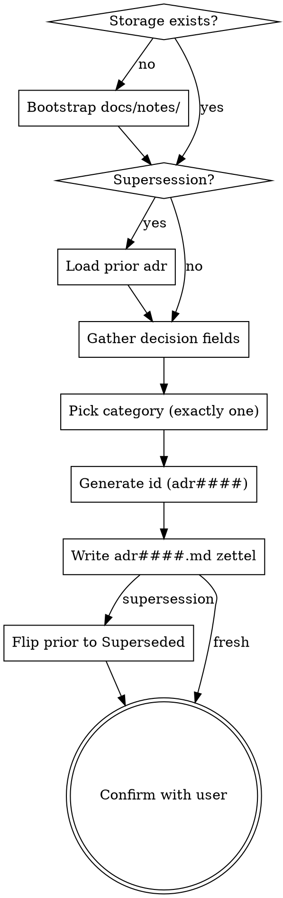

# ADR Write

## Overview

Capture a single Architectural Decision Record as a new AKM zettel under `docs/notes/adr####.md`. ADRs document *what* the team chose, *why*, and *what it locks in* — one decision per file, immutable once accepted. They feed downstream Implementation zettels (`im###`), which list the categories whose accepted ADRs constrain the chosen approach.

**Storage backend:** AKM (Agentic Knowledge Model). The schema is documented in `docs/notes/akm.md`; this skill writes one file per decision under `docs/notes/`.

**Announce at start:** "Using adr-write skill to record this architectural decision."

## Process Flow



## Storage

**File:** one zettel per decision at `docs/notes/adr####.md` — **four-digit** zero-padded id (e.g. `adr0001.md`, `adr0042.md`, `adr1024.md`). Note this differs from `us###` stories, `ft###` features, `im###` implementations, and `pn###` personas, which are three-digit. The wider id space reflects that ADRs accumulate forever — every reversal adds an entry rather than editing an old one.

If `docs/notes/` does not exist: create it. If `docs/product.md` does not exist, the project is not AKM-set-up — warn the user "No `docs/product.md` found; AKM workspace not initialized. Create the hub manually or via the project's `epic-create` skill first." then either proceed (zettel will reference a non-existent `[[product]]`) or abort if the user prefers.

## Zettel Schema

Every ADR zettel has this exact shape:

```markdown
---
aliases:
  - <decision one-liner, same text as ## title>
status: <Proposed|Accepted|Deprecated|Superseded>
created: YYYY-MM-DD
---
# ADR [[cat###]] [[product]]

## title
<decision one-liner>

## context
<forces, constraints, problem being solved>

## decision
<what we chose>

## consequences
<positive + negative; what it locks us into>

## superseded_by
[[adr####|<replacement-title>]]    # only when status = Superseded

---

Index: [[product]]
```

**Required pieces:**

- Frontmatter `aliases:` (one entry — the same line as `## title`), `status:`, `created:` (ISO date).
- H1 carrying **exactly one** `[[cat###]]` plus `[[product]]` — no more, no fewer category links.
- `## title`, `## context`, `## decision`, `## consequences` sections.
- `Index: [[product]]` footer.
- `## superseded_by` is present **only when** `status: Superseded` — omit otherwise.

**Lifecycle status values** (capitalized — unlike `us###` story lowercase statuses):

| Status | Meaning |
|--------|---------|
| `Proposed` | under review — decision drafted but not yet committed to |
| `Accepted` | current — the decision is in force; mutate only `consequences` if reality drifts |
| `Deprecated` | no longer applies, no replacement (the constraint that motivated it is gone) |
| `Superseded` | replaced by a newer ADR — `## superseded_by` body section carries the forward link |

New ADRs default to `Accepted` when the user reports a decision already taken, or `Proposed` when the user is documenting an option still under review. Default to `Accepted` and ask if unclear.

## Immutability — the rule that shapes everything

ADRs are append-only in spirit. Once a decision is `Accepted`, do not rewrite its `## context` or `## decision` to reflect a changed reality. Instead:

1. Write a *new* `adr####.md` with the revised decision.
2. The new ADR's `## context` cites the prior one (`originally captured in [[adr0007]]`) and explains what changed.
3. Flip the prior ADR's frontmatter to `status: Superseded` and add the body `## superseded_by` section with `[[<new-id>|<new-title>]]`.

The only safe in-place edit on an `Accepted` ADR is widening `## consequences` to record a downstream effect the original author didn't foresee — never narrowing, never rewriting the decision narrative. If the change to consequences would alter the *meaning* of what was chosen, you are actually superseding; write a new ADR.

**Why this matters:** ADRs are the historical record of constraint-evolution. The implementation tree (`im###`) references categories, and `[[product]]` links to the live ADR set. Rewriting an old ADR rewrites that history and breaks back-references in retrospectives and audits.

## ID Generation

IDs are `adr` + **four-digit** zero-padded sequential (`adr0001`, `adr0002`, …, `adr0042`).

1. List existing ADR zettels: `ls docs/notes/adr*.md` (or in-process equivalent).
2. Extract the numeric portion of each filename. Find max, add 1.
3. Zero-pad to 4 digits. If no existing ADRs, start at `0001`.

Example: `adr0001.md`, `adr0002.md`, `adr0007.md` exist → next is `adr0008`.

Gaps are preserved — a superseded ADR keeps its number forever; a deprecated ADR keeps its number forever. Always take max + 1.

## Picking the Category (exactly one)

The H1 carries one `[[cat###]]` wikilink. Unlike Implementations and Features (which allow several taxonomy buckets), ADRs commit to a single primary category. The reason: ADRs surface in `docs/product.md` grouped under one heading, and a decision that "spans categories" usually compresses two decisions — split it.

**Lookup workflow:**

1. List existing categories: `ls docs/notes/cat*.md` (or in-process equivalent).
2. For each, read the frontmatter `aliases:` — the first alias is the canonical name (e.g. `security`, `data`, `infrastructure`, `testing`, `observability`).
3. **If the user named a category that matches an existing alias** (case-insensitive substring or exact), use that `cat###` id.
4. **If no category matches**, ask once: "No existing category matches `<name>`. Pick from: <list of aliases>, or describe a new one (I'll create the `cat###` zettel)."
5. **If they want a new category**, write a minimal `cat###.md` per the AKM Category schema (status `stable`, just `## name` and `## summary`) — inline this cheaply.

The H1 form is bare-bracket: `# ADR [[cat003]] [[product]]`. No pipe label is needed — the category name is rendered from the linked file's H1, and ADRs are listed in the hub under their category heading anyway.

**Picking when two categories tempt:** prefer the category whose accepted ADR set this decision most directly extends. *Where would a future engineer look first to discover this decision?* That category wins.

## Gathering the Decision

ADRs are short. Don't over-interview — the goal is to record the commitment that was already made (or being made now), not to re-debate it. If the upstream design conversation hasn't happened, the right move is `infinifu:idea-brainstorming`, not a premature ADR.

**If the user provided everything upfront** (title/context/decision/consequences in one message): write the ADR, don't ask anything, just confirm at the end.

**If fields are missing**: ask only for the missing pieces. Use AskUserQuestion when 2-4 plausible framings exist (e.g., between two competing decisions to record), free-text when open-ended.

**Field guide:**

- **title** — one declarative sentence. Reads as "We choose X." or "Use X for Y." Mirrors the alias.
- **context** — the forces in play: the problem, the constraints, the prior art surveyed, the options considered. This is what makes the decision auditable years later. Not a novel — 2–6 sentences usually.
- **decision** — what was chosen, in active voice. *"Use Postgres for the events store."* Not *"It is recommended that we consider using Postgres."*
- **consequences** — both directions: what gets easier (positive), what gets locked in or harder (negative). The negative side is the load-bearing one — ADRs without honest negatives lose value within a year.

**Good consequences entry:**

> Locks the runtime to a single SQL dialect (Postgres-flavoured JSONB). Migration to a different store later means rewriting both the schema and any operator-side tooling that uses JSONB. Gains: native pub/sub via `LISTEN/NOTIFY` removes the need for a separate broker on day one.

**Bad consequences entry:**

> Pros: fast, reliable. Cons: minor lock-in.

Push back once if the consequences read like a marketing summary — the whole point of the section is to surface what the team is buying into.

## Writing the Zettel

Compose the full markdown per the schema. Write to `docs/notes/adr<NNNN>.md` using the generated id.

**Example output for a fresh ADR:**

`docs/notes/adr0008.md`:

```markdown
---
aliases:
  - use Postgres JSONB for the events store
status: Accepted
created: 2026-05-15
---
# ADR [[cat003]] [[product]]

## title
Use Postgres JSONB for the events store

## context
The pricing pipeline emits ~5k events/day. Options surveyed: a dedicated event store (EventStoreDB), a queue + cold storage (Kafka + S3), and Postgres with a JSONB column. The team already operates Postgres for the OLTP workload and has no current capacity to onboard a second persistence runtime.

## decision
Persist events to a single `events` table in the existing Postgres cluster, with payloads stored as JSONB indexed by event type and aggregate id. Use `LISTEN/NOTIFY` for downstream fan-out instead of introducing a broker.

## consequences
Locks the runtime to a single SQL dialect (Postgres-flavoured JSONB). Migration to a different store later means rewriting both the schema and any operator-side tooling that uses JSONB. Gains: zero new operational surface, native pub/sub via `LISTEN/NOTIFY` removes the need for a separate broker on day one, and the OLTP team already owns backups and on-call. Volume must be re-evaluated above ~50k events/day — the JSONB indexing strategy degrades past that point on the current hardware tier.

---

Index: [[product]]
```

**Conventions:**

- ISO `YYYY-MM-DD` for `created`.
- One alias entry only — the canonical decision one-liner (matches `## title`).
- Category wikilink form: `[[cat###]]` bare in the H1 — no pipe label.
- H1 order: `# ADR [[cat###]] [[product]]` — category first, then `[[product]]`.
- Body sections must be exactly `## title`, `## context`, `## decision`, `## consequences` — downstream readers (and a future ADR-read skill) parse on these headings.
- Footer is a `---` rule then `Index: [[product]]` on its own line.
- `## superseded_by` is only present when applicable; never leave an empty section as a placeholder.

## Supersession Workflow

When the user is recording a decision that overturns a prior ADR:

1. **Identify the prior ADR.** Ask if not given: "Which existing ADR does this overturn?" The user should provide the `adr####` id; resolve from `docs/notes/adr*.md` if they gave only a description.
2. **Read the prior ADR.** Confirm its current `status` — must be `Accepted` to be superseded. If it's already `Superseded`, ask whether to chain (rare but valid) or to point at the head of the supersession chain instead.
3. **Write the new ADR** per the schema. In `## context`, open with a sentence like *"Supersedes [[adr0007|<prior title>]]. Originally we chose X because Y; that constraint no longer holds because Z."* This makes the new ADR self-contained for future readers.
4. **Patch the prior ADR** with a minimal edit:
   - Frontmatter `status: Accepted` → `status: Superseded`.
   - Append a `## superseded_by` body section (insert before the closing `---` / `Index:` footer):
     ```markdown
     ## superseded_by
     [[adr<new-id>|<new-decision-one-liner>]]
     ```
   - Do **not** edit `## title`, `## context`, `## decision`, or `## consequences` on the prior ADR. They stay as the historical record.

This is the **only** edit pattern that touches an existing `Accepted` ADR. Treat it as a structural change, not a content change.

## Updating `docs/product.md` (the hub)

The hub groups ADRs under `## Architecture Decision Records` by category. After writing the new ADR, append a wikilink under the matching `[[cat###|<category>]]` H3 heading. If the category subheading doesn't yet exist in the hub, add it.

```markdown
## Architecture Decision Records

### [[cat003|data]]

- [[adr0007|use SQLite for local-first sync]]
- [[adr0008|use Postgres JSONB for the events store]]    ← new
```

The hub wikilink form is `[[adr####|<title>]]` — pipe-separated, with the alias/title as the readable label.

**On supersession:** keep the prior ADR's hub entry in place but optionally suffix `— superseded` for human readers, e.g. `[[adr0007|use SQLite for local-first sync]] — superseded`. The Superseded status in the prior ADR's frontmatter is the source of truth; the hub annotation is just a courtesy.

If `docs/product.md` doesn't exist, skip the hub update and tell the user "Hub `docs/product.md` not found; new ADR is on disk but not linked from the hub. Create the hub when ready."

## Confirmation

After writing, show the user:

1. The ADR id and the file path (`docs/notes/adr<NNNN>.md`).
2. The decision one-liner (the `## title` / alias).
3. The chosen category (with its `cat###` id).
4. The status (`Accepted` / `Proposed` / etc.).
5. If a supersession: the prior ADR's id and that its status was flipped to `Superseded`.
6. Whether the hub was updated.

Ask once: "Anything to revise?" If the user wants to revise the *content* of an `Accepted` ADR, push back: "Accepted ADRs are append-only. Revise `## context` / `## decision` / `## consequences` only if this ADR is still `Proposed`. Otherwise, supersede it with a new ADR."

## What This Skill Does NOT Do

- It does not run a design discussion. That's `infinifu:idea-brainstorming` — invoke that *before* this skill if the decision hasn't been made yet.
- It does not write user stories, features, implementations, personas, or categories — only ADRs.
- It does not edit the `## context` / `## decision` / `## consequences` of an `Accepted` ADR. Those are immutable; supersede instead.
- It does not retroactively re-justify a decision. The original `## context` stays as captured, even if it later reads as naive — that naivete is the historical record.
- It does not produce multiple ADRs from one capture. One decision per invocation; compound requests get rejected at the atomicity gate (delegated up to `infinifu:zettel-write` when invoked from there).
- It does not delete ADRs. `Deprecated` and `Superseded` are the retirement states — the file stays on disk forever.

## When to Defer to Other Skills

- User wants to explore a decision space before committing → `infinifu:idea-brainstorming`.
- User wants to capture a *requirement* (as-a / I want / because) rather than a decision → `infinifu:story-write`.
- User wants a generic concept note or is unsure which AKM type fits → `infinifu:zettel-write`.
- User wants to read / list / find existing ADRs → an `adr-read` skill (not yet built).
- User wants to add or remove tags on an existing zettel → `infinifu:tag-manage`.
- User wants to map code paths to a decision — ADRs don't carry component lists; map paths via the Implementation zettel (`infinifu:story-map` operates on `im###`).

<integration>

**Called by:** `infinifu:zettel-write` when its routing detects an architectural-decision shape; ad hoc by the user when they want to log a decision directly.

**Calls:** nothing — this skill is a leaf writer. If a missing category needs to be created, inline a minimal `cat###.md` rather than delegating, since `category-write` is not yet built.

**Complements:**

- `infinifu:idea-brainstorming` — upstream design conversation that produces the decision recorded here.
- `infinifu:story-write`, `feature-write`, `implementation-write`, `persona-write`, `category-write` — sibling typed writers; this one owns only `adr####.md`.
- `infinifu:zettel-write` — orchestrator that routes generic capture requests; delegates ADR-shaped captures here after the atomicity gate.

</integration>

<references>

- `docs/notes/akm.md` — canonical AKM schema. Load when needing schema details for ADR body shape, supersession invariants, or the lifecycle status table.
- `infinifu:meta-skill-writing` — house style for this skill's own SKILL.md; load when refactoring this file.

</references>
