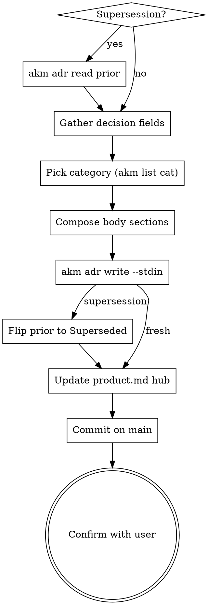

<skill_overview>
Capture a single Architectural Decision Record as a new AKM zettel under `docs/notes/adr####.md`. ADRs document *what* the team chose, *why*, and *what it locks in* — one decision per file, immutable once accepted. This skill owns the ADR schema inline (see `<schema>` block below); shared styling (atomicity, 80-char wrap, link discipline) lives in `infinifu:zettel-write`. Announce at start: "Using adr-write skill to record this architectural decision."
</skill_overview>

<rigidity_level>
LOW FREEDOM on the structural rules (one decision per file, four-digit id, exactly one `[[cat###]]` in H1, immutability of `Accepted` ADRs, supersession via new file + status flip). These are the constraints that make the ADR set auditable years later — under pressure to "just fix the old one" or "lump two decisions together", the value of the corpus collapses. MEDIUM FREEDOM on phrasing, length of `## context`, and how much interview the user wants.
</rigidity_level>

<quick_reference>
| Aspect | Convention |
|--------|-----------|
| File | `docs/notes/adr####.md` — four-digit zero-padded (`adr0001`, `adr0042`, `adr1024`) |
| ID rule | max existing + 1; gaps preserved; superseded/deprecated keep their number forever |
| H1 | `# ADR [[cat###]] [[product]]` — exactly one category, no pipe label |
| Frontmatter | `aliases:` (one entry, matches `## title`), `status:`, `created:` (ISO) |
| Status values | `Proposed` / `Accepted` / `Deprecated` / `Superseded` (capitalized) |
| Body sections | `## title`, `## context`, `## decision`, `## consequences` (+ `## superseded_by` only when Superseded) |
| Footer | `---` rule then `Index: [[product]]` |
| Default status | `Accepted` (decision already taken) — `Proposed` only if user says still under review |
| Immutability | `Accepted` ADRs are append-only; never rewrite — supersede with a new file |
</quick_reference>

<schema>

**Frontmatter.**

```yaml
aliases:
  - <decision one-liner, same as ## title>
status: <Proposed|Accepted|Deprecated|Superseded>
created: YYYY-MM-DD
```

**Body skeleton.**

```markdown
# ADR [[cat###]] [[product]]

## title
<decision one-liner>

## context
<forces, constraints, problem>

## decision
<what we chose>

## consequences
<positive + negative; what it locks us into>

## superseded_by
[[adr####|<replacement>]]      # only when status = Superseded

---

Index: [[product]]
```

**Required wikilinks.** Exactly one `[[cat###]]` category link in H1,
`[[product]]` in H1, `Index: [[product]]` footer. ADRs are filed under
a single primary category — pick the most accurate bucket rather than
listing several. If superseded, link the replacing ADR via the
`## superseded_by` body section.

**Lifecycle.**

- `Proposed` — under review.
- `Accepted` — current. Mutate only `consequences` if reality drifts.
- `Deprecated` — no longer applies, no replacement.
- `Superseded` — replaced. Frontmatter `status` is `Superseded`; the
  `## superseded_by` body section carries the `[[adr####]]` wikilink.

ADRs are append-only in spirit: never rewrite history. Create a new ADR
to overturn a decision.

</schema>

<when_to_use>
**Use when:**
- User says "write an ADR", "log a decision", "record an architectural decision", "ADR for X"
- User reports a design commitment already taken ("we decided to use Y instead of Z")
- User wants to supersede a prior ADR with a new one
- `infinifu:zettel-write` routed an architectural-decision-shaped capture here

**Don't use for:**
- Exploring a decision space before commitment → `infinifu:idea-brainstorming`
- Capturing a requirement (as-a / I want / because) → `infinifu:story-write`
- Generic concept note or unsure which AKM type fits → `infinifu:zettel-write`
- Reading / listing existing ADRs → `adr-read` (not yet built)
- Adding or removing tags on a zettel → `infinifu:tag-manage`
- Mapping code paths to a decision → use `infinifu:story-map` on the `im###` zettel (ADRs don't carry component lists)
</when_to_use>

<workspace_resolution>
ADRs are shared product knowledge — they live on **main**, even from a feature-branch worktree. All zettel mutations go through the `akm adr` CLI, which enforces the strict main-worktree rule, allocates ids, composes frontmatter + H1 (`[[cat###]] [[product]]`) + footer, and stages the new file on main. The skill no longer resolves `AKM_ROOT` by hand or formats the markdown itself.

```bash
# Read an existing ADR (for supersession context):
akm adr read adr0007

# List ADRs (use --json for pipeline filtering):
akm adr list --json | from json | where status == 'Accepted'

# Mint a fresh ADR. Body comes from stdin; CLI does id allocation,
# frontmatter, H1, footer, and `git -C $AKM_ROOT add`.
printf "<composed body>" | akm adr write <name> \
    --category <cat###> --title "<title>" --status Proposed --stdin
```

If `akm` refuses with exit 2 (cwd not on the main worktree), surface its stderr and abort — never silently land an ADR on the feature branch.

ADRs are immutable stable artifacts: this writer **commits on creation** on main. The CLI stages the ADR file; the skill is responsible for adding the hub edit (`docs/product.md`) to the same commit so a single `git -C "$(akm root)" commit -m "feat(akm): add adr<NNNN> <title>"` lands the pair atomically. For supersession the same commit also includes the patched prior ADR. See the per-stage commit table in `docs/notes/akm.md#workspace-resolution`.
</workspace_resolution>

<the_process>



1. **Supersession?** If the user is overturning a prior ADR, `akm adr read adr<old>` to load it; confirm its `status` is `Accepted`. If already `Superseded`, ask whether to chain or point at the head.
2. **Gather decision fields.** Title (one declarative sentence), context (forces + constraints + options surveyed), decision (active voice), consequences (positive + *honest* negative). Don't over-interview — if the design hasn't been discussed yet, redirect to `infinifu:idea-brainstorming`. If everything was provided upfront, write it; otherwise ask only for missing fields.
3. **Pick category — exactly one.** Match against existing `cat###` aliases via `akm list cat --json | from json` (case-insensitive on names). If none match, ask once with the existing list. If two categories tempt, pick the one where a future engineer would look first. (If a brand-new category is needed, mint it via `category-write` first, then continue.)
4. **Compose the body markdown** — `## context` + `## decision` + `## consequences` sections, one paragraph each. The CLI inserts the H1, `## title`, frontmatter, and footer; the skill only contributes the body sections.
5. **Mint the ADR via the CLI.** Pipe the composed body into `akm adr write`:
   ```bash
   printf "## context\n<context>\n\n## decision\n<decision>\n\n## consequences\n<consequences>\n" \
     | akm adr write <name> \
         --category <cat###> \
         --title "<title>" \
         --status Proposed \
         --stdin
   ```
   The CLI allocates the next `adr####` id, composes the file, and stages it via `git -C "$(akm root)" add docs/notes/adr<NNNN>.md`. Capture the printed id from the CLI's output for the supersession patch + hub update + commit below.
6. **On supersession**, patch the prior ADR. `akm adr read` doesn't write, so this step still edits the file directly under the AKM root: flip frontmatter `status: Accepted` → `Superseded` and append a `## superseded_by` body section with `[[adr<new-id>|<new-title>]]`. Stage the edit:
   ```bash
   git -C "$(akm root)" add docs/notes/adr<old>.md
   ```
   Do **not** edit the prior ADR's `## title` / `## context` / `## decision` / `## consequences`.
7. **Update `docs/product.md`** (the hub): append `[[adr####|<title>]]` under the matching category H3 inside `## Architecture Decision Records`. Add the category subheading if it doesn't yet exist. Stage the edit (`git -C "$(akm root)" add docs/product.md`). If the hub doesn't exist, skip and tell the user.
8. **Commit on main.** ADRs are stable, immutable artifacts — the CLI staged the new ADR; this step folds the hub update (and the patched prior ADR on supersession) into the same commit:
   ```bash
   # Fresh ADR
   git -C "$(akm root)" commit -m "feat(akm): add adr<NNNN> <title>"

   # Supersession (everything already staged across steps 5-7)
   git -C "$(akm root)" commit -m "feat(akm): supersede adr<old> with adr<new> <title>"
   ```
9. **Confirm with the user.** Show id + absolute path, decision one-liner, category, status, supersession info (if any), whether the hub was updated, and commit sha on main. Ask once: "Anything to revise?" — but push back on edits to an `Accepted` ADR's content.

For schema details (exact frontmatter shape, lifecycle status semantics, superseded_by invariants) see the `<schema>` block above — this skill owns it. For worked examples (fresh ADR markdown, supersession patch, good vs bad consequences), load `references/examples.md`.

</the_process>

<critical_rules>

- **One decision per file.** Compound requests get split; if two decisions are entangled, you usually have two ADRs, not one.
- **Exactly one `[[cat###]]` in the H1** — unlike Implementations or Features which allow multiple. A decision that "spans categories" compresses two decisions; split it.
- **Four-digit zero-padded id** (`adr####`) — wider than the three-digit `us###` / `ft###` / `im###` / `pn###` space because ADRs accumulate forever (every reversal adds an entry).
- **Status capitalization** (`Proposed` / `Accepted` / `Deprecated` / `Superseded`) — note the divergence from lowercase story statuses; downstream parsers are case-sensitive.
- **Default status is `Accepted`** when the user reports a decision already taken; `Proposed` only when explicitly under review. Ask if unclear.
- **`Accepted` ADRs are immutable.** Never rewrite `## context`, `## decision`, or narrow `## consequences`. The only safe in-place edit is *widening* `## consequences` to record an unforeseen downstream effect. If the change alters the *meaning* of what was chosen, write a new ADR — that's supersession, not editing.
- **Supersession is the *only* edit pattern that touches an existing `Accepted` ADR.** Treat it as structural (frontmatter status flip + `## superseded_by` append), not content.
- **Gaps in the id sequence are preserved.** Always `max + 1` — superseded and deprecated ADRs keep their number forever; files stay on disk forever.
- **No empty placeholder sections.** `## superseded_by` exists only when `status: Superseded`; omit it otherwise.
- **Don't run a design discussion.** If the upstream decision hasn't been made, redirect to `infinifu:idea-brainstorming`. ADRs record commitments; they don't manufacture them.
- **Push back on dishonest consequences.** *"Pros: fast, reliable. Cons: minor lock-in."* fails the audit-in-five-years test. The negative side is load-bearing.
- **One ADR per invocation.** Don't batch; compound captures get rejected at the atomicity gate (delegated up to `infinifu:zettel-write` when invoked from there).
- **Never delete an ADR.** `Deprecated` and `Superseded` are the retirement states.

</critical_rules>

<verification_checklist>

Before reporting the ADR written:

- [ ] File path is `$AKM_ROOT/docs/notes/adr####.md` (resolved via `akm-root`, not the current cwd)
- [ ] Id is `max(existing) + 1`, zero-padded to 4
- [ ] Frontmatter has `aliases:` (matches `## title`), `status:` (capitalized), `created:` ISO date
- [ ] H1 has `# ADR` plus exactly one `[[cat###]]` plus `[[product]]`
- [ ] Body sections in order: `## title`, `## context`, `## decision`, `## consequences` (+ `## superseded_by` iff `Superseded`)
- [ ] `Index: [[product]]` footer after a `---` rule
- [ ] Hub annotated in `$AKM_ROOT/docs/product.md` under the matching category H3 (or skipped with note if hub missing)
- [ ] On supersession: prior ADR has `status: Superseded` + `## superseded_by` appended; its `## title` / `## context` / `## decision` / `## consequences` are untouched
- [ ] Single commit landed on main covering the new ADR + hub diff (+ the old ADR's patch when superseding) — verify with `git -C "$AKM_ROOT" log -1`
- [ ] Confirmation surfaces the absolute `$AKM_ROOT/docs/notes/adr<NNNN>.md` path so the user sees where it landed from a worktree

</verification_checklist>

<integration>

**Called by:** `infinifu:zettel-write` when its routing detects an architectural-decision shape; ad hoc by the user when logging a decision directly.

**Calls:** nothing — leaf writer. If a missing category needs to be created, inline a minimal `cat###.md` rather than delegating (no `category-write` skill yet).

**Complements:**

- `infinifu:idea-brainstorming` — upstream design conversation that produces the decision recorded here
- `infinifu:story-write`, `feature-write`, `implementation-write`, `persona-write`, `category-write` — sibling typed writers; this one owns only `adr####.md`
- `infinifu:zettel-write` — orchestrator that routes generic capture requests; delegates ADR-shaped captures here after the atomicity gate

</integration>

<references>

- `docs/notes/akm.md` — top-level AKM model + lifecycle process flow. Load when needing cross-type perspective (how ADRs sit in the lifecycle relative to Stories / Features / Implementations / Categories). Schema details live in the `<schema>` block above, not here.
- `infinifu:zettel-write` — cross-type styling rules (atomicity, 80-char wrap, link discipline, post-write audit). Load when the styling rule is unclear; this skill owns the ADR schema, that one owns shared discipline.
- `references/examples.md` — worked examples (fresh ADR markdown, supersession workflow with both files, good vs bad consequences, hub update snippet, edge cases). Load when actually composing the markdown for a new or superseding ADR.
- `infinifu:meta-skill-writing` — house style for this SKILL.md; load when refactoring this file.

</references>