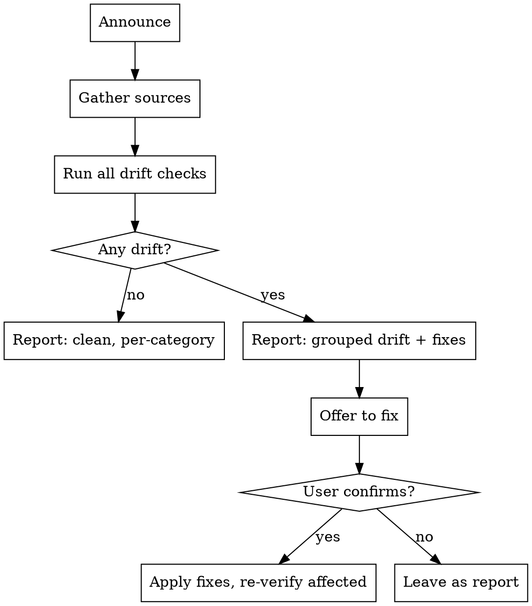

# Archive Verify

## Overview

"Archived" in AKM is not one action — each object type has its own terminal
status and its own archived *home*. The pain this skill solves is that those
two can drift apart: a spec flips to `status: done` but its entry never leaves
`board.md`; a bd issue closes but the committed snapshot still shows it open;
a feature gets superseded but the old card never gained a `superseded_by`
back-link. When that happens there is no single place that says "here is what
you forgot" — you have to know every rule and check each type by hand.

This skill runs that whole cross-check in one pass: derive each object's
terminal status from the source of truth, confirm it lives where its status
implies it should, and report every mismatch with the exact fix. Then it
offers to apply the fixes — after you confirm, never silently.

**Announce at start:** "Using archive-verify skill to audit AKM archiving state."

## The core idea: status is truth, location must follow

For every AKM type the frontmatter (or Dolt) status is authoritative. The
archive *location* is a derived index that must stay consistent with it.
Drift is any place where location and status disagree. The whole skill is:
read status, predict where the object should be, check whether it's there.

Do NOT flip a status to match a location — that's backwards and destroys
signal. If an object is in the wrong place, the location moves to match the
status, never the reverse.

## Data sources

Read through the `akm` CLI and the two index files — never resolve
`AKM_ROOT` or parse frontmatter by hand where the CLI can answer.

```bash
akm list --json | from json              # every zettel: type / id / name / status / created
akm root                                 # workspace root (refuses on a feature worktree)
open "$(akm root)/docs/board.md"         # active-workstream index (sp### idea/spec/ready)
open "$(akm root)/docs/archive.md"       # shipped index (sp### done)
```

bd state is separate from the zettels and lives in Dolt + a committed snapshot:

```bash
bd list --json --status closed --limit 0 | from json   # closed issues in Dolt (source of truth)
open "$(akm root)/.beads/issues-snapshot.jsonl"         # committed closed-issue archive
```

If `akm` refuses with exit 2, surface its stderr and stop — you are probably
on a feature worktree, and archiving audits only make sense from main.

## Drift rules

These are the checks. Run every one; a clean pass reports "no drift" per
category so the user knows it was actually checked, not skipped.

### 1. Specs (`sp###`) — the primary case

Spec status ∈ {idea, spec, ready, done}. `done` is the archived state.

The archive marker is the spec file's **`Index:` footer line** (near the
bottom of `sp###.md`), NOT the `[[board]]` token in the H1 heading — that H1
token is static heading text present on every spec regardless of status, so
never treat it as a drift signal.

| Status | Belongs in `board.md` | Belongs in `archive.md` | `Index:` footer |
|---|---|---|---|
| idea / spec / ready | yes (matching `## section`) | no | `Index: [[board]]` |
| done | no | yes (`## done`) | `Index: [[archive]]` |

Drift signals — flag any of:
- `status: done` but the `[[sp###]]` line still appears in `board.md`.
- `status: done` but missing from `archive.md ## done`.
- `status: done` but the footer still reads `Index: [[board]]` not `Index: [[archive]]`.
- `status ∈ {idea,spec,ready}` but the entry sits in `archive.md`, or its
  footer reads `Index: [[archive]]`.
- Entry present in `board.md` under a `## section` that doesn't match its status.

Find the footer with `rg '^Index:' "$(akm root)/docs/notes/spec/<id>.md"`.

The fix for a done-but-not-archived spec is the archive half of `work-merge`:
remove the `[[sp###]]` line from `board.md`, add it under `archive.md ## done`,
and flip the footer to `Index: [[archive]]`. Offer to do exactly that.

### 2. bd issues — closed but snapshot stale

The committed `issues-snapshot.jsonl` is meant to hold every closed issue
(see the sync model in CLAUDE.md — Dolt is canonical, the jsonl is the
human-readable closed-issue archive). It goes stale whenever issues are
closed without a following `akm bd export`.

Drift signal: the set of closed ids in Dolt ≠ the set of closed ids in the
committed snapshot. Compute both, diff them.

```bash
# closed ids in Dolt
let dolt = (bd list --json --status closed --limit 0 | from json | get id | sort)
# closed ids in the committed snapshot
let snap = (open --raw ($"(akm root)/.beads/issues-snapshot.jsonl") | lines
  | where { |l| ($l | str trim) != "" } | each { |l| $l | from json | get id } | sort)
```

If `dolt != snap`, the fix is `akm bd export` (rewrites the snapshot from
Dolt's closed set), then stage + commit it. Report how many issues are
missing from the snapshot.

Secondary, only mention if the user asks about long-term cleanup: closed
issues older than a year can be pruned out of Dolt into
`board/archive/YYYY.jsonl` with `akm bd archive create`. That's housekeeping,
not drift — don't flag it as a problem, just note it's available.

### 3. Implementations (`im###`) — accepted / superseded

im status ∈ {proposed, accepted, superseded}. `accepted` is terminal and
means "shipped, this card is now source of truth" — no location move, so
accepted is never drift on its own. `superseded` must carry a
`## superseded_by [[im###]]` back-link.

Drift signal: `status: superseded` but no `## superseded_by` section, or an
empty one. Fix: add the back-link (ask which im### supersedes it if unclear).

### 4. Features (`ft###`) and ADRs (`adr####`) — superseded chains

Both are terminal-by-supersession, not by moving files. A superseded
feature/ADR keeps its file but must record what replaced it.

Drift signals:
- ft###/adr with `status: superseded` (or `Superseded`) but no `superseded_by`
  / no `## superseded_by` link.
- An ADR whose status is still `Accepted` while a *newer* ADR explicitly
  supersedes it (search other ADRs' bodies for `supersedes [[adr####]]`
  pointing back at it). Fix: flip the old one to `superseded`.

### 5. Status-casing consistency (a common source of confusion)

AKM status values are lowercase (`accepted`, `done`, `superseded`). Legacy
ADRs sometimes use title-case (`Accepted`, `Superseded`), which makes
status filters and this very audit miss them. Flag any status value whose
casing differs from the lowercase convention as a low-severity drift, with
the fix being a one-line frontmatter edit. Don't block on it — just surface
it so the workspace converges.

### 6. Stories (`us###`) — status coherence, no location

us status ∈ {draft, ready, done}. Stories have no board/archive citizenship,
so there's no location to check. The only meaningful drift is *coherence*
with the spec that solves them: a `done` story whose `sp###` is not yet done,
or a `done` spec whose solved story is still `draft`/`ready`. Report these as
coherence warnings, not archive drift — they usually mean a `work-merge` or
`spec-retro` didn't finish. This check is optional; run it only when the user
asks for a thorough audit or when a spec drift in check #1 has a linked story.

## Workflow



## Report format

Group by type, most actionable first (specs and bd usually matter most).
Every check reports a line even when clean, so the user trusts the coverage.
The example below is illustrative — a clean workspace shows `✓` everywhere.

```markdown
# Archive audit — <date>

## Specs (sp###)
- ⚠ sp0NN (<alias>) — status: done but footer still Index: [[board]]
    fix: flip footer → Index: [[archive]] (already in archive.md, so this is the only gap)
- ✓ 4 other done specs correctly archived (in archive.md, footer [[archive]], off board.md)

## bd issues
- ⚠ snapshot stale — 3 closed issues missing from issues-snapshot.jsonl (dotfiles-xxx, ...)
    fix: akm bd export && git add .beads/issues-snapshot.jsonl

## Implementations (im###)
- ✓ no drift (2 accepted, 0 superseded)

## Features / ADRs
- ⚠ adr0003 — status: Accepted but adr0007 supersedes it
    fix: flip adr0003 status → superseded
- ⚠ ft002 — status: superseded but no ## superseded_by link

## Status casing
- ⚠ 5 ADRs use title-case status (Accepted/Superseded) — convention is lowercase

## Summary
6 drift items across 3 categories. Fix all, some, or none?
```

Use `⚠` for drift, `✓` for a clean category. Keep each drift line to the
object + one-clause reason + the fix — the user scans this, don't bury it.

## Applying fixes

Only after the user confirms. Apply per category so a partial "yes, just the
specs" is easy to honor.

- **Spec board→archive**: edit `board.md` (remove the line), `archive.md`
  (add under `## done`), and the spec file's `Index:` footer line
  (→ `Index: [[archive]]`). These are the exact moves `work-merge` makes for
  a single spec — mirror them. Leave the H1 heading untouched.
- **bd snapshot**: run `akm bd export`, then `git add .beads/issues-snapshot.jsonl`.
  Don't commit unless the user asked — leave it staged for their commit.
- **im/ft/adr supersession**: edit the frontmatter status and/or add the
  `## superseded_by [[...]]` link. If you don't know the superseding id, ask.
- **Status casing**: single-line frontmatter edits, lowercase the value.

After applying, re-run only the affected checks to confirm the drift cleared,
and report the before/after count. Don't push — remote sync is the user's
call and belongs to the normal session-close flow.

## What this skill does NOT do

- It does not create, ship, or close anything. It only reconciles *already
  terminal* objects with their archived location. Shipping a spec is
  `work-merge`; the post-ship knowledge-graph pass is `spec-retro`.
- It does not flip a live object to a terminal status to make it "archivable".
  If something looks done but isn't marked done, that's a report line, not a
  fix — the user decides whether to ship it.
- It does not push or create commits. Fixes land in the working tree (bd
  snapshot staged); committing and pushing stay with the session-close flow.
- It does not prune old closed issues (`akm bd archive create`) unless the
  user explicitly asks for that housekeeping — pruning is not drift repair.

## When to defer to other skills

- Ship a spec end-to-end (merge branch, flip statuses, move board→archive) →
  `work-merge`.
- Post-merge graph reconciliation (rewrite im body, mint follow-up ADRs) →
  `spec-retro`.
- Just view board/archive state without auditing → `spec-read`.
- Record that one feature/ADR supersedes another as a deliberate decision →
  `feature-write` / `adr-write` (this skill only flags the *missing* link).
