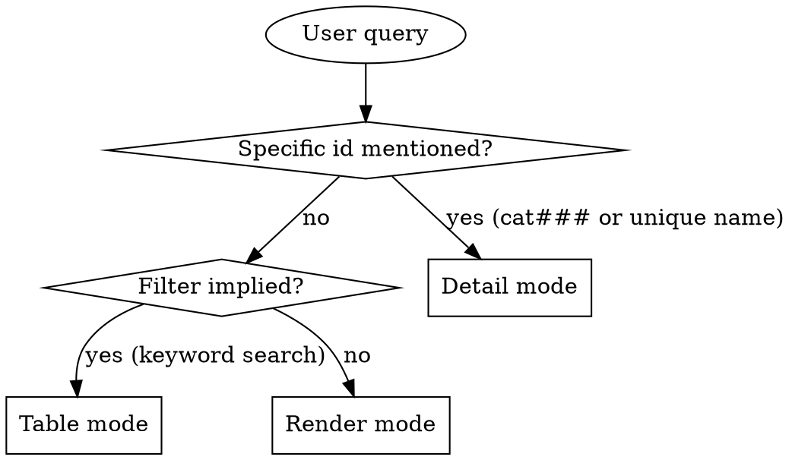

# Category Read

## Overview

Read category zettels under `docs/notes/cat###.md` and present them in the format that best fits the user's question. Categories are the smallest AKM type — frontmatter + `## name` + `## summary` — so detail mode often includes a usage cross-reference (which ADRs / Features / Implementations file under this category).

Three output modes — pick one, don't combine.

**Announce at start:** "Using category-read skill to surface the taxonomy."

## Storage

**Backend:** AKM. Categories live in `docs/notes/cat###.md`. Schema in `docs/notes/akm.md`; this skill only needs the slice below.

Categories are append-only and `status` is always `stable`. There is no draft/superseded lifecycle for categories — renaming is a wikilink-graph operation.

If no `cat*.md` files: tell the user "No categories found under docs/notes/. Use category-write to add one."

### Zettel slice this skill needs

```markdown
---
aliases:
  - <category name>
status: stable
created: YYYY-MM-DD
---
# Category [[product]]

## name
<category name>

## summary
<one-liner: what decisions / capabilities belong here>
```

**Key extraction rules:**

- `id` — filename slug (`cat001`).
- `name` — text under `## name` (also the first alias).
- `summary` — one-line text under `## summary`.

## Usage cross-reference (detail + render modes only)

Categories are taxonomy buckets — their value is in the zettels that reference them. For detail and render modes, also count and optionally list:

- **ADRs filed under this category** — `adr####` zettels whose H1 contains the `[[cat###]]` link.
- **Features in this category** — `ft###` zettels whose H1 contains the `[[cat###]]` link.
- **Implementations in this category** — `im###` zettels whose H1 contains the `[[cat###]]` link.

This is a cheap grep: `grep -l '\[\[cat003\]\]' docs/notes/{adr,ft,im}*.md`. Cache the count; render up to 3 example ids per type in detail mode.

For table mode, count-only (no list) keeps the table scannable.

## Mode Selection



### Detail mode triggers
- Query contains `cat###`.
- Names one category by name or alias.
- "show me cat002", "what's in the security category".

### Table mode triggers
- Keyword search: "categories about security", "find a category for caching".
- "List categories with summary".
- "Which category has the most ADRs" (sort-by-usage variation).

### Render mode triggers
- "Show me the taxonomy", "what categories do we have", "list all categories".

## Reading the zettels

1. List ids: `ls docs/notes/cat*.md`.
2. Per mode:
   - **Detail** — single file + usage cross-reference.
   - **Table** — `head -15` (frontmatter + `## name` + `## summary` first line). Usage counts via grep per category.
   - **Render** — full read + usage cross-reference per category.

Sort by filename ascending.

## Mode 1: Detail

```markdown
## [id] — [name]

[summary]

**Usage:**

- **ADRs (N):** [adr0001, adr0003, adr0007]    *(up to 3 examples)*
- **Features (N):** [ft002, ft005]
- **Implementations (N):** [im004]

To list all consumers, use `adr-read --category cat003`, `feature-read --category cat003`, etc.
```

If a usage list is empty, render it as `(none)` rather than omitting.

If id not found: "Category `cat001` not found. Closest matches: ..." with 1-3 candidates.

## Mode 2: Table

| id | name | summary | adrs | features | impls |

Sort by id ascending. Truncate `summary` to ~50 chars with `…`. The last three columns are usage counts (integers).

After the table: `N categories matched.`

For "most-used category" sorts, re-sort by total usage (adrs + features + impls) descending.

## Mode 3: Render

```markdown
# Category Taxonomy

## cat001 — workflow
Long-running orchestration / state-machine decisions.

**Usage:** 5 ADRs, 1 feature, 2 implementations.

## cat002 — data
Schema, retention, persistence boundaries.

**Usage:** 3 ADRs, 2 features, 4 implementations.

...
```

End: `Total: N categories. M ADRs filed, P features tagged, Q implementations tagged.`

## Filter Parsing

| User says | Match against |
|---|---|
| "about X", "for Y", "covering Z" | `name` or `summary` contains keyword (case-insensitive substring) |
| "with the most ADRs / features / impls" | sort by that usage count descending |
| "unused", "empty" | usage count of 0 across all three types |
| "with no ADRs" | adr count = 0 |

## What This Skill Does NOT Do

- It does not create or rename categories. Use `category-write` to add. Renaming is not implemented as a skill — it's a wikilink-graph refactor across every zettel that references the old slug.
- It does not modify the zettels that reference categories. Those have their own writers.
- It does not validate that every ADR has exactly one category. The constraint is checked at write time in `adr-write`, surfaced as a render-time warning in `adr-read`.

## When to Defer to Other Skills

- Add a new category → `category-write`.
- List ADRs in a category → `adr-read` (filter by `cat###`).
- List features / implementations in a category → `feature-read` / `implementation-read` (filter by `cat###`).
- Tag a story with a category-like wikilink → `tag-manage` (the tag layer is separate from formal categories).
