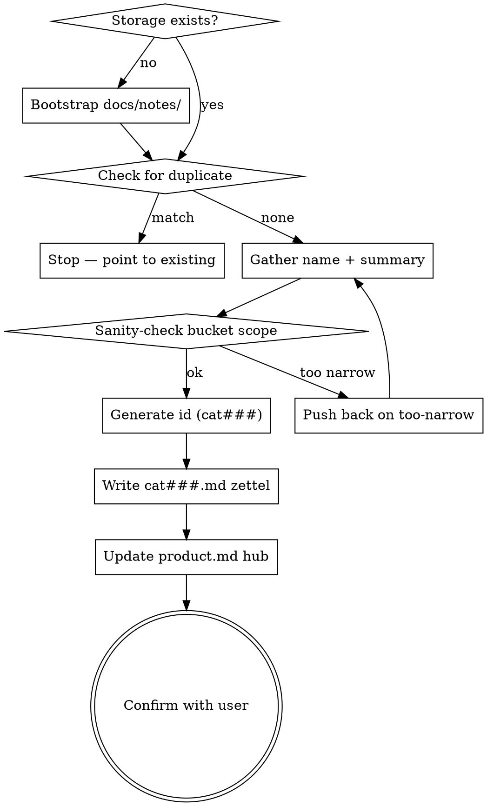

# Category Write

## Overview

Mint a new Category zettel — a taxonomy bucket for ADRs and a reusable tag for any zettel. Output: one file at `docs/notes/cat###.md` per the AKM schema in `docs/notes/akm.md` (see the **Category — `cat###.md`** section there). Categories are tiny: a name, a one-line summary of what kinds of decisions belong in the bucket, and that is the whole card.

**Storage backend:** AKM (Agentic Knowledge Model). The canonical schema lives in `docs/notes/akm.md`; this skill writes one file per category under `docs/notes/`. Do not duplicate the schema here — load `akm.md` when in doubt.

**Announce at start:** "Using category-write skill to mint a new Category bucket."

## Why categories are special

Categories carry the taxonomy that ADRs file under. An ADR's H1 has *exactly one* `[[cat###]]` link, so every category is referenced by potentially many ADRs across the lifetime of the workspace. Two consequences shape this skill:

1. **Slow-changing.** A new category should reflect a genuine, recurring axis of decision-making (security, data, infrastructure, testing, …) — not a one-off topic that would be better as a free-form concept note. Adding a category is cheap; removing one is impossible without rewriting ADRs.
2. **Renaming is expensive.** The filename `cat###.md` and the human label (in `aliases` + `## name`) are decoupled — that's by design, because the slug stays stable while the label can evolve. But if the category is renamed *and* the wikilinks-to-slug get touched (or the slug itself migrates), every ADR with that `[[cat###]]` in its H1 must be audited. Flag this loudly when proposing a rename.

There is no `draft` / `superseded` lifecycle — categories are `stable` from birth. If a category turns out to be wrong, the cure is a new category and a wikilink audit on the affected ADRs, not a status flip.

## Process Flow



## Storage

**File:** one zettel per category at `docs/notes/cat###.md` (three-digit zero-padded id).

If `docs/notes/` does not exist: create it. If `docs/product.md` does not exist, warn the user "No `docs/product.md` found; AKM workspace not initialized. Create the hub manually first, or run the project's bootstrap." then either proceed (zettel will reference a dangling `[[product]]`) or abort if the user prefers.

## Duplicate check (before any write)

A new category that overlaps an existing one fragments the taxonomy — ADRs end up split across `[[cat003|security]]` and `[[cat017|security-and-auth]]` for no good reason. Before generating an id:

1. List existing categories: `ls docs/notes/cat*.md`.
2. For each, read frontmatter `aliases` (the human label) and the `## name` body section. Build a quick scan of all category labels.
3. If the requested name matches an existing alias (case-insensitive, or near-synonym like `security` vs `auth-and-security`), stop and surface the match: *"Category `cat003` already covers this (alias: `security`). Use the existing one, or describe how the new bucket is genuinely distinct."*
4. Only proceed when the user confirms the new bucket is non-overlapping.

## Zettel Schema

Categories have the smallest body in the AKM catalog. Exact shape per `akm.md`:

```markdown
---
aliases:
  - <category name>
status: stable
created: YYYY-MM-DD
---
# Category [[product]]

## name
<category name>

## summary
<one-liner: what kinds of decisions belong here>

---

Index: [[product]]
```

**Required pieces:**

- Frontmatter `aliases` (at least one — the canonical category name), `status: stable` (the only valid value), `created` (ISO date).
- H1 is exactly `# Category [[product]]` — no tag wikilinks on the H1. Categories are the taxonomy layer; they do not get tagged by other categories. This is the one zettel type with a tagless H1.
- `## name` body section (human label, same as the first alias — duplicated here so renderers don't need to read the frontmatter).
- `## summary` body section — one sentence describing what kinds of decisions belong in this bucket. Resist the urge to write a paragraph; if it needs a paragraph, the bucket is probably too broad or you are writing the wrong zettel type.
- `Index: [[product]]` footer after a `---` horizontal rule.

**No optional sections.** Categories are buckets, not articles. If you find yourself wanting `## examples` or `## related`, those belong on the ADRs that file under this category, not on the category itself.

## ID Generation

IDs are `cat` + three-digit zero-padded sequential (`cat001`, `cat002`, …).

1. List existing category zettels: `ls docs/notes/cat*.md`.
2. Extract the numeric portion of each filename. Find max, add 1.
3. Zero-pad to 3 digits. If no existing categories, start at `001`.

Gaps are never reused — `cat003` missing means `cat003` is gone forever (which for categories should be near-impossible, since deletion implies a wikilink audit across every ADR that ever referenced it).

## Gathering name and summary

Categories are tiny captures, so the conversation should be short. Two pieces only.

**Name.** A short kebab-case-friendly noun phrase — `security`, `data`, `infrastructure`, `testing`, `observability`, `api-design`. The name is what renders inside `[[cat003|security]]` wikilinks across the workspace, so optimize for reading aloud: `[[cat003|security]]` is clean, `[[cat003|sec-and-auth-stuff]]` is not.

**Summary.** One sentence stating which kinds of architectural decisions belong in this bucket. The test: an ADR author skimming summaries should immediately know whether their decision files under this category or a sibling.

- ✅ *"Decisions about how data is stored, modeled, queried, and migrated."*
- ✅ *"Decisions about how the system is observed, monitored, and alerted on."*
- ❌ *"Security stuff."* — what kind? what does an ADR author do with this?
- ❌ *"Anything related to the auth flow, the IAM service, the rate-limiting middleware, the user role hierarchy, and the audit trail integration."* — that is at least three categories.

**If the user provided both upfront:** write it, don't ask anything, confirm at the end.

**If pieces are missing:** ask one focused question per turn. Use AskUserQuestion if there are 2–4 plausible names in play; free-text for the summary.

## Sanity-check the bucket scope

A category that is too narrow is a hidden ADR — it groups one or two decisions and then never grows. The bucket should plausibly hold at least a handful of ADRs over the workspace lifetime.

**Push back once** if the proposed name reads like a single decision rather than a recurring axis:

- *"`use-postgres`"* → that is an ADR (`adr0007`), not a category. The category is `data`.
- *"`logging-format-json-vs-text`"* → ADR. The category is `observability`.
- *"`rate-limit-on-public-api`"* → ADR. The category is `api-design` or `security`.

The cure for "this is really an ADR" is to route the user to `infinifu:adr-write` with the existing or proposed parent category, not to mint a one-shot category.

After one round of push-back, defer to the user — they may know something you do not about the workspace's future decision shape.

## Writing the Zettel

Compose the markdown file per the schema above. Write to `docs/notes/cat<NNN>.md` using the generated id.

**Example output:**

`docs/notes/cat003.md`:

```markdown
---
aliases:
  - security
status: stable
created: 2026-05-15
---
# Category [[product]]

## name
security

## summary
Decisions about authentication, authorization, secrets handling, threat models, and audit trails.

---

Index: [[product]]
```

**Conventions:**

- ISO `YYYY-MM-DD` for `created`.
- One alias entry (the name) is the minimum. Add a second alias only if the user explicitly named a synonym they expect ADR authors to reach for — e.g. `aliases: [security, authn-and-authz]`. Aliases let `[[security]]` and `[[authn-and-authz]]` both resolve to the same `cat003`.
- H1 is exactly `# Category [[product]]` — no other wikilinks in the H1. Resist the temptation to add `[[meta]]` or `[[taxonomy]]` flavor wikilinks; categories are the taxonomy, they do not need to be tagged.
- Footer is a `---` horizontal rule then `Index: [[product]]` on its own line.

## Updating `docs/product.md` (the hub)

The hub groups ADRs by category under `## Architecture Decision Records`. A new category gets a new subsection there — initially empty (no ADRs yet) but ready for the first ADR to land. Append:

```markdown
## Architecture Decision Records

### [[cat001|data]]

- [[adr0001|use-postgres]]
- [[adr0004|partition-by-tenant]]

### [[cat003|security]]    ← new
```

The hub wikilink form for category headings is `### [[cat###|<name>]]` — pipe-separated, with the alias as the label for readability.

If `docs/product.md` does not exist, skip the hub update and tell the user *"Hub `docs/product.md` not found; new category is on disk but not linked from the hub. Create the hub when ready."*

## Confirmation

After writing, show the user:

1. The category id and the file path (`docs/notes/cat<NNN>.md`).
2. The canonical name and the one-line summary.
3. Whether the hub was updated.
4. A reminder of the rename-cost: *"Renaming this category later means auditing every ADR that links `[[cat<NNN>]]` in its H1 — pick the name carefully now."*

Ask once: *"Anything to revise?"* If yes, edit the zettel in place (same id) before any ADR has a chance to link to it. If no or no response, you are done.

## Renaming an existing category (audit trigger)

If the user asks to *rename* an existing category rather than create a new one, treat it as a workspace-wide operation, not a single-file edit:

1. **Confirm intent.** Renames are rare and expensive. Ask: *"This will require updating every ADR that links `[[cat<NNN>]]`. Confirm rename from `<old>` to `<new>`?"*
2. **Audit consumers.** Grep the workspace for `[[cat<NNN>` and `[[<old-alias>` — every ADR (and any other zettel) that references the category must be touched.
3. **Decide slug vs label.** Renaming just the human label (`aliases` + `## name`) is cheap — wikilinks `[[cat003]]` still resolve, only the rendered text changes (and aliased `[[<old-alias>]]` references break unless you keep the old alias). Renaming the slug itself (moving `cat003.md` to something else) is forbidden — slugs are stable ids.
4. **Default to label-only rename.** Update `aliases` and `## name` in the category zettel. Update each ADR's H1 wikilink label if it used the piped form `[[cat003|<old-label>]]`. Leave the underlying `cat003` slug alone.
5. **Report the audit.** List every file touched in the confirmation so the user can spot-check.

If the request is to *deprecate* a category rather than rename it, push back hard: the AKM schema does not define a deprecated-category state because the bucket is referenced by ADRs that you cannot retroactively unlink. The cure is to stop filing new ADRs under it, not to mark the category itself dead.

## What This Skill Does NOT Do

- It does not write ADRs. That is `infinifu:adr-write` (which consumes categories).
- It does not manage H1 tag wikilinks on other zettels. That is `infinifu:tag-manage` — a different concept (tag-manage attaches existing-or-new bare wikilinks like `[[catalog]]` to stories/features; this skill mints `cat###` numbered taxonomy buckets).
- It does not create features, implementations, stories, personas. Each of those has its own typed writer.
- It does not delete or supersede categories. There is no lifecycle beyond `stable`; the bucket exists or does not.
- It does not retroactively re-categorize ADRs. If a category split or merge is needed, that is an explicit cross-zettel refactor (audit every affected ADR, update their H1 wikilink, possibly file a new ADR documenting the taxonomy change).

## When to Defer to Other Skills

- User wants to write an ADR (the thing that *uses* a category) → `infinifu:adr-write`.
- User wants to attach a free-form tag like `[[requestor-flow]]` to a story → `infinifu:tag-manage` (categories are numbered `cat###` buckets; tags are bare slug wikilinks — different layer).
- User wants a generic concept note that does not belong to the ADR taxonomy → `infinifu:zettel-write` (will emit a named-slug card under `docs/notes/<slug>.md`).
- User wants to inspect existing categories before deciding → list them directly (`ls docs/notes/cat*.md`) or route via `infinifu:zettel-write` for the broader knowledge-capture decision.

## Integration

<integration>

**Called by:**

- `infinifu:adr-write` — when an ADR's H1 needs a `[[cat###]]` bucket that does not yet exist, the ADR writer pauses and invokes this skill to mint the category first, then resumes the ADR with the freshly-minted id.
- `infinifu:feature-write` — when a Feature zettel needs one or more `[[cat###]]` taxonomy wikilinks in its H1 and a required bucket is missing.
- `infinifu:zettel-write` — the orchestrator routes here when a capture request is the *taxonomy bucket itself* (rather than an ADR or feature that consumes one).
- Ad hoc by the user with phrases like "we need a `cat###` for X".

**Calls:** nothing — this skill is a leaf writer. Hub update is inline (a small edit to `docs/product.md`); no skill delegation.

**Complements:**

- `infinifu:adr-write` — the primary downstream consumer of categories.
- `infinifu:tag-manage` — distinct concept (bare-slug tags vs numbered `cat###` buckets); the two coexist as separate layers of the taxonomy.

</integration>

## References

- `docs/notes/akm.md` — canonical AKM schema; the **Category — `cat###.md`** section is the source of truth for the body shape, frontmatter, and lifecycle. Load when in doubt about the schema or when reviewing this skill against AKM drift.
- `infinifu:meta-skill-writing` — house style for this skill's own SKILL.md; load when refactoring this file.
