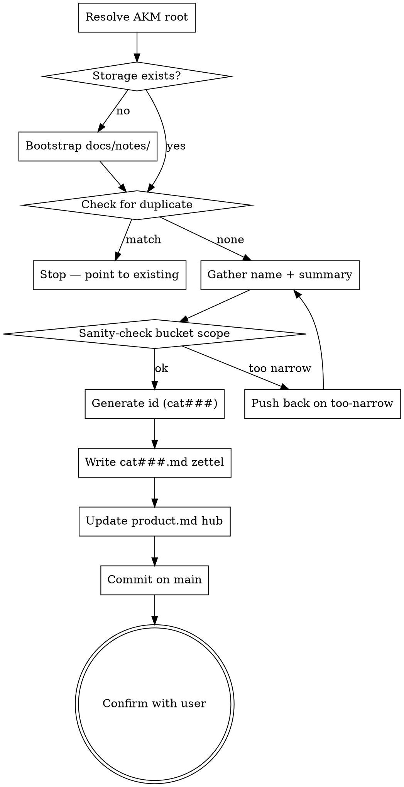

<skill_overview>
Mint a new Category zettel — a taxonomy bucket for ADRs and a reusable tag for any zettel. Output: one file at `docs/notes/cat###.md` per the AKM schema in `docs/notes/akm.md` (see the **Category — `cat###.md`** section there). Categories are tiny: a name, a one-line summary of what kinds of decisions belong in the bucket, and that is the whole card.

**Announce at start:** "Using category-write skill to mint a new Category bucket."
</skill_overview>

<rigidity_level>
MEDIUM FREEDOM — the schema and the duplicate / sanity / rename-audit gates are non-negotiable because categories are referenced by potentially many ADRs across the lifetime of the workspace. The conversation to gather name and summary adapts to how much the user already supplied.
</rigidity_level>

<quick_reference>
| Step | Action | Output |
|------|--------|--------|
| 1 | Resolve `AKM_ROOT="$(akm-root)"`; bootstrap `$AKM_ROOT/docs/notes/` if missing | workspace ready |
| 2 | Duplicate check — scan existing `cat###` aliases under `$AKM_ROOT` | go / stop-and-point |
| 3 | Gather name (kebab noun phrase) + one-line summary | two strings |
| 4 | Sanity-check bucket scope (is this really an ADR?) | go / push-back |
| 5 | Generate id `cat###` (max existing + 1, zero-padded) | new id |
| 6 | Write zettel per schema in `docs/notes/akm.md` | `$AKM_ROOT/docs/notes/cat###.md` on disk |
| 7 | Append `### [[cat###\|<name>]]` heading under product.md `## Architecture Decision Records` | hub linked |
| 8 | Commit on main (`git -C "$AKM_ROOT" commit`) | stable artifact landed |
| 9 | Confirm with rename-cost reminder | user signs off |

**Schema source of truth:** `docs/notes/akm.md` → **Category — `cat###.md`** section. Do not duplicate it here.
</quick_reference>

<workspace_resolution>
Categories are shared taxonomy — they live on **main**, even from a feature-branch worktree. Resolve before any file op:

```bash
AKM_ROOT="$(akm-root)"
```

`akm-root` returns the main-worktree path (default branch); outside git, cwd. Anchor every path on `$AKM_ROOT` (`$AKM_ROOT/docs/notes/cat###.md`, `$AKM_ROOT/docs/product.md`). If `akm-root` errors, surface its stderr and abort — never silently land a category on the feature branch.

Categories are **stable from birth** — no `draft` / `proposed` / `superseded` lifecycle. This writer therefore **commits on main on creation**, not stages:

```bash
git -C "$AKM_ROOT" add docs/notes/cat<NNN>.md docs/product.md
git -C "$AKM_ROOT" commit -m "feat(akm): add cat<NNN> <alias>"
```

Categories are append-only and immediately referenced by ADRs / Features / Implementations whose H1 must resolve, so the commit lands with the file. See the per-stage commit table in `docs/notes/akm.md#workspace-resolution`.
</workspace_resolution>

<when_to_use>
- "Create a category for security / data / observability / …"
- An ADR writer needs a `[[cat###]]` that does not yet exist
- A Feature or Implementation needs a category bucket to slot under
- Ad hoc: "we need a `cat###` for X"

**Don't use for:**
- Writing the ADR itself (the thing that *consumes* a category) → `infinifu:adr-write`
- Attaching free-form tag wikilinks like `[[catalog]]` to a story → `infinifu:tag-manage` (different layer: bare slugs vs numbered `cat###` buckets)
- Generic concept notes that don't belong to the ADR taxonomy → `infinifu:zettel-write`
- Renaming a category as a single-file edit — see the rename-audit rule below
</when_to_use>

<the_process>



## Steps

1. **Storage bootstrap.** Resolve `AKM_ROOT="$(akm-root)"` first. Create `$AKM_ROOT/docs/notes/` if missing. If `$AKM_ROOT/docs/product.md` is missing, warn ("AKM workspace not initialized in `$AKM_ROOT`") and either proceed (zettel will reference a dangling `[[product]]`) or abort per the user's choice.
2. **Duplicate check.** `ls "$AKM_ROOT/docs/notes/"cat*.md`, read each frontmatter `aliases` and `## name`. If the requested name matches an existing alias (case-insensitive, including near-synonyms like `security` vs `auth-and-security`), stop and surface the match. Full procedure in `references/examples.md` → *Duplicate-check walkthrough*.
3. **Gather name + summary.** Name: short kebab-friendly noun phrase (`security`, `data`, `observability`). Summary: one sentence stating which kinds of architectural decisions belong here. If both arrived upfront, write; if pieces are missing, ask one focused question per turn (`AskUserQuestion` when 2–4 names are in play). Good/bad summaries in `references/examples.md`.
4. **Sanity-check scope.** Is this a recurring axis of decision-making, or a single decision in disguise? Names like `use-postgres`, `logging-format-json-vs-text`, `rate-limit-on-public-api` are ADRs, not categories — the parent category already exists (`data`, `observability`, `api-design`). Push back once, then defer to the user.
5. **Generate id.** `cat` + three-digit zero-padded. Find max numeric portion across existing `$AKM_ROOT/docs/notes/cat*.md`, add 1. Gaps are never reused — they preserve historical context.
6. **Write the zettel.** Compose `$AKM_ROOT/docs/notes/cat<NNN>.md` per the **Category — `cat###.md`** section of `docs/notes/akm.md`. The whole card: frontmatter (`aliases`, `status: stable`, `created`), H1 `# Category [[product]]` (no other wikilinks), `## name`, `## summary`, `---`, `Index: [[product]]`. Worked example in `references/examples.md`.
7. **Update the hub.** Append `### [[cat###|<name>]]` under `## Architecture Decision Records` in `$AKM_ROOT/docs/product.md`, initially with no ADR bullets. Skip and warn if the hub does not exist.
8. **Commit on main.** Categories are stable from birth — land the file and hub edit in one commit:

   ```bash
   git -C "$AKM_ROOT" add docs/notes/cat<NNN>.md docs/product.md
   git -C "$AKM_ROOT" commit -m "feat(akm): add cat<NNN> <alias>"
   ```

   If the hub was not updated (no `product.md`), commit only the zettel.
9. **Confirm.** Report id, absolute file path under `$AKM_ROOT`, name, summary, hub-status, the commit sha, and the rename-cost reminder ("Renaming this later means auditing every ADR that links `[[cat<NNN>]]`"). Ask once: "Anything to revise?"

</the_process>

<critical_rules>

- **Status is always `stable`.** There is no `draft` / `proposed` / `superseded` lifecycle for categories. If a category turns out to be wrong, the cure is a new category plus a wikilink audit on the affected ADRs, not a status flip.
- **No deprecation either.** The AKM schema does not define a deprecated-category state because the bucket is referenced by ADRs you cannot retroactively unlink. Push back hard if the user asks to deprecate; route them to "stop filing new ADRs under it" instead.
- **Tagless H1.** `# Category [[product]]` and nothing else. Categories *are* the taxonomy layer — they do not get tagged by other categories. This is the only zettel type with a single-wikilink H1.
- **Run the duplicate check before generating an id.** A second `security` bucket fragments every future ADR search across `[[cat003|security]]` and `[[cat017|security-and-auth]]`. The check is cheap; the fragmentation is forever.
- **Run the sanity check before writing.** A category that is too narrow is a hidden ADR. If the proposed name reads like a single decision, route to `infinifu:adr-write` with the existing parent category rather than minting a one-shot bucket.
- **Rename is a workspace-wide audit, not a single-file edit.** Renaming the *label* (aliases + `## name`) is cheap because wikilinks `[[cat###]]` still resolve. Renaming the *slug* (moving `cat003.md`) is forbidden — slugs are stable ids. Either way, grep `[[cat<NNN>` and `[[<old-alias>` across the workspace and surface every consumer in the confirmation. Full procedure in `references/examples.md` → *Rename audit*.
- **Gaps are never reused.** `cat003` missing means `cat003` is gone forever. Always take max + 1.
- **No optional body sections.** Categories are buckets, not articles. `## examples` or `## related` belong on the ADRs that file under this category, not on the category itself.

</critical_rules>

<integration>

**Called by:**
- `infinifu:adr-write` — when an ADR's H1 needs a `[[cat###]]` bucket that does not yet exist, the ADR writer pauses, invokes this skill to mint the category, then resumes.
- `infinifu:feature-write` and `infinifu:implementation-write` — when an H1 `[[cat###]]` is missing.
- Ad hoc by the user with phrases like "we need a `cat###` for X".

**Calls:** nothing. Leaf writer. The hub update is an inline edit to `docs/product.md`.

**Complements:**
- `infinifu:adr-write` — the primary downstream consumer.
- `infinifu:tag-manage` — distinct layer (bare-slug tags vs numbered `cat###` buckets); the two coexist as separate parts of the taxonomy.

</integration>

<references>
Load these on demand, not preemptively.

- `references/examples.md` — worked zettel example, duplicate-check walkthrough, good/bad summaries, rename-audit procedure. Load when minting a non-trivial category, when the duplicate check returns a near-match, or when the user asks to rename a category.
- `docs/notes/akm.md` (in the target workspace) — canonical AKM schema. The **Category — `cat###.md`** section is the source of truth for the body shape, frontmatter, and lifecycle. Load when in doubt about schema details or when reviewing this skill against AKM drift.
</references>
