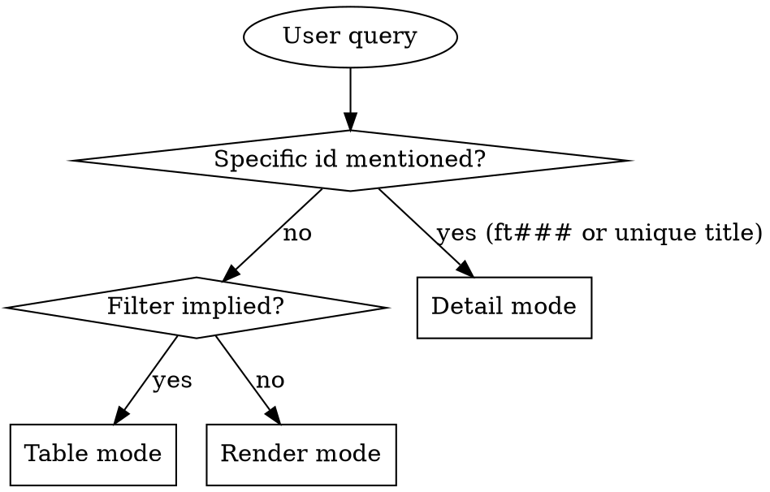

# Feature Read

## Overview

Read feature zettels under `docs/notes/ft###.md` and present them in the format that best fits the user's question. Three output modes — pick one, don't combine.

**Announce at start:** "Using feature-read skill to surface capabilities."

## Data source

All reads go through the `akm` CLI — never resolve `AKM_ROOT` or parse
frontmatter by hand. The CLI enforces the strict main-worktree rule
and returns canonical state.

```bash
akm list ft --json | from json         # all features as structured rows
akm read ft003                          # full markdown of one feature
```

If `akm` refuses with exit 2, surface its stderr and stop.
If `akm list ft --json` returns `[]`: tell the user "No features found.
Use feature-write to add one."

## Schema (this skill's slice)

```markdown
---
aliases:
  - <human-readable capability one-liner>
status: <proposed|stable|deprecated|superseded>
created: YYYY-MM-DD
---
# Feature [[cat###]] [[cat###]] [[product]]

## providing
<one-paragraph: what capability + who consumes it>

## api_surface
<how consumers invoke it>

## data_model
<own state, if any>

## sample
<sample snippet or pointer>

## components
- <module / file / path>

## superseded_by
[[ft###|<replacement>]]   # only when status = superseded
```

**Key extraction rules:**

- `id` — filename slug (`ft001`).
- `title` — first alias.
- `categories` — every `[[cat###]]` wikilink in the H1 except `[[product]]`. Render as slug.
- `providing` — paragraph under `## providing` (the headline capability).
- `api_surface`, `data_model`, `sample` — sections (free-form).
- `components` — bullets.
- `superseded_by` — wikilink under `## superseded_by`; only meaningful when status=superseded.

Omit silently if a section is missing.

## Mode Selection



### Detail mode triggers
- Query contains `ft###` (case-insensitive).
- Names one feature by title.
- "show me feature X", "what does ft005 do".

### Table mode triggers
- Status filters: `proposed`, `stable`, `deprecated`, `superseded`.
- Category filters: "features in cat003", "security features".
- Keyword search: "features about notifications".
- "List features", "how many features are stable".

### Render mode triggers
- "Show me the feature catalog", "what capabilities do we have".
- No filter and no id.

## Reading the zettels

- **Detail** — `akm read <id>` (e.g. `akm read ft003`).
- **Table / Render** — `akm list ft --json | from json` returns
  type / id / name / status / created / categories. For body fields
  (`## providing`, `## api_surface`, etc.) the list doesn't carry,
  fetch each matching id via `akm read <id>`.

## Mode 1: Detail

```markdown
## [id] — [title]

**Categories:** [cat001, cat002]    **Status:** [status]    **Created:** [created]

**Providing:** [providing paragraph]

**API surface:** [api_surface]

**Data model:** [data_model]

**Components:**
- [path 1]
- [path 2]

**Superseded by:** [ft###]    *(only if status = superseded)*
```

Drop sections that are empty.

If id not found: "Feature `ft001` not found. Closest matches: ..." with 1-3 candidates.

## Mode 2: Table

| id | status | categories | title | providing |

Sort by id ascending. Truncate `providing` to ~50 chars with `…`. Render `categories` as a comma-joined slug list.

After the table: `N features matched (X stable, Y proposed, Z deprecated, W superseded).` Omit zero buckets.

## Mode 3: Render

Grouped by status: `stable` → `proposed` → `deprecated` → `superseded`. Within each group sort by id ascending.

```markdown
# Feature Catalog

## Stable

### ft001 — notifications service
**Categories:** cat002 (data), cat004 (delivery)

**Providing:** ...

**API surface:** ...

### ft003 — ...
```

End: `Total: N features (X stable, Y proposed, Z deprecated, W superseded).`

## Filter Parsing

| User says | Match against |
|---|---|
| "proposed" | `status: proposed` |
| "stable", "active", "in use" | `status: stable` |
| "deprecated" | `status: deprecated` |
| "superseded", "replaced" | `status: superseded` |
| "in cat###", "category X" | H1 contains the category id or its alias |
| "about X", "for Y" | any text field (title, providing, api_surface, components) |

Multiple filters compose with AND.

## What This Skill Does NOT Do

- It does not modify features. To edit/supersede, use `feature-write`.
- It does not list consuming Implementations directly — that surfaces via moxide back-refs or `implementation-read --consumes ft###`. Defer to those tools.

## When to Defer to Other Skills

- Add / deprecate / supersede a feature → `feature-write`.
- See which Implementations consume a feature → `implementation-read`.
- Pick a feature to consume in a new spec → `spec-writing` (it surveys features for you).
