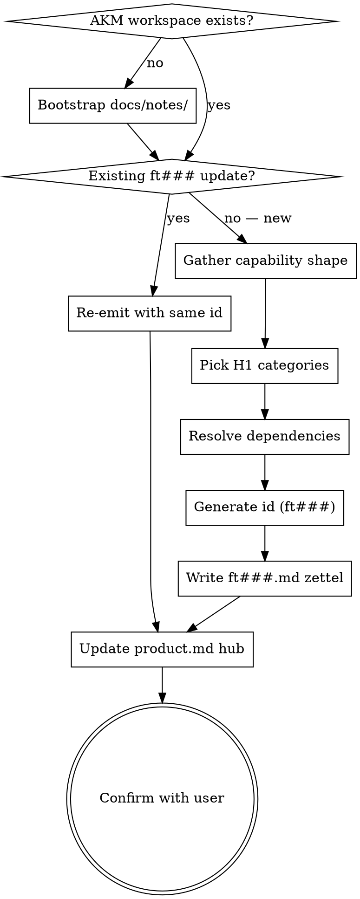

<skill_overview>
A Feature is the AKM record for a reusable building block — notifications, authentication, database access, audit-log — that the system implements once and many Implementations consume. This skill captures one such capability per zettel under `docs/notes/ft###.md`, with a tight contract surface (`providing` + `api_surface` + `data_model`) so downstream Implementations inherit constraints by reference, not by re-statement. Features are decoupled from stories on purpose: they describe what the system *provides*, not what any one user asks for.
</skill_overview>

<rigidity_level>
MEDIUM FREEDOM — the AKM schema is fixed (filename, sections, required wikilinks) because the corpus is queried by grep, moxide LSP, and downstream Implementation zettels that resolve `features: [[ft###]]` back-refs. Deviate and the graph silently breaks. Everything else (how much detail under each section, how to phrase the contract) adapts to the capability.

Two things are non-negotiable beyond the schema:

1. **Append-only contract.** Tightening `providing` / `api_surface` on a `stable` Feature is allowed only when reality demands it; *widening* the contract (new behaviour, looser invariants) means a new Feature and a `superseded_by` chain — not an in-place edit. Implementations downstream rely on the contract being stable; silent widening breaks that promise.
2. **No `solves` link.** Features must not back-link to a story. They serve Implementations, Implementations serve stories. If the user describes the Feature as "for story us013", that's a sign the capability is actually story-specific glue and belongs in an `im###` Implementation, not a Feature.
</rigidity_level>

<quick_reference>

| Aspect | Convention |
|--------|-----------|
| Filename | `docs/notes/ft###.md` (3-digit zero-padded, sequential, never reused) |
| Frontmatter | `aliases:` (≥1), `status:` (lowercase), `created:` (ISO) |
| Status values | `proposed` \| `stable` \| `deprecated` \| `superseded` |
| H1 | `# Feature [[cat###]] [[cat###]] [[product]]` — ≥1 category required |
| Body sections | `## providing`, `## api_surface`, `## data_model`, `## sample`, `## components`, optional `## superseded_by` |
| Footer | `Index: [[product]]` |
| Forward chain | `superseded_by` lives in the body as `## superseded_by` with `[[ft###]]`, not in frontmatter |
| Layering | Features may `depends_on` other Features (capabilities stack — e.g. notifications → templating) |
| Schema source | `docs/notes/akm.md` § Feature — `ft###.md` |

</quick_reference>

<when_to_use>
**Use when:**

- User describes a horizontal capability used by many Implementations (notification service, auth, audit-log, database access, templating, rate-limiter)
- User says "we keep rebuilding X, capture it as a feature" / "register this as a shared service" / "add this building block to the AKM"
- A Spec retrospective surfaces a piece of glue that turned out to be reusable and deserves a Feature card
- User wants to deprecate or supersede an existing Feature (`ft###` → new `ft###` chain)

**Don't use for:**

- Capturing a user-visible requirement — use `infinifu:story-write` (`us###`)
- Capturing how *one* story is solved by composing Features — use `infinifu:implementation-write` (`im###`)
- Capturing a *decision* about which library / pattern / trade-off to adopt — use `infinifu:adr-write` (`adr####`)
- Free-form concept notes / glossary entries — use `infinifu:zettel-write` (generic named-slug card)
- A new taxonomy bucket itself — use `infinifu:category-write` (`cat###`)
</when_to_use>

<the_process>

## Flow



## Storage bootstrap

One zettel per Feature at `docs/notes/ft###.md`. If `docs/notes/` does not exist, create it. If `docs/product.md` does not exist, warn the user "No `docs/product.md` found; AKM workspace not initialized — Feature will reference a dangling `[[product]]`. Create the hub manually or via the project's `epic-create` skill first." Then either proceed (file lands, hub link dangles) or abort if the user prefers.

## Gathering the capability shape

Features are short. Don't over-interview — capture the contract the user has in mind. Full design conversations belong upstream in `infinifu:idea-brainstorming`.

**Elicit (if missing):**

- **`providing`** — *what capability, who/what consumes it.* Elevator pitch.
- **`api_surface`** — *how consumers invoke it.* Function signature, endpoint, message contract. *"You call it somehow"* is not an api surface.
- **`data_model`** — *own state.* "Stateless" is fine; otherwise schema sketch + retention + ownership.
- **`sample`** — tiny snippet or path to a sample file. A Feature nobody can show how to use is still an idea.
- **`components`** — modules / paths / packages that implement the capability. The entry point for `infinifu:story-map` traceability.

If two or more pieces stay vague after one round of asking, the capability isn't ready — suggest `infinifu:idea-brainstorming` first.

## H1 categories (≥1 required)

The H1 carries one or more `[[cat###]]` buckets plus `[[product]]`:

```markdown
# Feature [[cat003]] [[cat007]] [[product]]
```

Unlike ADRs (exactly one), Features may list several when the capability genuinely spans buckets (an audit-log feature touches both data and security). Minimum is one.

1. List existing categories: `ls docs/notes/cat*.md`; read frontmatter `aliases:` for canonical labels.
2. User-named match → use that `cat###`. User listed categories verbatim → use them.
3. No match and a new bucket is genuinely needed → send the user to `infinifu:category-write` first. Don't fabricate dangling `[[cat###]]` links.

## Feature dependencies (`depends_on`)

When a Feature builds on another (notifications → templating; audit-log → database-access), record it as a `## depends_on` body section listing upstream `[[ft###]]` wikilinks. Only include the section when there is at least one dependency — don't leave an empty heading. This pattern is documented in `akm.md` ("Features may `depends_on` another Feature when capabilities layer").

## ID generation

`ft` + three-digit zero-padded sequential (`ft001`, `ft002`, …). Not date-bucketed — pure sequential keeps `[[ft001]]` stable forever.

1. `ls docs/notes/ft*.md` → extract numeric portion → `max + 1`, zero-padded to 3. No existing Features: start at `001`.
2. Gaps stay gaps. A superseded `ft003` keeps its file; the replacement gets a fresh id (never `ft003` again).

## Writing the zettel

Compose the full markdown file per the schema. Write to `docs/notes/ft<NNN>.md` using the generated id.

### Schema (canonical source: `docs/notes/akm.md` § Feature)

```markdown
---
aliases:
  - <human-readable capability one-liner>
status: <proposed|stable|deprecated|superseded>
created: YYYY-MM-DD
---
# Feature [[cat###]] [[cat###]] [[product]]

## providing
<one paragraph: what capability this provides, who/what consumes it>

## api_surface
<how consumers invoke it: function, endpoint, message contract>

## data_model
<own state, if any — schema, retention, ownership; "stateless" is fine>

## sample
<sample code snippet or link to a sample file showing how to implement / consume>

## components
- <module / file / path>
- <module / file / path>

## depends_on            ← only when this Feature layers on others
- [[ft###|<feature>]]

## superseded_by         ← only when status = superseded
[[ft###|<replacement>]]

---

Index: [[product]]
```

### Worked example

`docs/notes/ft004.md`:

```markdown
---
aliases:
  - audit log — append-only event record
status: stable
created: 2026-05-15
---
# Feature [[cat003|data]] [[cat007|security]] [[product]]

## providing
Append-only record of state-changing events (actor, timestamp, payload). Consumers: any Implementation mutating user-visible data. 7-year retention is part of the contract — no opt-out.

## api_surface
`audit.record(event_type: str, actor_id: str, payload: dict) -> event_id: uuid`. Synchronous append; failure raises `AuditWriteError` and the caller aborts the surrounding transaction (no silent drop).

## data_model
`audit_events` table: `id uuid pk`, `event_type text`, `actor_id text`, `payload jsonb`, `recorded_at timestamptz`. Monthly partitions; 7-year retention enforced by drop job. No updates, no deletes.

## sample
`event_id = record("request.approved", actor_id=user.id, payload={"request_id": req.id})`

## components
- `services/audit/recorder.py`
- `services/audit/schema.sql`
- `infra/retention/audit_drop.cron`

## depends_on
- [[ft002|database-access]]

---

Index: [[product]]
```

### Lifecycle status values

| Status | Meaning |
|--------|---------|
| `proposed` | design under discussion; no production consumers yet |
| `stable` | at least one Implementation consumes it; constraints are the contract |
| `deprecated` | no longer recommended; existing consumers stay until migrated; no forward link |
| `superseded` | replaced; `## superseded_by [[ft###]]` body section carries the chain |

New Features default to `proposed`. Promote to `stable` once a real Implementation lists this Feature in its `features:` section.

## Editing / superseding / deprecating

Features are append-only in spirit, like ADRs and Implementations. Three legitimate edit modes:

- **Tighten (rare).** Reality demanded a narrower invariant — edit `providing` / `api_surface` in place, keep `status: stable`.
- **Deprecate.** No replacement, but new consumers shouldn't pick this up. Flip `status: deprecated`; body stays for existing consumers.
- **Supersede.** Write the new `ft###` first. On the old Feature: flip `status: superseded` and add `## superseded_by [[ft<new>|<alias>]]` in the body. Never delete — the chain is part of the graph.

**Forbidden:** widening `providing` / `api_surface` on a `stable` Feature in place. Downstream Implementations rely on the contract as written; widening means a new Feature and a supersede chain.

## Updating `docs/product.md` (the hub)

The hub lists Features under `## Features` as a flat bullet list. Wikilink form is `[[ft###|<alias>]]` — first frontmatter alias as label. Append on create. For supersede chains: remove the old entry, add the new one (the old file stays on disk; the hub points at the live Feature).

If `docs/product.md` doesn't exist, skip and tell the user: "Hub not found; Feature is on disk but not linked from the hub."

## Confirmation

After writing, show: (1) Feature id + file path, (2) `providing` restatement, (3) H1 categories + any `depends_on`, (4) `components` paths, (5) hub update status. Ask once: "Anything to revise?" If yes, edit in place (same id).

</the_process>

<critical_rules>

- **One capability per Feature.** If `providing` describes two distinct services, split into two `ft###` cards before writing. A Feature with a compound contract is two Features waiting to drift apart.
- **No `solves` link.** Features never back-link to stories. If the user describes the capability as "for `us013`", it's probably story-specific glue and belongs in an `im###` Implementation.
- **Append-only contract.** Widening `providing` / `api_surface` on a `stable` Feature means a new Feature + `superseded_by` chain. Tightening in place is OK only when reality demands it.
- **Filename = stable id.** Gaps stay gaps. A superseded `ft003` keeps its file; the replacement gets a fresh `ft###`. Never reuse ids.
- **Real category, not fabricated.** Every `[[cat###]]` in the H1 must resolve to an existing `docs/notes/cat###.md`. Missing category → create it with `infinifu:category-write` first.
- **Show, don't promise, the api_surface.** A Feature whose `api_surface` is "you call it somehow" is still an idea. Either get a concrete signature/endpoint/contract or send the user back to `infinifu:idea-brainstorming`.
- **`sample` is the proof.** A Feature nobody can show how to use is a Feature nobody actually uses. Push back once if the sample is missing; accept "link to existing sample file" as a valid form.
- **Lowercase status values.** `proposed | stable | deprecated | superseded` — unlike ADR statuses which are capitalized. The schema is the schema; don't mix.

</critical_rules>

<verification_checklist>

Before reporting the Feature written:

- [ ] Filename matches `docs/notes/ft###.md`, id is `max(existing) + 1`, zero-padded to 3
- [ ] Frontmatter has `aliases:` (≥1), `status:` (lowercase from the four allowed values), `created:` ISO date
- [ ] H1 has `# Feature` plus ≥1 `[[cat###]]` (resolving to existing files) plus `[[product]]`
- [ ] Body sections in order: `## providing`, `## api_surface`, `## data_model`, `## sample`, `## components`
- [ ] `## depends_on` present only when the Feature actually layers on others; each entry `[[ft###]]` resolves
- [ ] `## superseded_by` present iff `status: superseded`, with `[[ft###]]` to the replacement
- [ ] `Index: [[product]]` footer present after a `---` rule
- [ ] No `solves: [[us###]]` link anywhere in the body
- [ ] `## Features` hub bullet added (or skipped with note if `product.md` missing)

</verification_checklist>

<integration>

**Called by:**

- `infinifu:zettel-write` — when the orchestrator routes a capture to the Feature type
- `infinifu:idea-brainstorming` — when a brainstorm concludes that the design produced a reusable capability worth its own Feature card
- `infinifu:spec-retro` — when a retrospective surfaces glue that turned out to be reusable and deserves promotion to a Feature

**Calls:**

- `infinifu:category-write` — when the H1 needs a new `[[cat###]]` bucket that doesn't exist yet
- `infinifu:story-map` (indirectly) — after the Feature is live, `components` paths become first-class entries for code-to-zettel traceability through consuming Implementations

**Sibling write-skills (decide between them at routing time):**

- `infinifu:story-write` — user-visible requirement (`us###`)
- `infinifu:implementation-write` — story-specific solution shape (`im###`) that *consumes* Features via `features:`
- `infinifu:adr-write` — architectural decision (`adr####`)
- `infinifu:persona-write` — user role (`pn###`)
- `infinifu:category-write` — taxonomy bucket (`cat###`)
- `infinifu:zettel-write` — the orchestrator; use it when routing is ambiguous

</integration>

<references>

- `docs/notes/akm.md` — canonical AKM schema, including the **Feature — `ft###.md`** section that this skill mirrors. Load when refining the schema (frontmatter keys, body sections, lifecycle states) or when checking that an edge case (deprecation, supersede chain, multi-category Feature) matches the catalog. This skill never duplicates the schema; `akm.md` is the source of truth.
- `infinifu:meta-skill-writing` — house style for this skill's own SKILL.md. Load when refactoring this file.
- `infinifu:zettel-write` — the orchestrator that routes generic capture requests to this skill. Load when reviewing the routing contract between the two.

</references>
