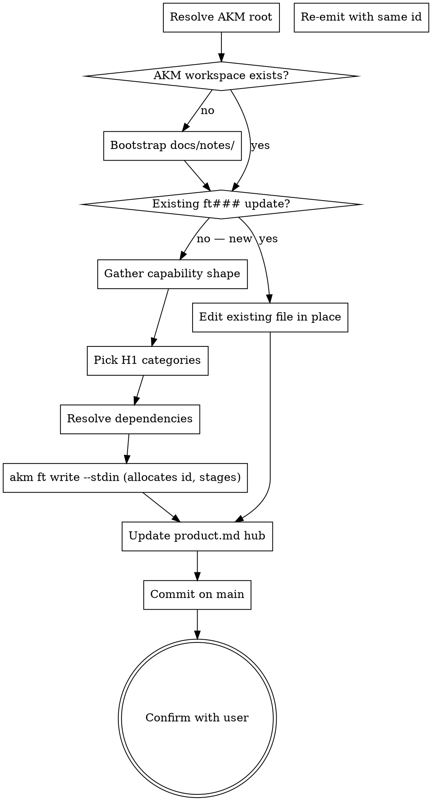

<skill_overview>
A Feature is the AKM record for a reusable building block — notifications, authentication, database access, audit-log — that the system implements once and many Implementations consume. This skill captures one such capability per zettel under `docs/notes/ft###.md`, with a tight contract surface (`providing` + `api_surface` + `data_model`) so downstream Implementations inherit constraints by reference, not by re-statement. Features are decoupled from stories on purpose: they describe what the system *provides*, not what any one user asks for.
</skill_overview>

<rigidity_level>
MEDIUM FREEDOM — the AKM schema is fixed (filename, sections, required wikilinks) because the corpus is queried by grep, moxide LSP, and downstream Implementation zettels that resolve `features: [[ft###]]` back-refs. Deviate and the graph silently breaks. Two extras beyond schema are non-negotiable: (1) the contract is **append-only** — widening `providing` / `api_surface` on a `stable` Feature means a new Feature + `superseded_by` chain, never an in-place edit; (2) **no `solves` link** — Features never back-link to stories. Everything else (how much detail per section, phrasing) adapts to the capability.
</rigidity_level>

<quick_reference>

| Aspect | Convention |
|--------|-----------|
| Filename | `docs/notes/ft###.md` (3-digit zero-padded, sequential, never reused) |
| Frontmatter | `aliases:` (≥1), `status:` (lowercase), `created:` (ISO) |
| Status values | `proposed` \| `stable` \| `deprecated` \| `superseded` |
| H1 | `# Feature [[cat###]] [[cat###]] [[product]]` — ≥1 category required |
| Body sections | `## providing`, `## api_surface`, `## data_model`, `## sample`, `## components`, optional `## depends_on`, optional `## superseded_by` |
| Footer | `Index: [[product]]` |
| Layering | Features may `depends_on` other Features (notifications → templating) |
| Schema source | this skill (`<schema>` block below); styling via `infinifu:zettel-write` |

</quick_reference>

<schema>

**Frontmatter.**

```yaml
aliases:
  - <human-readable capability one-liner>
status: <proposed|stable|deprecated|superseded>
created: YYYY-MM-DD
```

**Body skeleton.**

```markdown
# Feature [[cat###]] [[cat###]] [[product]]

## providing
<one-paragraph: what capability this provides, who/what consumes it>

## api_surface
<how consumers invoke it: function, endpoint, message contract>

## data_model
<own state, if any — schema, retention, ownership>

## sample
<sample code snippet or link to a sample file showing how to implement / consume the feature>

## components
- [<module / file / path>](../../<module / file / path>)
- [<module / file / path>](../../<module / file / path>)

## superseded_by
[[ft###|<replacement>]]        # only when status = superseded

---

Index: [[product]]
```

**Required wikilinks.** At least one `[[cat###]]` in the H1, `[[product]]`
in the H1, and the `Index: [[product]]` footer.

**Lifecycle.**

- `proposed` — design under discussion. No production consumers yet.
- `stable` — at least one Implementation consumes it; constraints are the
  contract.
- `deprecated` — no longer recommended; existing consumers may stay until
  migrated. No forward link.
- `superseded` — replaced by a newer feature. Frontmatter `status` is
  `superseded`; the `## superseded_by` body section carries the
  `[[ft###]]` wikilink. Existing consumers should migrate.

Features are append-only like ADRs. Tighten the `providing` / `api_surface`
contract only when reality demands; widening means a new Feature.

**Relationship to other AKM types.**

- No direct `solves` link to a story. Features serve Implementations,
  Implementations serve stories.
- Consumed via the Implementation `features` field (back-refs surface
  through moxide / grep, not stored on the Feature itself).
- May `depends_on` another Feature when capabilities layer (e.g.
  notifications → templating).

</schema>

<when_to_use>
**Use when:**

- User describes a horizontal capability used by many Implementations (notification service, auth, audit-log, database access, templating, rate-limiter)
- User says "we keep rebuilding X, capture it as a feature" / "register this as a shared service" / "add this building block to the AKM"
- A Spec retrospective surfaces glue that turned out to be reusable and deserves a Feature card
- User wants to deprecate or supersede an existing Feature (`ft###` → new `ft###` chain)

**Don't use for:**

- User-visible requirement → `infinifu:story-write` (`us###`)
- How *one* story is solved by composing Features → `infinifu:implementation-write` (`im###`)
- A *decision* about which library / pattern / trade-off → `infinifu:adr-write` (`adr####`)
- Free-form concept notes / glossary → `infinifu:zettel-write`
- New taxonomy bucket itself → `infinifu:category-write` (`cat###`)
</when_to_use>

<workspace_resolution>
Features are shared product knowledge — they live on **main**, even from a feature-branch worktree. Resolve before any file op:

```bash
AKM_ROOT="$(akm-root)"
```

`akm-root` returns the main-worktree path (default branch); outside git, cwd. Anchor every path on `$AKM_ROOT` (`$AKM_ROOT/docs/notes/ft###.md`, `$AKM_ROOT/docs/product.md`, `$AKM_ROOT/docs/notes/cat*.md`, `$AKM_ROOT/docs/notes/ft*.md`). If `akm-root` errors, surface its stderr and abort — never silently land a Feature on the feature branch.

Features are a stable artifact: this writer **commits on creation** on main with the new file plus any hub update in one commit: `git -C "$AKM_ROOT" add docs/notes/ft<NNN>.md docs/product.md && git -C "$AKM_ROOT" commit -m "feat(akm): add ft<NNN> <alias>"`. For supersession edits (new `ft###` + old one flipped to `superseded`), stage both files together then commit once. See the per-stage commit table in `docs/notes/akm.md#workspace-resolution`.
</workspace_resolution>

<the_process>

## Flow



## Steps

1. **Resolve AKM root.** `AKM_ROOT="$(akm-root)"` — every subsequent path anchors on it. Abort with the helper's stderr if it errors.
2. **Bootstrap storage.** Ensure `$AKM_ROOT/docs/notes/` exists; if `$AKM_ROOT/docs/product.md` is missing, warn the user the `[[product]]` link will dangle and either proceed or abort per their call.
3. **Edit vs. new.** Existing `ft###` update → re-emit the same file with the same id. New capability → continue.
4. **Gather the capability shape.** Elicit any missing piece: `providing` (what + who consumes), `api_surface` (concrete signature/endpoint/contract — not "you call it somehow"), `data_model` ("stateless" is OK; otherwise schema + retention + ownership), `sample` (snippet or path to sample file), `components` (modules/paths implementing it). If ≥2 pieces stay vague after one round, send the user to `infinifu:idea-brainstorming` first.
5. **Pick H1 categories (≥1).** `ls "$AKM_ROOT/docs/notes/"cat*.md`, read frontmatter `aliases:` for canonical labels, match user-named buckets. No match and a new bucket genuinely needed → route to `infinifu:category-write`; never fabricate dangling `[[cat###]]`.
6. **Resolve dependencies.** If this Feature layers on others (notifications → templating, audit-log → database-access), record `## depends_on` with upstream `[[ft###]]` wikilinks. Omit the heading entirely when empty.
7. **Write via the CLI.** Pipe the composed body (the `## providing / ## api_surface / ## data_model / ## sample / ## components` sections, plus `## depends_on` / `## superseded_by` when relevant — body only, no frontmatter, no H1, no footer) to the typed writer, which allocates the id, writes frontmatter + the categorized H1 + footer, and stages the file:

   ```bash
   printf '## providing\n%s\n\n## api_surface\n%s\n\n## data_model\n%s\n\n## sample\n%s\n\n## components\n%s\n' \
     "$providing" "$api" "$data_model" "$sample" "$components" \
     | akm ft write "$alias" --category cat003,cat006 --stdin   # --status stable if a consumer already exists
   ```

   The `$alias` argument is a **kebab-case slug** (letters/digits/dash/underscore only — `audit-log`, not "Audit Log Service"); the CLI rejects spaces or prose and stores it as `aliases[0]`. `--category` takes the H1 picks (one or more, comma-separated; each must resolve to an existing `cat###` or the CLI refuses). Capture the id from the `Id: ft###` first line of stdout. The CLI owns id allocation (max + 1, gaps never reused), frontmatter, the `# Feature [[cat###]]... [[product]]` H1, the `Index: [[product]]` footer, and `git add`. Do **not** hand-write the file. If the alias already exists the CLI short-circuits without overwriting — treat that as an edit and edit the file in place instead.
8. **Update the hub.** Append `[[ft###|<alias>]]` (first alias as label) under `## Features` in `$AKM_ROOT/docs/product.md`. For supersede chains, swap entries; old file stays on disk. Hub missing → skip and note "Feature on disk but not linked from hub."
9. **Commit on main.** Features are stable artifacts — the CLI already staged `ft<NNN>.md`; add the hub diff and commit in one shot from the AKM root:
    ```bash
    git -C "$AKM_ROOT" add docs/notes/ft<NNN>.md docs/product.md
    git -C "$AKM_ROOT" commit -m "feat(akm): add ft<NNN> <alias>"
    ```
    For supersession, also stage the old `ft###.md` (status flip + `## superseded_by` append) in the same commit. Commit message: `feat(akm): supersede ft<old> with ft<new> <alias>`.
10. **Confirm.** Show: Feature id + absolute path under `$AKM_ROOT`, `providing` restatement, H1 categories + `depends_on`, `components` paths, hub status, commit sha on main. Ask once: "Anything to revise?" Yes → edit in place (same id) and amend or new commit per the situation.

## Editing / superseding / deprecating

Three legitimate edit modes (full reasoning in `references/examples.md`):

- **Tighten (rare).** Reality demanded a narrower invariant — edit in place, keep `status: stable`.
- **Deprecate.** Flip `status: deprecated`; body stays for existing consumers; no forward link.
- **Supersede.** Write the new `ft###` first, then on the old: `status: superseded` + `## superseded_by [[ft<new>|<alias>]]`. Never delete — the chain is part of the graph.

Promote `proposed` → `stable` once a real Implementation lists this Feature in its `features:` section.

</the_process>

<critical_rules>

- **One capability per Feature.** A compound `providing` is two Features waiting to drift apart — split first.
- **No `solves` link.** Features never back-link to stories. "For `us013`" → it's `im###` glue, not a Feature.
- **Append-only contract.** Widening `providing` / `api_surface` on a `stable` Feature requires a new Feature + `superseded_by` chain. Tightening in place is OK only when reality demands it.
- **Filename = stable id.** Gaps stay gaps; superseded ids are never reused; the replacement always gets a fresh `ft###`.
- **Real categories only.** Every `[[cat###]]` resolves to an existing file. Missing → `infinifu:category-write` first.
- **Concrete `api_surface`.** Signature, endpoint, or message contract — not "you call it somehow". Vague → back to `infinifu:idea-brainstorming`.
- **`sample` is the proof.** A Feature nobody can show how to use is still an idea. Snippet or link to an existing sample file.
- **Lowercase status values.** `proposed | stable | deprecated | superseded`. ADR statuses are capitalized; don't mix.
- **References follow `infinifu:zettel-link-form`.** Every `## components` bullet, every in-repo path in `## api_surface` / `## sample` / prose uses the markdown link form `[<path>](../../<path>)`. AKM zettels stay `[[wikilink]]`; runtime paths stay in backticks. Load the microskill for the worked examples and anti-patterns.
- **Don't hand-write the file.** Id allocation, frontmatter, the categorized H1, and the footer are the CLI's job (`akm ft write --category … --stdin`). The skill composes only the body sections and pipes them in. `ft write` is mint-only — supersede/deprecate/tighten edits an *existing* file in place (the CLI short-circuits on a duplicate alias rather than overwriting).

</critical_rules>

<verification_checklist>

Before reporting the Feature written:

- [ ] Minted via `akm ft write <alias> --category … --stdin` (not hand-written) — `Id: ft###` captured from stdout
- [ ] File path is `$AKM_ROOT/docs/notes/ft###.md` (resolved via `akm-root`, not the current cwd)
- [ ] Id is `max(existing) + 1`, zero-padded to 3 (CLI enforces)
- [ ] Frontmatter has `aliases:` (≥1), `status:` (lowercase from the four allowed values), `created:` ISO date
- [ ] H1 has `# Feature` plus ≥1 `[[cat###]]` (resolving to existing files) plus `[[product]]`
- [ ] Body sections in order: `## providing`, `## api_surface`, `## data_model`, `## sample`, `## components`
- [ ] `## depends_on` present only when the Feature actually layers on others; each entry `[[ft###]]` resolves
- [ ] All references follow `infinifu:zettel-link-form` (AKM → `[[…]]`, in-repo → `[path](../../path)`, runtime → backticks) — especially every `## components` bullet
- [ ] `## superseded_by` present iff `status: superseded`, with `[[ft###]]` to the replacement
- [ ] `Index: [[product]]` footer present after a `---` rule
- [ ] No `solves: [[us###]]` link anywhere in the body
- [ ] `## Features` hub bullet added in `$AKM_ROOT/docs/product.md` (or skipped with note if hub missing)
- [ ] Single commit landed on main via `git -C "$AKM_ROOT" commit` covering the new file (+ hub diff, + old `ft###.md` if superseding)
- [ ] Confirmation surfaces the absolute `$AKM_ROOT/docs/notes/ft<NNN>.md` path so the user sees where it landed from a worktree

</verification_checklist>

<integration>

**Called by:** `infinifu:zettel-write` (routes generic capture to Feature type); `infinifu:idea-brainstorming` (brainstorm produced a reusable capability); `infinifu:spec-retro` (retro surfaced reusable glue).

**Calls:** `infinifu:category-write` (missing `[[cat###]]` bucket); `infinifu:story-map` indirectly (`components` paths become traceability entries through consuming Implementations).

**Sibling write-skills (decide at routing time):** `infinifu:story-write` (`us###` — user requirement), `infinifu:implementation-write` (`im###` — story-specific solution that *consumes* Features), `infinifu:adr-write` (`adr####` — decision), `infinifu:persona-write` (`pn###` — user role), `infinifu:category-write` (`cat###` — taxonomy bucket), `infinifu:zettel-write` (orchestrator when routing is ambiguous).

</integration>

<references>

- `references/examples.md` — worked example (`ft004` audit-log), hub-update rules, and editing/superseding rationale. Load when handling a deprecate/supersede chain or when the user disputes which edit mode applies.
- `docs/notes/akm.md` — top-level AKM model + lifecycle process flow. Load when needing cross-type perspective (how Features sit in the lifecycle relative to Stories / Implementations / Specs).
- `infinifu:zettel-write` — cross-type styling rules (atomicity, 80-char wrap, link discipline, post-write audit). Load when the styling rule is unclear; this skill owns the Feature schema, that one owns shared discipline.
- `infinifu:zettel-link-form` — microskill for which link shape to use per reference target. Load when emitting `## components`, `## sample`, `## api_surface`, or any in-repo path.
- `infinifu:meta-skill-writing` — house style for this SKILL.md itself. Load when refactoring this file.

</references>
</content>
</invoke>