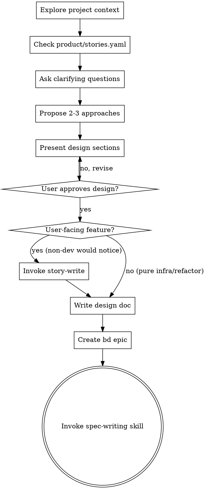

# Brainstorming Ideas Into Designs

## Overview

Help turn ideas into fully formed designs and specs through natural collaborative dialogue.

Start by understanding the current project context, then ask questions one at a time to refine the idea. Once you understand what you're building, present the design and get user approval.

<HARD-GATE>
Do NOT invoke any implementation skill, write any code, scaffold any project, or take any implementation action until you have presented a design and the user has approved it. This applies to EVERY project regardless of perceived simplicity.
</HARD-GATE>

## Anti-Pattern: "This Is Too Simple To Need A Design"

Every project goes through this process. A todo list, a single-function utility, a config change — all of them. "Simple" projects are where unexamined assumptions cause the most wasted work. The design can be short (a few sentences for truly simple projects), but you MUST present it and get approval.

## AKM hooks

Stage 1 of the AKM lifecycle — see `claude/akm/akm-lifecycle.md` for the full map and `claude/akm/akm.md` for typed-zettel schemas. Capture the request as an addressable `sp###` zettel during brainstorming.

**Entry type drives the read set:**

- *new story (us implement)* — read `pn###`, `us###`
- *us changed / adjust implementation* — read `pn###`, `us###`, `im###`, `adr####`
- *feature add* — read `ft###`, `us###`, `im###`, `adr####`
- *hotfix on implementation or feature* — read `ft###`, `us###`, `im###`, `adr####`

**Writes:**

- `sp###` — mint at `docs/notes/spec/sp###.md` with `## problem` populated, frontmatter `status: idea`, `Index: [[board]]` footer.
- `board.md` — add `[[sp###]]` under the `## idea` section.

If a new persona surfaces, invoke `persona-write` first to mint `pn###`. The legacy `board/idea/<topic>.md` flat file is being replaced by `sp###` + `board.md`; new work should land in the AKM model.

## Checklist

Create a task for each of these items and complete them in order. The order matters: persona context flows into design, not the other way around.

1. **Explore project context** — check files, docs, recent commits
2. **Check product backlog** — if `product/stories.yaml` exists, invoke `story-find` (or read it) to surface any stories that touch the same area; if it does not exist, skip — `story-write` will create it later if needed. Reference any related story ids so the design connects to existing user-facing intent rather than re-inventing it.
3. **Ask clarifying questions** — one at a time, understand purpose/constraints/success criteria. If a clear persona is forming (a real user role with a "want" and a "why"), surface it during the conversation so it shapes the design rather than getting bolted on later.
4. **Propose 2-3 approaches** — with trade-offs and your recommendation
5. **Present design** — in sections scaled to their complexity, get user approval after each section
6. **Capture user story (if user-facing)** — for any feature where a non-developer would notice the change (new behavior, new UI, new contract surface), invoke `story-write` to add a Connextra entry to `product/stories.yaml` and reference its id in the design. Skip for pure infra/refactor work that has no externally visible behavior change. Quick test: "Could I describe what's new to a non-engineer in one sentence?" — if yes, write a story.
7. **Write design doc** — save to `board/idea/<topic>.md` and commit
8. **Create bd epic** — `bd create "Epic: <topic>" --type epic` with goal, success criteria, design doc reference, and any related story ids
9. **Transition to implementation** — invoke spec-writing skill to create implementation spec

## Process Flow



**The terminal state is invoking spec-writing.** Do NOT invoke any implementation skill directly. The ONLY skill you invoke after idea-brainstorming is spec-writing.

## The Process

**Understanding the idea:**
- Check out the current project state first (files, docs, recent commits)
- Ask questions one at a time to refine the idea
- Prefer multiple choice questions when possible, but open-ended is fine too
- Only one question per message - if a topic needs more exploration, break it into multiple questions
- Focus on understanding: purpose, constraints, success criteria

**Exploring approaches:**
- Propose 2-3 different approaches with trade-offs
- Present options conversationally with your recommendation and reasoning
- Lead with your recommended option and explain why

**Presenting the design:**
- Once you believe you understand what you're building, present the design
- Scale each section to its complexity: a few sentences if straightforward, up to 200-300 words if nuanced
- Ask after each section whether it looks right so far
- Cover: architecture, components, data flow, error handling, testing
- Be ready to go back and clarify if something doesn't make sense

## After the Design

**Documentation:**
- Write the validated design to `board/idea/<topic>.md`
- Commit the design document to git

**Create bd epic:**
- `bd create "Epic: <topic>" --type epic --priority 4 --design "..."` with:
  - Goal (one sentence)
  - Success criteria (from the approved design)
  - Design doc reference path (`board/idea/<topic>.md`)
- Commit: `git add .beads/ && git commit -m "chore: create epic for <topic>"` (bd 1.0 auto-exports `.beads/issues.jsonl`; no separate `bd sync` step)

**Why P4:** epic priority tracks lifecycle commitment — P4 (idea, nascent), P3 (spec, designing), P2 (ready, committed), P1 (in flight, actively worked). The idea stage is the least committed, so start at P4. Subsequent skills (`spec-writing`, `spec-ready`, `plan-scrum-master`) bump priority as the work progresses. Pass the new epic ID to `spec-writing` so it can update the same epic rather than creating a duplicate.

**Transition to spec-writing:**
- Move the file from idea to spec: `git mv board/idea/<topic>.md board/spec/<topic>.md`
- Commit: `git commit -m "chore: promote <topic> from idea to spec"`
- Invoke the spec-writing skill — it replaces the design content with the implementation spec in the same file
- Do NOT invoke any other skill. spec-writing is the next step.

## Key Principles

- **One question at a time** - Don't overwhelm with multiple questions
- **Multiple choice preferred** - Easier to answer than open-ended when possible
- **YAGNI ruthlessly** - Remove unnecessary features from all designs
- **Explore alternatives** - Always propose 2-3 approaches before settling
- **Incremental validation** - Present design, get approval before moving on
- **Be flexible** - Go back and clarify when something doesn't make sense

## Integration

**Called by:**
- infinifu:meta-bootstrap (router) — when creative work is detected

**Calls:**
- infinifu:story-find — to surface existing stories on the same area before designing
- infinifu:story-write — to capture a user story when the feature is user-facing
- infinifu:spec-writing — the ONLY next step after design approval

**Call chain:**
```
meta-bootstrap → idea-brainstorming → spec-writing → spec-refinement → plan-prepare → plan-dispatch → work → done
```
