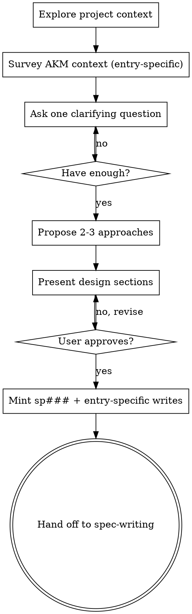

# Brainstorming Basics (shared)

## Overview

Shared process content for the four AKM entry-type brainstormers. Each entry skill (`idea-implement`, `idea-extend`, `idea-feature`, `idea-hotfix`) triggers directly on user phrasing per its own description. They share the process below — the hard gate, the context exploration, the question cadence, the design-approval rhythm — so the four don't drift.

This skill is **not a router** and not a direct entry point. It's the shared-content vault the four entry skills load.

## The Hard Gate (every entry type)

<HARD-GATE>
Do NOT invoke any implementation skill, write any code, scaffold any project, create bd issues, or take any implementation action until you have presented a design and the user has approved it. This applies to every entry type, every project, regardless of perceived simplicity. The gate is what makes the lifecycle worth the cost — skipping it builds undocumented behavior and the next outage.
</HARD-GATE>

## Anti-Pattern: "This Is Too Simple"

Every request goes through the lifecycle. A todo list, a one-line config change, a typo fix — all of them. "Simple" requests are where unexamined assumptions cause the most wasted work. The downstream design can be short for truly simple cases, but the entry type must be picked and a design must be presented.

## Process (every entry type)

### 1. Explore project context

- Read README, recent commits, and the directly-affected paths (e.g. `src/services/<x>/` for a service-level change).
- Read what's needed to ground the proposal — not everything.

### 2. Survey AKM context (entry-specific)

Each entry skill's `## AKM hooks` block lists the read set. Survey concretely via the read skills (`category-read`, `adr-read`, `feature-read`, `story-read`, `persona-read`, `implementation-read`) — never invent zettel ids that don't exist.

**Grounding rule.** Every "we could use X" mentioned in the proposal is anchored to a real zettel id surfaced by a read skill. If a candidate doesn't exist yet, say so explicitly ("no existing ft### covers this; we'd mint one at spec-writing").

### 3. Ask clarifying questions

- **One question per message.** Don't overwhelm.
- **Multiple-choice preferred.** Three options or fewer.
- Cover the entry-specific essentials (persona / want / because / AC for `idea-implement`; AC delta and migration story for `idea-extend`; capability boundary and consumers for `idea-feature`; severity / blast radius / rollback for `idea-hotfix`).

### 4. Propose 2-3 design approaches

- Lead with your recommended option.
- Each option carries trade-offs.
- Anchor every option in the surveyed AKM context (which categories, which ADRs constrain, which features are candidates).

### 5. Present the design, get approval

- Section by section, scaled to complexity (a few sentences for simple, up to 200-300 words for nuanced).
- Confirm after each section before continuing.
- Be ready to revise.

### 6. Mint the zettel(s)

Per the entry skill's `## AKM hooks` write set. The common write across all four:

- `sp###` at `docs/notes/spec/sp###.md` — frontmatter `status: idea`, `Index: [[board]]`, body has `## problem` populated, H1 carries the proposed `[[cat###]]` picks.
- `docs/board.md` — append `[[sp###|<title>]]` under `## idea`.

Entry-specific writes (new `us###`, new `pn###`, severity annotation, etc.) live in the entry skill.

### 7. Hand off to spec-writing

The only next step. Do **not** invoke any implementation skill (`work-do`, `domain-bug-fixing`, etc.) directly from any entry-type brainstormer.

## Key Principles

- **One question at a time.**
- **Multiple-choice preferred.**
- **Survey before proposing.** Never invent category / ADR / feature / story ids.
- **YAGNI ruthlessly.** Trim non-essential scope.
- **Incremental validation.** Approval per section.
- **The hard gate is non-negotiable.** No exception for "simple", no exception for hotfix urgency.

## Process flow

## Integration

**Loaded by (not invoked from):**

- `infinifu:idea-implement`
- `infinifu:idea-extend`
- `infinifu:idea-feature`
- `infinifu:idea-hotfix`

**Not a direct entry point.** If a user request truly doesn't fit any of the four entry types, ask one MC question to identify the type before routing — never run this skill standalone.

**Next skill in chain (every entry type):** `infinifu:spec-writing`.
