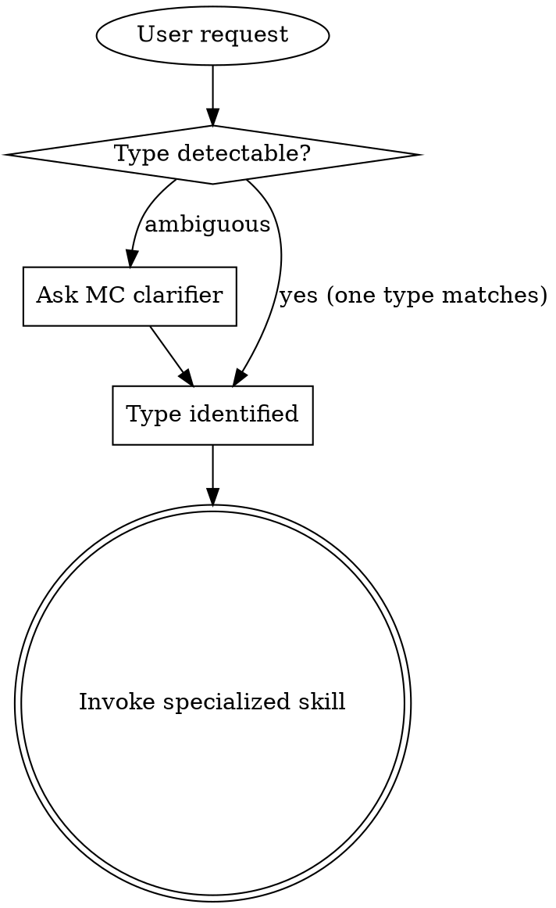

# Brainstorming Ideas Into Designs

## Overview

Router for the 4 idea entry types of the AKM lifecycle. Identify which entry type fits the request, then hand off to the specialized brainstorming skill that owns the matching read/write set on the AKM zettel graph.

<HARD-GATE>
Do NOT invoke any implementation skill, write any code, scaffold any project, or take any implementation action until you have presented a design and the user has approved it. This gate is non-negotiable for every entry type, every project, regardless of perceived simplicity. The specialized skill enforces this gate; this router only routes.
</HARD-GATE>

## Anti-Pattern: "This Is Too Simple To Need A Design"

Every request goes through the entry-type router. A todo list, a one-line config change, a typo fix — all of them. "Simple" requests are where unexamined assumptions cause the most wasted work. The downstream design can be short for truly simple cases, but the entry type must be picked and the specialized skill must present a design before any implementation step.

## Entry-type routing

Four entry types per the [AKM lifecycle](../../../../akm/akm-lifecycle.md). Pick the one that fits; when ambiguous, ask the user one multiple-choice question to disambiguate.

| Entry type | Skill | Trigger phrasing |
|---|---|---|
| New story — system gains behavior it doesn't have yet | `idea-implement` | "add X", "build Y", "users should be able to Z", "we need a feature where the analyst can …" |
| Existing story changes — shipped behavior needs adjustment | `idea-extend` | "us007 should also do X", "us005 is wrong", "extend Y to support Z" |
| New reusable capability — horizontal building block | `idea-feature` | "we need an audit-log service", "add a shared rate-limit feature", "register a notifications building block" |
| Production hotfix — bug in a shipped feature/implementation | `idea-hotfix` | "production is broken", "ft003 drops emails", "us005 fails when …", "rollback X" |

## Routing flow



## Disambiguation rules

When more than one type seems to fit, pick by this order:

1. **Production urgency wins** — any "it's broken in prod" framing → `idea-hotfix`, even if the fix happens to extend a story.
2. **Existing story present** — if an existing `us###` covers the area, prefer `idea-extend` over `idea-implement`.
3. **No specific story drives the request** — capability-shaped requests with multiple potential consumers → `idea-feature`.
4. **Else** — fresh user-facing behavior with a clear persona → `idea-implement`.

## AKM hooks (router)

Stage 1 of the AKM lifecycle — see `claude/akm/akm-lifecycle.md` for the full map and `claude/akm/akm.md` for typed-zettel schemas. Each specialized skill carries its own `## AKM hooks` block with the entry-type-specific read set.

All four entry types ultimately:

- **Write** `sp###` — a new spec zettel at `docs/notes/spec/sp###.md` with `## problem` populated, frontmatter `status: idea`, `Index: [[board]]` footer.
- **Update** `docs/board.md` — append `[[sp###|<title>]]` under `## idea`.

The differences live in **what gets read** before the design conversation begins. Categories, ADRs, and features must be surveyed concretely (`category-read`, `adr-read`, `feature-read`) so the proposal is grounded in what already exists — never invented.

## When to Defer

After identifying the type, hand the conversation to the specialized skill. Do not duplicate its work in this router. If a request truly spans two types (e.g. a hotfix that also extends a story), pick the one with the more rigid gate (hotfix > extend > implement > feature in urgency order) and note the secondary aspect in the brainstorming notes.

## Integration

**Called by:** `infinifu:meta-bootstrap` (router) — when creative work is detected.

**Calls (one of):**
- `infinifu:idea-implement`
- `infinifu:idea-extend`
- `infinifu:idea-feature`
- `infinifu:idea-hotfix`

**Call chain:**

```
meta-bootstrap
  → idea-brainstorming (route)
    → idea-{implement|extend|feature|hotfix}
      → spec-writing
        → spec-refinement
          → spec-ready
            → work-do / work-audit / work-merge
              → spec-retro
```
