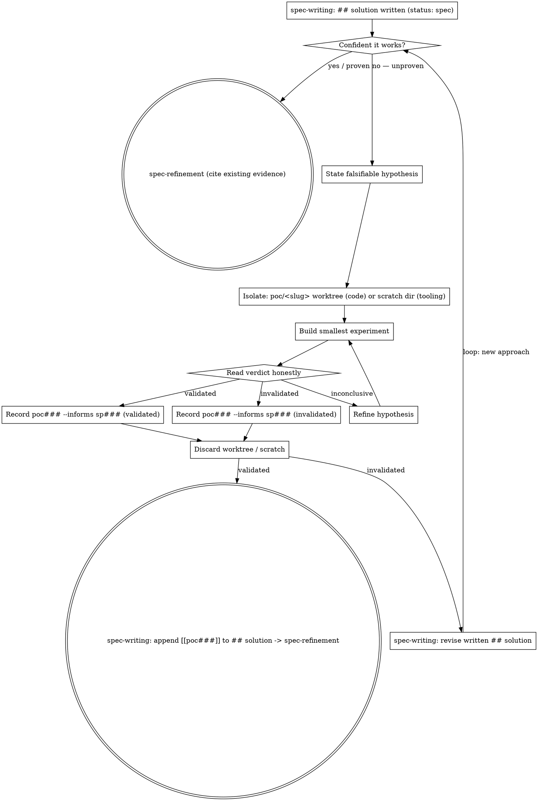

# Idea: PoC (de-risk an unproven solution)

<skill_overview>
A proof-of-concept de-risks a chosen solution by building the smallest
throwaway thing that proves — or kills — the approach, in complete isolation,
then records the verdict as evidence that feeds the spec's `## solution`. It
sits in the **solution domain**: the problem is already clear and
`infinifu:spec-writing` has *written* the `## solution` (the `sp###` is now
`status: spec`), but nobody is confident the approach actually works. The code
is disposable; the knowledge is the deliverable. A validated PoC lets
spec-writing append `[[poc###]]` to the written solution and hand off to
spec-refinement; an invalidated PoC kills a bad approach in an hour instead of
a sprint, and spec-writing revises the solution to another. It runs as
an optional loop until an approach validates.
</skill_overview>

<rigidity_level>
MEDIUM-HIGH FREEDOM on *what* you build to test the idea; LOW FREEDOM on two
disciplines, because they are the entire reason a PoC is cheap and honest:

1. **Isolation.** The experiment runs where it can be thrown away whole — a
   `poc/<slug>` git worktree for code, a scratch dir for external tooling.
   A failed or abandoned PoC must leave *zero* residue on main except the
   `poc###` record. Isolation is what makes a wrong guess free.
2. **Throwaway.** PoC code never becomes the real implementation. The real
   thing is built fresh through the normal lifecycle (idea → spec → work)
   once the approach is proven. PoC code is hypothesis-shaped: no tests, no
   edge cases, no review. Promoting it smuggles untested code past the hard
   gate — the exact outage the lifecycle exists to prevent.

These two are why a PoC is a *sanctioned exception* to the lifecycle's rule
that no implementation code is written until the work stage: a PoC produces
knowledge, not product. The rule keeps undocumented behavior from shipping;
throwaway PoC code ships nothing. Discard the worktree, carry only the verdict
back into the spec's `## solution`.
</rigidity_level>

<quick_reference>
| Step | Action | Deliverable |
|------|--------|-------------|
| 1 | State a **falsifiable** hypothesis | one sentence that can be proven false |
| 2 | `AKM_ROOT="$(akm-root)"` | poc### lands on main |
| 3 | Isolate — `poc/<slug>` worktree (code) or scratch dir (tooling) | a place born to be deleted |
| 4 | Build the smallest thing that answers the hypothesis | a running experiment, nothing more |
| 5 | Read the verdict honestly + capture evidence | validated / invalidated / inconclusive |
| 6 | `akm poc write <slug> --category … --informs sp### --stdin` | `docs/notes/lab/poc###.md` |
| 7 | **Discard** the worktree / scratch dir | clean main |
| 8 | Hand the verdict back to spec-writing | validated → `## solution` cites `[[poc###]]` → spec-refinement; invalidated → spec tries another approach |
</quick_reference>

<when_to_use>
**Use when:**

- A spec's written `## solution` (from `infinifu:spec-writing`, `sp###` at
  `status: spec`) rests on an unproven assumption — the confidence gate in
  spec-writing (step 13), the transition to spec-refinement, routes here.
- You catch yourself about to hand a solution to spec-refinement you have not
  seen work
  ("I *think* nushell can drive an fzf popup", "this library *probably*
  supports streaming").
- The user says "prove it works first", "spike this", "poc", "is this even
  possible", "I'm not confident this approach holds".

**Don't use for:**

- Building the real, reviewed implementation → `infinifu:work-do` /
  `infinifu:domain-tdd`.
- Investigating why *existing* code misbehaves → `infinifu:domain-debug`.
- Capturing a reusable capability at idea stage → `infinifu:idea-feature`.
- Choosing the solution shape itself → `infinifu:spec-writing` (this skill
  only *de-risks* an already-proposed shape).
- An approach already proven elsewhere — cite that evidence and skip the PoC.
</when_to_use>

<the_process>

## 1. Frame a falsifiable hypothesis

First, **check for an existing PoC**: `akm poc list` (or grep `docs/notes/lab/`)
for a `poc###` already informing this `sp###` or testing the same assumption.
If one settled the question, cite it and skip — don't re-run a spike someone
already paid for.

"Approach X works" is not testable. The smallest claim that, if true, removes
the risk *is*: "nushell can drive an fzf picker inside a tmux popup without TTY
breakage". If you cannot state it falsifiably, you do not yet know what you are
de-risking — go back to spec-writing and pin the real unknown.

## 2. Resolve AKM root

```bash
AKM_ROOT="$(akm-root)"
```

The `poc###` record is shared knowledge — it lives on main. If `akm-root`
errors, surface its stderr and abort (see `infinifu:idea-brainstorming` for the
strict-main rule).

## 3. Isolate

**Pick the isolation by what the experiment touches** — a worktree is only for
code:

- **Touches repo source code** (a change to how the dotfiles themselves behave)
  → a throwaway worktree on `poc/<slug>` (use `infinifu:domain-git-worktrees`).
  Build there. This branch is born to be deleted — do not push it, do not open
  a PR.
- **Proves an external tool / binary / config** (does `nu` start fast enough,
  does library X stream, does this tool even do Y) → a scratch dir
  (`/tmp/poc-<slug>`, `~/.cache/...`), no worktree and no repo involvement at
  all. This is the common case — most feasibility questions are about a tool,
  not about repo code, so don't reach for a worktree by reflex.

The rule that makes a PoC free, either way: **nothing from the experiment lands
on main except the `poc###` record.**

## 4. Build the smallest experiment that answers the hypothesis

YAGNI hard. You are proving the risky bit, not building the feature. Stub
everything that is not the risk — hardcode inputs, skip error handling, ignore
the happy-path polish. The moment the experiment answers the hypothesis, stop.

## 5. Read the verdict honestly

`validated` / `invalidated` / `inconclusive`. Capture the *evidence*: the
command output, the measurement, the thing that broke. An honest `invalidated`
is the cheapest possible outcome — you killed a bad approach before it cost a
sprint. `inconclusive` means the experiment was wrong, not the idea — refine
the hypothesis and rerun.

## 6. Record the poc###

```bash
printf '## hypothesis\n%s\n\n## method\n%s\n\n## result\n%s\n\n## recommendation\n%s\n' \
  "$hypothesis" "$method" "$result" "$recommendation" \
  | akm poc write "$slug" --category cat003 --informs sp012 --status validated --stdin
# cat003 / sp012 are PLACEHOLDERS — use the de-risked spec's real category + id
# --informs sp###     the spec whose ## solution this PoC de-risks (the common case)
# --status open|validated|invalidated   (the verdict)
```

- `$slug` is kebab-case (becomes `aliases[0]`).
- `--category` is the `[[cat###]]` bucket(s) the approach lives in (required).
- `--informs sp###` is the common case here — the spec's `## solution` is
  already written (the gate fires *after* spec-writing's idea→spec flip, so the
  `sp###` is `status: spec`), so pass it to record which spec this PoC de-risks.
  It also accepts `us###`, and may be omitted for a bare standalone spike with
  no spec yet.
- `## method` should name the throwaway worktree or scratch dir so the record
  is reproducible — and the tool version where behavior is version-sensitive
  (an API that shifts between releases is exactly the kind of thing a PoC
  catches, and the next reader needs to know which version you measured).
- Success is the `Id: poc###` line printed on stdout — capture it. The CLI also
  stages the file; a `git add` warning (e.g. outside a git repo in a sandbox)
  is benign and does not mean the write failed.

## 7. Discard the experiment

Delete the `poc/<slug>` worktree/branch (or the scratch dir). The code's job is
done. Keeping it around is step 1 of the "just promote the branch" anti-pattern.

## 8. Feed the verdict back (the loop)

Hand the `## recommendation` back to `infinifu:spec-writing`, which owns the
confidence gate that sent you here:

- **Validated** → spec-writing appends `[[poc###]]` to the already-written
  `## solution` as the evidence (commits the touch-up), then hands off to
  `infinifu:spec-refinement`. Done.
- **Invalidated** → that approach is dead. spec-writing revises the written
  `## solution` to a different approach (status stays `spec`); if *that* one is
  also unproven, run a **new** PoC on it. The loop repeats until an approach
  validates (or the spec concludes the problem isn't tractable as framed).
  Either way the rejected `poc###` stays on record so nobody re-litigates it.

</the_process>

<discipline>

A PoC is cheap only if it stays a PoC. Under the pull of a working prototype,
the temptation is always to keep the code. Closing that loophole in advance:

**Violating the letter of these rules is violating the spirit of them.** A
"mostly isolated" experiment or a "lightly cleaned up" PoC branch is the
failure, not a near-miss.

| Excuse | Reality |
|--------|---------|
| "The PoC works — just clean it into the real impl" | PoC code is hypothesis-shaped: no tests, no edge cases, no review. The PoC proved it's *possible*, not *correct*. Build the real thing fresh through the lifecycle. |
| "No need to isolate, I'll just try it in the repo" | An abandoned experiment in the repo is residue the next person trips over. Isolation is the whole reason a failed PoC costs nothing. |
| "It's obviously going to work, skip the PoC" | Then state the hypothesis and prove it in 20 minutes. If it's obvious it's cheap; if it's not cheap it wasn't obvious. |
| "Invalidated, so the PoC was wasted" | Invalidated is the cheapest win — a bad approach killed before a sprint sank into it. Record it so it stays dead. |
| "The result's in my head, skip the poc### record" | The verdict is the deliverable. Unrecorded, the next person re-runs the experiment or, worse, picks the invalidated approach. |

**Red flags — stop, the PoC is bleeding into production:** "let me just promote
this branch", "close enough to production", "I'll write the tests after the
merge", "no time to spin a separate worktree", "I'll keep it as reference while
I build the real one".

</discipline>

<examples>

**Hypothesis framing — vague vs. falsifiable:**

Input: "I want to use nushell for the i3 status bar but I'm not sure it's fast enough"
Output (hypothesis): "a nushell script can produce the full i3blocks status line in under 50ms cold, so the bar refreshes without visible lag"

**Recommendation that feeds a solution — validated:**

Input: PoC proved a single `nu` invocation renders the bar in 31ms
Output (recommendation): "Adopt the single-shot nushell renderer. 31ms < 50ms budget measured in the poc/nu-i3status worktree. The im### should compose it as one script invoked per i3blocks interval; no daemon needed."

**Recommendation that closes a path — invalidated:**

Input: PoC showed the library drops connections over 1MB
Output (recommendation): "Reject the streaming-upload approach via lib X — it silently truncates payloads >1MB (reproduced in poc/stream-upload). Spec should use chunked multipart instead; do not revisit lib X streaming."

</examples>

<integration>

**Branched from (the confidence gate):** `infinifu:spec-writing` step 13 — the
solution-domain gate *after* the `## solution` is written (`sp###` flipped
idea→spec) and *before* spec-refinement, when that written solution lacks clear
proof it works. (Stage placement: idea → spec-writing writes `## solution` →
*[idea-poc loop]* → spec-refinement. The idea-* entry skills do **not** branch
here — de-risking is solution-domain, after the problem is clear and the
solution is on disk.)

**Calls:**

- `infinifu:domain-git-worktrees` — the isolated, disposable `poc/<slug>`
  worktree for code experiments.
- `akm poc write` — mints `docs/notes/lab/poc###.md` (id allocation,
  frontmatter, `# PoC [[cat###]]... [[board]]` H1, `--informs sp###`
  back-link, staging).

**Feeds back to:** `infinifu:spec-writing` — the verdict resolves the
confidence gate. Validated → spec-writing appends `[[poc###]]` to the written
`## solution` and hands to `infinifu:spec-refinement`; invalidated → spec-writing
revises the written solution and may loop a new PoC.

</integration>

<process_flow>



</process_flow>
