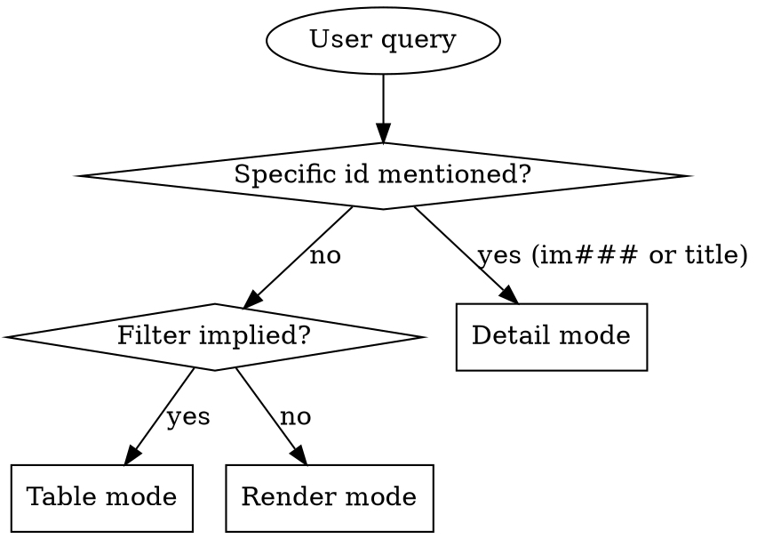

# Implementation Read

## Overview

Read implementation zettels under `docs/notes/im###.md` and present them in the format that best fits the user's question. Three output modes — pick one, don't combine.

**Announce at start:** "Using implementation-read skill to surface solution records."

## Storage

**Backend:** AKM. Implementations live in `docs/notes/im###.md`. Schema in `docs/notes/akm.md`; this skill only needs the slice below.

If no `im*.md` files: tell the user "No implementations found under docs/notes/. Use implementation-write to add one."

### Zettel slice this skill needs

```markdown
---
aliases:
  - <solution one-liner>
status: <proposed|accepted|superseded>
created: YYYY-MM-DD
---
# Implementation [[cat###]] [[cat###]]

## solves
[[us###|<story-alias>]]

## approach
<one-paragraph chosen solution shape>

## features
- [[ft###|<feature>]]

## data_model
<schema deltas this impl owns>

## api_surface
<endpoints, payloads beyond what features expose>

## components
- <module / file / path>

## specs
- [[sp###|<spec-title>]]

## superseded_by
[[im###|<replacement>]]   # only when status = superseded
```

**Key extraction rules:**

- `id` — filename slug (`im001`).
- `title` — first alias.
- `categories` — H1 `[[cat###]]` wikilinks (exclude any `[[product]]` if present).
- `solves` — wikilink target under `## solves` (e.g. `us007`). Render as id + alias if shown.
- `approach` — paragraph under `## approach`.
- `features` — list of `[[ft###]]` ids under `## features`.
- `specs` — list of `[[sp###]]` ids under `## specs`.
- `components` — bullets.
- `superseded_by` — wikilink under that H2; meaningful only when status=superseded.

Omit silently for missing sections.

## Mode Selection



### Detail mode triggers
- Query contains `im###` (case-insensitive).
- "show me im012", "how was us007 solved" (story id → implementation lookup via `solves`).

### Table mode triggers
- Status filters: `proposed`, `accepted`, `superseded`.
- By story: "implementations for us005".
- By feature consumed: "what im consume ft003".
- By category: "implementations in cat002".
- Keyword search: "implementations about caching".

### Render mode triggers
- "Show me all implementations", "what solution records do we have".

## Reading the zettels

1. List ids: `ls docs/notes/im*.md`.
2. Per mode:
   - **Detail** — single file.
   - **Table** — full read is cheap; you need `solves`, `features`, and `approach`.
   - **Render** — full read.

For "how was us005 solved", scan every im file's `## solves` and match — usually a small set.

## Mode 1: Detail

```markdown
## [id] — [title]

**Solves:** [us### — story-alias]    **Status:** [status]    **Created:** [created]
**Categories:** [cat001, cat002]

**Approach:** [approach paragraph]

**Consumed features:**
- [ft### — feature-alias]
- [ft### — feature-alias]

**Data model:** [data_model]

**API surface:** [api_surface]

**Components:**
- [path]

**Specs:** [sp###, sp###]    *(if any)*

**Superseded by:** [im###]    *(if status = superseded)*
```

If id not found: "Implementation `im001` not found. Closest matches: ..." with 1-3 candidates.

## Mode 2: Table

| id | status | solves | categories | title |

Sort by id ascending. After the table: `N implementations matched (X accepted, Y proposed, Z superseded).`

For "consumes ft###" filter, render an extra column or add a one-line note: "Filter: consumes ft003 — 4 matches."

## Mode 3: Render

Grouped by status: `accepted` → `proposed` → `superseded`. Within each group sort by id ascending.

```markdown
# Implementations

## Accepted

### im001 — order sampling solution
**Solves:** us001 — order samples for upcoming client work
**Categories:** cat001 (workflow), cat002 (data)

**Approach:** ...

**Features:** ft003, ft005
```

End: `Total: N implementations (X accepted, Y proposed, Z superseded).`

## Filter Parsing

| User says | Match against |
|---|---|
| "proposed", "draft" | `status: proposed` |
| "accepted", "shipped" | `status: accepted` |
| "superseded" | `status: superseded` |
| "for us###", "story X" | `solves` contains the story id |
| "consumes ft###", "uses ft###" | `features` list contains the feature id |
| "in cat###", "category X" | H1 contains the category id |
| "about X" | any text field (title, approach, api_surface, components) |

Multiple filters compose with AND.

## What This Skill Does NOT Do

- It does not modify implementations. To edit/supersede, use `implementation-write`.
- It does not bridge implementations to source code line-by-line — `## components` is the as-recorded path list; `story-map` walks the reverse direction.
- It does not surface unimplemented stories (stories with no `solves` back-ref). Use `story-read` filtered by status.

## When to Defer to Other Skills

- Add / supersede an implementation → `implementation-write`.
- Find which stories lack an implementation → `story-read` (filter by status=ready, then scan).
- Map an implementation to code → `story-map` (implementations carry the path list).
- Find specs that delivered this implementation → `spec-read` (filter by `implements im###`).
