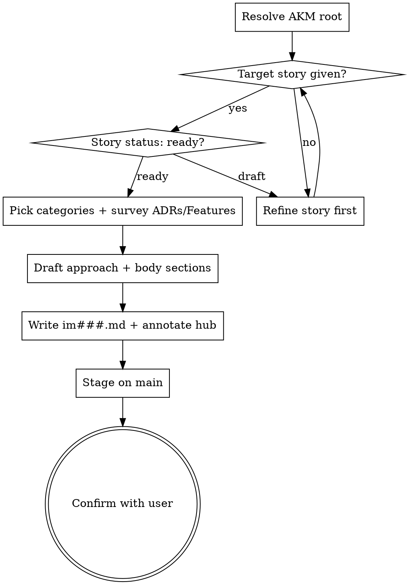

<skill_overview>
An Implementation zettel persists the *solution shape* for a single user story: which Features it composes, what story-specific glue it adds, and which architectural categories it touches. This skill captures that shape as `docs/notes/im###.md` per the AKM schema. It sits between the Story (the problem) and the Spec (the transient execution plan), and gates `spec-writing` — no spec should be written for a story that does not have an `im###` card to anchor against. The card is append-only on `accepted`: reshape by writing a new `im###` and superseding, never by rewriting history.
</skill_overview>

<rigidity_level>
MEDIUM FREEDOM — three pieces are non-negotiable because they are the load-bearing invariants of the AKM graph:

1. **`solves` back-link.** Exactly one `## solves [[us###]]`. No story → the card has no consumer; route to `infinifu:story-write` instead.
2. **H1 + Index footer.** H1 ends in `[[product]]`, file ends with `Index: [[product]]`. moxide LSP relies on this.
3. **Append-only on `accepted`.** Once shipped, the body is the historical record. Drift → narrow updates to factual sections (`components` / `data_model` / `api_surface`) only. If `approach` changed, write a new `im###` and supersede.

Everything else (how many categories, which Features to list, depth of `## components`) flexes with the situation.
</rigidity_level>

<quick_reference>

| Aspect | Convention |
|--------|-----------|
| Filename | `docs/notes/im###.md`, three-digit zero-padded, sequential, gaps preserved |
| Frontmatter | `aliases`, `status` (`proposed`/`accepted`/`superseded`), `created` ISO date |
| H1 | `# Implementation [[cat###]] [[cat###]] [[product]]` — ≥1 category + `[[product]]` |
| Required wikilinks | `solves [[us###]]`, ≥1 `[[cat###]]` in H1, each consumed `[[ft###]]`, `Index: [[product]]` footer |
| Body sections | `## solves`, `## approach`, `## features`, `## data_model`, `## api_surface`, `## components`, `## specs`, optional `## superseded_by` |
| Default status | `proposed` |
| Gates | `spec-writing` should not run until this card exists for the target story |

**Status lifecycle:** `proposed` (drafted, revisable) → `accepted` (specs shipped, body now history) → `superseded` (replaced; `## superseded_by` carries the forward pointer).

</quick_reference>

<when_to_use>
**Use when:**

- A user story is `ready` and someone wants to decide *how* before writing a board spec
- The user asks for an "implementation card", "im###", "solution shape", or "how we'll do that story"
- `spec-writing` is about to start with no `im###` for the target story — write the card first
- Reshaping the codebase: write a new `im###` to supersede an `accepted` one rather than editing it
- A retro surfaces drift between reality and an `accepted` card's *factual* sections — narrow updates allowed, narrative is not

**Don't use for:**

- Capturing the user-facing requirement → `infinifu:story-write`
- The transient execution plan with task-level acceptance criteria → `infinifu:spec-writing`
- Defining a reusable capability consumed by multiple stories → `feature-write` (`ft###`)
- Recording an architectural decision → `adr-write` (`adr####`) — Implementations reference ADRs *via category*, not by direct link
- Updating an `accepted` card's narrative → file a new `im###` and supersede instead

</when_to_use>

<workspace_resolution>
Implementations are shared product knowledge — they live on **main**, even from a feature-branch worktree. Resolve before any file op:

```bash
AKM_ROOT="$(akm-root)"
```

`akm-root` returns the main-worktree path (default branch); outside git, cwd. Anchor every path on `$AKM_ROOT` (`$AKM_ROOT/docs/notes/im###.md`, `$AKM_ROOT/docs/notes/us###.md`, `$AKM_ROOT/docs/notes/cat*.md`, `$AKM_ROOT/docs/product.md`). If `akm-root` errors, surface its stderr and abort — never silently land an Implementation on the feature branch.

Implementations evolve through their lifecycle (`proposed → accepted → superseded`), so this writer **stages on main without committing**: `git -C "$AKM_ROOT" add docs/notes/im<NNN>.md docs/product.md`. The lifecycle commit happens later in `spec-refinement` when the surrounding spec finalizes Features/im### together. See the per-stage commit table in `docs/notes/akm.md#workspace-resolution`.
</workspace_resolution>

<the_process>

## Flow



**Announce at start:** *"Using implementation-write skill to draft the im### card for `<story-id>`."*

### Step 0 — Resolve AKM root
`AKM_ROOT="$(akm-root)"`. Every subsequent path anchors on it. Abort with the helper's stderr if it errors — don't fall back to cwd silently when on a feature-branch worktree.

### Step 1 — Anchor the story
Read `$AKM_ROOT/docs/notes/us###.md`. Pull first alias for `[[us###|<alias>]]`. If `status: draft`, push back once: *"Story `usNNN` is still `draft`. Implementations should anchor on a `ready` story so acceptance criteria are stable. Refine first via `infinifu:story-write`, or proceed if you accept the approach may need revisiting."* No story → stop, route to `infinifu:story-write`.

### Step 2 — Pick categories for the H1
`ls "$AKM_ROOT/docs/notes/"cat*.md`; read frontmatter `aliases` for labels. Pick 1–3 that the solution actually touches; >3 is a smell. Missing category → route to `category-write` (or inline-create per the AKM Category schema). H1 reads `# Implementation [[cat###]] [[cat###]] [[product]]` — categories first, `[[product]]` last.

### Step 3 — Survey ADRs under those categories
Open `$AKM_ROOT/docs/product.md` → `## Architecture Decision Records`. For the chosen categories, scan listed `[[adr####]]`s and note any `Accepted` decisions that constrain the solution. Bind them inside `## approach` prose (e.g. *"per [[adr0007]], persistence layer is event-sourced"*). Do **not** add a body section listing ADRs — category linkage is the index.

### Step 4 — Survey reusable Features
Open `$AKM_ROOT/docs/product.md` → `## Features`. For each `[[ft###]]` the approach would consume:

1. Read its frontmatter `status`. `stable` → safe. `proposed` → consume but call out in `## approach`. `deprecated`/`superseded` → use the replacement chain.
2. Add `- [[ft###|<alias>]]` to `## features`.

The Feature's `api_surface` is the contract — do **not** re-describe it here; this card carries only the delta.

If no Feature fits a needed capability: build a new Feature first (if reusable across ≥2 stories) via `feature-write` and resume here; otherwise the glue lives in *this* card's `## components` (reserve Feature elevation for the second consumer).

### Step 5 — Draft `## approach`
One paragraph, ≤5 sentences. Three things it must convey: (1) the chosen pattern/solution shape, (2) the key trade-off, (3) binding ADRs/Features mentioned in prose. More than 5 sentences → the implementation is probably two implementations, or the approach is unclear. Push back once.

### Step 6 — Fill body sections (delta only)
- **`## data_model`** — schema deltas this card *owns*. Features own their own state; don't re-document. Empty is OK (*"none — read-only over [[ft003]]"*).
- **`## api_surface`** — endpoints/payloads this card *adds*. Exclude inherited surface.
- **`## components`** — story-specific code paths. **Concrete** (`src/orders/sample-request.ts`, `migrations/2026-05-15-create-samples.sql`) — vague labels like *"the orders module"* defeat traceability.

In `proposed` status, these can be educated guesses; the spec-retro pass updates them to match what landed.

### Step 7 — `## specs`
Transient board spec(s) that touched or delivered this card. Empty for a fresh `proposed`. While active: `[[<topic>|<title>]]` → `board/spec/<topic>.md`. Once archived: same wikilink, file moves to `board/done/<topic>.md`. Add as specs land; don't pre-populate.

### Step 8 — Generate the id, write the zettel
IDs are `im` + 3-digit zero-padded sequential. `ls "$AKM_ROOT/docs/notes/"im*.md`, take max + 1 (never reuse gaps), zero-pad. Compose per the schema (see `references/examples.md` for the full template + worked examples). Write to `$AKM_ROOT/docs/notes/im<NNN>.md`. ISO date for `created`. Section ordering matches `akm.md` — moxide LSP parses on these headings.

### Step 9 — Update `$AKM_ROOT/docs/product.md`
Annotate the story bullet in `## Stories`:

```markdown
- [[us014|bulk import requests from spreadsheet]] >> [[im007]]
```

Hub missing → skip and tell the user: *"Hub `docs/product.md` not found in `$AKM_ROOT`; im### is on disk but not annotated."*

### Step 10 — Stage on main
Implementations evolve through their lifecycle; this writer does **not** commit. Stage from the AKM root so the file shows in `git status` on main and the next lifecycle skill (`spec-refinement`) picks it up in its commit:

```bash
git -C "$AKM_ROOT" add docs/notes/im<NNN>.md docs/product.md
```

### Step 11 — Confirm
Show: id + absolute path under `$AKM_ROOT`, story solved, H1 categories, Features consumed (with status), one-line approach summary, hub annotation status, staging state on main (no commit). Ask once: *"Anything to revise?"* If yes, edit in place. If no/no-response, done.

**Next step prompt:** *"`im###` is `proposed`. Next: `infinifu:spec-writing` produces `board/spec/<topic>.md` against this card. The card flips to `accepted` after the spec ships (via `spec-retro`)."*

</the_process>

<critical_rules>

- **`solves` is non-negotiable.** No story → no card. Route to `infinifu:story-write`.
- **Don't re-describe Feature contracts.** Listed `[[ft###]]`s inherit `api_surface` + constraints automatically; restating drifts.
- **`## components` is concrete.** File/module paths, migration filenames — not *"the orders module"*. Vague entries defeat code-to-story traceability.
- **Append-only on `accepted`.** Drift means narrow updates to factual sections only. If `approach` changed, the implementation changed — supersede.
- **Categories are first-class.** They're the *only* index back to relevant ADRs and the hub. Defaulting to `architecture` makes the card unfindable.
- **Spec is the plan; Implementation is the shape.** *"How will we sequence the work"* → `spec-writing`, not this skill.
- **No `## features` re-implementation.** User lists a Feature then describes its internals → push back; either the Feature contract is wrong or the card is duplicating known state.

</critical_rules>

<verification_checklist>

Before reporting the Implementation written:

- [ ] File path is `$AKM_ROOT/docs/notes/im###.md` (resolved via `akm-root`, not the current cwd)
- [ ] Id is `max(existing) + 1`, zero-padded to 3
- [ ] Exactly one `## solves [[us###]]` back-link, resolving to an existing story file under `$AKM_ROOT/docs/notes/`
- [ ] H1 has `# Implementation` plus ≥1 `[[cat###]]` plus `[[product]]`
- [ ] Body sections in order: `## solves`, `## approach`, `## features`, `## data_model`, `## api_surface`, `## components`, `## specs` (+ `## superseded_by` only when `superseded`)
- [ ] Hub annotated in `$AKM_ROOT/docs/product.md` (or skipped with note if hub missing)
- [ ] File staged on main (`git -C "$AKM_ROOT" add docs/notes/im<NNN>.md`) and **no commit created** — spec-refinement commits the lifecycle batch
- [ ] Confirmation surfaces the absolute `$AKM_ROOT/docs/notes/im<NNN>.md` path so the user sees where it landed from a worktree

</verification_checklist>

<integration>

**Position in workflow:**

```
infinifu:story-write → infinifu:implementation-write → infinifu:spec-writing → infinifu:spec-ready → (bd execution) → infinifu:spec-retro
   (us###)                (im### proposed)                (board/spec/)                                              (im### → accepted)
```

A spec for a story with no `im###` is a smell — refuse to start `spec-writing` until the card exists.

**Called by:** `infinifu:zettel-write` (orchestrator front door), or ad-hoc post `story-write` and pre `spec-writing`.

**Calls:** `infinifu:story-write` (no anchoring story), `feature-write` (missing reusable Feature), `category-write` (missing `cat###`), `infinifu:story-map` (post-ship code-path attachment).

**Complements:** `infinifu:spec-writing` (downstream consumer), `infinifu:spec-retro` (flips `proposed → accepted`), `infinifu:story-find`/`story-read` (read-side counterparts).

</integration>

<references>

- `references/examples.md` — full zettel template, three worked examples (fresh card, story-still-draft push-back, missing-Feature elevation), verification checklist. **Load when** composing the file, validating a draft, or seeing an unfamiliar edge case (draft anchor, missing category, no fitting Feature).
- `docs/notes/akm.md` (in the target repo) — canonical AKM schema, source of truth. **Load when** verifying body shape beyond what `examples.md` shows.
- `infinifu:zettel-write` — orchestrator and atomicity gate. **Load when** the request shape is ambiguous between AKM types.
- `infinifu:story-write` — counterpart for the problem side. **Load when** the anchoring story doesn't exist yet.
- `infinifu:meta-skill-writing` — house style for this SKILL.md. **Load when** refactoring this file.

</references>