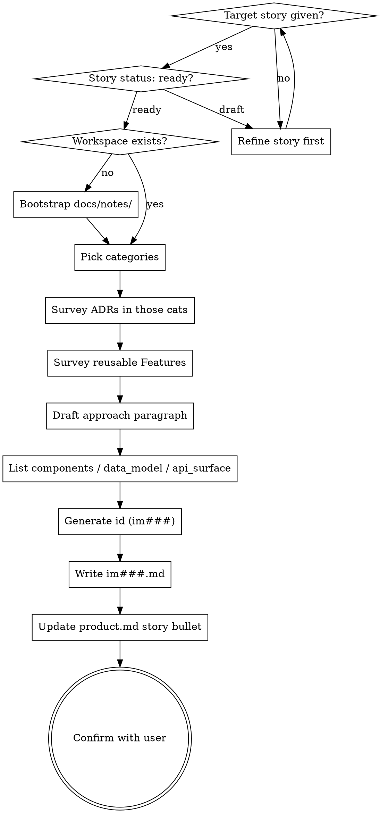

<skill_overview>
An Implementation zettel persists the *solution shape* for a single user story: which Features it composes, what story-specific glue it adds, and which architectural categories it touches. This skill captures that shape as `docs/notes/im###.md` per the AKM schema. It sits between the Story (the problem) and the Spec (the transient execution plan), and gates `spec-writing` — no spec should be written for a story that does not have an `im###` card to anchor against. The implementation card is append-only in spirit: reshape the codebase by writing a new card and superseding the old one, never by rewriting history on an `accepted` card.
</skill_overview>

<rigidity_level>
MEDIUM FREEDOM — three pieces are non-negotiable because they are the load-bearing invariants of the AKM graph:

1. **`solves` back-link.** Every `im###` carries exactly one `## solves [[us###]]` link. An Implementation without a Story has no purpose — it's a design fragment with no consumer. If the user can't name the story, write the story first via `infinifu:story-write` and come back.
2. **`[[product]]` invariant + Index footer.** The H1 ends in `[[product]]`, the file ends with `Index: [[product]]`. Same as every typed AKM zettel; moxide LSP relies on it.
3. **Append-only on `accepted`.** Once `status: accepted`, the body becomes the historical record. Don't rewrite `## approach`; supersede with a new `im###` instead.

Everything else (how many categories, which Features to list, how deep `## components` goes) flexes with the situation.
</rigidity_level>

<quick_reference>

| Aspect | Convention |
|--------|-----------|
| Filename | `docs/notes/im###.md`, three-digit zero-padded, sequential, gaps preserved |
| Frontmatter | `aliases`, `status` (`proposed`/`accepted`/`superseded`), `created` ISO date |
| H1 | `# Implementation [[cat###]] [[cat###]] [[product]]` — one-or-more category links + `[[product]]` |
| Required wikilinks | `solves [[us###]]`, ≥1 `[[cat###]]` in H1, every consumed `[[ft###]]` in `## features`, `Index: [[product]]` footer |
| Body sections | `## solves`, `## approach`, `## features`, `## data_model`, `## api_surface`, `## components`, `## specs`, optional `## superseded_by` |
| Default status | `proposed` |
| Gates | `spec-writing` should not run until this card exists for the target story |

**Status lifecycle:**

| Status | Meaning |
|--------|---------|
| `proposed` | drafted before spec is written; may still be revised |
| `accepted` | the spec(s) listed in `specs` shipped; body is now historical record |
| `superseded` | replaced by a newer `im###`; `## superseded_by` carries the forward pointer |

</quick_reference>

<when_to_use>
**Use when:**

- A user story is `ready` and someone wants to decide *how* to build it before writing a board spec
- The user explicitly asks for an "implementation card", "im###", "the solution shape", or "how we'll do that story"
- `spec-writing` is about to start and no `im###` exists for the target story — write the card first
- Reshaping the codebase: write a new `im###` to supersede an `accepted` one rather than editing it
- A retro surfaces drift between the shipped reality and an `accepted` card's `## components` / `## data_model` / `## api_surface` — narrow updates are allowed; the narrative is not

**Don't use for:**

- Capturing the user-facing requirement — use `infinifu:story-write` (Story is the *problem*; Implementation is the *solution shape*)
- Writing the transient execution plan with task-level acceptance criteria — use `infinifu:spec-writing` (Spec is the *board* artifact; Implementation is the *persistent* one)
- Defining a reusable capability consumed by multiple stories — use `feature-write` for `ft###` (Features are horizontal building blocks; Implementations are per-story composition)
- Recording an architectural decision — use `adr-write` for `adr####` (decisions live as ADRs filed under a category; an Implementation references them by category, not by direct link)
- Updating an `accepted` implementation's narrative — file a new `im###` and supersede instead

</when_to_use>

<the_process>

## Flow



**Announce at start:** "Using implementation-write skill to draft the im### card for `<story-id>`."

## Step 1 — Anchor the story

The `## solves [[us###]]` link is non-negotiable. Before anything else:

1. Confirm the target story id. Read `docs/notes/us###.md` to pull its first alias (used as the wikilink label `[[us###|<alias>]]`).
2. Check the story's frontmatter `status`. If `draft`, push back once: *"Story `us014` is still `draft`. Implementations should anchor on a `ready` story so acceptance criteria are stable. Refine the story via `infinifu:story-write` first, or proceed if you accept that the approach may need revisiting."*
3. If no story exists, stop and route to `infinifu:story-write`. An implementation without a story is a design fragment, not a zettel.

## Step 2 — Pick categories for the H1

Categories (`[[cat###]]`) locate the solution in the taxonomy — *what kind* of problem this card addresses (data, security, infrastructure, frontend, etc.). Unlike ADRs (which take exactly one category), Implementations accept one-or-more.

1. List existing categories: `ls docs/notes/cat*.md`.
2. Read frontmatter `aliases` for each to surface the human label.
3. Pick the buckets the solution actually touches. Typical count is 1–3; more than 3 is a smell that the implementation is doing too much.
4. If a needed category doesn't exist, either route to `category-write` (when available) or create a minimal `cat###.md` inline per the AKM Category schema.

The H1 reads `# Implementation [[cat###]] [[cat###]] [[product]]` — categories first, `[[product]]` always last.

## Step 3 — Survey ADRs under those categories

ADRs that matter to this Implementation surface *via the category*, not by direct link. Open `docs/product.md` `## Architecture Decision Records`, find the chosen categories, scan the listed `[[adr####]]`s, and note any `Accepted` decisions that constrain the solution.

When the approach is bound by an ADR, mention it inside `## approach` prose (e.g. *"per [[adr0007]], persistence layer is event-sourced"*). Don't add a body section listing ADRs — the category linkage is the index, prose is the rationale.

## Step 4 — Survey reusable Features

Open `docs/product.md` `## Features`. For each `[[ft###]]` that the chosen approach would consume:

1. Read its frontmatter `status` — only `stable` Features are safe to consume; `proposed` Features can be consumed but call it out in `## approach`; `deprecated` and `superseded` Features should not be added (use the replacement chain instead).
2. Add the wikilink to `## features` as `- [[ft###|<alias>]]`.

**Critical:** every listed Feature's constraints (rate limits, retention, SLAs, contract) become this Implementation's inherited constraints. Do **not** re-describe what the Feature already exposes — that's duplication that drifts. The Feature's `api_surface` is the contract; this card only adds *delta*.

If no existing Feature fits a needed capability, two options:

- **Build a new Feature first.** When the capability is genuinely reusable (will serve multiple Implementations), pause this skill and route to `feature-write` for the `ft###`, then resume here.
- **Glue stays in this Implementation.** When the capability is story-specific, the code lives in `## components` of *this* card. Reserve Feature elevation for the second consumer.

## Step 5 — Draft `## approach`

One paragraph. Three things it must convey:

1. **The chosen pattern or solution shape.** "Event-sourced log + denormalized read model with a single CRUD endpoint."
2. **The key trade-off.** "Consistency relaxed to eventual to keep write latency under 50ms."
3. **Binding ADRs / Features in prose.** "Per [[adr0007]] persistence is event-sourced; [[ft003]] supplies the notification fan-out."

If the paragraph needs more than ~5 sentences, the implementation is probably two implementations or the approach is unclear. Push back once on either.

## Step 6 — Fill `## data_model` / `## api_surface` / `## components`

These three sections describe the **delta** this Implementation adds on top of consumed Features.

- **`## data_model`** — schema deltas and glue tables this Implementation *owns*. Features own their own state; do not re-document it here. Empty section is OK if the implementation owns no data ("none — read-only over `[[ft003]]`").
- **`## api_surface`** — endpoints, payloads, message contracts this Implementation adds. Exclude what consumed Features already expose. Empty section is OK if the surface is entirely inherited.
- **`## components`** — story-specific code paths: modules, files, directories. Be concrete (`src/orders/sample-request.ts`, `migrations/2026-05-15-create-samples.sql`) — vague labels like *"the orders module"* defeat the purpose.

When the Implementation is in `proposed` status, these can be educated guesses; the retro pass after the spec ships updates them to match what actually landed.

## Step 7 — `## specs`

The transient board spec(s) that touched or delivered this Implementation. Empty for a fresh `proposed` card.

- While a spec is active: `[[<topic>|<title>]]` pointing at `board/spec/<topic>.md`.
- Once archived: same wikilink, but the file lives at `board/done/<topic>.md`. The wikilink target stays stable — the moving piece is the directory.

Add entries as specs land. Don't pre-populate.

## Step 8 — Generate the id

IDs are `im` + three-digit zero-padded sequential (`im001`, `im002`, …). Same rule as stories: take max + 1, never reuse gaps.

1. List: `ls docs/notes/im*.md`.
2. Extract numeric portion, find max, add 1.
3. Zero-pad to 3 digits. If no existing implementations, start at `001`.

## Step 9 — Write the zettel

Compose the full markdown per the schema (see below), write to `docs/notes/im<NNN>.md`.

```markdown
---
aliases:
  - <human-readable solution one-liner>
status: proposed
created: YYYY-MM-DD
---
# Implementation [[cat###]] [[cat###]] [[product]]

## solves
[[us###|<story-alias>]]

## approach
<one paragraph: pattern, key trade-off, binding ADRs/Features mentioned in prose>

## features
- [[ft###|<feature-alias>]]
- [[ft###|<feature-alias>]]

## data_model
<schema deltas this implementation owns; features carry their own state>

## api_surface
<endpoints / payloads / contracts this implementation adds — exclude what features already expose>

## components
- <story-specific glue: module / file / path>
- <story-specific glue: module / file / path>

## specs
- [[<spec-topic>|<spec-title>]]

---

Index: [[product]]
```

**Conventions:**

- ISO `YYYY-MM-DD` for `created`.
- Story wikilink form: `[[us###|alias]]` — pipe-separated, alias label after.
- Category wikilinks in H1 are bare slugs in double brackets, no pipe needed.
- Feature wikilinks in `## features` use `[[ft###|alias]]` form for readability.
- Section ordering matches `akm.md` — moxide LSP parses on these headings.
- Footer: `---` rule then `Index: [[product]]` on its own line.

## Step 10 — Update `docs/product.md`

The hub's `## Stories` section annotates a story that has an implementation with `>> [[im###]]` on the same bullet line. After writing the new card, append the annotation:

```markdown
### [[pn001|requestor]]

- [[us001|order samples for upcoming client work]]
- [[us014|bulk import requests from spreadsheet]] >> [[im007]]    ← new annotation
```

If `docs/product.md` doesn't exist, skip and tell the user *"Hub `docs/product.md` not found; im### is on disk but not annotated on the story bullet."*

## Step 11 — Confirm

Show the user:

1. The implementation id and the file path (`docs/notes/im<NNN>.md`).
2. The story it solves (`[[us###|alias]]`).
3. The categories on the H1.
4. The Features consumed (with their `status`).
5. A one-line summary of the `## approach`.
6. Whether the hub bullet was annotated.

Ask once: *"Anything to revise?"* If yes, edit in place (same id). If no or no response, you're done.

**Next step prompt:** *"`im###` is `proposed`. Next: `infinifu:spec-writing` produces `board/spec/<topic>.md` against this card. The spec ships when bd epic closes; flip this card to `accepted` then."*

</the_process>

<examples>

**Example 1 — fresh implementation for a `ready` story**

Input: *"draft the implementation for us014 — we'll lean on the existing import-pipeline feature and add a samples-specific staging table."*

Anchor: read `docs/notes/us014.md`, status `ready`, alias *"bulk import requests from spreadsheet"*. ✓

Categories: data (`cat003`) + integration (`cat007`) — the card touches schema and an external file format.

Survey: scan ADRs under `data` and `integration` — `[[adr0007]]` (event-sourced persistence) is `Accepted` and binds the write path. Survey Features — `[[ft004|import-pipeline]]` is `stable` and exposes a generic row-parser; reuse it.

File: `docs/notes/im007.md`

```markdown
---
aliases:
  - samples bulk import via staging table
status: proposed
created: 2026-05-15
---
# Implementation [[cat003]] [[cat007]] [[product]]

## solves
[[us014|bulk import requests from spreadsheet]]

## approach
Stage parsed rows in a per-upload table, run validators against the staging set, then promote valid rows into the canonical event log per [[adr0007]]. Reuse [[ft004]] for row parsing and contract enforcement; the staging table is the only schema this card owns. Trade-off: two-phase ingest doubles write amplification but keeps the canonical log clean of half-validated rows.

## features
- [[ft004|import-pipeline]]

## data_model
- `sample_import_staging(import_id, row_no, payload jsonb, validation_state)` — owned by this implementation; truncated 24h after promotion.

## api_surface
- `POST /samples/import` — multipart upload; returns import_id and async validation handle.
- `GET /samples/import/:id` — returns row-level validation state and promotion progress.

## components
- src/samples/import.ts
- src/samples/staging-table.sql
- migrations/2026-05-15-create-sample-import-staging.sql

## specs
- (none yet — `board/spec/samples-bulk-import.md` once drafted)

---

Index: [[product]]
```

Hub update: annotate the `us014` bullet with `>> [[im007]]`.

**Example 2 — story is still `draft`, push back**

Input: *"write the implementation for us020"*

Anchor: read `docs/notes/us020.md`, status `draft`, acceptance criteria contains *"TBD"*.

Push back: *"`us020` is still `draft` and its acceptance criteria are unfinished. Implementations should anchor on a `ready` story so the approach isn't chasing a moving target. Want me to route to `infinifu:story-write` to refine `us020` first?"*

**Example 3 — Implementation needs a missing Feature**

Input: *"im### for us031, the notification fan-out is the core of it"*

Survey: no `[[ft###]]` exists for notification fan-out — only `[[ft002|email-sender]]` which is single-recipient.

Decision: notification fan-out will serve at least three planned stories (`us031`, `us033`, `us041`). Genuinely reusable.

Action: pause this skill. Route: *"This needs a `ft###` for notification fan-out first — it'll serve us033 and us041 too. Routing to `feature-write` for the Feature card, then I'll resume im### for us031."*

</examples>

<critical_rules>

- **`solves` is non-negotiable.** Every `im###` has exactly one `[[us###]]` back-link. No story → no implementation card. Refuse to write one in the absence of a story; route to `infinifu:story-write` instead.
- **Don't re-describe Feature contracts.** Listed `[[ft###]]` Features inherit their `api_surface` and constraints automatically. Re-stating them here means two sources of truth that drift. The Feature is the contract; this card only adds delta.
- **`## components` is concrete.** File paths, module paths, migration filenames — not *"the orders module"*. Vague components defeat code-to-story traceability.
- **Append-only on `accepted`.** Once shipped, the body becomes the historical record. Drift between reality and the card means a narrow update to `## components` / `## data_model` / `## api_surface` (the *factual* sections) — never a rewrite of `## approach`. If the approach changed, the implementation changed; write a new `im###` and supersede.
- **Categories are first-class.** The H1 categories are the *only* index back to relevant ADRs and the hub. Picking lazy categories (defaulting to `architecture`) makes the card unfindable. Be specific.
- **Spec is the plan; Implementation is the shape.** If the user is asking *"how will we sequence the work"*, they want `spec-writing`, not this skill. This skill captures *what is being built*, not *in what order*.
- **No `## features` re-implementation.** When the user lists a Feature but then describes its internals here, push back — that's a sign either the Feature contract is wrong (file a new ADR / Feature) or the card is duplicating known state.

</critical_rules>

<verification_checklist>

Before reporting the card complete:

- [ ] `## solves [[us###]]` present, links to a real `us###.md` with status `ready` (or status mismatch acknowledged)
- [ ] H1 has ≥1 `[[cat###]]` and ends with `[[product]]`
- [ ] Frontmatter `aliases` (≥1), `status` (default `proposed`), `created` ISO date
- [ ] Every `[[ft###]]` in `## features` resolves to a real file; status acknowledged for `proposed`/`deprecated` Features
- [ ] `## approach` is one paragraph (≤5 sentences), names pattern + trade-off, mentions binding ADRs/Features in prose
- [ ] `## data_model` / `## api_surface` / `## components` describe deltas only, not Feature internals
- [ ] `## components` entries are concrete file/module paths (not vague labels)
- [ ] `Index: [[product]]` footer present
- [ ] Filename is `docs/notes/im<NNN>.md`, sequential next id (max + 1)
- [ ] `docs/product.md` story bullet annotated with `>> [[im###]]` (or hub-missing message shown)
- [ ] moxide LSP shows no unresolved diagnostics for the new wikilinks (or dangles are deliberate and noted)

</verification_checklist>

<integration>

**Position in workflow:** this skill is called **before** `infinifu:spec-writing`. The AKM flow is:

```
infinifu:story-write  →  infinifu:implementation-write  →  infinifu:spec-writing  →  infinifu:spec-ready  →  (bd execution)  →  infinifu:spec-retro
   (us###)                 (im### proposed)                 (board/spec/<topic>.md)                                              (im### → accepted)
```

A spec for a story that has no `im###` is a smell — refuse to start `spec-writing` until the implementation card exists.

**Orchestrator:** `infinifu:zettel-write` routes here when a capture request matches *"how we'll build us###"* shape. Use `zettel-write` as the front door when the user is unsure which AKM type fits; invoke this skill directly when the user already said "implementation card" or named an `im###`.

**Called by:**

- `infinifu:zettel-write` — when the request shape matches a story-specific solution
- Ad hoc by the user post `infinifu:story-write` and before `infinifu:spec-writing`

**Calls:**

- `infinifu:story-write` — when no anchoring story exists; pause and route there first
- `feature-write` — when the implementation needs a `[[ft###]]` that doesn't exist yet and the capability is genuinely reusable
- `category-write` — when a needed `[[cat###]]` doesn't exist (or write inline per AKM schema if no typed writer)
- `infinifu:story-map` — after the spec ships, to attach code paths to the canonical `## components` list

**Complements:**

- `infinifu:spec-writing` — downstream consumer; takes this card as input and produces the transient board spec
- `infinifu:spec-retro` — flips this card from `proposed` → `accepted` after the spec ships, and updates the factual body sections to match reality
- `infinifu:story-find` / `infinifu:story-read` — read-side counterparts; surface stories that have or lack an `im###`

</integration>

<references>

- `docs/notes/akm.md` — canonical AKM schema for every typed zettel. **Load when** the user asks for schema detail beyond what's in `<the_process>`, or when verifying a body shape against the spec. Specifically, this skill does not duplicate the `Implementation — im###.md` section there; rely on it as the source of truth.
- `infinifu:zettel-write` — orchestrator and atomicity gate. **Load when** the request shape is ambiguous between AKM types or the user hasn't named what they want to write.
- `infinifu:story-write` — counterpart for the problem side. **Load when** the anchoring story doesn't exist and needs to be written before this skill can proceed.
- `infinifu:meta-skill-writing` — house style for this SKILL.md itself. **Load when** refactoring this file.

</references>
