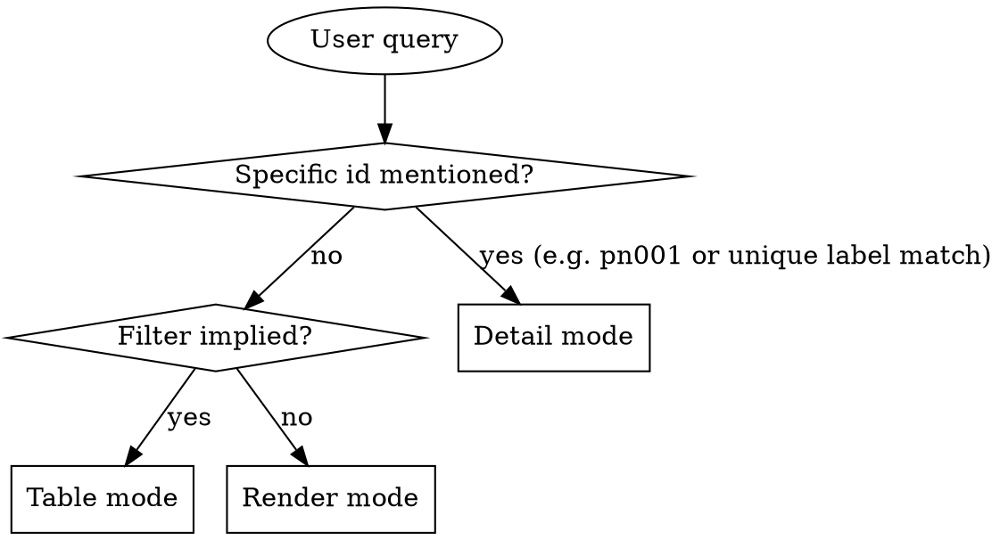

# Persona Read

## Overview

Read persona zettels under `docs/notes/pn###.md` and present them in the format that best fits the user's question. Three output modes — pick one based on the query, don't combine.

**Announce at start:** "Using persona-read skill to surface roles."

## AKM Workspace Resolution

Readers always anchor on the main worktree's view of the AKM, never the
feature worktree's local copy (which may be stale or branch-divergent).
Resolve first:

```bash
AKM_ROOT="$(akm-root)"
```

All lookups anchor on `$AKM_ROOT/docs/notes/...`. If `akm-root` errors,
surface its stderr and fall back to cwd with the warning *"reading from
cwd worktree — may be stale; check out the default branch for canonical
view"*.

## Storage

**Backend:** AKM (Agentic Knowledge Model). Personas live as individual markdown zettels in `$AKM_ROOT/docs/notes/pn###.md`. Schema is documented in `docs/notes/akm.md`; this skill only needs the slice below.

If `$AKM_ROOT/docs/notes/` does not contain any `pn*.md` files: tell the user "No personas found. Use persona-write to add one." Don't fabricate.

### Zettel slice this skill needs

```markdown
---
aliases:
  - <short role label>     # first alias = the slug stories reference
status: <draft|validated|retired>
created: YYYY-MM-DD
---
# Persona [[product]]

## name
<full role name>

## summary
<one-paragraph context>

## primary_goals
- <goal>

## open_questions
- <unresolved question>
```

**Key extraction rules:**

- `id` — filename slug (`pn001`).
- `label` — first entry under `aliases:` (this is what stories reference via `[[pn###|label]]`).
- `name` — text under `## name`.
- `summary` — paragraph under `## summary`.
- `primary_goals`, `open_questions` — bullets under those H2s.
- `status`, `created` — frontmatter scalars.

If a persona is missing any of these sections, render what's there and omit silently.

## Mode Selection



### Detail mode triggers
- Query contains `pn###` (case-insensitive).
- Query names one persona by label or full name.
- "show me persona X", "tell me about the X role".

### Table mode triggers
- Status filters: `draft`, `validated`, `retired`.
- Open-question filter: "personas with open questions".
- Keyword search: "personas about approval", "roles related to catalog".
- "List …", "how many … are validated".

### Render mode triggers
- "Show me the personas", "what user roles do we have", "print all personas".
- No filter and no specific id.

Ambiguous between table and render → prefer table.

## Reading the zettels

1. **List ids.** `ls "$AKM_ROOT/docs/notes/"pn*.md`.
2. **Read per mode:**
   - **Detail** — read only the matching file.
   - **Table** — `head -25` is usually enough (frontmatter + `## name` + first line of `## summary`).
   - **Render** — full read.

Sort by filename ascending — don't trust list order.

## Mode 1: Detail

```markdown
## [id] — [label]

**Name:** [name]    **Status:** [status]    **Created:** [created]

[summary]

**Primary goals:**
- [goal 1]
- [goal 2]

**Open questions:**
- [question 1]
```

If `## open_questions` is empty or contains only placeholder dashes, omit the **Open questions** section.

If id not found: "Persona `pn001` not found. Closest matches: ..." and list 1-3 candidates by label similarity. Don't guess.

## Mode 2: Table

| id | status | label | summary |

Sort by id ascending. Truncate `summary` to ~60 chars with `…` if longer.

After the table: `N personas matched (X validated, Y draft, Z retired).`

If zero matched: state the filter explicitly. Example: "No personas with status=validated and label contains 'admin'."

## Mode 3: Render

Grouped by status: `draft` → `validated` → `retired`. Within each group sort by id ascending.

```markdown
# Personas

## Validated

### pn001 — requestor
**Name:** Field Sales Rep

<summary>

- <goal 1>
- <goal 2>

### pn002 — ...
```

End with: `Total: N personas (X validated, Y draft, Z retired).` Omit zero-count buckets.

## Filter Parsing

| User says | Match against |
|---|---|
| "draft", "pending", "open" | `status: draft` |
| "validated", "active" | `status: validated` |
| "retired", "deprecated" | `status: retired` |
| "with open questions" | `open_questions` non-empty |
| "about X", "related to Y" | any text field (label, name, summary, goals, questions; case-insensitive) |

Multiple filters compose with AND.

## What This Skill Does NOT Do

- It does not modify personas. To edit, use `persona-write` or edit the markdown directly.
- It does not validate wikilinks; moxide LSP is the source of truth.
- It does not estimate fit between personas and stories.

## When to Defer to Other Skills

- Add/edit a persona → `persona-write`.
- Find stories that target a persona → `story-read` (filter by role) or `story-find`.
- General zettel routing → `zettel-write`.
