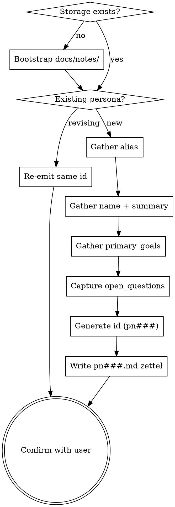

<skill_overview>
Capture a single user role as a new AKM Persona zettel under `docs/notes/pn###.md`. Personas anchor stories via the `role` wikilink and group the backlog under `## Stories` subheadings in the [[product]] hub. They describe **who** the system serves — context, goals, and what we still don't know about them — not what that role wants done (that lives on the story). The skill exists so persona creation has one home: `infinifu:story-write` no longer inlines a minimal `pn###.md` fallback, it delegates here.
</skill_overview>

<rigidity_level>
MEDIUM FREEDOM — schema shape and id sequence are fixed because every story that references `[[pn###|alias]]` depends on them, and a wrong alias propagates into the hub's `## Stories` grouping. Content (the summary, the goals, the open questions) is whatever the user actually knows; if they only know the alias and one sentence of context, write that and leave `## open_questions` populated — the `draft` status exists for exactly that case.

Non-negotiable bits:

1. **Filename = stable id.** `pn###.md`, three-digit zero-padded, max-of-existing + 1. Never reuse gaps.
2. **First alias is the canonical short label.** Stories will link with `[[pn###|<first-alias>]]`; if the first alias drifts later, every story's role label drifts with it.
3. **Schema invariants.** `[[product]]` in the H1, `Index: [[product]]` footer, `## name` / `## summary` / `## primary_goals` / `## open_questions` sections in that order.
</rigidity_level>

<quick_reference>

| Field | Where | Rule |
|-------|-------|------|
| Filename | `docs/notes/pn###.md` | Three-digit zero-padded, sequential, max+1, no gap reuse |
| `aliases[0]` | frontmatter | Canonical short label (`requestor`, `approver`, `field-sales-rep`) — kebab-case, what stories link to |
| `status` | frontmatter | `draft` (open_questions populated) / `validated` (resolved) / `retired` (role no longer served) |
| `created` | frontmatter | ISO `YYYY-MM-DD` |
| H1 | body | `# Persona [[product]]` — no category tags, no flow tags |
| `## name` | body | Full role name in prose (`Field Sales Rep`, `Warehouse Approver`) |
| `## summary` | body | One paragraph: who, where, why they touch the system |
| `## primary_goals` | body | Bullets — what this role is trying to accomplish, role-shaped not story-shaped |
| `## open_questions` | body | Bullets — unresolved discovery; **empty** for `validated` |
| Footer | body | `---` rule, then `Index: [[product]]` |

**Status transitions:**

| From → To | Trigger |
|-----------|---------|
| `draft` → `validated` | `## open_questions` resolved or moved to an ADR / decision log |
| `validated` → `retired` | Role no longer served — keep file, add `## retired` section, leave existing story back-links intact |
| `draft` → `retired` | Persona dropped before validation — same treatment, with note in `## retired` |

</quick_reference>

<when_to_use>
**Use when:**

- User asks to create / add / register / define a persona or user role explicitly
- `infinifu:story-write` is about to write a story whose `role` references a `[[pn###]]` that doesn't exist yet — delegate here instead of inlining a minimal stub
- A brainstorm or refinement session lands on a new actor that future stories will reference
- User wants to revise an existing persona — re-emit the same `pn###.md` with updated body (personas are mutable; unlike ADRs they don't supersede in place)

**Don't use for:**

- Capturing what a role *wants done* → that's a story, use `infinifu:story-write` (the persona is the `role` link, not the artifact)
- Generic concept notes about user types / market segments that no story will reference → `infinifu:zettel-write` and write a generic named-slug card
- Tagging or H1 wikilink edits on existing zettels → `infinifu:tag-manage`
- Mapping stories to personas after the fact (the link lives on the story) → re-emit the story via `infinifu:story-write`
</when_to_use>

<the_process>

## Flow



## Storage

**File:** one zettel per persona at `docs/notes/pn###.md` (three-digit zero-padded id).

If `docs/notes/` does not exist: create it. If `docs/product.md` is also missing the workspace is not AKM-set-up — warn the user *"No `docs/product.md` found; AKM workspace not initialized. Create the hub manually or via the project's `epic-create` skill first."* then proceed (the zettel will reference a dangling `[[product]]` until the hub lands) or abort if the user prefers.

## Zettel schema

Every persona zettel has this exact shape (canonical source: `docs/notes/akm.md#persona--pn-md`):

```markdown
---
aliases:
  - <canonical short label, e.g. requestor>
status: <draft|validated|retired>
created: YYYY-MM-DD
---
# Persona [[product]]

## name
<full role name, e.g. Field Sales Rep>

## summary
<one paragraph: who, where, why they touch the system>

## primary_goals
- <goal>
- <goal>

## open_questions
- <unresolved discovery question>

---

Index: [[product]]
```

**Required pieces:**

- Frontmatter `aliases:` (at least one entry — the canonical short label), `status:`, `created:` (ISO date).
- H1 is exactly `# Persona [[product]]` — no taxonomy tags, no flow tags. Personas are a supporting type; they don't get their own `[[product]]` section, so there's nothing for an H1 tag to group under.
- `## name`, `## summary`, `## primary_goals`, `## open_questions` sections in that order.
- `Index: [[product]]` footer.

New personas default to `status: draft`. Flip to `validated` only when `## open_questions` is empty (or the open questions migrated to an ADR / decision-log entry).

## ID generation

IDs are `pn` + three-digit zero-padded sequential (`pn001`, `pn002`, …). Same rule as every other AKM type:

1. List existing persona zettels: `ls docs/notes/pn*.md` (or in-process equivalent).
2. Extract the numeric portion. Find max, add 1.
3. Zero-pad to 3 digits. If no existing personas, start at `001`.

Gaps from retired personas are **not** reused — wikilink stability across history is the whole point of the sequential id.

## The alias is load-bearing

The first entry in `aliases:` is what every story will use as its label: `[[pn001|requestor]]`. Two consequences:

- **Kebab-case, short, role-shaped.** `requestor`, `approver`, `field-sales-rep`, `warehouse-approver`. Not full sentences, not titles, not `Field Sales Rep` with capitals — the alias renders inside `[[…|alias]]` in story bodies and the hub.
- **Stable once chosen.** Changing the first alias later renames the label on every story that references this persona. Possible (re-emit each story) but expensive. Push back once if the user proposes a vague or shifting label.

Subsequent aliases are free aliases — synonyms the user might search for. Add them if the user gave multiple equivalent phrasings; otherwise leave the list at one entry.

## Gathering persona content

Personas are small — usually smaller than stories. Don't over-interview. If the user provided everything upfront (alias + summary + 1–2 goals), write the zettel and confirm at the end. If pieces are missing, ask only for what's missing, one focused question per turn.

**The four body sections, in priority order for elicitation:**

1. **`## name`** — full role name in prose. *"What's the full role name? e.g. 'Field Sales Rep', 'Warehouse Approver'."*
2. **`## summary`** — one paragraph context. *"Who is this person, where do they sit, why do they touch the system?"* One paragraph, three sentences max. If the user gives more, trim — the summary is orientation, not biography.
3. **`## primary_goals`** — 2–4 bullets of what this role is trying to accomplish *as a role*, not as a story. *"Get product in customer hands"* is role-shaped; *"upload a CSV to bulk-create orders"* is story-shaped (that's a `us###`). Push back once if the goals read like stories.
4. **`## open_questions`** — bullets of what you don't know yet. *Any* unresolved discovery — pain points not yet mapped, frequency-of-use, edge cases, decision authority. Empty for `validated`; populated for `draft`.

If `## open_questions` is empty at write time, the persona is born `validated`. That's rare but legitimate (e.g. when a persona is being formalized from a long-running existing role). Otherwise default to `draft` and write what's known.

## Status: draft vs validated vs retired

| Status | Means | When to use |
|--------|-------|-------------|
| `draft` | Captured, but `## open_questions` still populated | The common case — most new personas |
| `validated` | `## open_questions` empty (or moved to ADR / decision log) | After enough stories reference this persona that the role is well-understood |
| `retired` | Role no longer served | Add a `## retired` body section with the date and the reason; keep all existing story back-links — they're history, not live links |

Personas don't supersede in place (unlike ADRs / Features / Implementations) — they're just role descriptions. If the role itself splits or merges, retire the old `pn###` and create new ones, then re-emit the affected stories with updated `role` links.

## Writing the zettel

Compose the full markdown file per the schema above. Write to `docs/notes/pn<NNN>.md` using the generated id.

**Example output for a fresh persona:**

`docs/notes/pn001.md`:

```markdown
---
aliases:
  - requestor
status: draft
created: 2026-05-15
---
# Persona [[product]]

## name
Field Sales Rep

## summary
Account-facing sales rep who visits client sites and runs tastings. Spends most of the working day off-network; uses the system from a tablet between client visits to log activity and prepare product for upcoming meetings. Low tolerance for multi-step UI — every extra tap is a tap in a parking lot.

## primary_goals
- Get sample product in client hands before each scheduled tasting
- Capture client feedback during the visit, not after
- Hand off promising leads to the office without manual re-keying

## open_questions
- Frequency of bulk sample requests vs single-item asks
- Whether the same rep both submits and approves their own follow-ups
- Offline behaviour expectations when network drops mid-visit

---

Index: [[product]]
```

**Conventions:**

- ISO `YYYY-MM-DD` for `created`.
- One alias entry (the canonical short label) is the minimum; add more aliases only if the user gave multiple equivalent phrasings.
- `## summary` is one paragraph — if it grows headings or sub-bullets, the persona has compound goals and should likely split.
- Body sections are `## name`, `## summary`, `## primary_goals`, `## open_questions` exactly — downstream readers (story-find, story-read, hub generators) parse on these headings.
- Footer is a `---` rule then `Index: [[product]]` on its own line.

## Updating `docs/product.md` (the hub)

Personas are a **supporting type** — they do not get their own section in [[product]]. Instead they surface as H3 subheadings under `## Stories`, where the backlog is grouped by persona. There are two cases:

1. **No story references this persona yet** → no hub change. The persona file exists in `docs/notes/`; it will appear in the hub the first time a story is written against it.
2. **The user is writing a persona because a story is about to reference it** → that's `infinifu:story-write`'s job. After this skill returns the new `pn###` id, story-write writes the story *and* appends the new H3 + the story bullet under `## Stories` in the hub.

So: **this skill does not touch `docs/product.md`**. It writes the persona file and returns. If the user invoked persona-write directly (no story in flight), the hub stays untouched until a story is filed.

## Confirmation

After writing, show the user:

1. The persona id and the file path (`docs/notes/pn<NNN>.md`).
2. The canonical short label (the first alias) — *"Stories will reference this as `[[pn<NNN>|<alias>]]`."*
3. The full name and a one-line gist of the summary.
4. The status (`draft` / `validated` / `retired`) and the count of open questions.
5. A note that the hub was **not** updated (personas surface in the hub via stories, not directly).

Ask once: *"Anything to revise?"* If yes, edit the zettel in place (same id). If no or no response, you're done.

</the_process>

<examples>

**Example 1 — fresh persona with open questions**

Input: *"We need a persona for the warehouse approver. They sit in the back office, review submitted sample requests, and approve or reject them before the pick list goes out. Not sure yet whether one approver covers all regions or whether we'll have regional approvers."*

Atomicity: one role, one summary, clear primary goals, one open question ✓.

Alias choice: *"approver"* is short and role-shaped — propose it.

Status: `draft` — the regional-coverage question is unresolved.

File: `docs/notes/pn002.md`

```markdown
---
aliases:
  - approver
status: draft
created: 2026-05-15
---
# Persona [[product]]

## name
Warehouse Approver

## summary
Back-office role that gates sample requests before the warehouse pick list is generated. Reviews submitted requests for budget, inventory, and client-fit signals, then approves or rejects. Decision is the trigger for downstream warehouse work — nothing ships without an approval.

## primary_goals
- Hold the line on inventory not earmarked for paying customers
- Turn submitted requests around fast enough that field reps trust the process
- Surface rejected requests with clear reasoning so the rep can resubmit

## open_questions
- Single approver covering all regions vs regional approvers
- Whether approver and requestor can be the same person for low-value requests
- SLA expectation between submission and decision

---

Index: [[product]]
```

**Example 2 — story-write delegates here for a missing persona**

Context: `infinifu:story-write` is mid-flight on a story whose `role` references *"the brand manager"*. `ls docs/notes/pn*.md` shows `pn001` (requestor) and `pn002` (approver) — no brand-manager persona yet.

Story-write hands off: *"No existing persona matches `brand manager`. Delegating to `infinifu:persona-write` to create `pn003`, then I'll resume the story."*

This skill takes over, gathers the four fields (alias `brand-manager`, name `Brand Manager`, summary, goals, any open questions), writes `docs/notes/pn003.md`, returns `pn003` + the canonical alias `brand-manager`. Story-write resumes with `[[pn003|brand-manager]]` in the story's `## role`.

**Example 3 — revising an existing persona**

Input: *"Update the requestor persona — we figured out the offline question, they need full offline capture and sync-on-reconnect."*

Existing persona: `docs/notes/pn001.md`, status `draft`, `## open_questions` lists an offline question.

Re-emit `pn001.md` (same id, same alias) with the offline question removed from `## open_questions`. If the question was the last one, flip status to `validated`. If others remain, stay `draft`. Capture the resolution as a new bullet under `## primary_goals` or as a separate ADR if the decision was architectural — body content is yours to shape, status is what flips.

</examples>

<critical_rules>

- **One role per file.** A persona zettel describes one role. If the user is describing two roles ("approver and reviewer"), split into two persona files with mutual `[[pn###]]` links in their summaries, not one compound persona.
- **Alias is forever.** The first `aliases[]` entry becomes the label on every story that references this persona. Choose it once, deliberately. Renaming later requires re-emitting every linked story.
- **Goals are role-shaped, not story-shaped.** *"Get product in customer hands"* belongs on the persona; *"upload a CSV to bulk-create orders"* belongs on a story. If the user gives story-shaped goals, push back once.
- **`open_questions` is an honest field, not a stylistic one.** Leave it populated when there are real unknowns. Don't fabricate a question to look thorough, and don't empty it just to flip to `validated` — `draft` is a perfectly good resting state.
- **Don't touch the hub.** `docs/product.md` only changes when a story references this persona. Story-write owns that update.
- **Retire, never delete.** A retired persona keeps its file (existing story back-links are history). Add a `## retired` section with date and reason. The id is never reused.
- **No category tags in the H1.** Just `# Persona [[product]]`. Personas are a supporting type with no taxonomy.

</critical_rules>

<verification_checklist>

Before reporting the persona complete:

- [ ] Filename is `pn<NNN>.md` — three digits, zero-padded, max-existing + 1, no gap reuse
- [ ] Frontmatter has `aliases:` (≥ 1 entry, first is kebab-case short label), `status:` (draft/validated/retired), `created:` (ISO date)
- [ ] H1 is exactly `# Persona [[product]]` — no extra tags
- [ ] Body sections present and in order: `## name`, `## summary`, `## primary_goals`, `## open_questions`
- [ ] `## summary` is one paragraph (no headings, no sub-bullets)
- [ ] `## primary_goals` are role-shaped, not story-shaped
- [ ] `## open_questions` empty *iff* status is `validated` (or `retired` with no follow-up)
- [ ] Footer is `---` rule then `Index: [[product]]` on its own line
- [ ] `docs/product.md` was **not** touched (personas surface via stories)
- [ ] The canonical alias was shown back to the user so they can object before story-write starts using it

</verification_checklist>

<integration>

**Called by:**

- `infinifu:story-write` — when a story being written references a persona that doesn't yet exist in `docs/notes/`. Story-write previously inlined a minimal `pn###.md` fallback; that path is now this skill. Story-write hands off, this skill writes the persona file, returns the new `pn###` id + canonical alias, story-write resumes.
- `infinifu:zettel-write` — the orchestrator routes any persona-shaped capture request here (per its `<quick_reference>` routing table: *"User role / 'for whom'" → `persona-write`*).
- Directly by the user when establishing a new role upfront, before any story exists for it.

**Calls:** nothing — this skill writes one file and returns. It deliberately does **not** update `docs/product.md` (that's story-write's responsibility, since personas surface in the hub via the stories that reference them).

**Complements:**

- `infinifu:story-write` — uses the personas this skill produces; together they cover the role + want sides of a backlog item.
- `infinifu:story-read` / `infinifu:story-find` — read-side counterparts that resolve `[[pn###|alias]]` links back to the persona file.
- `infinifu:tag-manage` — separate skill for H1 tag wikilinks on *stories*; personas don't carry H1 tags so tag-manage doesn't apply here.

</integration>

<references>

- `docs/notes/akm.md` — canonical AKM schema. Section `## Persona — pn###.md` is the source of truth for the body shape, frontmatter keys, and lifecycle states this skill emits. Load when in doubt about any schema detail; never duplicate the schema text here.
- `infinifu:meta-skill-writing` — house style for this skill's own SKILL.md. Load when refactoring this file.

</references>
