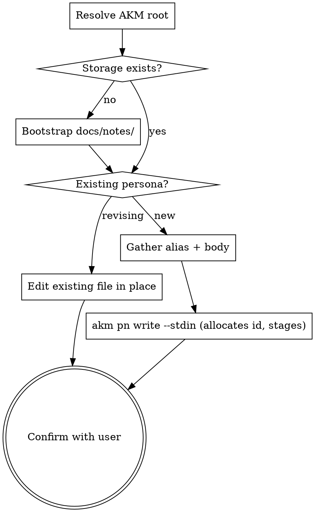

<skill_overview>
Capture a single user role as a new AKM Persona zettel under `docs/notes/pn###.md`. Personas anchor stories via the `role` wikilink and group the backlog under `## Stories` subheadings in the [[product]] hub. They describe **who** the system serves — context, goals, and what we still don't know about them — not what that role wants done (that lives on the story). The skill exists so persona creation has one home: `infinifu:story-write` no longer inlines a minimal `pn###.md` fallback, it delegates here.
</skill_overview>

<rigidity_level>
MEDIUM FREEDOM — schema shape and id sequence are fixed because every story that references `[[pn###|alias]]` depends on them, and a wrong alias propagates into the hub's `## Stories` grouping. Content (summary, goals, open questions) is whatever the user actually knows; the `draft` status exists for the case where only the alias and one sentence of context are known.

Non-negotiable: (1) filename is `pn###.md`, three-digit zero-padded, max-of-existing + 1, gaps never reused; (2) `aliases[0]` is the canonical label every story links with via `[[pn###|<first-alias>]]`; (3) schema is `[[product]]` in the H1, `Index: [[product]]` footer, `## name` / `## summary` / `## primary_goals` / `## open_questions` in that order.
</rigidity_level>

<quick_reference>

| Field | Where | Rule |
|-------|-------|------|
| Filename | `$AKM_ROOT/docs/notes/pn###.md` | Three-digit zero-padded, sequential, max+1, no gap reuse |
| `aliases[0]` | frontmatter | Canonical short label (`requestor`, `approver`, `field-sales-rep`) — kebab-case, what stories link to |
| `status` | frontmatter | `draft` (open_questions populated) / `validated` (resolved) / `retired` (role no longer served) |
| `created` | frontmatter | ISO `YYYY-MM-DD` |
| H1 | body | `# Persona [[product]]` — no category tags, no flow tags |
| `## name` | body | Full role name in prose (`Field Sales Rep`, `Warehouse Approver`) |
| `## summary` | body | One paragraph: who, where, why they touch the system |
| `## primary_goals` | body | Bullets — role-shaped, not story-shaped |
| `## open_questions` | body | Bullets — unresolved discovery; empty for `validated` |
| Footer | body | `---` rule, then `Index: [[product]]` |

**Status transitions:**

| From → To | Trigger |
|-----------|---------|
| `draft` → `validated` | `## open_questions` empty or moved to ADR / decision log |
| `validated` → `retired` | Role no longer served — keep file, add `## retired`, leave existing story back-links |
| `draft` → `retired` | Persona dropped before validation — same treatment |

</quick_reference>

<schema>

**Frontmatter.**

```yaml
aliases:
  - <short role label, e.g. requestor>
status: <draft|validated|retired>
created: YYYY-MM-DD
```

**Body skeleton.**

```markdown
# Persona [[product]]

## name
<full role name, e.g. Field Sales Rep>

## summary
<one-paragraph context: who, where, why they touch the system>

## primary_goals
- <goal>
- <goal>

## open_questions
- <unresolved discovery question>

---

Index: [[product]]
```

**Required wikilinks.** `[[product]]` in H1, `Index: [[product]]` footer.
No category tags, no flow tags — Persona H1 is intentionally minimal.

**Lifecycle.**

- `draft` — captured but `## open_questions` still populated.
- `validated` — `## open_questions` empty (or migrated to ADR / decision
  log).
- `retired` — role no longer served. Keep the file (existing story
  back-links remain valid); add a `## retired` section noting why.

</schema>

<when_to_use>
**Use when:**

- User asks to create / add / register / define a persona or user role explicitly
- `infinifu:story-write` is about to write a story whose `role` references a `[[pn###]]` that doesn't exist yet — delegate here instead of inlining a stub
- A brainstorm or refinement session lands on a new actor that future stories will reference
- User wants to revise an existing persona — re-emit the same `pn###.md` with updated body (personas are mutable; unlike ADRs they don't supersede in place)

**Don't use for:**

- Capturing what a role *wants done* → that's a story, use `infinifu:story-write`
- Generic concept notes about user types / market segments that no story will reference → `infinifu:zettel-write`
- Tagging or H1 wikilink edits on existing zettels → `infinifu:tag-manage`
- Mapping stories to personas after the fact (the link lives on the story) → re-emit the story via `infinifu:story-write`
</when_to_use>

<workspace_resolution>
Personas are shared knowledge — they live on **main**, even from a feature-branch worktree. Resolve before any file op:

```bash
AKM_ROOT="$(akm-root)"
```

`akm-root` returns the main-worktree path (default branch); outside git, cwd. Anchor every path on `$AKM_ROOT` (`$AKM_ROOT/docs/notes/pn###.md`, `$AKM_ROOT/docs/product.md`). If `akm-root` errors, surface its stderr and abort — never silently land a persona on the feature branch.

Personas are a `draft → validated → retired` artifact and typically born as `draft`. **Minting a new persona goes through `akm pn write <name> [--status <s>] --stdin`**, which allocates the id, writes frontmatter + tagless H1 + footer, and **stages on main without committing** (`git add docs/notes/pn<NNN>.md`). The next lifecycle commit happens when the persona is referenced from a `ready` story or flipped to `validated` by spec-refinement. See the per-stage commit table in `docs/notes/akm.md#workspace-resolution`.

**Revising an existing persona is a body edit, not a mint** — `akm pn write` short-circuits on a duplicate alias and will not overwrite. For revisions, edit the existing `$AKM_ROOT/docs/notes/pn<NNN>.md` in place and re-stage.
</workspace_resolution>

<the_process>



1. **Check storage.** Resolve `$AKM_ROOT` first. If `$AKM_ROOT/docs/notes/` is missing, create it. If `$AKM_ROOT/docs/product.md` is missing, warn *"No `docs/product.md` found in `$AKM_ROOT`; AKM workspace not initialized."* and proceed with a dangling `[[product]]` (or abort if the user prefers).

2. **Choose the canonical alias.** `aliases[0]` is what every story will use as label inside `[[pn###|alias]]`, and the `name` argument to `akm pn write`. Kebab-case, short, role-shaped (`requestor`, `approver`, `field-sales-rep`). Stable once chosen — see `references/examples.md` for why renaming is expensive.

3. **Gather body content.** Personas are small — don't over-interview. Ask only for what's missing, one focused question per turn:
   - `## name` — full role name in prose ("Field Sales Rep", "Warehouse Approver").
   - `## summary` — one paragraph (≤3 sentences): who, where, why they touch the system.
   - `## primary_goals` — 2–4 bullets, role-shaped (not story-shaped — push back once if they read like stories).
   - `## open_questions` — bullets of unresolved discovery. Empty iff `validated`.

4. **Set status.** Default to `draft` (the CLI default). Pass `--status validated` only when `## open_questions` is empty (or migrated to an ADR / decision log). `validated` at write time is rare but legitimate when formalizing a long-running role.

5. **Write via the CLI.** Pipe the composed body (the four `## name / ## summary / ## primary_goals / ## open_questions` sections only — no frontmatter, no H1, no footer) to the typed writer, which allocates the id, writes frontmatter + tagless `# Persona [[product]]` H1 + footer, and stages the file on main:

   ```bash
   printf '## name\n%s\n\n## summary\n%s\n\n## primary_goals\n%s\n\n## open_questions\n%s\n' \
     "$name" "$summary" "$goals" "$open_qs" \
     | akm pn write "$alias" --stdin          # add --status validated if appropriate
   ```

   The `$alias` argument is the **kebab-case slug** (letters/digits/dash/underscore only — `field-sales-rep`, not "Field Sales Rep"); the CLI rejects spaces or prose and stores it as `aliases[0]`. Capture the allocated id from the structured `Id: pn###` first line of stdout. The CLI owns id allocation (max + 1, gaps never reused), frontmatter, the tagless H1, the `Index: [[product]]` footer, and `git add`. Do **not** hand-write the file and do **not** touch `$AKM_ROOT/docs/product.md` — personas surface in the hub via stories (see `critical_rules`). If the alias already exists the CLI short-circuits without overwriting; treat that as "this is a revision" and edit the existing file in place instead.

6. **Confirm.** Show id + absolute file path (so the user sees the AKM root when invoked from a worktree), the canonical alias (*"Stories will reference this as `[[pn<NNN>|<alias>]]`"*), the name + one-line summary gist, the status, the open-questions count, the staging state on main, and note that the hub was **not** updated. Ask once: *"Anything to revise?"* If yes, edit in place.

See `references/examples.md` for fresh-persona, story-write-delegation, and revision walkthroughs.

</the_process>

<critical_rules>

- **One role per file.** Two roles ("approver and reviewer") split into two persona files with mutual `[[pn###]]` links in their summaries — not one compound persona.
- **First alias is forever.** It becomes the label on every story that references this persona. Renaming later requires re-emitting every linked story; push back once if the user proposes a vague or shifting label.
- **Goals are role-shaped.** *"Get product in customer hands"* belongs on the persona; *"upload a CSV to bulk-create orders"* belongs on a `us###`.
- **`open_questions` is honest, not stylistic.** Don't fabricate questions to look thorough; don't empty the field just to flip to `validated`. `draft` is a fine resting state.
- **Don't touch the hub.** `docs/product.md` only changes when a story references this persona — that's `infinifu:story-write`'s job. Personas are a supporting type with no `[[product]]` section of their own.
- **Retire, never delete.** A retired persona keeps its file (existing story back-links are history). Add a `## retired` section with date + reason. Ids are never reused.
- **No category tags in the H1.** Just `# Persona [[product]]`. Personas are supporting with no taxonomy.
- **Don't hand-write the file.** Id allocation, frontmatter, the tagless H1, the footer, and staging are the CLI's job (`akm pn write --stdin`). The skill composes only the four body sections and pipes them in. The one exception is revising an *existing* persona — `write` is mint-only, so revisions edit the file in place.

</critical_rules>

<verification_checklist>

Before reporting complete:

- [ ] Minted via `akm pn write <alias> --stdin` (not hand-written) — `Id: pn###` captured from stdout
- [ ] Filename is `pn<NNN>.md` — three digits, zero-padded, max-existing + 1, no gap reuse (CLI enforces)
- [ ] Frontmatter has `aliases:` (≥ 1, first is kebab-case short label), `status:`, `created:` (ISO date)
- [ ] H1 is exactly `# Persona [[product]]` — no extra tags
- [ ] Body sections in order: `## name`, `## summary`, `## primary_goals`, `## open_questions`
- [ ] `## summary` is one paragraph (no headings, no sub-bullets)
- [ ] `## primary_goals` are role-shaped, not story-shaped
- [ ] `## open_questions` empty *iff* `validated` (or `retired` with no follow-up)
- [ ] Footer is `---` rule then `Index: [[product]]` on its own line
- [ ] `$AKM_ROOT/docs/product.md` was **not** touched
- [ ] File was staged on main by the CLI (`git add docs/notes/pn<NNN>.md`) and no commit was created
- [ ] Confirmation surfaces the absolute path under `$AKM_ROOT` so the user sees where it landed
- [ ] Canonical alias shown back to the user so they can object before story-write uses it

</verification_checklist>

<integration>

**Called by:** `infinifu:story-write` (when a story's `role` references a `[[pn###]]` that doesn't exist — story-write hands off, this skill writes the persona file, returns `pn###` + canonical alias, story-write resumes); `infinifu:zettel-write` (orchestrator routes persona-shaped capture requests here); directly by the user when establishing a role upfront.

**Calls:** nothing — writes one file and returns. Deliberately does **not** update `docs/product.md` (story-write's responsibility).

**Complements:** `infinifu:story-write` (uses these personas as `role` links), `infinifu:story-read` / `infinifu:story-find` (resolve `[[pn###|alias]]` back to the persona file), `infinifu:tag-manage` (separate skill for H1 tags on stories — personas don't carry H1 tags so it doesn't apply).

</integration>

<references>

- `docs/notes/akm.md` — top-level AKM model + lifecycle process flow. **Load when** needing cross-type perspective (how Personas relate to Stories / Implementations). Schema details live in the `<schema>` block above, not here.
- `infinifu:zettel-write` — cross-type styling rules (atomicity, 80-char wrap, link discipline, post-write audit). **Load when** the styling rule is unclear; this skill owns the Persona schema, that one owns shared discipline.
- `references/examples.md` — three worked examples (fresh persona with open questions, story-write delegation handoff, revision/re-emit). **Load when** unclear how the workflow plays out end-to-end, especially for the alias-stability rationale or the status-lifecycle nuances.
- `infinifu:meta-skill-writing` — house style for this skill's own SKILL.md. **Load when refactoring** this file.

</references>
</content>
</invoke>