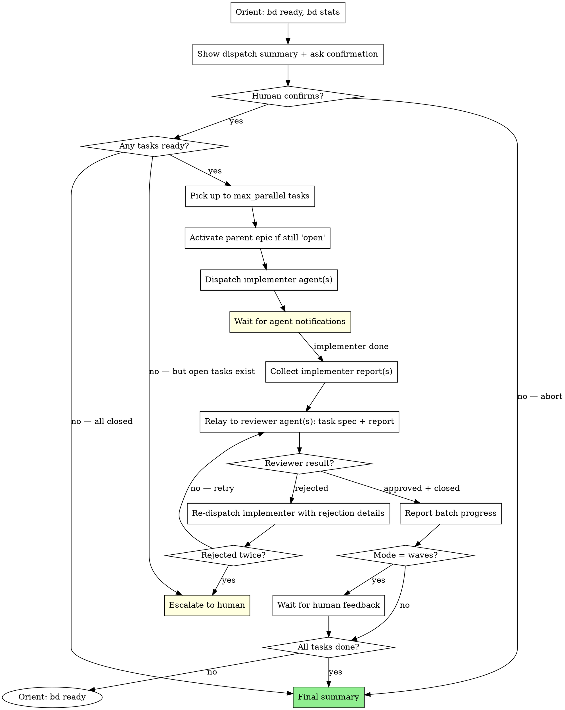

# Scrum Master — Pipeline Orchestrator

## Overview

Orchestrate bd-driven development by reading the ready queue, dispatching implementer agents, applying their state transitions to bd from main, relaying reports to reviewer agents, and routing verdicts.

**Core principle:** You are the bd write gateway. You stay on `$AKM_ROOT` (main) for the entire pipeline. Workers (implementers + reviewers) live in feature worktrees and never write to bd themselves — they emit structured reports / verdict blocks that you parse and apply serially from main. This eliminates concurrent-writer races on bd's shared Dolt server that have been observed reverting closes.

**Announce at start:** "I'm using the plan-scrum-master skill to orchestrate the pipeline."

## BD WRITE GATEWAY — you are the only writer

bd has one persistent Dolt server shared across worktrees. Multiple parallel agents writing to it simultaneously have been observed producing reverted closes (a task closes, then on the next `bd show` it shows open again). The fix is process-level: a **single serial writer** on a single workspace.

**You** are that writer. **You stay on `$AKM_ROOT`** and apply every bd write — claim, notes, discoveries, close, blocked, epic close — sequentially. Workers report; you write.

What this looks like in practice:

| When | What you write to bd from `$AKM_ROOT` |
|---|---|
| Before dispatching first task of an epic | `bd update <epic-id> --status in_progress --priority 1`; bump children to P1 |
| Before dispatching each implementer | `bd update <id> --status in_progress` (the claim) |
| After saving agent metadata | `bd update <id> --notes "Agent session: …"` |
| Receiving implementer report | Apply `notes_to_append`, file `discoveries:`, apply blocked status if reported |
| Receiving reviewer APPROVED verdict | `bd close <id> --reason "$close_reason"`; then invoke `work-merge` (which closes the epic if last child) |
| Receiving reviewer REJECTED verdict | Apply `notes_to_append` with gaps |
| Retry decisions | `bd update <id> --notes "Retry attempt N: …"` |

Workers MUST NOT run any of these from the worktree. Read-only bd commands (`bd show`, `bd dep tree`, `bd list`) are fine in the worktree because reads don't race.

If you find yourself reading a worker report that says "I ran `bd close …`" — that's a contract violation. Flag the worker, double-check the bd state from `$AKM_ROOT`, and re-apply if the state diverged from the report's intent.

## Execution Model

The main Claude session is the scrum-master — the user invokes the skill directly (`/plan-dispatch-fnf` or equivalent) and talks to the orchestrator as themselves. Workers (implementers + reviewers) are dispatched as background subagents via the `Agent` tool with `run_in_background: true`. Each implementer creates its own worktree at `bd-<id>.<N>` as part of work-do Step 2 (the previous `isolation: "worktree"` shortcut was dropped because the auto-generated dir name was opaque and broke the dir-to-task mapping). Main Claude reacts to completion notifications; it does not poll or sleep.

For the rationale (why a wrapper agent cannot do this) and the full dispatch contract, see `references/architecture.md`.

## Prerequisites

Two mandatory gates must have been passed:

1. **⛔ Spec approved by user** — the spec/plan document was reviewed and explicitly approved.
2. **⛔ bd tasks approved by user** — the bd task list was reviewed and explicitly approved.

If either gate was not passed, STOP and go back. Starting execution before both approvals means the agents will burn tokens on work the human has not yet sanctioned.

Additionally:
- bd tasks are created with designs and dependencies.
- `bd ready` returns at least one task.

## Configuration

Three settings, provided by the human at start. If any are missing, **ask** — but offer the defaults below as the "use defaults" option. The defaults are tuned for a typical session: moderate parallelism, only halt on real problems, cheap model first with automatic escalation on failure.

| Setting | Default | Options |
|---------|---------|---------|
| `max_parallel` | **2** | 1, 2, 3, ... N, or `all` |
| `mode` | **only-blockers** | `auto`, `waves`, `only-blockers` — see `references/modes.md` |
| `worker_model` | **sonnet** | `opus`, `sonnet`, `haiku`, `auto` — see `references/worker-models.md` |

### Failure-escalation rule (always on)

When `worker_model` is `sonnet` or `haiku`, the scrum-master **upgrades the model on retry** after any of: implementer error/timeout, first reviewer rejection, or implementer `blocked` status. The retry uses `opus` regardless of the configured `worker_model`. Rationale: the cheap model gets one fair attempt; if it fails, throwing more capability at the problem is usually faster than the human debugging why it stumbled.

The upgrade applies only to the *retry* dispatch — subsequent tasks return to the configured `worker_model`. If `worker_model` is already `opus` or `auto`, no upgrade is needed.

Always echo the chosen settings (and the escalation rule) in the dispatch summary so the human can override before confirming.

## Multi-Epic Parallelism

When multiple epics have ready tasks, tasks from different epics can run in parallel **only if they don't touch overlapping files or directories**. Run an interference check: read each epic's spec, compare file paths, and group non-interfering epics for parallel dispatch. If unsure, ask the human — guessing here causes merge conflicts in worktrees.

For the full rule set + examples, see `references/multi-epic.md`. Present the interference assessment in every dispatch summary (write `n/a — single epic` when only one is active).

## State Machine

### Task state (scrum-master observes, agents perform)

```
open → in_progress    Implementer agent (claims the task)
in_progress → closed  Reviewer agent (verifies, merges, and closes)
in_progress → blocked Implementer agent (needs info, can't proceed)
```

### Epic state (scrum-master owns open → in_progress + P2 → P1)

```
open → in_progress    Scrum-master (on first task dispatch of this epic)
in_progress → closed  spec-retro skill (after merge / PR)
```

**Priority also escalates on dispatch:** epic and all child tasks go from P2 → P1 (actively in flight). See "Activate the epic" in Step 3 for commands.

**Why scrum-master owns the activation:** dispatch is the moment work starts — the state flips from "planned and waiting" to "in flight." Status `in_progress` and priority `P1` both encode that. Nobody else is watching for this moment: `spec-ready` sets up the P2/open snapshot and walks away, `work-do` only touches its own task, `work-audit` closes individual tasks, and `spec-retro` runs much later at delivery time. The scrum-master is the first actor that "knows" the epic is alive.

**When to transition:** right before dispatching the first implementer for a task whose parent epic is still `open` / P2. Run the `bd update` commands before the `Agent` call. If the epic is already `in_progress` / P1 from a previous session, leave it alone.

**Epic close stays with spec-retro** — do NOT close epics from this skill. The retro step validates the work, writes the learning notes, and archives the spec. Closing early would skip that.

### Full lifecycle priority map

| Stage | Skill | Epic priority | Epic status | Child tasks |
|-------|-------|---------------|-------------|-------------|
| Idea | `idea-brainstorming` | P4 | open | — |
| Spec | `spec-writing` | P3 | open | — |
| Ready | `spec-ready` | P2 | open | P2 / open |
| **Dispatched** | **`plan-scrum-master`** | **P1** | **in_progress** | **P1** |
| Retro | `spec-retro` | — | closed | (already closed by work-audit) |

## The Process



## Step 1: Orient

```bash
bd ready                              # What's available?
bd list --type epic --status open     # Which epics are active?
bd list --status in_progress          # Anything mid-flight from previous session?
bd stats                              # Overall picture
```

If `in_progress` tasks exist from a previous session, escalate to human — ask whether to resume or reset them. Do not silently retry; a stale `in_progress` may mean the previous agent crashed mid-merge and the worktree is in an unknown state.

**Multiple epics:** If more than one epic has ready tasks, perform the interference check (`references/multi-epic.md`). Group non-interfering epics for parallel dispatch.

## Step 2: Dispatch Summary

Before dispatching anything, present a summary to the human and ask for confirmation:

```
━━━━━━━━━━━━━━━━━━━━━━━━━━━━━━━━━━━━━━━
  DISPATCH SUMMARY
━━━━━━━━━━━━━━━━━━━━━━━━━━━━━━━━━━━━━━━

Board:
  Total tasks:    X
  Ready:          Y
  In progress:    Z
  Blocked:        W
  Closed:         V

Active epics:
  bd-AAAA: [epic title]  — targets: app/auth/, app/models/user.ts
  bd-BBBB: [epic title]  — targets: app/billing/, app/models/invoice.ts

Interference:
  bd-AAAA ↔ bd-BBBB: NONE — can parallel
  (or: CONFLICT on app/shared/config.ts — must serialize)
  (or: n/a — single epic)

Ready queue:
  [bd-AAAA] bd-XXXX: [title]
  [bd-AAAA] bd-YYYY: [title]
  [bd-BBBB] bd-ZZZZ: [title]

Dependencies:
  [summary of key chains — use `bd list --parent <epic-id>` for the child list
   and `bd dep tree <task-id> --direction=both` for per-task view]

Config:
  max_parallel:   N                  (default 2)
  mode:           only-blockers      (default — pause on failures only)
  worker_model:   sonnet             (default; opus on retry after any failure)

First batch (up to max_parallel):
  → bd-XXXX: [title]  (epic bd-AAAA)  model: sonnet  [default — retry will upgrade to opus]
  → bd-ZZZZ: [title]  (epic bd-BBBB)  model: sonnet  [default — retry will upgrade to opus]

Proceed? (yes / adjust config / abort)
```

Wait for human confirmation before dispatching. The human may adjust `max_parallel`, `mode`, or ask to skip/reorder tasks.

## Step 3: Dispatch Implementers

Pick up to `max_parallel` tasks from `bd ready`. When multiple non-interfering epics are active, mix tasks from different epics in the same batch.

### Activate the epic (first task only)

Before dispatching the first task of an epic, transition the epic to `in_progress` and bump priority to P1 — both the epic and all its child tasks go to P1 to signal "actively in flight":

```bash
bd show <epic-id>                                # Check current status + priority
bd update <epic-id> --status in_progress --priority 1    # Only if still 'open' / P2

# Bump all child tasks to P1 in one pass
bd list --parent <epic-id> --status open --json | jq -r '.[].id' \
  | xargs -I{} bd update {} --priority 1
```

**Why P1 for both epic and child tasks:** priority tracks lifecycle commitment (P4 idea → P3 spec → P2 ready → P1 in flight). Bumping the whole subtree to P1 on dispatch means `bd list --priority 1` surfaces exactly what is being worked on *right now*. If tasks stay at P2 after dispatch, the priority field loses its signal.

Skip this if the epic is already `in_progress` / P1 (e.g., resumed session). Do this once per epic, not per task. If some child tasks already have a higher-priority override (P0 — urgent), leave those alone.

### Claim the task (you, on main)

Before dispatching the implementer, you (running on `$AKM_ROOT`) claim the task. This is the **first half of bd write serialization** — the implementer never writes to bd from the worktree.

```bash
bd update <id> --status in_progress
```

Then dispatch.

### Dispatch the task

For each task, run `bd show <id>` and dispatch an `Agent` tool call with `run_in_background: true` (no `isolation: "worktree"` — that auto-generates an opaque dir name; the implementer creates its own worktree at the right name per work-do Step 2). The dispatch payload contains:

1. **Task ID and title**
2. **Full design text** from `bd show` (paste it — don't make agent query bd)
3. **Context** — what tasks were recently completed, what else is in the pipeline
4. **Branch + worktree name to use:** both `bd-<id>.<N>`. `<N>` is the iteration (`.0` first attempt; orchestrator increments on retry — see Step 5). Path = `$AKM_ROOT/.worktrees/bd-<id>.<N>`. The implementer creates the worktree itself with `git worktree add` so the dir name matches the branch name — work-merge and the spec-retro safety-net sweep both key off `bd-<id>` branches, and the matching dir name makes `git worktree list` self-documenting.
5. **Mandatory rules:**
   - "NEVER use `cd path && command` in bash — always use absolute paths. `cd &&` triggers user confirmation prompts that block background agents."
   - **"NEVER run bd write commands** (`bd close`, `bd update`, `bd create`, `bd dep add`, `bd remember`) from the worktree. Read-only bd commands (`bd show`, `bd dep tree`, `bd list`) are fine. Emit your report block per work-do Step 8; the orchestrator applies all bd writes from `$AKM_ROOT` serially."

**The implementer is responsible for:**
- **Creating its own worktree** at `$AKM_ROOT/.worktrees/bd-<id>.<N>` on branch `bd-<id>.<N>` via `git worktree add` (per work-do Step 2). Do NOT rely on `isolation: "worktree"` — opaque dir names break the dir-to-task mapping the cleanup sweeps depend on.
- `cd` into the newly-created worktree; do all work there
- Implementing, testing, committing in the worktree
- Do NOT merge — orchestrator handles that via work-merge
- **Emitting the structured report** per work-do Step 8 (status_transition, notes_to_append, discoveries, blocked_reason). NO bd write commands from the worktree.
- **NEVER use `cd ... &&` in bash commands** — use absolute paths instead (triggers extra user confirmation, breaks background flow)

**Dispatch up to `max_parallel` agents in a single message**, all with `run_in_background: true`. Do NOT poll or sleep — you will be automatically notified when each agent completes. While waiting, you may report status or respond to the human.

**Save agent session metadata** after each `Agent` call returns:
- **Agent ID / session ID** — for resuming the agent via `SendMessage`
- **Worktree path** — for reviewers to inspect the code
- **Branch name** — for reviewers to merge

Apply these to bd notes from `$AKM_ROOT`, serially:

```bash
bd update <id> --notes "Agent session: [id], worktree: [path], branch: [branch]"
```

This enables resuming agents on rejection instead of dispatching fresh ones — the original agent retains its full context.

## Step 4: Apply implementer report + relay to reviewer

When an implementer notification arrives, the report block contains `notes_to_append`, `discoveries`, `status_transition`, and optionally `blocked_reason`. **You apply all bd writes from `$AKM_ROOT` before dispatching the reviewer** — this is the bd write gateway.

### 4a: Parse and apply the report (serial bd writes from main)

```bash
# 1. Append implementation notes
bd update <id> --notes "$(extract notes_to_append from report block)"

# 2. File discoveries (if any)
for d in discoveries:
  bd create "$d.title" --type "$d.type" --design "$d.design"
  bd dep add <new-id> "$d.depends-on" --type discovered-from

# 3. Status transition
if status_transition is "in_progress → blocked":
  bd update <id> --status blocked --notes "$(extract blocked_reason)"
  # Then ESCALATE — see Step 5
else:
  # status stays in_progress; reviewer will close on approval
  proceed to 4b
```

If `blocked`, do NOT dispatch the reviewer — go to Step 5 (escalation).

### 4b: Dispatch the reviewer

Dispatch a reviewer agent with `run_in_background: true`:

1. **Task spec** — the original design text from bd
2. **Implementer's full report** — pass through as-is, including paths/branches
3. **Same hard rules as implementer:** NO bd write commands from the worktree. Read-only bd is fine. Emit the verdict block per work-audit Step 7.

Do NOT wait for the reviewer — you will be notified when it completes.

**The reviewer is responsible for:**
- Invoking `infinifu:work-audit` against the task — that skill produces the verdict block (APPROVED / REJECTED with evidence) but does NOT run bd writes or fire work-merge directly
- Reading actual code in the implementer's worktree as part of work-audit's evidence-gathering
- Emitting the verdict block with `orchestrator_actions: [...]`
- **NEVER use `cd ... &&` in bash commands** — use absolute paths instead (triggers extra user confirmation, breaks background flow)
- **NEVER run bd write commands** from the audited worktree

### 4c: Apply reviewer verdict (serial bd writes + work-merge from main)

When the reviewer notification arrives with its verdict block:

**APPROVED path:**
```bash
# 1. Close the task
bd close <id> --reason "$(extract close_reason from verdict block)"

# 2. Invoke work-merge for this task + iteration
infinifu:work-merge <id> <N>     # iteration from verdict block

# 3. Route work-merge's outcome:
#    TASK_LANDED            → continue pipeline
#    TASK_LANDED + EPIC_DONE → run infinifu:spec-retro
#    POST-MERGE FAIL        → treat as REJECTED, re-dispatch implementer
```

**REJECTED path:**
```bash
# 1. Append rejection notes
bd update <id> --notes "$(extract notes_to_append from verdict block)"

# 2. Re-dispatch implementer for next iteration (bd-<id>.<N+1>) — see Step 5
```

work-audit no longer auto-fires work-merge directly. Putting the bd close + work-merge invocation on the orchestrator side keeps every bd write on main and serial — the whole point of this gateway.

## Step 5: Handle Rejections and Failures

The retry rule covers three failure modes: reviewer rejection, implementer error/timeout, and implementer-reported `blocked`. All three follow the same escalation pattern.

1. **First failure (rejection / error / blocked):**
   - If a reviewer rejection: reviewer updates bd with `--design` (new conditions) and `--notes` (rejection reason).
   - If an implementer error or `blocked`: log the implementer's reason to `--notes`.
   - **Model upgrade:** if the original `worker_model` was `sonnet` or `haiku`, the retry uses `opus` (see "Failure-escalation rule" in Configuration). If it was already `opus` or `auto`, keep the same model.
   - **Resume the original implementer** via `SendMessage` (with `run_in_background: true`) using the saved agent ID — pass the failure details. The agent retains its full context and is already in the worktree. Resume preserves cheap context; only dispatch a fresh agent if the original session cannot be resumed (e.g., expired) or if the model is being upgraded across providers and a session swap is required.
   - When notified of completion, dispatch reviewer again (also in background).
2. **Second failure on the same task:** Escalate to human — the task needs human attention. Do not retry a third time silently.

Log the retry decision in the bd notes so a later auditor can see why the model jumped (`bd update <id> --notes "Retry attempt 2: upgraded sonnet → opus after reviewer rejection"`).

## Step 6: Report

After each batch:

```
Batch N:
  ✅ bd-XXXX: [title] — [summary from report]
  ✅ bd-YYYY: [title] — [summary from report]
  ❌ bd-ZZZZ: [title] — ESCALATED: [reason]

Pipeline: X/Y tasks done | Z ready | W blocked
```

**If mode = `waves`:** Say "Ready for feedback." and wait for human input.
**If mode = `auto` or `only-blockers`:** Continue to next batch.

See `references/modes.md` for the full mode semantics.

## Step 7: Loop or Finish

- **`bd ready` returns tasks** → go to Step 3
- **All tasks closed** → report final summary and run `bd stats` (bd 1.0 auto-exports `.beads/issues.jsonl`; no separate `bd sync` needed)
- **Open tasks exist but none ready** → escalate (dependency issue or blocked tasks)

## Agent Health Monitoring

Alert the user immediately when any agent shows signs of struggling — long runtime vs peers, verbose / partial reports, self-reported uncertainty, or a `blocked` marker. Do not defer alerts to the next batch report; a stuck agent burns tokens until killed.

See `references/agent-health.md` for the full signal list and the alert template.

## Escalation Protocol

**STOP and escalate when:**
- Implementer agent fails or returns an error
- Reviewer rejects the same task twice
- Task has no design or vague design in bd
- Implementer marks task as blocked
- Agent shows signs of struggling (see `references/agent-health.md`)
- `bd ready` is empty but open tasks remain
- Any unexpected agent behavior

**Format:**
```
BLOCKED: bd-XXXX "[task title]"
Reason: [what the agent reported]
Attempts: [what was tried]
Options: [suggested next steps]
Need your decision to continue.
```

## What You Do Touch vs. What You Don't

**You own (from `$AKM_ROOT`, serially — you are the bd write gateway):**
- Reading the board (`bd ready`, `bd list`, `bd show`, `bd stats`)
- Epic state: `open → in_progress` and priority bump on first dispatch
- Task claim: `bd update <id> --status in_progress` before dispatching the implementer
- Logging dispatch metadata to bd notes (agent id, worktree path, branch)
- Applying implementer report blocks: notes_to_append, discoveries (bd create + bd dep add), blocked status
- Applying reviewer verdict blocks: `bd close` on APPROVED + invoke `work-merge`; `bd update --notes` on REJECTED
- Routing work-merge outcomes: `TASK_LANDED` → continue; `TASK_LANDED + EPIC_DONE` → run spec-retro; `POST-MERGE FAIL` → treat as REJECTED

**You never:**
- Write code, edit files, or run tests
- Touch git, branches, worktrees, or merges — you stay on `$AKM_ROOT`
- Create or manage worktrees — implementer creates its own worktree per work-do Step 2 (with the matching `bd-<id>.<N>` dir name); work-merge handles removal on approve
- Close **epics directly** — work-merge closes the epic when it detects the last open child has landed. You invoke work-merge; it does the epic-finale bd close.
- Analyze code, detect file conflicts, or review implementations
- Decide technical approach for agents

**Workers (implementers + reviewers) never:**
- Run any bd write command (`bd close`, `bd update`, `bd create`, `bd dep add`, `bd remember`) — they emit structured reports / verdict blocks for you to apply.

Read-only bd (`bd show`, `bd list`, `bd dep tree`) is safe everywhere — reads don't race.

## Integration

**Depends on:**
- **infinifu:spec-ready** — creates the bd tasks and promotes spec to ready; reference for bd commands
- **infinifu:spec-writing** — creates the plan this skill orchestrates

**Implementer agents are dispatched without `isolation: "worktree"` (they create their own worktree at `bd-<id>.<N>` per work-do Step 2) and should use:**
- **infinifu:work-do** — per-task protocol (read `bd show`, claim, implement, close with evidence, report back)
- **infinifu:domain-tdd** — invoked by work-do for RED-GREEN-REFACTOR

**Reviewer agents should use:**
- **infinifu:work-audit** — per-task verification gate. Auto-triggers work-merge on the APPROVED verdict.
- **infinifu:work-merge** (invoked by the orchestrator from `$AKM_ROOT` after applying `bd close` for an APPROVED task) — per-task local land + worktree cleanup; epic finale (AKM flip + board→archive + bd close epic) on the last open child.

**After every pipeline task lands and the epic finale has fired:**
- **infinifu:spec-retro** — refreshes the AKM graph (im### body rewrite, new ADRs, ft### updates, us### drafts) and pushes everything to remote (`git push` + `bd dolt push`). work-merge stayed local; this is where remote sync happens.
