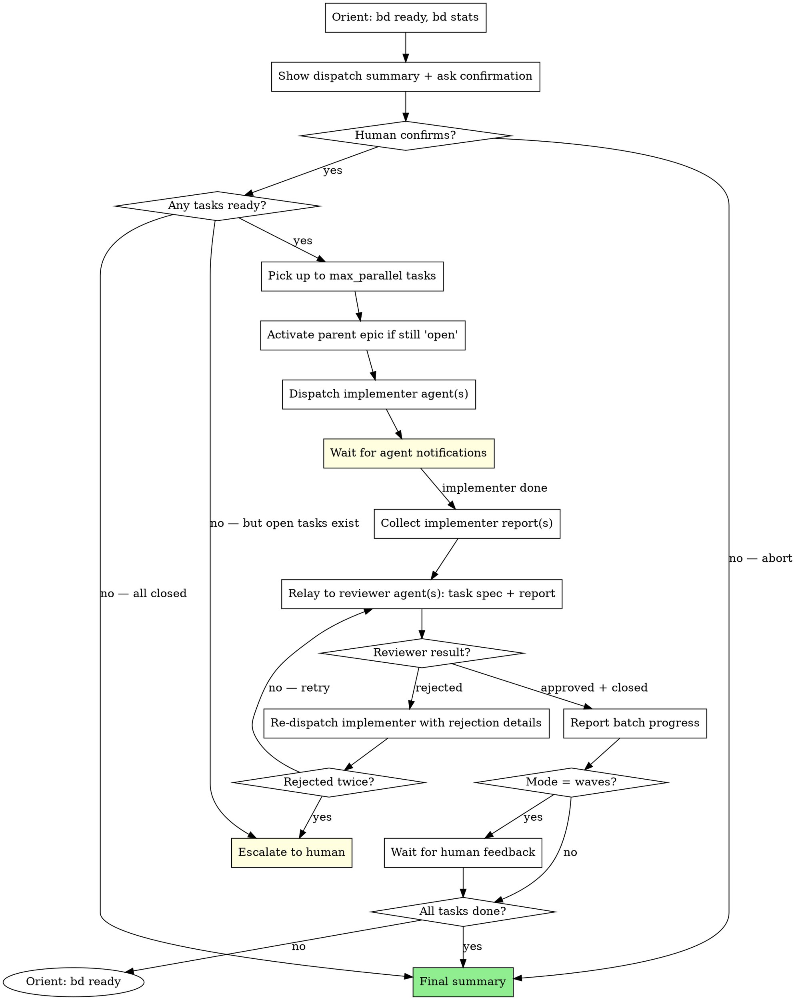

# Scrum Master — Pipeline Orchestrator

## Overview

Orchestrate bd-driven development by reading the ready queue, applying the runtime adapter gate, and tracking pipeline progress. The orchestrator dispatches implementer workers and relays their reports to reviewer workers; the runtime-specific command for each step comes from the operation binding, never from this skill body.

**Core principle:** You are a task dispatcher that stays on main. Your domain is bd. You never touch code, git, worktrees, or files. You read the board, dispatch workers (operation: dispatch — no isolation mode that hides the worktree behind an opaque path; implementers create their own worktree at `bd-<id>.<N>` so dir name matches branch name), relay information, and track progress. You do not claim a worker was dispatched unless the runtime's own binding cell was actually invoked. Reviewers verify and per-task land via work-audit → work-merge.

**Announce at start:** "I'm using the plan-scrum-master skill to orchestrate the pipeline."

## Execution Model

### Runtime adapter gate

Follow the shared runtime-selection contract in
`../meta-patterns/runtime-adapter.md` before dispatching work. Every step
below names one of the seven operations in that file's `## operation
binding` — *dispatch*, *send work*, *await*, *reject/resume*, *accept and
clean*, *tear down*, *inspect* — and the runtime-specific command for that
operation lives only in the binding's row, never restated here.

The main Claude session is the scrum-master when Claude's native surface is
selected — the user invokes the skill directly (`/plan-dispatch-fnf` or
equivalent) and talks to the orchestrator as themselves. Workers (implementers
+ reviewers) are *dispatched* as **named** workers — `impl-<bd-id>` for
implementers, `rev-<bd-id>` for reviewers — and that name is the address used
for every later operation on that worker (*send work*, *reject/resume*,
*tear down*, *inspect*). Every dispatch uses no isolation mode that hides the
worktree behind an opaque path: each implementer creates its own worktree at
`bd-<id>.<N>` as part of work-do Step 2, so dir name matches branch name and
the cleanup sweeps can map dir → task mechanically. The orchestrator reacts to
the *await* notification; it does not poll or sleep.

If the runtime selected has no equivalent for an operation this skill needs,
stop with `unsupported-runtime` and name the missing operation — do not fall
through to a partial pipeline or claim a worker was dispatched when the
binding cell for this runtime cannot fill the request.

##### Transport boundary (binds any adapter that uses tmux as a process host)

[[ft014]] hosts Pi workers as named windows in an existing linked tmux project
group. Tmux is the display and process host and nothing more. It is **not** the
bus: no adapter may use `tmux send-keys`, `tmux wait-for`, pane or window
options, or `display-message` to carry a message, a completion signal, a status,
or any coordination state.

The shortcut is tempting because both verbs appear to work — `wait-for` really
does block until a worker signals, `send-keys` really does deliver a string.
Neither can be versioned, sequenced, addressed, or replayed after a crash, and
`send-keys` types its text into whatever now occupies a stale target: a shell, a
different Pi session, somebody's editor. Messages travel only as versioned JSON
envelopes under `$XDG_RUNTIME_DIR/infinifu-worker/<run-id>/<worker-uid>/`.

Legitimate tmux calls are window and process lifecycle only — `new-window`,
`list-windows`, `kill-window`. Completion is never inferred from an idle prompt,
an exited pane, or assistant prose; a worker that settles without writing a
typed result envelope is recorded as `protocol_error`, never as complete.
Missing process, bus, or transcript evidence yields `unknown`, which is an
observation and never licenses stopping, accepting, or deleting anything
([[adr0017]]).

##### Operation semantics that hold regardless of runtime

Once [[ft014]] or the equivalent worker surface is installed, the full
implementer → reviewer → merge loop runs the same way on every runtime this
skill supports; only the concrete command per operation differs, and that
command lives solely in `../meta-patterns/runtime-adapter.md`'s
`## operation binding`. A few process rules hold on every runtime regardless
of which cell fired:

- **Reject/resume reaches the ORIGINAL worker, never a fresh one.** It
  delivers the feedback to the same session, same worktree, same context —
  a redispatch is a different operation (*dispatch*) and is not what
  *reject/resume* means. Step 5 below relies on this.
- **A completed worker stays inspectable until accepted.** *await* returning
  a result does not by itself remove the worktree or close anything out —
  *accept and clean* is a separate operation, run only after the merge has
  actually happened. Until then a reviewer can still read the live worktree
  and transcript.
- **The second rejection on the same task always escalates to the human.**
  That count is read from the bd task's own evidence (Step 5), never
  reconstructed from transport or session state.
- **Automatic *tear down* is scoped to workers this orchestrator itself
  spawned** — never a worker it merely observes, per [[adr0017]].
- **Missing evidence about a worker is not permission to act on it.** A
  worker with no discoverable identity is refused by name, and that refusal
  never licenses stopping, accepting, or deleting anything ([[adr0017]]).

##### Brainstorm stage: a worker that consults the human, not the dispatcher

Not every worker executes a bd task. Some are spawned to have a conversation
— design review, requirements gathering, "what should this API look like" —
where the human is the counterparty and the dispatcher must not relay a
single word of it. The transport must let such a worker's report reach a
dispatcher who is not sitting there polling.

Dispatch it exactly like an implementer (operation: *dispatch*), with two
differences: an isolation mode scoped to the current session rather than a
disposable worktree (see "Known Issues" in `references/architecture.md` if
that seems backwards — nothing about a conversation belongs in a throwaway
worktree), and the work handed over (operation: *send work*) is the
brainstorm-stage instruction in full — see `references/brainstorm-stage.md`
for the instruction text itself and what it must and must not let the agent
decide alone.

*Await* returns nothing while the human and the worker are still talking —
that silence is correct, not a failure, and asking again costs nothing. When
the worker judges the conversation finished, *await* returns its typed
result: `status`, `summary`, and how it was validated.

The dispatcher reads `status`/`summary` off that result and proceeds — no
human relayed anything, and none of the reading requires inferring completion
from a transcript or a prompt going idle ([[adr0027]]). A `status` other than
`complete` (`blocked`, `waiting_human`, `failed`) means proceed no further
than reporting it onward; see `references/brainstorm-stage.md` for what each
one means for a brainstorm specifically. A brainstorm worker never claims a
bd task, so any instruction elsewhere in this skill that assumes "the task"
does not apply to it.

For the rationale (why a wrapper agent cannot do this) and the full Claude
dispatch contract, see `references/architecture.md`.

## Prerequisites

Two mandatory gates must have been passed:

1. **⛔ Spec approved by user** — the spec/plan document was reviewed and explicitly approved.
2. **⛔ bd tasks approved by user** — the bd task list was reviewed and explicitly approved.

If either gate was not passed, STOP and go back. Starting execution before both approvals means the agents will burn tokens on work the human has not yet sanctioned.

Additionally:
- bd tasks are created with designs and dependencies.
- `bd ready` returns at least one task.

## Configuration

Three settings, provided by the human at start. If any are missing, **ask** — but offer the defaults below as the "use defaults" option. The defaults are tuned for a typical session: moderate parallelism, only halt on real problems, cheap model first with automatic escalation on failure.

| Setting | Default | Options |
|---------|---------|---------|
| `max_parallel` | **2** | 1, 2, 3, ... N, or `all` |
| `mode` | **only-blockers** | `auto`, `waves`, `only-blockers` — see `references/modes.md` |
| `worker_model` | **sonnet** | `opus`, `sonnet`, `haiku`, `auto` — see `references/worker-models.md` |

### Failure-escalation rule (always on)

When `worker_model` is `sonnet` or `haiku`, the scrum-master **upgrades the model on retry** after any of: implementer error/timeout, first reviewer rejection, or implementer `blocked` status. The retry uses `opus` regardless of the configured `worker_model`. Rationale: the cheap model gets one fair attempt; if it fails, throwing more capability at the problem is usually faster than the human debugging why it stumbled.

The upgrade applies only to the *retry* dispatch — subsequent tasks return to the configured `worker_model`. If `worker_model` is already `opus` or `auto`, no upgrade is needed.

Always echo the chosen settings (and the escalation rule) in the dispatch summary so the human can override before confirming.

## Multi-Epic Parallelism

When multiple epics have ready tasks, tasks from different epics can run in parallel **only if they don't touch overlapping files or directories**. Run an interference check: read each epic's spec, compare file paths, and group non-interfering epics for parallel dispatch. If unsure, ask the human — guessing here causes merge conflicts in worktrees.

For the full rule set + examples, see `references/multi-epic.md`. Present the interference assessment in every dispatch summary (write `n/a — single epic` when only one is active).

## State Machine

### Task state (scrum-master observes, agents perform)

```
open → in_progress    Implementer agent (claims the task)
in_progress → closed  Reviewer agent (verifies, merges, and closes)
in_progress → blocked Implementer agent (needs info, can't proceed)
```

### Epic state (scrum-master owns open → in_progress + P2 → P1)

```
open → in_progress    Scrum-master (on first task dispatch of this epic)
in_progress → closed  spec-retro skill (after merge / PR)
```

**Priority also escalates on dispatch:** epic and all child tasks go from P2 → P1 (actively in flight). See "Activate the epic" in Step 3 for commands.

**Why scrum-master owns the activation:** dispatch is the moment work starts — the state flips from "planned and waiting" to "in flight." Status `in_progress` and priority `P1` both encode that. Nobody else is watching for this moment: `spec-ready` sets up the P2/open snapshot and walks away, `work-do` only touches its own task, `work-audit` closes individual tasks, and `spec-retro` runs much later at delivery time. The scrum-master is the first actor that "knows" the epic is alive.

**When to transition:** right before dispatching the first implementer for a task whose parent epic is still `open` / P2. Run the `bd update` commands before dispatching. If the epic is already `in_progress` / P1 from a previous session, leave it alone.

**Epic close stays with spec-retro** — do NOT close epics from this skill. The retro step validates the work, writes the learning notes, and archives the spec. Closing early would skip that.

### Full lifecycle priority map

| Stage | Skill | Epic priority | Epic status | Child tasks |
|-------|-------|---------------|-------------|-------------|
| Idea | `idea-brainstorming` | P4 | open | — |
| Spec | `spec-writing` | P3 | open | — |
| Ready | `spec-ready` | P2 | open | P2 / open |
| **Dispatched** | **`plan-scrum-master`** | **P1** | **in_progress** | **P1** |
| Retro | `spec-retro` | — | closed | (already closed by work-audit) |

## The Process


```dot
digraph scrum_master {
    rankdir=TB;

    "Orient: bd ready, bd stats" [shape=box];
    "Show dispatch summary + ask confirmation" [shape=box];
    "Human confirms?" [shape=diamond];
    "Any tasks ready?" [shape=diamond];
    "Pick up to max_parallel tasks" [shape=box];
    "Dispatch implementer agent(s)" [shape=box];
    "Collect implementer report(s)" [shape=box];
    "Relay to reviewer agent(s): task spec + report" [shape=box];
    "Reviewer result?" [shape=diamond];
    "Re-dispatch implementer with rejection details" [shape=box];
    "Rejected twice?" [shape=diamond];
    "Escalate to human" [shape=box style=filled fillcolor=lightyellow];
    "Report batch progress" [shape=box];
    "Mode = waves?" [shape=diamond];
    "Wait for human feedback" [shape=box];
    "All tasks done?" [shape=diamond];
    "Final summary" [shape=box style=filled fillcolor=lightgreen];

    "Orient: bd ready, bd stats" -> "Show dispatch summary + ask confirmation";
    "Show dispatch summary + ask confirmation" -> "Human confirms?";
    "Human confirms?" -> "Any tasks ready?" [label="yes"];
    "Human confirms?" -> "Final summary" [label="no — abort"];
    "Any tasks ready?" -> "Pick up to max_parallel tasks" [label="yes"];
    "Any tasks ready?" -> "Final summary" [label="no — all closed"];
    "Any tasks ready?" -> "Escalate to human" [label="no — but open tasks exist"];
    "Pick up to max_parallel tasks" -> "Activate parent epic if still 'open'";
    "Activate parent epic if still 'open'" [shape=box];
    "Activate parent epic if still 'open'" -> "Dispatch implementer agent(s)";
    "Dispatch implementer agent(s)" -> "Wait for agent notifications";
    "Wait for agent notifications" [shape=box style=filled fillcolor=lightyellow];
    "Wait for agent notifications" -> "Collect implementer report(s)" [label="implementer done"];
    "Collect implementer report(s)" -> "Relay to reviewer agent(s): task spec + report";
    "Relay to reviewer agent(s): task spec + report" -> "Reviewer result?";
    "Reviewer result?" -> "Report batch progress" [label="approved + closed"];
    "Reviewer result?" -> "Re-dispatch implementer with rejection details" [label="rejected"];
    "Re-dispatch implementer with rejection details" -> "Rejected twice?";
    "Rejected twice?" -> "Relay to reviewer agent(s): task spec + report" [label="no — retry"];
    "Rejected twice?" -> "Escalate to human" [label="yes"];
    "Report batch progress" -> "Mode = waves?";
    "Mode = waves?" -> "Wait for human feedback" [label="yes"];
    "Mode = waves?" -> "All tasks done?" [label="no"];
    "Wait for human feedback" -> "All tasks done?";
    "All tasks done?" -> "Orient: bd ready" [label="no"];
    "All tasks done?" -> "Final summary" [label="yes"];
}
```

## Step 1: Orient

```bash
bd ready                              # What's available?
bd list --type epic --status open     # Which epics are active?
bd list --status in_progress          # Anything mid-flight from previous session?
bd stats                              # Overall picture
```

If `in_progress` tasks exist from a previous session, escalate to human — ask whether to resume or reset them. Do not silently retry; a stale `in_progress` may mean the previous agent crashed mid-merge and the worktree is in an unknown state.

**Multiple epics:** If more than one epic has ready tasks, perform the interference check (`references/multi-epic.md`). Group non-interfering epics for parallel dispatch.

## Step 2: Dispatch Summary

Before dispatching anything, present a summary to the human and ask for confirmation:

```
━━━━━━━━━━━━━━━━━━━━━━━━━━━━━━━━━━━━━━━
  DISPATCH SUMMARY
━━━━━━━━━━━━━━━━━━━━━━━━━━━━━━━━━━━━━━━

Board:
  Total tasks:    X
  Ready:          Y
  In progress:    Z
  Blocked:        W
  Closed:         V

Active epics:
  bd-AAAA: [epic title]  — targets: app/auth/, app/models/user.ts
  bd-BBBB: [epic title]  — targets: app/billing/, app/models/invoice.ts

Interference:
  bd-AAAA ↔ bd-BBBB: NONE — can parallel
  (or: CONFLICT on app/shared/config.ts — must serialize)
  (or: n/a — single epic)

Ready queue:
  [bd-AAAA] bd-XXXX: [title]
  [bd-AAAA] bd-YYYY: [title]
  [bd-BBBB] bd-ZZZZ: [title]

Dependencies:
  [summary of key chains — use `bd list --parent <epic-id>` for the child list
   and `bd dep tree <task-id> --direction=both` for per-task view]

Config:
  max_parallel:   N                  (default 2)
  mode:           only-blockers      (default — pause on failures only)
  worker_model:   sonnet             (default; opus on retry after any failure)

First batch (up to max_parallel):
  → bd-XXXX: [title]  (epic bd-AAAA)  model: sonnet  [default — retry will upgrade to opus]
  → bd-ZZZZ: [title]  (epic bd-BBBB)  model: sonnet  [default — retry will upgrade to opus]

Proceed? (yes / adjust config / abort)
```

Wait for human confirmation before dispatching. The human may adjust `max_parallel`, `mode`, or ask to skip/reorder tasks.

## Step 3: Dispatch Implementers

Pick up to `max_parallel` tasks from `bd ready`. When multiple non-interfering epics are active, mix tasks from different epics in the same batch.

### Activate the epic (first task only)

Before dispatching the first task of an epic, transition the epic to `in_progress` and bump priority to P1 — both the epic and all its child tasks go to P1 to signal "actively in flight":

```bash
bd show <epic-id>                                # Check current status + priority
bd update <epic-id> --status in_progress --priority 1    # Only if still 'open' / P2

# Bump all child tasks to P1 in one pass
bd list --parent <epic-id> --status open --json | jq -r '.[].id' \
  | xargs -I{} bd update {} --priority 1
```

**Why P1 for both epic and child tasks:** priority tracks lifecycle commitment (P4 idea → P3 spec → P2 ready → P1 in flight). Bumping the whole subtree to P1 on dispatch means `bd list --priority 1` surfaces exactly what is being worked on *right now*. If tasks stay at P2 after dispatch, the priority field loses its signal.

Skip this if the epic is already `in_progress` / P1 (e.g., resumed session). Do this once per epic, not per task. If some child tasks already have a higher-priority override (P0 — urgent), leave those alone.

### Dispatch the task

For each task, run `bd show <id>` and dispatch (operation binding row
`dispatch`) a named worker `impl-<bd-id>`, using no isolation mode that hides
the worktree behind an opaque path — the implementer creates its own worktree
at the right name per work-do Step 2. The dispatch payload contains:

1. **Task ID and title**
2. **Full design text** from `bd show` (paste it — don't make agent query bd)
3. **Context** — what tasks were recently completed, what else is in the pipeline
4. **Branch + worktree name to use:** both `bd-<id>.<N>`. `<N>` is the iteration computed by work-do's picker (`.0` on first attempt, increment on retry). Path = `$AKM_ROOT/.worktrees/bd-<id>.<N>`. The implementer creates the worktree itself with `git worktree add` so the dir name matches the branch name — work-merge and the spec-retro safety-net sweep both key off `bd-<id>` branches, and the matching dir name makes `git worktree list` self-documenting.
5. **Mandatory rule:** "NEVER use `cd path && command` in bash — always use absolute paths. `cd &&` triggers user confirmation prompts that block background agents."

**The implementer is responsible for:**
- Claiming the task: `bd update <id> --status in_progress`
- **Creating its own worktree** at `$AKM_ROOT/.worktrees/bd-<id>.<N>` on branch `bd-<id>.<N>` via `git worktree add` (per work-do Step 2). Do NOT rely on `isolation: "worktree"` — opaque dir names break the dir-to-task mapping the cleanup sweeps depend on.
- `cd` into the newly-created worktree; do all work there
- Implementing, testing, committing in the worktree
- Do NOT merge — reviewer will handle that
- Reporting back: what it did, branch name (`bd-<id>.<N>`), absolute worktree path, test results, concerns
- Marking blocked if it can't proceed: `bd update <id> --status blocked`
- **NEVER use `cd ... &&` in bash commands** — use absolute paths instead (triggers extra user confirmation, breaks background flow)

Dispatch up to `max_parallel` workers in a single batch, each with its own
name. Do NOT poll or sleep — you will be automatically notified when each
worker completes (operation: *await*). While waiting, you may report status
or respond to the human. `max_parallel`, `mode` (waves / blockers-only /
auto), and `worker_model` apply exactly the same way regardless of which
runtime's *dispatch* and *await* cells are firing — none of them is a
Claude-only or Pi-only setting.

**Save worker session metadata** after each dispatch returns:
- **Worker name** (`impl-<bd-id>`) — the address for *send work*, *reject/resume*, and *tear down*. Names keep working after the worker completes; a send resumes it from its transcript.
- **Runtime worker ID** — fallback address only, for when a name was not set or a newer worker took the name (latest wins)
- **Worktree path** — for reviewers to inspect the code
- **Branch name** — for reviewers to merge

Log these to bd notes: `bd update <id> --append-notes "Agent session: [id], worktree: [path], branch: [branch]"`
(`--append-notes`, not `--notes` — a retry dispatch's own session metadata must
not erase the first attempt's, and `--notes` replaces the field wholesale.)

This enables resuming agents on rejection instead of dispatching fresh ones — the original agent retains its full context.

## Step 4: Relay to Reviewer

When notified (operation: *await*) that an implementer has completed,
dispatch (operation binding row `dispatch`) a reviewer worker named
`rev-<bd-id>` running the `infinifu:code-reviewer` review:

1. **Task spec** — the original design text from bd
2. **Implementer's full report** — pass through as-is, including any metadata (paths, branches, etc.)

You do not interpret the report. You relay it. Do NOT wait for the reviewer — you will be notified when it completes. Continue processing other notifications or dispatching new implementers in the meantime.

**The reviewer is responsible for:**
- Invoking `infinifu:work-audit` against the task — that skill owns the verdict, the `bd close` on approve, and the auto-trigger of `infinifu:work-merge` for per-task local landing
- Reading actual code in the implementer's worktree as part of work-audit's evidence-gathering
- **work-audit on APPROVED auto-fires work-merge**, which: merges `bd-<id>` into base locally with `--no-ff`, runs the post-merge test gate, removes the worktree + local branch, and (if this was the last open child of the epic) flips the AKM lifecycle + moves board→archive + closes the bd epic. All local — no push. spec-retro syncs to remote later.
- Closing the task happens inside work-audit (`bd close <id> --reason "AUDITED: APPROVED ..."`); reviewer does not call `bd close` directly
- **NEVER use `cd ... &&` in bash commands** — use absolute paths instead (triggers extra user confirmation, breaks background flow)
- If rejected (verdict from work-audit OR `POST-MERGE FAIL` from work-merge converted back to rejection):
  - work-audit / work-merge already updated bd notes with `Gaps:` or `POST-MERGE FAIL:` evidence
  - Reporting the rejection details (gaps, requested action) to scrum master so the implementer can be re-dispatched

## Step 5: Handle Rejections and Failures

The retry rule covers three failure modes: reviewer rejection, implementer error/timeout, and implementer-reported `blocked`. All three follow the same escalation pattern.

**Which attempt this is comes from `bd`, not from this session's own memory.**
A reviewer rejection is counted by work-audit's own durable counter
(`metadata.rejection_count`, bumped via `--set-metadata` on every REJECTED
verdict — see work-audit's "Counting rejections"). For an implementer
error/timeout or a `blocked` report, where work-audit is never invoked, bump
the same field yourself before deciding:

```bash
COUNT=$(bd show <id> --json | jq -r '.[0].metadata.rejection_count // 0')
NEXT=$((COUNT + 1))
bd update <id> --set-metadata rejection_count=$NEXT
```

Reading this instead of keeping a private count matters for the same reason
work-audit switched: `bd update --notes` **replaces** the notes field, so a
count kept only in this session's memory (or reconstructed by scanning notes
text) is exactly what an intervening implementer report or a `POST-MERGE
FAIL` note silently defeats — and it is also what a restarted scrum-master
session has no way to recover at all. `metadata.rejection_count` is a
separate field nothing else touches, so both problems disappear at once.

1. **First failure (`$NEXT == 1`):**
   - If a reviewer rejection: work-audit already recorded gaps via
     `--append-notes` (never `--notes` — see its own "Counting rejections");
     also update `--design` with any new conditions.
   - If an implementer error or `blocked`: log the implementer's reason with
     `bd update <id> --append-notes "<reason>"` — `--notes` would erase
     whatever evidence is already there.
   - **Model upgrade:** if the original `worker_model` was `sonnet` or `haiku`, the retry uses `opus` (see "Failure-escalation rule" in Configuration). If it was already `opus` or `auto`, keep the same model.
   - **Resume the ORIGINAL implementer** (operation binding row
     `reject/resume`) by its saved name, passing the failure details. This
     reaches the same worker, in the same worktree, with its full context —
     never a fresh dispatch. Resume preserves cheap context; only dispatch a
     fresh worker if the original session cannot be resumed (e.g., expired)
     or the model upgrade requires a session swap across providers.
   - When notified of completion, dispatch reviewer again (also in background).
2. **Second failure on the same task (`$NEXT >= 2`):** Do not retry a third time — even automatically, even silently. Report to the human that the task needs their attention.

Log the retry decision with `--append-notes` (not `--notes`, for the same
reason as above) so a later auditor can see why the model jumped: `bd update
<id> --append-notes "Retry attempt $NEXT: upgraded sonnet → opus after
reviewer rejection"`.

## Step 6: Report

After each batch:

```
Batch N:
  ✅ bd-XXXX: [title] — [summary from report]
  ✅ bd-YYYY: [title] — [summary from report]
  ❌ bd-ZZZZ: [title] — ESCALATED: [reason]

Pipeline: X/Y tasks done | Z ready | W blocked
```

**If mode = `waves`:** Say "Ready for feedback." and wait for human input.
**If mode = `auto` or `only-blockers`:** Continue to next batch.

See `references/modes.md` for the full mode semantics.

## Step 7: Loop or Finish

- **`bd ready` returns tasks** → go to Step 3
- **All tasks closed** → report final summary and run `bd stats` (bd 1.0 auto-exports `.beads/issues.jsonl`; no separate `bd sync` needed)
- **Open tasks exist but none ready** → escalate (dependency issue or blocked tasks)

## Agent Health Monitoring

Alert the user immediately when any agent shows signs of struggling — long runtime vs peers, verbose / partial reports, self-reported uncertainty, or a `blocked` marker. Do not defer alerts to the next batch report; a stuck agent burns tokens until killed.

See `references/agent-health.md` for the full signal list and the alert template.

## Escalation Protocol

**STOP and escalate when:**
- Implementer agent fails or returns an error
- Reviewer rejects the same task twice
- Task has no design or vague design in bd
- Implementer marks task as blocked
- Agent shows signs of struggling (see `references/agent-health.md`)
- `bd ready` is empty but open tasks remain
- Any unexpected agent behavior

**Format:**
```
BLOCKED: bd-XXXX "[task title]"
Reason: [what the agent reported]
Attempts: [what was tried]
Options: [suggested next steps]
Need your decision to continue.
```

## What You Do Touch vs. What You Don't

**You own:**
- Reading the board (`bd ready`, `bd list`, `bd show`, `bd stats`)
- Epic state: `open → in_progress` on first dispatch (close is NOT yours — spec-retro handles it)
- Logging dispatch metadata to bd notes (agent id, worktree path, branch)

**You never:**
- Write code, edit files, or run tests
- Touch git, branches, worktrees, or merges — you stay on main
- Create or manage worktrees — implementer creates its own worktree per work-do Step 2 (with the matching `bd-<id>.<N>` dir name); reviewer's work-audit → work-merge handles removal on approve
- Claim or close **tasks** — implementer sets `in_progress`, reviewer closes
- Close **epics** — spec-retro owns that (after merge)
- Analyze code, detect file conflicts, or review implementations
- Decide technical approach for agents
- Interpret agent metadata — just relay it

## Integration

**Depends on:**
- **infinifu:spec-ready** — creates the bd tasks and promotes spec to ready; reference for bd commands
- **infinifu:spec-writing** — creates the plan this skill orchestrates

**Implementer agents are dispatched without `isolation: "worktree"` (they create their own worktree at `bd-<id>.<N>` per work-do Step 2) and should use:**
- **infinifu:work-do** — per-task protocol (read `bd show`, claim, implement, close with evidence, report back)
- **infinifu:domain-tdd** — invoked by work-do for RED-GREEN-REFACTOR

**Reviewer agents should use:**
- **infinifu:work-audit** — per-task verification gate. Auto-triggers work-merge on the APPROVED verdict.
- **infinifu:work-merge** (auto-triggered, not invoked directly) — per-task local land + worktree cleanup; epic finale (AKM flip + board→archive + bd close epic) on the last open child.

**After every pipeline task lands and the epic finale has fired:**
- **infinifu:spec-retro** — refreshes the AKM graph (im### body rewrite, new ADRs, ft### updates, us### drafts) and pushes everything to remote (`git push` + `bd dolt push`). work-merge stayed local; this is where remote sync happens.
