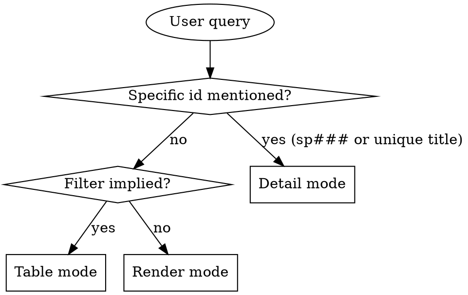

# Spec Read

## Overview

Read spec zettels under `docs/notes/spec/sp###.md` and present them in the format that best fits the user's question. Three output modes — pick one, don't combine.

Note: specs are the board-citizen AKM type. Active ones (`idea` / `spec` / `ready`) appear in [[board]]; shipped ones (`done`) appear in [[archive]]. The footer flips accordingly.

**Announce at start:** "Using spec-read skill to surface board state."

## Storage

**Backend:** AKM. Specs live in `docs/notes/spec/sp###.md` (the `spec/` subfolder under `notes/`). Schema in `docs/notes/akm.md`; this skill only needs the slice below.

If `docs/notes/spec/` does not exist or has no `sp*.md` files: tell the user "No specs found under docs/notes/spec/. Use spec-writing (via idea-brainstorming → spec-writing) to create one."

### Zettel slice this skill needs

```markdown
---
aliases:
  - <spec one-liner>
status: <idea|spec|ready|done>
created: YYYY-MM-DD
---
# Spec [[cat###]] [[board]]      ← [[board]] while active, [[archive]] when done

## solves
[[us###|<story-alias>]]

## implements
[[im###|<solution-alias>]]

## problem
<goal + motivation>

## solution
<approach + ADRs + features referenced>

## plan
<file tree, conventions, anti-patterns>

## tasks

### Task 1: <name>

#### type
<task | feature | bug>

#### effort
<Xh>

#### depends
- <task-id>

#### files_touched
- <path>

#### success_criteria
- <criterion>

#### edge_cases
- <failure mode>

#### test_plan
- <test name>

#### bd
<id>   ← attached by spec-ready

### Task 2: ...
```

**Key extraction rules:**

- `id` — filename slug (`sp001`).
- `title` — first alias.
- `categories` — H1 `[[cat###]]` wikilinks (exclude `[[board]]` / `[[archive]]`).
- `solves` — `[[us###]]` under `## solves`.
- `implements` — `[[im###]]` under `## implements`.
- `task_count` — number of `### Task N:` blocks under `## tasks`.
- `tasks_with_bd` — count of task blocks that have a `#### bd <id>` value.
- `sections_present` — which of `problem` / `solution` / `plan` / `tasks` exist. This is the lifecycle signal: `idea` has problem only, `spec` adds solution, `ready` adds plan + tasks.

Omit silently for missing sections.

## Mode Selection



### Detail mode triggers
- Query contains `sp###` (case-insensitive).
- "show me sp012", "what's in the auth spec".

### Table mode triggers
- Status filters: `idea`, `spec`, `ready`, `done` (or aliases: "in flight", "shipped").
- By story: "specs for us007".
- By implementation: "specs implementing im013".
- By category: "specs in cat002".
- Keyword search: "specs about caching".

### Render mode triggers
- "Show me the board", "what's in flight", "print all active specs".
- "What shipped" → render with status=done filter (effectively the archive view).
- No filter and no id.

## Reading the zettels

1. List ids: `ls docs/notes/spec/sp*.md`.
2. Per mode:
   - **Detail** — single file.
   - **Table** — `head -40` is enough (frontmatter + H1 + `## solves` + `## implements` + count of `### Task` lines).
   - **Render** — full read, including task blocks.

For task counts under table mode, `grep -c '^### Task' <file>` is the cheapest measure.

## Mode 1: Detail

```markdown
## [id] — [title]

**Solves:** [us### — story-alias]    **Implements:** [im### — solution-alias]
**Status:** [status]    **Categories:** [cat001, cat002]    **Created:** [created]

**Problem:** [problem paragraph]

**Solution:** [solution paragraph]    *(if present)*

**Plan:** [plan paragraph]    *(if present)*

**Tasks (N total, M with bd ids):**

| # | name | effort | bd | status |
|---|------|--------|----|--------|
| 1 | <task-name> | 4h | bd-123 | open |
| 2 | <task-name> | 6h | (none) | — |

To see a single task block in full (success_criteria / edge_cases / test_plan), open `docs/notes/spec/[id].md` directly.

**Lifecycle signal:** sections present = [problem, solution, plan, tasks] → status should be `ready`. If sections and status disagree, flag it.
```

For bd status, run `bd show <id>` per task only if the user asks; otherwise just list the id. Don't fan out automatically.

If id not found: "Spec `sp012` not found. Closest matches: ..." with 1-3 candidates.

## Mode 2: Table

| id | status | solves | implements | title | tasks |

Sort by id ascending. The `tasks` column shows `M/N` where N is total task blocks and M is count with bd ids.

After the table: `N specs matched (X idea, Y spec, Z ready, W done).` Omit zero buckets.

For "what shipped this quarter" style queries, add a `created` column and sort by `created` descending instead.

## Mode 3: Render

Grouped by status: `idea` → `spec` → `ready` → `done`. Within each group sort by id ascending.

```markdown
# Board State

## Idea (N)

### sp001 — multi-vault search
**Solves:** us005    **Implements:** im007    **Categories:** cat002

**Problem:** ...

## Spec (N)

### sp002 — ...
**Problem:** ...

**Solution:** ...

## Ready (N)

### sp003 — ...
**Tasks:** 5 (5 with bd ids: bd-101 → bd-105)

## Done (N)     ← effectively the archive view; omit if no status filter or if user asked for active only
```

End: `Total: N specs (X idea, Y spec, Z ready, W done).` Omit zero buckets.

## Filter Parsing

| User says | Match against |
|---|---|
| "idea stage", "captured" | `status: idea` |
| "in spec", "being shaped", "designing" | `status: spec` |
| "ready", "queued", "ready to start" | `status: ready` |
| "done", "shipped", "merged", "finished" | `status: done` |
| "in flight", "active", "not done" | status ∈ {idea, spec, ready} |
| "for us###", "story X" | `solves` contains the story id |
| "implements im###", "implementing X" | `implements` contains the implementation id |
| "in cat###", "category X" | H1 contains the category id |
| "about X", "covering Y" | any text field (title, problem, solution, plan, task names) |

Multiple filters compose with AND.

## Quick aliases

The board and archive hubs are also valid entry points:

- "what's on the board" → equivalent to render with filter `status ∈ {idea, spec, ready}`. You can also literally read `docs/board.md` to get the curated list — but the source of truth is `sp*.md` frontmatter.
- "what's in the archive" / "what shipped" → render with `status: done`. Source of truth is `sp*.md`; `docs/archive.md` is the curated hub.

When `docs/board.md` or `docs/archive.md` disagrees with `sp*.md` status, trust the zettels and surface the drift in a one-line note.

## What This Skill Does NOT Do

- It does not modify specs. To flip status / add solution / add tasks, use the corresponding lifecycle skill (`spec-writing`, `spec-refinement`, `spec-ready`, `work-merge`).
- It does not run bd commands for the listed tasks. It only reports the `#### bd <id>` annotations as-recorded.
- It does not move files between `docs/notes/spec/` and an archive location. Specs live in one place; only the footer and status field flip when archived.

## When to Defer to Other Skills

- Create a new spec → `idea-brainstorming` (start at idea) → `spec-writing` → `spec-refinement` → `spec-ready`.
- See full task detail (success_criteria / edge_cases / test_plan) for one task → open the file directly or use `bd show <id>`.
- See the bd queue under a spec → `bd ready` or `bd list --parent <epic-id>`.
- Find the story behind a spec → `story-read` with the `solves` id.
- Find the implementation card behind a spec → `implementation-read` with the `implements` id.
