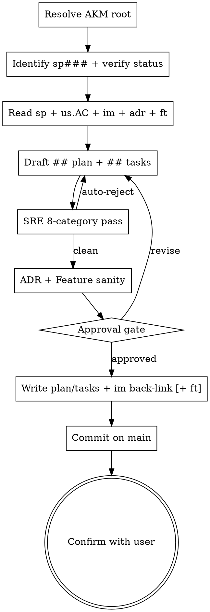

# Spec Refinement (## solution → ## plan + ## tasks)

## Overview

Stage 3 of the AKM lifecycle. A spec is at `status: spec` with `## solution` populated. The user wants the plan + task breakdown that makes the solution executable. This is the SRE pass: junior engineer must be able to pick up any single task and ship it with zero questions.

**Three deliverables, all on the spec file:**

1. **`## plan`** — file tree, conventions, anti-patterns, known limitations. The execution context every task inherits.
2. **`## tasks`** — H3 per task (`### Task N: <name>`) with H4 properties (`#### type`, `#### effort`, `#### depends`, `#### files_touched`, `#### success_criteria`, `#### edge_cases`, `#### test_plan`). No `#### bd` ids — those land in `spec-ready`.
3. **Sanity check** against binding `[[adr####]]` and consumed `[[ft###]]` — the solution shape from stage 2 was a *proposal*; here we verify the breakdown actually respects every ADR's `## decision` and matches every Feature's `## api_surface`. Find conflicts now, before tasks ship.
4. **Finalize `## specs` back-link on the consumed `[[im###]]`** — close the graph so `spec-retro` can find the trail.

**Out of scope (deliberately deferred):**

- bd epic / task creation → `spec-ready`
- Status promotion `spec → ready` → `spec-ready`
- `board.md` move `## spec → ## ready` → `spec-ready`
- Minting a new `im###` from scratch → that happened upstream; this skill only finalizes the back-link

**Announce at start:** "Using spec-refinement skill — SRE 8-category pass + ADR/Feature sanity."

## AKM Workspace Resolution

Specs, implementations, and features live on **main**, even from a feature-branch worktree. Resolve before any file op:

```bash
AKM_ROOT="$(akm-root)"
```

`akm-root` returns the main-worktree path (default branch); outside git, cwd. Anchor every path on `$AKM_ROOT` (`$AKM_ROOT/docs/notes/spec/sp###.md`, `$AKM_ROOT/docs/notes/im###.md`, `$AKM_ROOT/docs/notes/ft###.md`, `$AKM_ROOT/docs/notes/us###.md`). If `akm-root` errors, surface its stderr and abort — never silently land refinement mutations on the feature branch.

**Commit policy: commit on transition.** Spec-refinement finalizes the implementation card and (occasionally) mints a new feature — both are stable artifacts. The idea-then-spec lineage was already committed by spec-writing, so this commit covers **only this skill's writes**:

```bash
git -C "$AKM_ROOT" add docs/notes/spec/sp<NNN>.md docs/notes/im<NNN>.md
# add docs/notes/ft<NNN>.md too if a Feature was minted/widened during refinement
git -C "$AKM_ROOT" commit -m "feat(akm): refine sp<NNN> with im<NNN>"
```

Append ` + ft<NNN>` to the message when a Feature is part of the commit. See the per-stage commit table in `docs/notes/akm.md#workspace-resolution`.

## AKM hooks

Stage 3 of the AKM lifecycle (see `claude/akm/akm-lifecycle.md`). Lifecycle goal: ensure deliverable workable — SRE 8-category pass.

**Reads** (per lifecycle contract):

- `sp###` — target spec at `status: spec`. Read frontmatter, `## solves [[us###]]`, `## solution`, the H1 categories.
- `us###` — re-read source story's `## acceptance_criteria`. Every task's `#### success_criteria` should map to one or more AC. (Reading the story is required to validate that the breakdown actually delivers AC, not invented criteria.)
- `im###` — the implementation card this spec implements. Its `## approach`, `## features`, `## components` constrain the breakdown. Finalize `## specs` back-link.
- `adr####` (`adr-read --category <picks>`) — every `Accepted` ADR under the spec's categories. The task list must not violate any `## decision`; if it does, name a supersession candidate (do not silently violate).
- `ft###` (`feature-read`) — every `[[ft###]]` listed in the spec's `## solution`. Each task that consumes a feature must call its `## api_surface` exactly; document any deviation as a Feature-extension request.

**Writes** (all paths anchored on `$AKM_ROOT`):

- `$AKM_ROOT/docs/notes/spec/sp###.md` — append `## plan` + `## tasks`. **Reference discipline:** every consumed feature, binding ADR, category, and source us appears as a wikilink in `## plan` or in the relevant task's H4 properties.
- `$AKM_ROOT/docs/notes/im###.md` — append the back-link `## specs - [[sp###]]` so the graph closes. May also widen `## components` / `## data_model` / `## api_surface` if the SRE pass revealed concrete deltas.
- `$AKM_ROOT/docs/notes/ft###.md` — optional. Only if the Feature-sanity pass surfaced a genuine extension that the user approved minting (or widening an existing `ft###`) here rather than routing through `idea-extend`.

## SRE 8-category checklist (applied to every `### Task N`)

| # | Category | Key questions | Auto-reject if |
|---|---|---|---|
| 1 | Granularity | Each task 4-8h? Phases ≤16h? | Any task >16h with no breakdown |
| 2 | Implementability | Junior can execute without questions? File paths explicit? | Vague language, "implement properly" |
| 3 | Success criteria | 3+ measurable criteria per task? Tied to a `us###.AC` line? | Subjective criteria ("works well"); no AC link |
| 4 | Dependencies | `#### depends` correctly references earlier task ids? No cycles? | Circular deps; missing prerequisite |
| 5 | Safety standards | `#### anti-patterns` or `## plan` anti-patterns section present? Error handling explicit? | No anti-patterns; raw unwrap/panic allowed |
| 6 | Edge cases | Empty input? Unicode? Concurrency? Failures? | No `#### edge_cases` content |
| 7 | Red flags | Placeholder text? "[detailed above]"? "TODO" in the spec? | Any placeholder found |
| 8 | Test meaningfulness | Tests catch real bugs? Not tautological? Per-test scenario named? | Tests verify syntax/existence only; "test_basic" |

**Reject the breakdown** if any auto-reject row trips on any task. Rewriting in place is cheaper than shipping a broken task list.

## ADR / Feature sanity (after SRE pass)

After the 8-category pass produces a clean breakdown, run two cross-cutting sanity checks:

### ADR sanity

For every `Accepted` `[[adr####]]` whose category overlaps the spec's H1 categories:

- Re-read the ADR's `## decision` and `## consequences`.
- Walk every task in the breakdown; flag any task whose chosen approach contradicts the decision.
- If the spec genuinely needs to overturn an ADR, the breakdown must include a Task: "File new ADR superseding [[adr####]]" before any task that depends on the new direction. Silent violation = ship-blocker.

### Feature sanity

For every `[[ft###]]` consumed (per the spec's `## solution`):

- Re-read the Feature's `## api_surface`. Tasks that call it must match the surface exactly (function names, payload shapes, return types).
- Re-read the Feature's `## providing` paragraph. If the spec uses the feature in a way that isn't in `## providing`, that's a *Feature extension* — call it out as a separate task that goes through `idea-extend` on that `ft###` first.
- Re-read `## data_model`. Tasks that mutate the feature's owned state need explicit coordination (lock, transaction, idempotency); flag if missing.

## Flow



## Entry-specific checklist

1. **Resolve AKM root.** `AKM_ROOT="$(akm-root)"` — every subsequent path anchors on it. Abort with the helper's stderr if it errors.
2. **Identify target spec.** User names a `sp###`. Verify `$AKM_ROOT/docs/notes/spec/sp###.md` exists.
3. **Verify status.** Must be `status: spec`. Apply Disambiguation if not.
4. **Read the spec body** — `## solves`, `## solution`, H1 categories.
5. **Re-read source `us###.acceptance_criteria`** from `$AKM_ROOT/docs/notes/us<NNN>.md`. Every task's success criteria will map here.
6. **Read consumed `[[im###]]`** from `$AKM_ROOT/docs/notes/im<NNN>.md` — `## approach`, `## features`, `## components` constrain the breakdown.
7. **Survey ADRs** under the spec's categories (`$AKM_ROOT/docs/notes/adr*.md`). Note `Accepted` decisions that bind.
8. **Survey Features** in `## solution` (`$AKM_ROOT/docs/notes/ft*.md`). Note `## api_surface` + `## providing` per feature.
9. **Draft `## plan`** — file tree, conventions, anti-patterns, known limitations.
10. **Draft `## tasks`** — H3 per task with the H4 property set (`type`, `effort`, `depends`, `files_touched`, `success_criteria`, `edge_cases`, `test_plan`). No bd ids.
11. **Apply SRE 8-category pass** to every task. Reject and rewrite if any auto-reject row trips.
12. **ADR sanity pass.** Flag any conflict; add supersession task if needed.
13. **Feature sanity pass.** Flag api-surface mismatches; route Feature extensions through `idea-extend` (or, if minor and user-approved, widen the `ft###` in place and include it in the commit).
14. **Surface as design-approval gate** to the user — the breakdown is a commitment, not a proposal. User approves before continuing.
15. **On approval:** write `## plan` + `## tasks` into `$AKM_ROOT/docs/notes/spec/sp<NNN>.md`; append `## specs - [[sp###]]` to `$AKM_ROOT/docs/notes/im<NNN>.md`; if Feature widening happened, write the updated `$AKM_ROOT/docs/notes/ft<NNN>.md` too.
16. **Commit on main.** Only this skill's writes are in scope — the idea-then-spec lineage was already committed by spec-writing:
    ```bash
    git -C "$AKM_ROOT" add docs/notes/spec/sp<NNN>.md docs/notes/im<NNN>.md
    # add docs/notes/ft<NNN>.md too if a Feature was minted/widened
    git -C "$AKM_ROOT" commit -m "feat(akm): refine sp<NNN> with im<NNN>"
    ```
    Append ` + ft<NNN>` to the message when a Feature is in the commit.
17. **Confirm.** Show: spec id + absolute path under `$AKM_ROOT`, im### back-link landed, any ft### touched, commit sha on main. Ask once: "Anything to revise?"

## Verification

Before reporting complete:

- [ ] Every file path written/read is under `$AKM_ROOT` (resolved via `akm-root`, not the current cwd)
- [ ] `sp###.md` has `## plan` + `## tasks` populated; every task's H4 properties present (`type`, `effort`, `depends`, `files_touched`, `success_criteria`, `edge_cases`, `test_plan`); no `#### bd` ids
- [ ] SRE 8-category pass clean on every task; no auto-reject row trips
- [ ] ADR sanity: no task silently violates an `Accepted` `[[adr####]]`; supersession task filed if conflict named
- [ ] Feature sanity: every consumed `[[ft###]]` matches its `## api_surface`; extensions routed via `idea-extend` or widened in-commit
- [ ] `im###.md` has `## specs - [[sp###]]` back-link appended
- [ ] If a Feature was widened in-place, `ft###.md` updated and included in the commit
- [ ] `sp###.status` still `spec` (status promotion belongs to spec-ready)
- [ ] `board.md` untouched (board move belongs to spec-ready)
- [ ] `git log -1` on main shows a new commit titled `feat(akm): refine sp<NNN> with im<NNN>` (with `+ ft<NNN>` if applicable)
- [ ] Confirmation surfaces the absolute `$AKM_ROOT/docs/notes/spec/sp<NNN>.md` path so the user sees where it landed from a worktree

## Disambiguation

- **`sp###` does not exist** → block. Route to an idea-* skill or spec-writing depending on where the gap is.
- **`sp###` at `status: idea`** → no solution chosen yet. Route to `spec-writing`.
- **`sp###` at `status: ready`** → already refined and queued. Route to `work-do` (or `spec-retro` after merge).
- **`sp###` at `status: done`** → shipped. Nothing to refine.
- **`sp###` at `status: spec` but `## solution` missing/empty** → block. Route back to `spec-writing` to populate solution first.
- **Source `us###.AC` empty or vague** → block. Route back to `idea-implement` / `idea-extend` for AC refinement. Tasks cannot map to AC that don't exist.
- **No `[[im###]]` referenced in `## solution`** → block. Spec-writing should have either named the consumed `im###` or marked dedup against an existing one; either way the back-link can't be finalized here without it.

## Key Principles (entry-specific)

- **SRE pass is the deliverable.** Without the 8-category check, the breakdown is just a task list — the discipline is what makes it executable by a junior engineer who reads only the spec.
- **AC bind every task.** Each task's `#### success_criteria` ties back to one or more lines from `us###.## acceptance_criteria`. A task whose success criteria don't trace back to AC is either out of scope or AC are incomplete (block).
- **ADR sanity, not just survey.** Knowing the ADRs exist isn't enough — walk every task and verify the chosen approach respects each `Accepted` decision. Silent ADR violation is the #1 source of post-merge rework.
- **Feature surface, not feature intent.** Tasks must call `## api_surface` exactly. If the spec needs functionality outside the Feature's `## providing`, that's a Feature extension via `idea-extend`, not a silent over-reach in the task list.
- **No bd ids at this stage.** Annotating `#### bd <id>` is `spec-ready`'s job. Doing it here couples task structure to bd state machine and slows iteration.
- **Reject placeholder text.** Anything matching "[detailed above]", "[as specified]", "[will be added during implementation]" is an auto-reject. Read back the spec body after every edit; reject if a placeholder slipped in.

## Integration

**Calls:**

- `infinifu:spec-read` — fetch target sp### + verify status/body.
- `infinifu:story-read` — re-read source us###'s AC.
- `infinifu:implementation-read` — read consumed im###'s approach/features/components.
- `infinifu:category-read` / `adr-read` / `feature-read` — context survey + sanity pass.
- `infinifu:domain-test-effectiveness` — when grading test_plan blocks for tautology / coverage gaming.
- `infinifu:idea-brainstorming` — shared process basics (reference, not router).
- `infinifu:idea-extend` — route here when Feature sanity surfaces an extension need.
- `infinifu:spec-ready` — the only next step after the user approves the breakdown.

**Out of scope (do NOT call from here):**

- `bd` — task creation belongs to `spec-ready`. No `bd create`, no `bd update`, no `bd dep add` from this skill.
- Status promotion — `sp###.status` stays at `spec` after this skill runs.
- `board.md` — board listing stays in `## spec`. Move happens at `spec-ready`.
