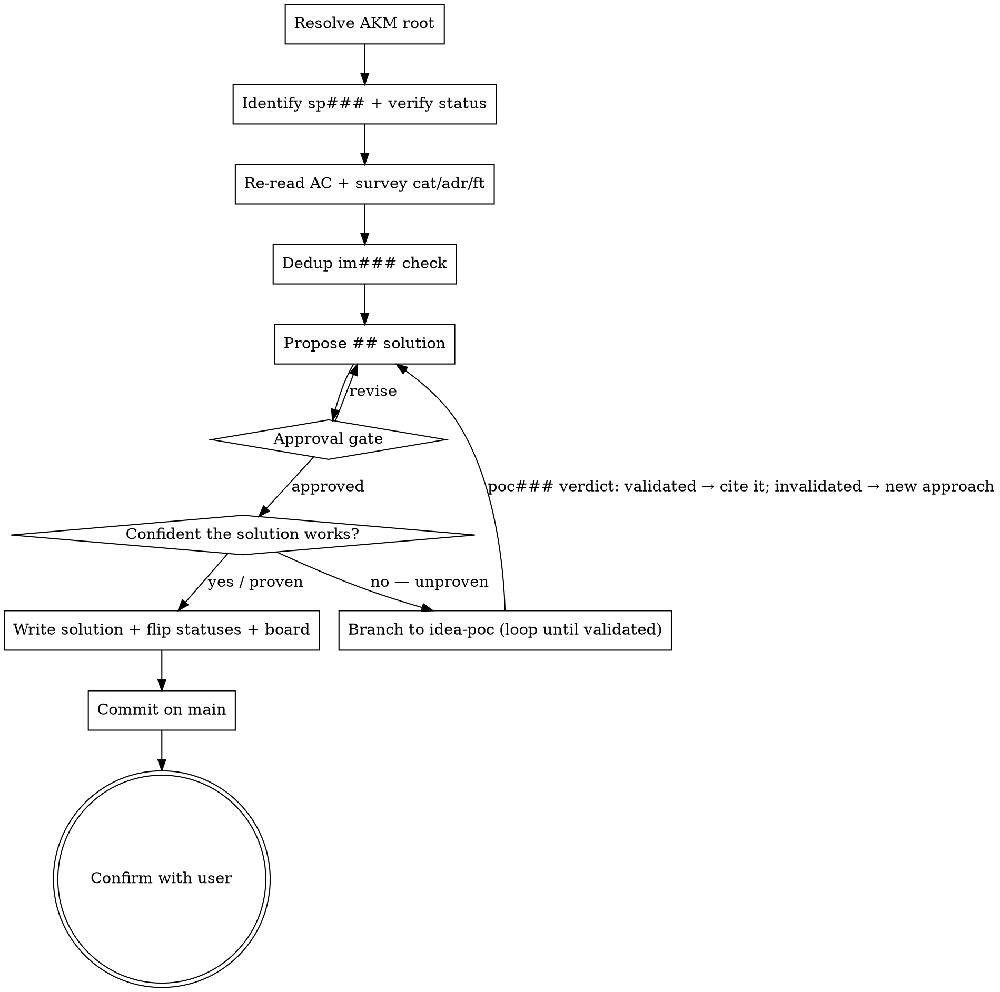

# Spec Writing (idea → spec)

## Overview

Stage 2 of the AKM lifecycle. A spec is already on the board at `status: idea` with `## problem` populated (placed there by one of the idea-* skills). The user is asking you to choose **how** to solve that problem at a high level — which ADRs constrain the approach, which features will be consumed, which trade-offs to take — and to write that choice into the spec as `## solution`. The spec then flips `idea → spec` and its board listing moves with it.

**This skill does NOT write tasks, file trees, bd ids, or step-by-step plans.** Those are deliberately downstream:
- File tree / conventions / anti-patterns / task breakdown → `spec-refinement`
- bd epic + task ids → `spec-ready`

Keeping spec-writing narrow lets the solution shape stay revisable until the user approves it. Locking task structure here is what creates churn when the approach shifts.

**Announce at start:** "Using spec-writing skill to propose the solution shape."

## AKM Workspace Resolution

Specs and the board live on **main**, even from a feature-branch worktree. Resolve before any file op:

```bash
AKM_ROOT="$(akm-root)"
```

`akm-root` returns the main-worktree path (default branch); outside git, cwd. Anchor every path on `$AKM_ROOT` (`$AKM_ROOT/docs/notes/spec/sp###.md`, `$AKM_ROOT/docs/board.md`, `$AKM_ROOT/docs/notes/us###.md`). If `akm-root` errors, surface its stderr and abort — never silently land spec mutations on the feature branch.

**Commit policy: commit on transition.** spec-writing is the **first transition that commits** on main — it batches the idea-phase staged files (the `sp###.Problem` written by an `idea-*` skill, plus any draft stories newly referenced) together with this skill's writes (`## solution` appended, `status: idea → spec` flipped, story `draft → ready` flipped, `board.md` `## idea → ## spec` moved). One commit covers the whole lineage:

```bash
git -C "$AKM_ROOT" add docs/notes/spec/sp<NNN>.md docs/board.md docs/notes/us<NNN>.md
git -C "$AKM_ROOT" commit -m "feat(akm): spec sp<NNN> <title>"
```

See the per-stage commit table in `docs/notes/akm.md#workspace-resolution`.

## AKM hooks

Stage 2 of the AKM lifecycle (see `claude/akm/akm-lifecycle.md`). Lifecycle goals: propose solution for the problem at high level, ensure solution is in line with features and ADRs, ensure no duplication or propose possible made solution.

**Reads** (per lifecycle contract):

- `sp###` — the target spec at `status: idea`. Read `## solves [[us###]]` + `## problem` to know what's being solved.
- `us###.acceptance_criteria` — the testable criteria the solution must satisfy. The spec's solution shape is constrained by these AC.
- `cat###` (`category-read`) — taxonomy buckets the spec lives under (read from the spec's H1 wikilinks).
- `ft###` (`feature-read`) — capabilities the solution might consume. Bind concretely here (not just candidates as in idea-*).
- `adr####` (`adr-read --category <picks>`) — decisions binding the chosen categories. Solution must align with `Accepted` ADRs in scope; if it conflicts, surface as a supersession candidate, do not silently violate.

**Writes** (all paths anchored on `$AKM_ROOT`):

- `$AKM_ROOT/docs/notes/spec/sp###.md` — append `## solution` body section. **Reference discipline:** every relevant id appears as a wikilink in `## solution` — `[[ft###]]` for consumed features, `[[adr####]]` for binding decisions, `[[cat###]]` for taxonomy alignment. Prose-only solutions break the graph for spec-refinement downstream. Also flip frontmatter `status: idea → spec`.
- `$AKM_ROOT/docs/notes/us###.md` — flip the source story's frontmatter `status: draft → ready` (the spec being written *is* the act of readying that story).
- `$AKM_ROOT/docs/board.md` — move the `[[sp###]]` entry from `## idea` to `## spec`.

## Flow



## Entry-specific checklist

1. **Resolve AKM root.** `AKM_ROOT="$(akm-root)"` — every subsequent path anchors on it. Abort with the helper's stderr if it errors.
2. **Identify target spec.** User must name a `sp###` (by id or alias). Verify `$AKM_ROOT/docs/notes/spec/sp###.md` exists.
3. **Verify status.** Read frontmatter `status`. Must be `idea`. Apply Disambiguation if not.
4. **Read the spec.** Confirm `## solves [[us###]]` and `## problem` are populated. If `## problem` is missing or empty, block — route back to the originating idea-* skill.
5. **Re-read source us###.AC.** Fetch `$AKM_ROOT/docs/notes/us<NNN>.md`; re-read `## acceptance_criteria`. If AC are vague or empty, block — route back to `idea-implement` (or `idea-extend`) for AC refinement. The solution shape is meaningless against shifting criteria.
6. **Survey categories** named in the spec's H1 — `category-read` on each (resolved under `$AKM_ROOT/docs/notes/cat*.md`).
7. **Survey binding ADRs** under those categories via `adr-read`. Identify which ones constrain the approach; flag any conflict between the natural solution and an `Accepted` ADR.
8. **Survey features** the solution will consume via `feature-read`. Where the problem mentioned candidate `[[ft###]]` ids, decide which actually bind; identify any new ones.
9. **Dedup check.** Does an existing `im###` already solve this story (or an adjacent one) in a way the new spec is about to duplicate? If yes, surface the duplicate and ask whether to extend the existing solution shape rather than mint a new one. Lifecycle goal: "ensure no duplication or propose possible made solution".
10. **Propose `## solution`.** One paragraph naming the approach + ADR refs + bound `[[ft###]]` consumed + the trade-offs taken. Surface this as the design-approval question — the user owns whether the proposed shape is the right one.
10a. **Confidence gate — is the chosen solution proven?** Once the user has approved the *shape*, ask whether there is clear proof the approach actually *works*. If it rests on an unproven assumption — a library you haven't seen do this, a tool integration nobody has tried here, a perf budget you're guessing at — do **not** finalize a guess. Branch to `infinifu:idea-poc` to de-risk it: a throwaway isolated experiment (`--informs sp<NNN>`) that returns a `poc###` verdict. This is an optional **loop**: a `validated` PoC means finalize the solution and cite `[[poc###]]` in `## solution` as the evidence; an `invalidated` PoC means the approach is dead — revise the solution and run a new PoC on the next approach, until one validates. Skip the gate only when the approach is already proven (cite where). De-risking *here* — after the problem is clear and a solution shape is chosen, before spec-refinement invests in a task plan — is the cheapest place to kill a bad approach.
11. **On confidence:** append `## solution` to `$AKM_ROOT/docs/notes/spec/sp<NNN>.md` with the wikilink reference discipline (cite `[[poc###]]` when a PoC validated the approach); flip its frontmatter `status: idea → spec`; flip the source story `$AKM_ROOT/docs/notes/us<NNN>.md` `status: draft → ready`; move the `[[sp###]]` entry in `$AKM_ROOT/docs/board.md` from `## idea` to `## spec`.
12. **Commit on main.** spec-writing is the first lifecycle transition that commits — it picks up the idea-phase staged files (the originating `sp###.Problem`, any newly-referenced draft stories) and bundles them with this skill's writes into a single commit on main:
    ```bash
    git -C "$AKM_ROOT" add docs/notes/spec/sp<NNN>.md docs/board.md docs/notes/us<NNN>.md
    git -C "$AKM_ROOT" commit -m "feat(akm): spec sp<NNN> <title>"
    ```
    `<title>` is the spec's `aliases[0]` (kebab-case acceptable). If additional draft stories were referenced in the spec, stage their files too — the commit captures the full idea-then-spec lineage as one atomic transition.
13. **Confirm.** Show: spec id + absolute path under `$AKM_ROOT`, status flips (`sp###: idea→spec`, `us###: draft→ready`), board move, commit sha on main. Ask once: "Anything to revise?"

Walk the shared process around this checklist (load `idea-brainstorming` for cadence + hard-gate basics — same conventions apply at every lifecycle stage).

## Verification

Before reporting complete:

- [ ] Every file path written/read is under `$AKM_ROOT` (resolved via `akm-root`, not the current cwd)
- [ ] `sp###.md` `## solution` populated with `[[ft###]]` / `[[adr####]]` / `[[cat###]]` wikilinks (no prose-only solutions)
- [ ] `sp###.md` frontmatter flipped `status: idea → spec`
- [ ] `us###.md` source story flipped `status: draft → ready`
- [ ] `board.md` entry moved from `## idea` to `## spec`
- [ ] `git log -1` on main shows a new commit titled `feat(akm): spec sp<NNN> <title>`
- [ ] Commit covers the spec file, the story file, and `board.md` (plus any idea-phase staged files)
- [ ] Confirmation surfaces the absolute `$AKM_ROOT/docs/notes/spec/sp<NNN>.md` path so the user sees where it landed from a worktree

## Disambiguation

- **`sp###` does not exist (file missing)** → block; the user is asking about a spec that hasn't been captured. Route to an idea-* skill to capture the problem first.
- **`sp###` at `status: spec`** → solution already chosen. Route to `spec-refinement` to add `## plan` + `## tasks`.
- **`sp###` at `status: ready`** → already refined and queued. Route to `work-do`.
- **`sp###` at `status: done`** → shipped; nothing to write.
- **`sp###` at `status: idea` but `## problem` is empty / missing** → block; route back to the originating idea-* skill to populate the problem first.
- **Source `us###.acceptance_criteria` is empty / vague** → block; route back to `idea-implement` (or `idea-extend`) to refine AC. Spec-writing cannot bind a solution to shifting criteria.
- **Existing `im###` already solves the same `us###`** → surface the duplicate; if the user wants a new approach, file the existing `im###` as a supersession candidate and continue; if not, stop.

## Key Principles (entry-specific)

- **Solution shape only — no task plumbing.** The output is `## solution`. File trees, task lists, bd ids belong downstream. Putting them here means the user has to approve them along with the solution, which conflates two decisions and slows iteration.
- **AC bind the solution.** A solution proposed against vague AC is a guess. The skill blocks at step 4 for exactly this reason.
- **ADRs constrain, don't reinvent.** An `Accepted` ADR under the picked categories binds the approach. If the natural solution conflicts, name it as a supersession candidate; never silently violate.
- **Feature consumption commits here.** Idea-* listed candidates; spec-writing picks the actual `[[ft###]]` set the solution will consume. Spec-refinement will design tasks against that set.
- **Dedup before mint.** If an existing `im###` already solves the same story, the new spec needs to either supersede it (named decision) or stop (don't duplicate). The lifecycle explicitly carries this goal at stage 2.
- **Reference discipline.** Every consumed `ft###`, binding `adr####`, and category `cat###` appears as a wikilink in `## solution`. The moxide LSP and downstream skills traverse the graph through those wikilinks.
- **Don't finalize an unproven solution.** The confidence gate (step 10a) is the lifecycle's de-risking point: a solution shape can be the *right* one yet still rest on an assumption nobody has tested. When proof is missing, loop through `infinifu:idea-poc` until an approach validates — cheaper here than discovering it during `work-do`.

## Integration

**Calls:**

- `infinifu:spec-read` — fetch target sp### + verify status/body.
- `infinifu:story-read` — fetch source us### + re-read AC.
- `infinifu:category-read` / `adr-read` / `feature-read` — context survey.
- `infinifu:implementation-read` — dedup check against existing im### that solves the same us###.
- `infinifu:idea-brainstorming` — shared process basics (reference, not invoked as router).
- `infinifu:idea-poc` — confidence gate (step 10a): when the chosen solution is unproven, loop a throwaway PoC to de-risk it before spec-refinement; cite `[[poc###]]` in `## solution`.
- `infinifu:spec-refinement` — the next step once the solution is approved *and* confident; it adds `## plan` + `## tasks`.

**Out of scope (do NOT call from here):**

- `bd` — task creation belongs to `spec-ready`.
- `implementation-write` minting a new `im###` — happens at `spec-refinement` once tasks are concrete enough to anchor an implementation card.
- File-tree / convention drafting — `spec-refinement`'s `## plan` section.
