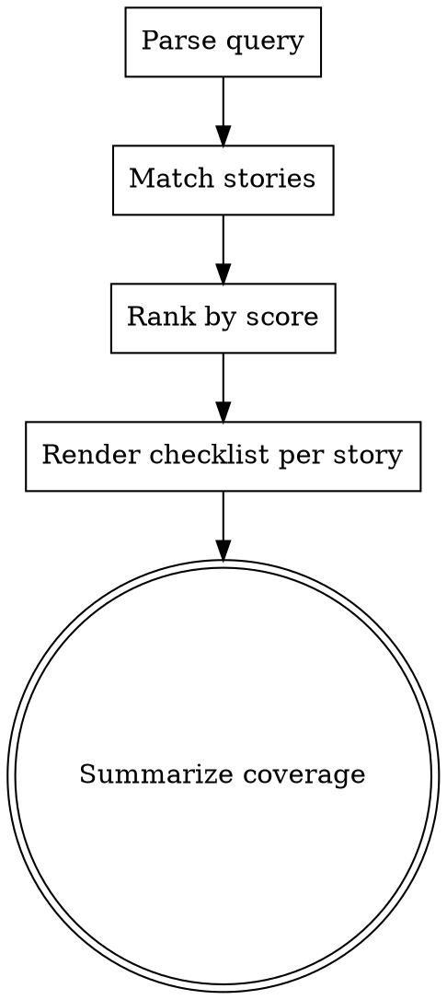

# Story Find

## Overview

Find user stories related to a part of the system, then show their validation status as a checklist. This skill answers two coupled questions in one shot:

1. **Coverage** — which stories touch this area?
2. **Validation** — for each, are the acceptance criteria met?

It is read-only. It does not modify `product/stories.yaml`, does not flip statuses, and does not run tests. To change a story's status, the user edits the YAML directly or re-emits via `story-write` with the same id.

**Announce at start:** "Using story-find skill to surface stories touching this area + their validation state."

## Storage

**File:** `product/stories.yaml`. Schema is defined in the `story-write` skill.

If the file does not exist or has zero stories: tell the user "No stories found in product/stories.yaml — nothing to search." Do not fabricate matches.

## Process Flow



## Step 1: Parse the Query

The query is the user's description of the system area. Extract the meaningful tokens:

- Drop stop words (the, a, an, of, for, in, on, with, to, and, or, but, is, are, was, were).
- Drop **meta/intent words** that describe the *question* rather than the *area*:
  - Story-meta: `story`, `stories`, `backlog`, `criteria`, `acceptance`.
  - Validation-intent: `pass`, `passing`, `passed`, `done`, `ready`, `draft`, `validate`, `validated`, `verify`, `tested`, `cover`, `covered`, `coverage`, `working`, `whether`, `they`, `we`, `have`, `has`, `do`, `does`, `did`, `is`, `it`, `which`, `what`, `show`, `find`, `me`, `about`, `around`.
  - Question scaffolding: `please`, `currently`, `actually`.
- Lowercase everything.
- Split on whitespace and punctuation.
- Keep multi-word phrases when they appear quoted or hyphenated (e.g. `"forgot password"`, `auth-flow`).

**Why drop validation-intent words:** queries like "show me stories about auth and whether they pass" mix two concerns — the topic (auth) and the validation question (pass). Treating "pass" as a topic token causes false matches against any story containing the substring (e.g., `password`). Strip these so the search is purely topical; validation always renders via the AC checklist regardless of whether "pass/done/validate" appeared in the query.

**Example:**
- Query: "Which stories cover the export feature?"
- Tokens: `["export", "feature"]`

If the query is too vague to extract meaningful tokens (e.g. just "stories", "system"), ask the user to be more specific. One question, then proceed.

**If the query is a code path** (contains `/`, ends in a known extension, or looks like a repo-relative file/dir reference): **stop and defer to `story-map`** — that skill does exact path matching against each story's `paths` field, which is more precise than fuzzy keyword search. Don't try to substring-match a path against text fields.

## Step 2: Match Stories

For each story, compute a match score against the query tokens. Search these fields with these weights:

| Field | Weight | Match rule |
|-------|--------|------------|
| `tags` | **5** | Token equals any tag (exact, case-insensitive). Tags are the most reliable signal — they were chosen to mark the story's system area. |
| `title` | 3 | Field contains token (case-insensitive substring). |
| `want` | 2 | Substring. |
| `acceptance_criteria` (all bullets joined) | 2 | Substring. |
| `because` | 1 | Substring. |
| `role` | 1 | Substring. |

Scoring is a simple count: for each token, walk the fields above and add the matching field's weight. Sum across tokens and fields.

**Tag synonyms.** Before matching, expand the query tokens with these common synonyms so `authentication` queries hit `auth` tags and vice versa:

| Token in query | Also match these tags |
|----------------|------------------------|
| `authentication`, `login`, `signin` | `auth` |
| `auth` | `authentication` (only relevant if no tag named `auth` exists) |
| `permissions`, `authorization`, `authz` | `auth` |
| `csv`, `xlsx`, `pdf`, `download` | `export` |
| `dashboard`, `chart`, `graph` | `reports` |

The synonym map is a hint, not a hard rule — if the user query is already specific (e.g. `csv`), keep the original token *and* try the synonym; both can score.

A story matches if `score >= 1`. Lower scores indicate weaker relevance.

**Backward compatibility.** Older stories may not have a `tags` field. If `tags` is missing, treat it as an empty list — the story can still match via the text fields, just without the tag-weight boost.

## Step 3: Rank and Cap

Sort matches by score descending. Break ties by id ascending (older first).

Cap output at the top **10** matches. If more matched, mention the cap in the summary.

If zero matched, state: "No stories matched query `<query>`. Try a broader term or check `story-read` for the full backlog."

## Step 4: Render Each Story as a Checklist

For each ranked match, output this exact template:

```markdown
### [id] — [title]   (match score: [score])

**As a** [role], **I want** [want], **because** [because].

**Tags:** [tag1, tag2, ...]   **Status:** [status]

**Acceptance criteria:**
- [x] [criterion 1]              (when status == done)
- [ ] [criterion 1]              (when status != done)
- ...
```

### Validation Rules

The checkbox state is derived from `status`:

| status | Checkbox state | Meaning |
|--------|----------------|---------|
| `done` | `[x]` for all criteria | Story is closed — all criteria assumed met |
| `ready` | `[ ]` for all criteria | Approved but not implemented — unverified |
| `draft` | `[ ]` for all criteria | Still being shaped — unverified |

This is intentionally coarse. The schema does not track per-criterion status today; if a future iteration adds an `acceptance_criteria_status` field per story, this skill should switch to per-bullet rendering.

After the checklist, add one line summarizing this story's validation:

- If `status == done`: `Validated: 3/3 criteria met (status=done).`
- Otherwise: `Unverified: 0/3 criteria checked (status=<draft|ready>).`

## Step 5: Summary Footer

After rendering all matched stories, end with a one-paragraph coverage summary:

```
Coverage for "<query>": <N> matched stories — <X> done, <Y> ready, <Z> draft. Top match: [id] (score [score]).
```

If matches were capped at 10: `<N> matched stories (showing top 10 — <total> total matched).`

If any matches scored below 2 (weak): mention them as "weak matches" so the user can dismiss noise.

## What This Skill Does NOT Do

- It does not modify `product/stories.yaml` or any story.
- It does not flip statuses, even if all criteria appear met.
- It does not run tests, scan code, or verify acceptance criteria against the actual system. Validation here means *what the YAML claims*, not what the running system proves.
- It does not invent acceptance criteria or relationships not present in the YAML.

## When to Defer to Other Skills

- User wants to add a new story → `story-write`.
- User wants the full backlog (no filter, all stories) → `story-read` (render mode).
- User wants to look up a single story by id → `story-read` (detail mode).
- User wants implementation traceability beyond stories (which bd tasks/PRs implement this) → that's a different concern; not in this skill's scope.

## Example

**Query:** "stories about export functionality"

**Tokens:** `["export", "functionality"]`

**Stories matched:**

```
### 2605-001 — Export query results as CSV   (match score: 8)

**As a** data analyst, **I want** to export query results as CSV, **because** I can share them with non-technical stakeholders.

**Status:** done

**Acceptance criteria:**
- [x] CSV download includes all visible columns in the same order as the table
- [x] Empty result set returns a CSV with only the header row
- [x] Download triggers within 2 seconds for ≤10k rows

Validated: 3/3 criteria met (status=done).

### 2604-003 — Export reports as PDF   (match score: 5)

**As a** manager, **I want** to export weekly reports as PDF, **because** I can email them to executives.

**Status:** ready

**Acceptance criteria:**
- [ ] Report includes company logo header
- [ ] PDF is paginated by section

Unverified: 0/2 criteria checked (status=ready).
```

**Coverage summary:**

```
Coverage for "stories about export functionality": 2 matched stories — 1 done, 1 ready, 0 draft. Top match: 2605-001 (score 8).
```
