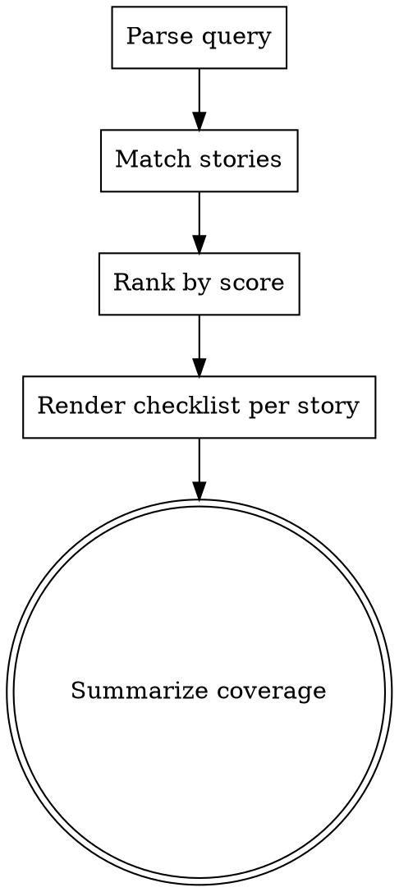

# Story Find

## Overview

Find user stories related to a part of the system, then show their validation status as a checklist. This skill answers two coupled questions in one shot:

1. **Coverage** — which stories touch this area?
2. **Validation** — for each, are the acceptance criteria met?

It is read-only. It does not modify any AKM zettel, does not flip statuses, and does not run tests. To change a story's status, the user edits the markdown directly or re-emits via `story-write` with the same id.

**Announce at start:** "Using story-find skill to surface stories touching this area + their validation state."

## Data source

The story listing comes from the `akm` CLI; full body content for
tag / acceptance-criteria matching comes from `akm read <id>` per
candidate. The CLI enforces the strict main-worktree rule and returns
canonical state.

```bash
# Index — id, name (first alias), status, created, categories (H1 tags).
akm list us --json | from json

# Per-story body for body-field scoring:
akm read us013
```

When a search needs body grep across many stories at once (rare), use
`akm root` to anchor a ripgrep:

```bash
rg -l '<token>' "$(akm root)/docs/notes/"us*.md
```

If `akm` refuses with exit 2, surface its stderr and stop.
If `akm list us --json` returns `[]`: tell the user "No stories found
— nothing to search."

### Zettel slice this skill reads

```markdown
---
aliases:
  - <title / want clause>
status: <draft|ready|in_progress|done|dropped>
created: YYYY-MM-DD
---
# Story [[<tag>]] [[<tag>]] [[product]]

## role
[[pn###|<persona-alias>]]

## want
<want>

## because
<motivation>

## acceptance_criteria
- <criterion>
- <criterion>
```

**Per-story extraction:**

- `id` — filename slug (`us001` for `us001.md`).
- `title` — first entry of frontmatter `aliases:`.
- `status` — frontmatter scalar.
- `tags` — every H1 wikilink **except `[[product]]`**. `[[product]]` is structural, not a tag. Render extracted tags as their link target slug (e.g. `[[requestor-flow]]` → `requestor-flow`).
- `role-alias` — text after the `|` in `[[pn###|<alias>]]` under `## role`. (Fall back to reading the persona zettel's first `aliases:` entry if only an unqualified `[[pn###]]` is present.)
- `want`, `because` — body text under those H2s.
- `acceptance_criteria` — bullets under `## acceptance_criteria`.

## Process Flow



## Step 1: Parse the Query

The query is the user's description of the system area. Extract the meaningful tokens:

- Drop stop words (the, a, an, of, for, in, on, with, to, and, or, but, is, are, was, were).
- Drop **meta/intent words** that describe the *question* rather than the *area*:
  - Story-meta: `story`, `stories`, `backlog`, `criteria`, `acceptance`, `zettel`.
  - Validation-intent: `pass`, `passing`, `passed`, `done`, `ready`, `draft`, `validate`, `validated`, `verify`, `tested`, `cover`, `covered`, `coverage`, `working`, `whether`, `they`, `we`, `have`, `has`, `do`, `does`, `did`, `is`, `it`, `which`, `what`, `show`, `find`, `me`, `about`, `around`.
  - Question scaffolding: `please`, `currently`, `actually`.
- Lowercase everything.
- Split on whitespace and punctuation.
- Keep multi-word phrases when they appear quoted or hyphenated (e.g. `"forgot password"`, `auth-flow`).

**Why drop validation-intent words:** queries like "show me stories about auth and whether they pass" mix two concerns — the topic (auth) and the validation question (pass). Treating "pass" as a topic token causes false matches against any text containing the substring (e.g., `password`). Strip these so the search is purely topical; validation always renders via the AC checklist regardless of whether "pass/done/validate" appeared in the query.

**Example:**
- Query: "Which stories cover the catalog area?"
- Tokens: `["catalog"]`

If the query is too vague to extract meaningful tokens (e.g. just "stories", "system"), ask the user to be more specific. One question, then proceed.

**If the query is a code path** (contains `/`, ends in a known extension, or looks like a repo-relative file/dir reference): **stop and defer to `story-map`** — that skill links code paths to stories via the Implementation (`im###.md`) `## components` field, which is more precise than fuzzy keyword search. Don't try to substring-match a path against text fields.

## Step 2: Match Stories

For each story zettel, compute a match score against the query tokens. Search these fields with these weights:

| Field | Weight | Match rule |
|-------|--------|------------|
| H1 tag wikilinks (excluding `[[product]]`) | **5** | Token equals any tag slug (exact, case-insensitive). Tags are the most reliable signal — they were chosen to mark the story's flow/theme. |
| Frontmatter `aliases[0]` (title) | 3 | Field contains token (case-insensitive substring). |
| `## want` body | 2 | Substring. |
| `## acceptance_criteria` (all bullets joined) | 2 | Substring. |
| `## because` body | 1 | Substring. |
| `## role` persona alias | 1 | Substring. |

Scoring is a simple count: for each token, walk the fields above and add the matching field's weight. Sum across tokens and fields.

**Tag synonyms.** Before matching, expand the query tokens with these common synonyms so `authentication` queries hit `auth` tags and vice versa:

| Token in query | Also match these tags |
|----------------|------------------------|
| `authentication`, `login`, `signin` | `auth` |
| `auth` | `authentication` (only relevant if no tag named `auth` exists) |
| `permissions`, `authorization`, `authz` | `auth` |
| `csv`, `xlsx`, `pdf`, `download` | `export`, `import` |
| `dashboard`, `chart`, `graph` | `reports`, `tracking` |

The synonym map is a hint, not a hard rule — if the user query is already specific (e.g. `csv`), keep the original token *and* try the synonym; both can score.

A story matches if `score >= 1`. Lower scores indicate weaker relevance.

**Reading shortcuts.** Tag scoring is already implicit in
`akm list us --json | from json` — the `categories` column carries the
`[[cat###]]` H1 wikilinks. For non-cat tag matches and body-field
matches you still need full body content via `akm read <id>`. A
reasonable strategy:

1. `akm list us --json | from json` — score each row's `categories`
   against the query's tag tokens.
2. For stories that scored on tags, `akm read <id>` to render the
   checklist with acceptance criteria.
3. For stories that scored 0 on tags, body grep across the AKM root
   for the remaining tokens:
   `rg -li '<token>' "$(akm root)/docs/notes/"us*.md`.

For raw tag-wikilink matches outside the canonical H1 cat-set, the
same ripgrep works: `rg -l '\[\[<token>\]\]' "$(akm root)/docs/notes/"us*.md`.

## Step 3: Rank and Cap

Sort matches by score descending. Break ties by id ascending (older first).

Cap output at the top **10** matches. If more matched, mention the cap in the summary.

If zero matched, state: "No stories matched query `<query>`. Try a broader term or check `story-read` for the full backlog."

## Step 4: Render Each Story as a Checklist

For each ranked match, output this exact template:

```markdown
### [id] — [title]   (match score: [score])

**As a** [persona-alias], **I want** [want], **because** [because].

**Tags:** [tag1, tag2, ...]   **Status:** [status]

**Acceptance criteria:**
- [x] [criterion 1]              (when status == done)
- [ ] [criterion 1]              (when status != done)
- ...
```

### Validation Rules

The checkbox state is derived from `status`:

| status | Checkbox state | Meaning |
|--------|----------------|---------|
| `done` | `[x]` for all criteria | Story is closed — all criteria assumed met |
| `in_progress` | `[ ]` for all criteria | Work in flight — unverified |
| `ready` | `[ ]` for all criteria | Approved but not implemented — unverified |
| `draft` | `[ ]` for all criteria | Still being shaped — unverified |
| `dropped` | `[~]` for all criteria | Abandoned — neither met nor pending |

This is intentionally coarse. The AKM schema does not track per-criterion status today; if a future iteration adds per-bullet validation, this skill should switch to per-bullet rendering.

After the checklist, add one line summarizing this story's validation:

- If `status == done`: `Validated: 3/3 criteria met (status=done).`
- If `status == dropped`: `Abandoned: 3 criteria not applicable (status=dropped).`
- Otherwise: `Unverified: 0/3 criteria checked (status=<draft|ready|in_progress>).`

If the H1 has no tag wikilinks (only `[[product]]`), omit the **Tags:** label rather than rendering an empty list.

## Step 5: Summary Footer

After rendering all matched stories, end with a one-paragraph coverage summary:

```
Coverage for "<query>": <N> matched stories — <X> done, <Y> ready, <Z> in_progress, <W> draft, <V> dropped. Top match: [id] (score [score]).
```

Omit zero-count buckets from the summary.

If matches were capped at 10: `<N> matched stories (showing top 10 — <total> total matched).`

If any matches scored below 2 (weak): mention them as "weak matches" so the user can dismiss noise.

## What This Skill Does NOT Do

- It does not modify any zettel under `$AKM_ROOT/docs/notes/`.
- It does not flip statuses, even if all criteria appear met.
- It does not run tests, scan code, or verify acceptance criteria against the actual system. Validation here means *what the zettel claims*, not what the running system proves.
- It does not invent acceptance criteria or relationships not present in the zettels.

## When to Defer to Other Skills

- User wants to add a new story → `story-write`.
- User wants the full backlog (no filter, all stories) → `story-read` (render mode).
- User wants to look up a single story by id → `story-read` (detail mode).
- User names a code path (e.g. `src/auth/login.ts`) → `story-map` (the Implementation card lists components).

## Example

**Query:** "stories about catalog"

**Tokens:** `["catalog"]`

**Stories matched:**

```
### us001 — order samples for upcoming client work   (match score: 5)

**As a** requestor, **I want** to order samples for upcoming client work, **because** I need product in hand for client tasting / presentation.

**Tags:** requestor-flow, catalog   **Status:** done

**Acceptance criteria:**
- [x] browse catalog of available samples
- [x] add items with quantity to a request
- [x] submit request to approver

Validated: 3/3 criteria met (status=done).
```

**Coverage summary:**

```
Coverage for "stories about catalog": 1 matched stories — 1 done. Top match: us001 (score 5).
```
