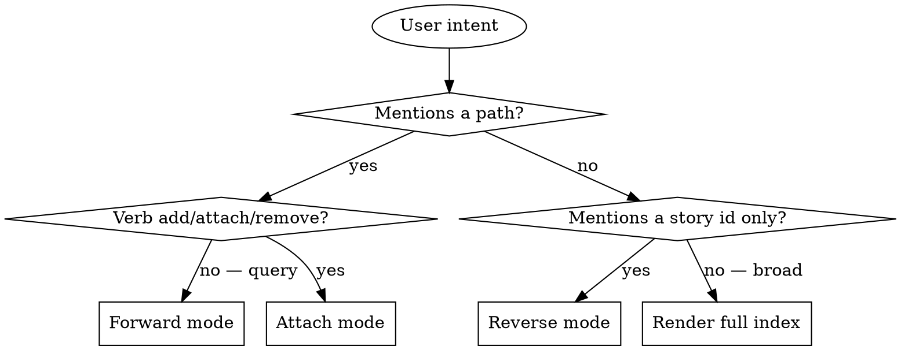

# Story Map

## Overview

`story-map` indexes **repository items** (file paths, directory globs) to **user stories** in `product/stories.yaml`. Where `tags` are noisy keyword markers, paths are exact references that can't drift.

The skill answers two questions and supports one edit:

1. **Forward lookup** — given a path, which stories touch it?
2. **Reverse lookup** — given a story id, which paths implement it?
3. **Attach** — add or remove a path-to-story mapping.

The map lives in a **dedicated index file** at `product/story-map.yaml`. The file is **path-keyed**: each path is a top-level key, and its value is the list of story ids implementing it. This makes forward lookup a direct YAML key access (or a one-line `grep`) — no scanning every story.

Storywise content (id, title, role, want, criteria, tags, status) stays in `product/stories.yaml`. The map file holds *only* the path → story-id linkage. Two files, one concern each.

**Announce at start:** "Using story-map skill to <forward / reverse / attach> path-to-story mapping."

## File Format

**File:** `product/story-map.tsv`. **Line-oriented TSV.** Each line is one edge in the (story, path) bipartite graph.

```
2605-001	src/export/csv.ts
2605-001	src/export/csv.test.ts
2605-001	src/components/ExportButton.svelte
2605-002	src/auth/login.ts
2605-002	src/auth/password-reset.ts
2605-002	src/email/templates/reset.html
2605-005	src/auth/2fa/**
2605-005	src/auth/login.ts
```

**Format rules:**

- One record per line: `<story_id><TAB><path>`.
- Story id first, path second. (Story-id-first means `grep '^2605-002\t'` is the natural reverse-lookup query.)
- One id per line. A story with three paths gets three lines. A path shared across two stories gets two lines.
- No header row. `#`-prefixed lines are comments and are ignored.
- Sort by story id, then by path. (Apply sort at write time — keeps diffs clean.)
- UTF-8. Unix newlines.

**Why TSV over YAML:**

- **Greppable both ways.** Forward: `grep '\tsrc/auth/login\.ts$'`. Reverse: `grep '^2605-002\t'`. No parser needed.
- **Diff-clean.** Adding a path = adding one line. YAML's nested lists shuffle keys/indentation under loaders.
- **Pipeline-friendly.** `cut -f1`, `cut -f2`, `sort -u`, `awk` all work as-is.
- **No quoting hell.** Paths with special characters (`:`, `*`, `[`) need YAML quoting; TSV doesn't care.

**Path rules:**

- **Repo-relative.** No leading `/`, no `./`. Same form `git ls-files` returns.
- **Globs allowed.** `src/auth/2fa/**`, `src/payments/*.ts`. Matching expansion happens at lookup time.
- **No tabs in paths.** (Filesystems allow them; TSV doesn't.) If you absolutely need one, switch the field separator project-wide first.

## Lookup Recipes

The skill prefers shell over re-implementing matching when possible — the file is structured for it.

**Forward lookup (path → stories):**
```bash
grep $'\t'"<query-path>"$ product/story-map.tsv | cut -f1 | sort -u
```

For prefix queries (`src/auth/`):
```bash
grep $'\t'"src/auth/" product/story-map.tsv | cut -f1 | sort -u
```

For globs stored on the right side, expand them in code (Python `fnmatch`, or `git ls-files | grep`).

**Reverse lookup (story → paths):**
```bash
grep "^<story-id>"$'\t' product/story-map.tsv | cut -f2 | sort -u
```

**Render full map:**
```bash
sort product/story-map.tsv
```

**Stories with no paths:**
```bash
comm -23 <(yq '.stories[].id' product/stories.yaml | sort -u) \
         <(cut -f1 product/story-map.tsv | sort -u)
```

The skill should run these directly when an environment is available, not paraphrase them.

## Storage

Two files, two concerns:

| File | Owner | Contents |
|------|-------|----------|
| `product/stories.yaml` | `story-write`, `story-read`, `story-find`, `tag-manage` | Story content. **No `paths` field.** |
| `product/story-map.tsv` | `story-map` | (story_id, path) edges. **Nothing else.** |

If `product/story-map.tsv` does not exist, treat the index as empty:
- Forward / reverse lookup → "No paths indexed yet."
- Attach → create the file with the new line.

## Validating story ids

When attaching a path, look up the story id in `product/stories.yaml` and confirm it exists. If it doesn't, error with: "Story `<id>` not found in stories.yaml. Closest: <id1>, <id2>." This keeps the map from accumulating dead references over time.

## Mode Selection



### What counts as a path

Treat the user input as a path if it contains `/`, ends in a known extension (`.ts`, `.py`, `.svelte`, `.rs`, `.go`, `.md`, etc.), or matches a repo-relative pattern. When in doubt, ask the user "Is `<input>` a code path or a topic?" — one question, then proceed.

## Mode 1: Forward Lookup (path → stories)

**Trigger:** "which stories cover `src/auth/login.ts`?", "stories touching `src/export/`", "what's `src/payments/*.ts` mapped to?".

**Process:**

1. Read all stories from `product/stories.yaml`.
2. For each story's `paths` list, check whether any pattern **contains the query path** as a prefix OR matches it as a glob.
3. Both directions count:
   - Story has `src/auth/**`, query is `src/auth/login.ts` → **match** (story's glob covers the query).
   - Story has `src/auth/login.ts`, query is `src/auth/` → **match** (query is a prefix of story's path).
4. Collect matching stories. Show id + title + matched-path + status.

**Output template:**

```markdown
## Stories touching `src/auth/login.ts`

| id | status | title | matched via |
|----|--------|-------|-------------|
| 2605-002 | ready | Reset password via email link | src/auth/login.ts |
| 2605-005 | draft | Two-factor authentication for admins | src/auth/** |

2 stories matched.
```

If zero matched: "No stories indexed for path `<query>`. The path may be unmapped, or the story may not have a `paths` field yet. To attach, say: 'add `<path>` to story `<id>`'."

## Mode 2: Reverse Lookup (story → paths)

**Trigger:** "where is story 2605-002 implemented?", "what files belong to story 2605-005", "show me the code for 2605-001".

**Process:**

1. Confirm the story exists in `product/stories.yaml`. If not → "Story `<id>` not found." and stop.
2. Run `grep "^<story-id>"$'\t' product/story-map.tsv | cut -f2 | sort -u` (or its in-process equivalent).
3. If zero results: "Story `<id>` has no paths indexed yet. Use `story-map` attach to add some." Then optionally also show the story's tags (from stories.yaml) so the user has *some* context to act on.
4. Read the story's title from `stories.yaml` (single lookup) so the rendered header includes it.

**Output template:**

```markdown
## 2605-002 — Reset password via email link

**Paths:**
- `src/auth/password-reset.ts`
- `src/auth/password-reset.test.ts`
- `src/email/templates/reset.html`

3 paths indexed.
```

## Mode 3: Attach (edit)

**Trigger:** "add `src/foo.ts` to story 2605-001", "map this file to story Y", "remove `src/old.ts` from 2605-002".

**Process:**

1. Parse story id, path(s), and the verb (add / remove).
2. Validate story id exists in `product/stories.yaml`. If not → error with closest matches (do not guess).
3. **For add:**
   - Normalize the path (strip leading `/`, `./`, trim whitespace).
   - **Sanity check:** if the path contains no `/` and no extension, ask "Is `<path>` really a code path? It looks like a topic word." — one confirmation, then proceed.
   - **Existence check (optional but recommended):** if a working tree is available, run `git ls-files <path>` or check `ls`. If the path doesn't exist, warn: "Path `<X>` doesn't exist in the working tree. Add anyway?" — proceed under auto mode and note the warning in the response.
   - Check whether the line `<id>\t<path>` already appears in `product/story-map.tsv`. If yes → "Already indexed, nothing to do."
   - Append the line. Then re-sort the file (sort by id, then path) so diffs stay clean.
   - If `product/story-map.tsv` doesn't exist, create it.
4. **For remove:**
   - Check whether the line `<id>\t<path>` exists. If not → "Edge `<id> ↔ <path>` not in the map."
   - Delete that line (only that line — don't touch other rows even if the path appears with a different id).
5. Write back. Preserve sort order. Preserve `#` comment lines if any.

**Output:** show the operation (add/remove), the affected line, and the resulting **reverse-lookup** view for the story so the user sees the new state for that story.

## Mode 4: Render Full Index

**Trigger:** broad queries like "show me the story map", "what's our code-to-story coverage", with no specific path or story id.

**Process:**

1. Read `product/stories.yaml` for ids + titles + statuses.
2. Read `product/story-map.tsv`. Group by story id (`cut -f1 | sort -u` → set of mapped ids; full file → per-story path lists).
3. Compute the **unmapped set**: story ids that appear in stories.yaml but not in the map's first column.

Render grouped by status, with paths under each mapped story:

```markdown
# Story Map

## Done
- **2605-001** Export query results as CSV
  - src/export/csv.ts
  - src/export/csv.test.ts
  - src/components/ExportButton.svelte

## Ready
- **2605-002** Reset password via email link
  - src/auth/login.ts
  - src/auth/password-reset.ts
  - src/email/templates/reset.html

## Draft
- **2605-005** Two-factor authentication for admins
  - src/auth/2fa/**
  - src/auth/login.ts

## Unmapped (not in story-map.tsv)
- 2605-003 Bulk-archive old reports
- 2605-004 Export reports as PDF

Coverage: 3/5 stories indexed (60%).
```

The "Unmapped" section is the actionable list of stories that need `story-map attach`.

## Why This Beats Fuzzy Tags

Tags drift (`auth` vs `authentication`), bring noise (many stories share a tag), and require synonym maps. Paths can't drift — `src/auth/login.ts` either exists or it doesn't. Ambiguity is impossible. The trade-off is upfront cost: someone has to attach paths once. The skill makes that cheap.

`story-find` (fuzzy tag/text search) and `story-map` (exact path index) are complementary:

- Use `story-find` when the user describes a system area in natural language.
- Use `story-map` when the user names a file, directory, or wants to know which stories any given source file is implementing.

## What This Skill Does NOT Do

- It does not modify code, run tests, or execute paths.
- It does not enforce that paths exist in the working tree (it warns but does not block).
- It does not auto-discover paths from code (e.g. by reading commit messages or scanning files for story id mentions). All path attachments are explicit user actions.
- It does not change other fields of the story. To edit role/want/criteria/tags, use `story-write` (re-emit) or `tag-manage`.

## When to Defer to Other Skills

- User wants to add a brand-new story (with paths) → `story-write` first, then `story-map` to attach paths.
- User wants to find by topic/keyword (no path) → `story-find`.
- User wants to read a single story's full content → `story-read`.
- User wants to manage tags → `tag-manage`.
