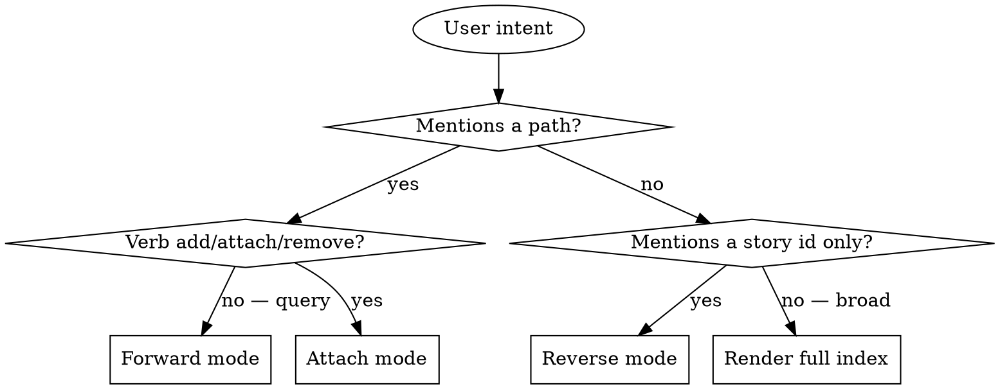

# Story Map

## Overview

`story-map` answers code ↔ story traceability questions in the AKM model. The mapping is carried by **Implementation zettels** (`docs/notes/im###.md`), not by a separate index file. Each Implementation has a `## solves [[us###]]` back-link to one story and a `## components` body section listing repo-relative paths (or globs) that implement the story. The skill traverses this bipartite relation.

Three modes:

1. **Forward lookup** — given a path, which stories touch it? (path → components → im### → solves us###)
2. **Reverse lookup** — given a story id, which paths implement it? (us### → im### that solves it → components)
3. **Attach** — add or remove a path on the Implementation that solves a story.

**Announce at start:** "Using story-map skill to <forward / reverse / attach> path-to-story mapping via im### zettels."

## AKM Model Recap

Per `docs/notes/akm.md` Implementation schema:

```markdown
---
aliases:
  - <solution one-liner>
status: <proposed|accepted|superseded>
created: YYYY-MM-DD
---
# Implementation [[cat###]] [[cat###]]

## solves
[[us###|<story-alias>]]

## approach
<chosen solution shape>

## features
- [[ft###|<feature>]]

## data_model
<schema deltas>

## api_surface
<endpoints>

## components
- src/foo/bar.ts
- src/components/Baz.svelte

## specs
- [[<spec-topic>|<spec-title>]]

---

Index: [[product]]
```

The two body sections this skill cares about are `## solves` (one wikilink to a story) and `## components` (a bullet list of repo-relative paths or globs).

## AKM Workspace Resolution

Readers always anchor on the main worktree's view of the AKM, never the
feature worktree's local copy (which may be stale or branch-divergent).
Resolve first:

```bash
AKM_ROOT="$(akm-root)"
```

All AKM zettel lookups (`us###`, `im###`) anchor on `$AKM_ROOT/docs/notes/...`.
If `akm-root` errors, surface its stderr and fall back to cwd with the
warning *"reading from cwd worktree — may be stale; check out the default
branch for canonical view"*.

**Code paths are different.** The paths inside `## components` (e.g.
`src/auth/login.ts`) refer to the source tree the user is actually
working in — typically the current worktree, possibly a feature branch.
**Do not rewrite code paths to be anchored on `$AKM_ROOT`.** Existence
checks like `git ls-files` and `ls` run in the user's cwd, not the AKM
root. Only the `us###` / `im###` / `docs/notes/` reads anchor on
`$AKM_ROOT`; component path strings stay as-written.

## Storage

- **Stories:** `$AKM_ROOT/docs/notes/us###.md` (read-only here — to add stories, see `story-write`).
- **Implementations:** `$AKM_ROOT/docs/notes/im###.md` (this is what we read and edit).

If `$AKM_ROOT/docs/notes/` has no `im*.md` files: the map is empty.
- Forward / reverse lookup → "No implementations indexed yet. Stories with shipped code typically have an `im###` zettel; create one before mapping."
- Attach → tell the user "No `im###` zettel exists for story `<id>`. Create one via `spec-writing` or by hand following the AKM Implementation schema, then re-run attach."

## Mode Selection



### What counts as a path

Treat the user input as a path if it contains `/`, ends in a known extension (`.ts`, `.py`, `.svelte`, `.rs`, `.go`, `.md`, etc.), or matches a repo-relative pattern. When in doubt, ask the user "Is `<input>` a code path or a topic?" — one question, then proceed.

## Mode 1: Forward Lookup (path → stories)

**Trigger:** "which stories cover `src/auth/login.ts`?", "stories touching `src/export/`", "what's `src/payments/*.ts` mapped to?".

**Process:**

1. Search `$AKM_ROOT/docs/notes/im*.md` for the path. `grep -l '<query-path>' "$AKM_ROOT/docs/notes/"im*.md` returns the implementation files that list it under `## components`. Also handles glob expansion: if an im### has `src/auth/**` in components and the query is `src/auth/login.ts`, that should match — accept either *exact*, *prefix*, or *glob-style* coverage.
2. For each matching `im###.md`, read `## solves` to extract the back-linked `us###`.
3. Read the story's title (frontmatter `aliases[0]`) and status — that's what you'll render.

**Output template:**

```markdown
## Stories touching `src/auth/login.ts`

| story | status | title | via implementation | matched component |
|-------|--------|-------|--------------------|--------------------|
| us002 | done   | Reset password via email link | im004 | src/auth/login.ts |
| us005 | draft  | Two-factor authentication for admins | im007 | src/auth/** |

2 stories matched (via 2 implementation zettels).
```

If zero matched: "No implementations list `<query>` under `## components`. The path may be unmapped, or no `im###` zettel exists for the affected story yet. To attach, say: 'add `<path>` to story `<id>`' — the skill will edit the matching `im###.md`."

## Mode 2: Reverse Lookup (story → paths)

**Trigger:** "where is story us013 implemented?", "what files belong to us005", "show me the code for us001".

**Process:**

1. Confirm the story exists in `$AKM_ROOT/docs/notes/us<id>.md`. If not → "Story `us<id>` not found." and stop.
2. Find the `im###.md` whose `## solves` section contains `[[us<id>]]`. Cheap: `grep -l '\[\[us<id>' "$AKM_ROOT/docs/notes/"im*.md` (the wikilink form may be `[[us013]]` or `[[us013|<alias>]]`, both should match the prefix). If multiple match, list them all — a story may have a superseded chain.
3. Read the title from the story zettel and the `## components` bullets from the implementation. Also surface the implementation's `status` (proposed / accepted / superseded) so the user knows if the mapping is current.

**Output template:**

```markdown
## us002 — Reset password via email link

**Implementation:** im004 (status: accepted)

**Components:**
- src/auth/password-reset.ts
- src/auth/password-reset.test.ts
- src/email/templates/reset.html

3 paths indexed via im004.
```

If `## components` is empty: "im004 exists but has no components listed yet. Use `story-map` attach to add some."

If no `im###.md` solves the story: "Story `us<id>` has no Implementation zettel yet. Create one via `spec-writing` (which emits the spec) or by hand following the AKM Implementation schema. Optionally include some context here: H1 tags of the story = ..."

## Mode 3: Attach (edit)

**Trigger:** "add `src/foo.ts` to story us013", "map this file to story Y", "remove `src/old.ts` from us002".

**Process:**

1. Parse story id, path(s), and the verb (add / remove).
2. Validate story id exists in `$AKM_ROOT/docs/notes/us<id>.md`. If not → error with closest matches.
3. Find the `im###.md` that solves the story (Reverse-lookup step 2). If zero or multiple:
   - **Zero:** error "No Implementation zettel solves `us<id>`. Create one first." Do not invent an im### here — Implementation creation is `spec-writing`'s job (or a manual hand-write per the AKM schema).
   - **Multiple:** ask the user "Stories `us<id>` is solved by multiple implementations (im004, im007). Which should the path attach to?" (Usually only one is `accepted`; supersededs are historical.)
4. **For add:**
   - Normalize the path (strip leading `/`, `./`, trim whitespace).
   - **Sanity check:** if the path contains no `/` and no extension, ask "Is `<path>` really a code path? It looks like a topic word." — one confirmation, then proceed.
   - **Existence check (optional but recommended):** if a working tree is available, run `git ls-files <path>` or `ls` **in the user's cwd** (not `$AKM_ROOT` — code paths reference the user's source tree, which may be a feature worktree). If the path doesn't exist, warn: "Path `<X>` doesn't exist in the working tree. Add anyway?" Proceed under auto mode and note the warning in the response.
   - Locate the `## components` body section in the `im###.md`.
   - Check whether the path is already a bullet. If yes → "Already listed, nothing to do."
   - Append a new bullet `- <path>` to the section. Preserve other body sections untouched.
5. **For remove:**
   - Find the bullet for the path. If not present → "Path `<X>` not listed under im###'s `## components`."
   - Delete just that line. Preserve all other content.
6. Write the file back.

**Output:** show the operation (add/remove), the affected im### id, and the resulting **reverse-lookup** view for the story so the user sees the new state for that story.

## Mode 4: Render Full Index

**Trigger:** broad queries like "show me the story map", "what's our code-to-story coverage", with no specific path or story id.

**Process:**

1. List all `us*.md` ids + titles + statuses from `$AKM_ROOT/docs/notes/`.
2. List all `im*.md` ids from `$AKM_ROOT/docs/notes/`. For each, read `## solves` and `## components`.
3. Build the (us### → im### → components) mapping in memory.
4. Compute the **unmapped set**: story ids that no `im###.md` solves.

Render grouped by story status, with components under each mapped story:

```markdown
# Story Map

## Done
- **us001** order samples for upcoming client work *(im001, accepted)*
  - src/catalog/list.svelte
  - src/api/requests/create.ts

## Ready
- **us003** track the status of my open requests *(im002, proposed)*
  - src/dashboard/requests.svelte
  - src/api/requests/list.ts

## Draft
- **us013** resubmit a Rejected or Blocked request *(im003, proposed)*
  - src/requests/resubmit.ts

## Unmapped (no Implementation zettel)
- us014 bulk import requests from spreadsheet

Coverage: 3/4 stories indexed (75%).
```

The "Unmapped" section is the actionable list of stories that need a `spec-writing` pass to mint an `im###.md`.

## Why Path-via-Implementation Beats a Sidecar Index

In earlier (non-AKM) iterations, story-map maintained a `product/story-map.tsv` sidecar with `(story-id, path)` edges. AKM rejects sidecars: each Implementation zettel already lists its components as part of the "what was shipped" record. Putting paths in a sidecar means duplicating that data and risking drift. The AKM Implementation card *is* the canonical place — story-map just queries it.

Trade-offs vs the old TSV:
- **Pro:** no drift between the spec/implementation history and the path index.
- **Pro:** `## components` is human-edited via normal markdown — no extra tooling required.
- **Pro:** Implementation status (proposed/accepted/superseded) is right there, so the index is self-dating.
- **Con:** path lookups require scanning every `im*.md`, not a single sidecar file. With dozens to low-hundreds of implementations, `grep` is still cheap.

## Implementation Existence Boundary

This skill **does not create `im###.md` zettels**. The Implementation zettel is part of the story → spec → implementation lifecycle owned by `spec-writing` (which creates a `proposed` Implementation card before the spec is written). If the user wants to attach paths to a story that has no Implementation yet, the right answer is: write the Implementation first, then attach paths.

This boundary keeps story-map narrow (it edits `## components` and reads `## solves`) and makes it safe to invoke repeatedly without polluting the zettel set.

## What This Skill Does NOT Do

- It does not modify code, run tests, or execute paths.
- It does not enforce that paths exist in the working tree (it warns but does not block).
- It does not auto-discover paths from code (no commit-message scraping, no source scanning). All path attachments are explicit user actions.
- It does not change story fields. To edit role/want/criteria/tags, use `story-write` or `tag-manage`.
- It does not create `im###.md` zettels. See `spec-writing`.
- It does not touch any zettel type other than `us###` (read-only) and `im###` (edit).

## When to Defer to Other Skills

- User wants to add a brand-new story → `story-write`.
- User wants the Implementation zettel itself to be drafted → `spec-writing`.
- User wants to find by topic/keyword (no path) → `story-find`.
- User wants to read a single story's full content → `story-read`.
- User wants to manage H1 tags → `tag-manage`.
