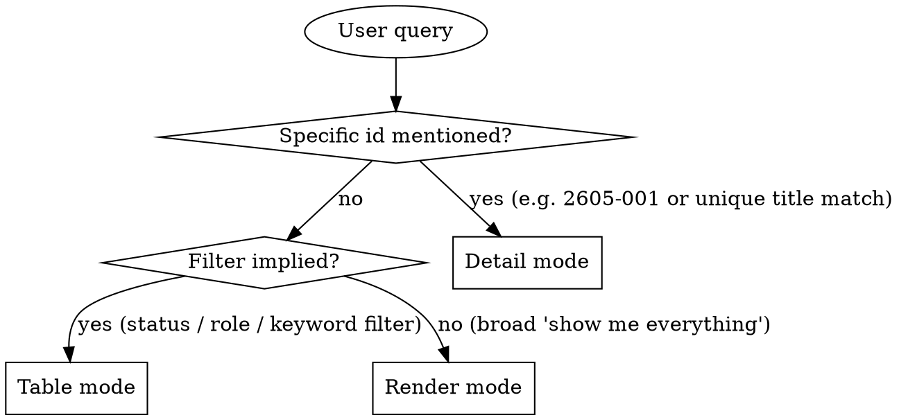

# Story Read

## Overview

Read `product/stories.yaml` and present user stories in the format that best fits the user's question. Three output modes — pick one based on the query, don't combine.

**Announce at start:** "Using story-read skill to surface the backlog."

## Storage

**File:** `product/stories.yaml`.

If the file does not exist or has no stories: tell the user "No stories found. Use story-write to add one." Don't fabricate a backlog.

Schema is defined in the `story-write` skill — every story has: `id`, `title`, `role`, `want`, `because`, `acceptance_criteria`, `status`, `created`.

## Mode Selection



### Detail mode triggers
- Query contains a story id like `2605-001`.
- Query references a single specific story unambiguously by title.
- Phrases like "show me story X", "tell me about story X", "what does story X say".

### Table mode triggers
- Filter words: `draft`, `ready`, `done`, `open`, `closed`, `pending`.
- Role mentions: "stories for admins", "all developer stories".
- Keyword search: "find stories about export", "anything related to auth".
- "List …", "what … are pending", "how many … are done".

### Render mode triggers
- "Show me the backlog".
- "What user stories do we have".
- "Print all stories".
- No filter and no specific id.

If the query is ambiguous between table and render, prefer **table** — it's more scannable. Render is for full audits.

## Mode 1: Detail

Show one story in full. Use this exact template:

```markdown
## [id] — [title]

**As a** [role], **I want** [want], **because** [because].

**Tags:** [tag1, tag2, ...]    **Status:** [status]    **Created:** [created]

**Acceptance criteria:**
- [criterion 1]
- [criterion 2]
- ...
```

If the lookup is by title and matches multiple stories, fall back to table mode showing the matches.

If the id does not exist: "Story `2605-001` not found. Closest matches: ..." and list 1-3 candidates by title similarity. Don't guess — let the user pick.

## Mode 2: Table

Render a markdown table. Columns:

| id | status | role | title |

Sort by id ascending unless the user asked otherwise. Apply the filter implied by the query before rendering.

**Example:**

```markdown
| id       | status | role          | title                          |
|----------|--------|---------------|--------------------------------|
| 2605-001 | draft  | data analyst  | Export query results as CSV    |
| 2605-003 | draft  | admin         | Bulk-archive old reports       |
```

After the table, add a one-line summary: `3 stories matched (2 draft, 1 ready).`

If zero matched: state the filter explicitly so the user can see what was searched. Example: "No stories with status=ready and role contains 'admin'."

## Mode 3: Render

Full markdown dump of the entire backlog, grouped by status (`draft` → `ready` → `done`). Within each group, sort by id ascending.

```markdown
# Product Backlog

## Draft

### 2605-001 — Export query results as CSV
**As a** data analyst, **I want** to export query results as CSV, **because** I can share them with non-technical stakeholders.

- CSV download includes all visible columns in the same order as the table
- Empty result set returns a CSV with only the header row
- Download triggers within 2 seconds for ≤10k rows

### 2605-003 — Bulk-archive old reports
...

## Ready

### 2604-002 — ...
...

## Done

### 2603-001 — ...
...
```

End with a one-line summary: `Total: N stories (X draft, Y ready, Z done).`

## Filter Parsing

Translate natural-language filters into structured matches:

| User says | Match against |
|-----------|---------------|
| "draft", "pending", "open" | `status: draft` |
| "ready" | `status: ready` |
| "done", "closed", "finished" | `status: done` |
| "for admins", "admin stories" | `role` contains "admin" (case-insensitive substring) |
| "about export", "related to auth" | `title`, `want`, `because`, or any `acceptance_criteria` contains the keyword (case-insensitive) |

Multiple filters compose with AND. Example: "draft stories about CSV" → `status == draft AND any-text-field contains 'csv'`.

## What This Skill Does NOT Do

- It does not modify stories. To edit, use `story-write` (re-emit) or edit the YAML directly.
- It does not create bd tasks or trigger downstream workflows.
- It does not estimate, prioritize, or invent metadata not in the schema.
- It does not paginate. If the backlog grows huge, prefer table mode with a filter.

## When to Defer to Other Skills

- User wants to add a story → `story-write`.
- User wants design discussion based on a story → `idea-brainstorming`.
- User wants to turn a story into an implementation plan → `spec-writing`.
