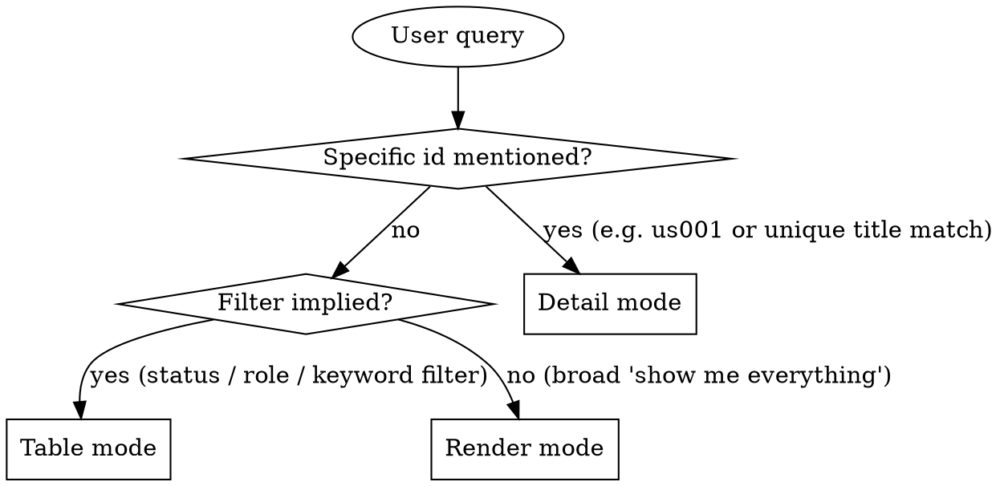

# Story Read

## Overview

Read user-story zettels under `docs/notes/us###.md` and present them in the format that best fits the user's question. Three output modes — pick one based on the query, don't combine.

**Announce at start:** "Using story-read skill to surface the backlog."

## Data source

All reads go through the `akm` CLI — never resolve `AKM_ROOT` or parse
frontmatter by hand. The CLI is the single gatekeeper: it enforces the
strict main-worktree rule (refuses from feature worktrees with exit 2)
and returns canonical state.

```bash
# All stories as structured rows: columns type, id, name (first alias),
# status, created, categories (list of cat ids from H1 wikilinks).
akm list us --json | from json

# Full markdown of a single story:
akm read us001
```

If `akm` refuses with exit 2, surface its stderr verbatim and stop.

If `akm list us --json` returns `[]`: tell the user "No stories found.
Use story-write to add one." Don't fabricate a backlog.

## Schema (this skill's slice)

```markdown
---
aliases:
  - <human-readable title / want clause>          # first alias = title
status: <draft|ready|in_progress|done|dropped>
created: YYYY-MM-DD
---
# Story [[<tag>]] [[<tag>]] [[product]]

## role
[[pn###|<persona-alias>]]

## want
<one-liner>

## because
<one-liner>

## acceptance_criteria
- <bullet>
- <bullet>
```

**Key extraction rules:**

- `id` — the filename slug (`us001` for `us001.md`).
- `title` — first entry under `aliases:` in frontmatter.
- `status`, `created` — frontmatter scalars.
- `role` — text under `## role`; usually a wikilink `[[pn###|alias]]`. **Render the alias label**, not the raw wikilink (the alias is the human-friendly name).
- `want`, `because` — body text under those H2s, one paragraph each.
- `acceptance_criteria` — bullets under `## acceptance_criteria`.
- `tags` — every wikilink in the H1 **except `[[product]]`** (the product link is structural, not a tag). Render as the link target slug (e.g. `[[requestor-flow]]` → `requestor-flow`).

If a story is missing any of these sections, render what's there and omit silently — don't crash on incomplete drafts.

## Mode Selection



### Detail mode triggers
- Query contains a story id like `us001` (case-insensitive; `US001` and `us001` are the same — AKM `case_matching = "Smart"` makes wikilinks equivalent).
- Query references a single specific story unambiguously by title.
- Phrases like "show me story X", "tell me about story X", "what does story X say".

### Table mode triggers
- Status filters: `draft`, `ready`, `in_progress`, `done`, `dropped`, `open`, `closed`, `pending`.
- Role mentions: "stories for requestors", "all approver stories".
- Keyword search: "find stories about approval", "anything related to catalog".
- "List …", "what … are pending", "how many … are done".

### Render mode triggers
- "Show me the backlog".
- "What user stories do we have".
- "Print all stories".
- No filter and no specific id.

If the query is ambiguous between table and render, prefer **table** — it's more scannable. Render is for full audits.

## Reading the zettels

- **Detail mode** — `akm read <id>` (e.g. `akm read us001`).
- **Table / Render mode** — `akm list us --json | from json` returns
  type / id / name / status / created / categories. Apply filters as
  nu pipeline stages:
  ```
  akm list us --json | from json | where status == 'ready'
  akm list us --json | from json | where { |r| 'cat002' in $r.categories }
  ```
  For role / acceptance-criteria details that aren't in the list rows,
  fetch the full body via `akm read <id>` per matching row.

`akm list` already sorts by `type status id` — natural ordering works
for both modes.

## Mode 1: Detail

Show one story in full. Use this exact template:

```markdown
## [id] — [title]

**As a** [persona-alias], **I want** [want], **because** [because].

**Tags:** [tag1, tag2, ...]    **Status:** [status]    **Created:** [created]

**Acceptance criteria:**
- [criterion 1]
- [criterion 2]
- ...
```

If the lookup is by title and matches multiple stories, fall back to table mode showing the matches.

If the id does not exist: "Story `us001` not found. Closest matches: ..." and list 1-3 candidates by title similarity. Don't guess — let the user pick.

If the H1 has no tag wikilinks (only `[[product]]`), omit the **Tags:** label rather than rendering an empty list.

## Mode 2: Table

Render a markdown table. Columns:

| id | status | role | title |

Sort by id ascending unless the user asked otherwise. Apply the filter implied by the query before rendering.

**Example:**

```markdown
| id    | status | role      | title                                       |
|-------|--------|-----------|---------------------------------------------|
| us001 | done   | requestor | order samples for upcoming client work      |
| us013 | draft  | requestor | resubmit a Rejected or Blocked request      |
```

After the table, add a one-line summary: `3 stories matched (2 draft, 1 done).`

If zero matched: state the filter explicitly so the user can see what was searched. Example: "No stories with status=ready and role contains 'approver'."

## Mode 3: Render

Full markdown dump of the entire backlog, grouped by status. Group order: `draft` → `ready` → `in_progress` → `done` → `dropped`. Within each group, sort by id ascending.

```markdown
# Product Backlog

## Draft

### us013 — resubmit a Rejected or Blocked request after revising it
**As a** requestor, **I want** to resubmit a rejected or blocked request after revising it, **because** I don't want to recreate the whole request from scratch.

- request can be reopened from the rejected/blocked view
- previous line items pre-fill the new submission
- audit trail links the resubmission to the original

### us014 — ...
...

## Ready

### us006 — ...
...

## Done

### us001 — order samples for upcoming client work
...
```

End with a one-line summary: `Total: N stories (X draft, Y ready, Z in_progress, W done, V dropped).` Omit zero-count buckets from the summary.

## Filter Parsing

Translate natural-language filters into structured matches:

| User says | Match against |
|-----------|---------------|
| "draft", "pending", "open" | `status: draft` |
| "ready" | `status: ready` |
| "in progress", "in_progress", "active", "working" | `status: in_progress` |
| "done", "closed", "finished" | `status: done` |
| "dropped", "abandoned" | `status: dropped` |
| "for requestors", "approver stories" | persona alias contains the keyword (case-insensitive substring) |
| "about approval", "related to catalog" | any text field (title, want, because, acceptance_criteria) OR any H1 tag contains the keyword (case-insensitive) |

Multiple filters compose with AND. Example: "draft stories about catalog" → `status == draft AND any-text-field-or-tag contains 'catalog'`.

For role filtering, remember the role field is `[[pn###|alias]]` — match against the alias label, not the persona id. If you need the alias and only have the id, `akm read pn###` (or `akm list pn --json | from json` once and reuse the table for many lookups).

## What This Skill Does NOT Do

- It does not modify stories. To edit, use `story-write` (re-emit) or edit the markdown directly.
- It does not create bd tasks or trigger downstream workflows.
- It does not estimate, prioritize, or invent metadata not in the zettel.
- It does not paginate. If the backlog grows huge, prefer table mode with a filter.
- It does not validate wikilinks (`[[product]]`, `[[pn###]]`, etc.). The moxide LSP is the source of truth for link health; this skill just renders what's there.

## When to Defer to Other Skills

- User wants to add a story → `story-write`.
- User wants design discussion based on a story → `idea-brainstorming`.
- User wants to turn a story into an implementation plan → `spec-writing`.
- User wants to find which code implements a story → `story-map`.
- User wants traceability between system area and stories → `story-find`.
