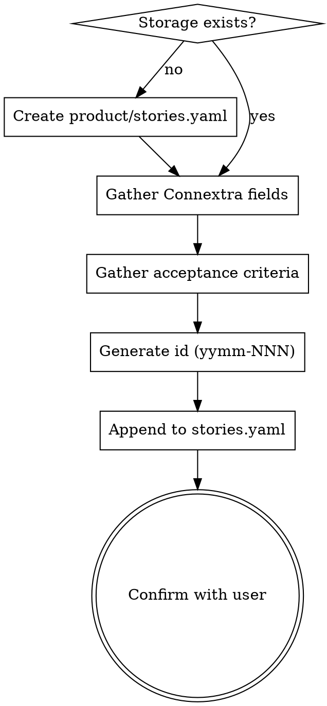

# Story Write

## Overview

Capture a single user story in classic Connextra format and append it to `product/stories.yaml`. Stories are the product-level requirements that feed downstream specs (`spec-writing`) and bd epics. They live above the implementation layer — they describe **who** wants **what** and **why**, not how to build it.

**Announce at start:** "Using story-write skill to capture this as a user story."

## Process Flow



## Storage

**File:** `product/stories.yaml` (single file, all stories).

If the file does not exist, create it with this skeleton:

```yaml
stories: []
```

If `product/` does not exist, create it. This is the canonical product backlog location for the project.

## Story Schema

Each entry under `stories:` has these fields:

| Field | Required | Type | Notes |
|-------|----------|------|-------|
| `id` | yes | string | Format `yymm-NNN`, e.g. `2605-001`. Auto-generated. |
| `title` | yes | string | One-line summary, ≤ 80 chars. |
| `role` | yes | string | The persona — "user", "developer", "admin", "guest", etc. Be specific. |
| `want` | yes | string | What they want to do. Verb phrase. |
| `because` | yes | string | The benefit / motivation. The *why*. |
| `acceptance_criteria` | yes | list[string] | Testable bullets defining "done". At least 1, usually 2-5. |
| `tags` | yes | list[string] | Short kebab-case area markers (1-4 tags). Used by `story-find` for traceability between system area and story. |
| `status` | yes | enum | `draft` (default for new), `ready`, `done`. |
| `created` | yes | string | ISO date `YYYY-MM-DD`. |

## ID Generation

IDs use `yymm-NNN` to mirror the existing epic_id pattern in this repo.

1. Get current year/month: `yy = last two digits of year`, `mm = zero-padded month`.
2. Read existing `product/stories.yaml`. Find all stories with id starting `{yy}{mm}-`.
3. Find the max NNN, add 1, zero-pad to 3 digits.
4. If none exist for this month, start at `001`.

Example for May 2026 with two existing stories `2605-001`, `2605-002` → next is `2605-003`.

## Gathering Story Content

Stories are small. Don't over-interview the user. The goal is to capture what they already have in mind, not to brainstorm the feature.

**If the user provided everything upfront** (full role/want/because/criteria in one message): write the story, don't ask anything, just confirm at the end.

**If fields are missing**: ask only for the missing pieces, one focused question per turn. Use AskUserQuestion when there are 2-4 plausible options (e.g., role choices), free-text when open-ended.

**Connextra phrasing** — when writing the final story, use this exact pattern:

> As a `<role>`, I want `<want>`, because `<because>`.

The three pieces should compose into a grammatical sentence. If they don't, the fields are wrong.

**Examples:**

Good:
- role: `data analyst`, want: `to export query results as CSV`, because: `I can share them with non-technical stakeholders`
- role: `returning customer`, want: `to see my past orders on the account page`, because: `I can re-order quickly`

Bad (vague role):
- role: `user`, want: `the app to be fast`, because: `it's better`

## Acceptance Criteria

Each criterion must be objectively testable. A criterion is good if a tester can read it and know whether it passes or fails.

**Good:**
- "CSV download includes all visible columns in the same order as the table"
- "Empty result set returns a CSV with only the header row"
- "Download triggers within 2 seconds for ≤10k rows"

**Bad:**
- "Works well" — not testable
- "Users like the export" — subjective
- "Handles large data" — vague

If the user gives only one vague criterion, push back once: "Can you add 1-2 more criteria covering [edge case / failure mode / boundary]?" Don't fabricate criteria they didn't ask for.

### When the User Gives Zero Acceptance Criteria

If the user provides **no acceptance criteria at all** (the want/because are present but no testable bullets):

1. **Preferred:** ask once — "Any acceptance criteria? 1-3 testable bullets that would let us know it's done."
2. **If asking is not possible** (e.g., you're a non-interactive agent and the user's message is the whole input): derive 2-4 baseline criteria from the `want` and `because` covering the obvious boundaries (entry point, success path, expiry/timeout, error case). **Then explicitly flag this in your confirmation:** "You didn't specify acceptance criteria, so I derived N covering [areas]. Confirm or revise."

Never silently invent criteria. The user must always know which bullets came from them and which came from you.

## Tags

Tags are the **system-area glue** that makes a story discoverable by `story-find` even when the query phrasing doesn't substring-match the title or want fields (e.g. "authentication" should still find a "reset password" story).

**Tag selection is delegated to the `tag-manage` skill** (suggest mode). That skill owns the canonical taxonomy + synonym map, so all tag logic stays in one place.

**How to use it from here:**

1. Invoke `tag-manage` in suggest mode with the draft story's role/want/because/criteria as input.
2. It returns 1-4 suggested tags drawn from the existing taxonomy (or a single bootstrap tag if the backlog is fresh).
3. Include those tags in the new story entry.
4. **If the user did not explicitly specify tags, flag in your confirmation** which tags came from the suggester so the user can revise. Same derivation-flag rule as for acceptance criteria.

**If the user explicitly listed tags in their message** (e.g. "tag this as auth and account"), use them verbatim — skip the suggester. tag-manage's `add` mode is for after-the-fact tagging, not for first-write.

**Quick reference (full rules in tag-manage):** lowercase kebab-case nouns, 1-4 per story, pick the system area not the feature name, reuse existing tags before inventing.

## Writing to stories.yaml

Append the new story to the `stories:` list. Preserve existing entries. Keep field order as listed in the schema above for readability.

**Example output for a fresh story:**

```yaml
stories:
  - id: 2605-001
    title: Export query results as CSV
    role: data analyst
    want: to export query results as CSV
    because: I can share them with non-technical stakeholders
    acceptance_criteria:
      - CSV download includes all visible columns in the same order as the table
      - Empty result set returns a CSV with only the header row
      - Download triggers within 2 seconds for ≤10k rows
    tags: [export, data]
    status: draft
    created: 2026-05-09
```

When appending to an existing file, read the file, parse it, append the new entry, write the full file back. Do not rely on string concatenation — YAML formatting matters.

## Confirmation

After writing, show the user:

1. The story id.
2. The full Connextra sentence: "As a `<role>`, I want `<want>`, because `<because>`."
3. Acceptance criteria as a bulleted list.
4. Storage path.

Ask once: "Anything to revise?" If yes, edit the story in place (same id). If no or no response, you're done.

## What This Skill Does NOT Do

- It does not plan implementation. That's `spec-writing`.
- It does not create bd tasks/epics. That's `spec-ready`.
- It does not estimate, prioritize, or assign. Those are separate workflow steps.
- It does not refine vague stories into INVEST-compliant ones. The user's wording is preserved as written; you may suggest improvements but do not silently rewrite.

## When to Defer to Other Skills

- User wants a full design discussion → `idea-brainstorming`.
- User wants to turn an approved story into a build plan → `spec-writing`.
- User wants to read / list / find existing stories → `story-read`.
