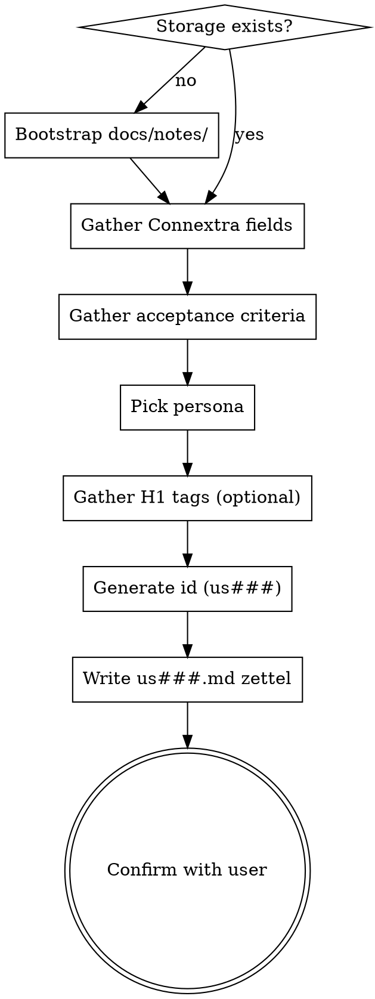

# Story Write

## Overview

Capture a single user story in Connextra format and write it as a new AKM zettel under `docs/notes/us###.md`. Stories are the product-level requirements that feed downstream Implementation zettels (`im###.md`) and bd epics. They describe **who** wants **what** and **why**, not how to build it.

**Storage backend:** AKM (Agentic Knowledge Model). The schema is documented in `docs/notes/akm.md`; this skill writes one file per story under `docs/notes/`.

**Announce at start:** "Using story-write skill to capture this as a user story."

## Process Flow



## Storage

**File:** one zettel per story at `docs/notes/us###.md` (three-digit zero-padded id).

If `docs/notes/` does not exist: create it. If `docs/product.md` does not exist, the project is not AKM-set-up — warn the user "No `docs/product.md` found; AKM workspace not initialized. Create the hub manually or via the project's `epic-create` skill first." then either proceed (zettel will reference a non-existent `[[product]]`) or abort if the user prefers.

## Zettel Schema

Every story zettel has this exact shape:

```markdown
---
aliases:
  - <human-readable want clause / title>
status: <draft|ready|in_progress|done|dropped>
created: YYYY-MM-DD
---
# Story [[<flow-or-area>]] [[<theme>]] [[product]]

## role
[[pn###|<persona-alias>]]

## want
<want clause — one sentence>

## because
<motivation — one sentence>

## acceptance_criteria
- <criterion>
- <criterion>

---

Index: [[product]]
```

**Required pieces:**

- Frontmatter `aliases:` (at least one entry — the title), `status:`, `created:` (ISO date).
- H1 with at least `[[product]]` — additional flow/theme tag wikilinks are optional.
- `## role`, `## want`, `## because`, `## acceptance_criteria` sections.
- `Index: [[product]]` footer.

**Lifecycle status values** (from `akm.md`):

| Status | Meaning |
|--------|---------|
| `draft` | captured, not refined — acceptance criteria may be incomplete |
| `ready` | refined, sized, ready for spec-writing |
| `in_progress` | bd epic exists and is being worked |
| `done` | merged — Implementation card carries the bd-epic link |
| `dropped` | abandoned — keep file for history; mark status, no delete |

New stories default to `draft`.

## ID Generation

IDs are `us` + three-digit zero-padded sequential (`us001`, `us002`, …). Not date-bucketed — the AKM model uses pure sequential ids so wikilinks like `[[us001]]` stay stable forever.

1. List existing story zettels: `ls docs/notes/us*.md` (or in-process equivalent).
2. Extract the numeric portion of each filename. Find max, add 1.
3. Zero-pad to 3 digits. If no existing stories, start at `001`.

Example: `us001.md`, `us002.md`, `us013.md` exist → next is `us014`.

If a gap exists (e.g. `us003.md` is missing because the story was dropped), do **not** reuse — gaps preserve historical context. Always take max + 1.

## Gathering Story Content

Stories are small. Don't over-interview the user. The goal is to capture what they have in mind, not to brainstorm the feature.

**If the user provided everything upfront** (full role/want/because/criteria in one message): write the story, don't ask anything, just confirm at the end.

**If fields are missing**: ask only for the missing pieces, one focused question per turn. Use AskUserQuestion when there are 2-4 plausible options (e.g., persona choices), free-text when open-ended.

**Connextra phrasing** — the final story should compose into this grammatical sentence:

> As a `<persona-alias>`, I want `<want>`, because `<because>`.

If the three pieces don't compose into a grammatical sentence, the fields are wrong — push back once.

**Examples:**

Good:
- persona: `requestor` (`pn001`), want: `order samples for upcoming client work`, because: `I need product in hand for client tasting`
- persona: `approver` (`pn002`), want: `approve or reject a submitted request`, because: `the warehouse should only pick approved orders`

Bad (vague persona):
- persona: `user`, want: `the app to be fast`, because: `it's better`

## Picking the Persona

The `## role` field is a wikilink `[[pn###|<persona-alias>]]` to a persona zettel under `docs/notes/pn###.md`.

**Lookup workflow:**

1. List existing personas: `ls docs/notes/pn*.md` (or in-process equivalent).
2. For each, read the frontmatter `aliases:` — the first alias is the canonical short label (e.g. `requestor`, `approver`).
3. **If the user named a persona that matches an existing alias** (case-insensitive substring or exact), use that `pn###` id.
4. **If no persona matches**, ask the user: "No existing persona matches `<name>`. Pick from: <list of existing aliases>, or describe a new one (I'll create the `pn###` zettel)."
5. **If they want a new persona**, write a minimal `pn###.md` per the AKM Persona schema (status `draft`, just `## name` and `## summary`) — that's outside the scope of this skill but cheap to inline.

The wikilink form is `[[pn001|requestor]]` — `pn001` is the file slug, `requestor` is the alias label that renders in `story-read`. Use the first alias from the persona's frontmatter as the label.

## Acceptance Criteria

Each criterion must be objectively testable. A criterion is good if a tester can read it and know whether it passes or fails.

**Good:**
- "browse catalog of available samples"
- "rejected request can be reopened from the rejected view"
- "preview parsed rows before commit and reject bad rows with row-level error messages"

**Bad:**
- "Works well" — not testable
- "Users like the feature" — subjective
- "Handles edge cases" — vague

If the user gives only one vague criterion, push back once: "Can you add 1-2 more criteria covering [edge case / failure mode / boundary]?" Don't fabricate criteria they didn't ask for.

### When the User Gives Zero Acceptance Criteria

If the user provides **no acceptance criteria at all** (want/because present but no testable bullets):

1. **Preferred:** ask once — "Any acceptance criteria? 1-3 testable bullets that would let us know it's done."
2. **If asking is not possible** (non-interactive mode, user's message is the whole input): derive 2-4 baseline criteria from the `want` and `because` covering obvious boundaries (entry point, success path, expiry/timeout, error case). **Then explicitly flag this in your confirmation:** "You didn't specify acceptance criteria, so I derived N covering [areas]. Confirm or revise."

Never silently invent criteria. The user must always know which bullets came from them and which came from you.

## H1 Tag Wikilinks (optional)

The H1 carries `[[product]]` plus optional flow/theme tag wikilinks for grouping in the hub:

```markdown
# Story [[requestor-flow]] [[catalog]] [[product]]
```

These are **optional** and **may dangle** — `[[requestor-flow]]` is fine even without a backing `requestor-flow.md` zettel. The moxide LSP will flag dangling links as diagnostics; users tolerate them when the tag is conceptual.

**Tag selection is delegated to the `tag-manage` skill** (suggest mode). That skill owns the canonical taxonomy + synonym map.

**How to use it from here:**

1. Invoke `tag-manage` in suggest mode with the draft story's role/want/because/criteria as input.
2. It returns 1-4 suggested tags as bare wikilink targets (e.g. `requestor-flow`, `catalog`).
3. Render them as `[[<tag>]]` in the H1, before `[[product]]`.
4. **If the user did not explicitly specify tags, flag in your confirmation** which tags came from the suggester. Same derivation-flag rule as for acceptance criteria.

**If the user explicitly listed tags in their message** (e.g. "tag this with requestor-flow and catalog"), use them verbatim — skip the suggester. tag-manage's `add` mode is for after-the-fact tagging.

**If tags are not relevant** (e.g. a one-off cross-cutting story), it's fine to write just `# Story [[product]]` with no tag wikilinks. The story-read skill handles the no-tag case.

## Writing the Zettel

Compose the full markdown file per the schema above. Write to `docs/notes/us<NNN>.md` using the generated id.

**Example output for a fresh story:**

`docs/notes/us014.md`:

```markdown
---
aliases:
  - bulk import requests from spreadsheet
status: draft
created: 2026-05-14
---
# Story [[requestor-flow]] [[import]] [[product]]

## role
[[pn001|requestor]]

## want
upload a spreadsheet to create many requests at once

## because
event prep means submitting dozens of similar requests and the per-row UI is slow

## acceptance_criteria
- accept .xlsx and .csv uploads
- each row maps to one request with line items
- preview parsed rows before commit and reject bad rows with row-level error messages

---

Index: [[product]]
```

**Conventions:**

- ISO `YYYY-MM-DD` for `created`.
- One alias entry (the title) is the minimum; add more aliases only if the user gave multiple equivalent phrasings.
- Persona wikilink form: `[[pn###|alias]]` — pipe-separated, alias label after.
- H1 tag wikilinks are bare slugs in double brackets, no pipe label needed.
- Body sections must be `## role`, `## want`, `## because`, `## acceptance_criteria` exactly — `story-read` parses on these headings.
- Footer is a `---` rule then `Index: [[product]]` on its own line.

## Updating `docs/product.md` (the hub)

The hub groups stories under `## Stories` by persona. After writing the new story, append a wikilink to it under the right persona heading. If the persona section doesn't yet exist in the hub, add it. Example diff:

```markdown
## Stories

### [[pn001|requestor]]

- [[us001|order samples for upcoming client work]]
- [[us014|bulk import requests from spreadsheet]]    ← new
```

The hub wikilink form is `[[us###|<title>]]` — pipe-separated, with the alias/title as the label for readability.

If `docs/product.md` doesn't exist, skip the hub update and tell the user "Hub `docs/product.md` not found; new story is on disk but not linked from the hub. Create the hub when ready."

## Confirmation

After writing, show the user:

1. The story id and the file path (`docs/notes/us<NNN>.md`).
2. The full Connextra sentence: "As a `<persona-alias>`, I want `<want>`, because `<because>`."
3. Acceptance criteria as a bulleted list.
4. Tags rendered in the H1 (and a note if any came from the suggester).
5. Whether the hub was updated.

Ask once: "Anything to revise?" If yes, edit the zettel in place (same id). If no or no response, you're done.

## What This Skill Does NOT Do

- It does not plan implementation. That's `spec-writing`.
- It does not create the matching `im###.md` Implementation zettel — that happens at spec time, before code lands.
- It does not create bd tasks/epics. That's `spec-ready`.
- It does not estimate, prioritize, or assign.
- It does not silently refine vague stories into INVEST-compliant ones. The user's wording is preserved; you may suggest improvements but do not silently rewrite.
- It does not touch any other zettel type (`pn###`, `ft###`, `im###`, `adr####`, `cat###`) except optionally creating a missing persona (see "Picking the Persona") and updating the hub.

## When to Defer to Other Skills

- User wants a full design discussion → `idea-brainstorming`.
- User wants to turn an approved story into a build plan → `spec-writing`.
- User wants to read / list / find existing stories → `story-read`.
- User wants to add tags to an existing story → `tag-manage` (add mode).
- User wants to map code paths to a story → `story-map`.
