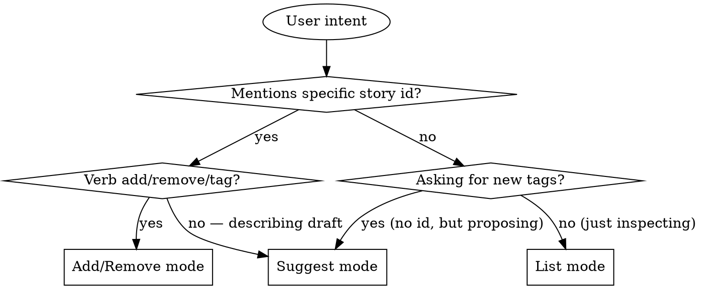

# Tag Manage

## Overview

Centralizes the tag layer of `product/stories.yaml`. Three modes:

1. **list** — show the current tag taxonomy with usage counts.
2. **add / remove** — modify the `tags` field on a specific story by id.
3. **suggest** — given draft story content (role/want/because and optionally acceptance criteria), propose 1-4 tags using the existing taxonomy first.

This skill is used directly by users and is also called by `story-write` whenever it needs to pick tags for a new story. Keeping the logic here means there is one source of truth for the taxonomy — when the rules evolve, only this skill changes.

**Announce at start:** "Using tag-manage skill to <list / add / remove / suggest> tags."

**Storage:** `product/stories.yaml`. If the file does not exist or has zero stories, list returns an empty taxonomy, add/remove fail clearly with "no story <id> found", and suggest falls back to the bootstrap rules below.

## Mode Selection



## Tag Conventions

These conventions apply across all modes:

- **Lowercase, kebab-case nouns.** `auth`, `export`, `admin`, `account`, `reports`, `billing`, `notifications`, `data`, `security`, `onboarding`.
- **System area, not action.** Prefer `auth` over `password-reset`; the action belongs in the title and want, the area belongs in tags.
- **1-4 tags per story.** More than 4 means the story is too broad — split it.
- **Reuse before invent.** Always prefer an existing tag from the taxonomy over creating a new one. Only invent when no existing tag fits.

## Mode 1: List

Read `product/stories.yaml`, walk every story's `tags` field, count occurrences.

**Output template:**

```markdown
## Tag taxonomy (product/stories.yaml)

| tag | count | example stories |
|-----|-------|-----------------|
| auth | 2 | 2605-002, 2605-005 |
| export | 2 | 2605-001, 2605-004 |
| admin | 2 | 2605-003, 2605-005 |
| reports | 2 | 2605-003, 2605-004 |
| account | 1 | 2605-002 |
| data | 1 | 2605-001 |
| security | 1 | 2605-005 |

7 distinct tags across 5 stories. Most-used: auth (2), export (2), admin (2), reports (2).
```

Sort by count descending, then alphabetically. Show up to 3 example story ids per tag (truncate with `...` if more).

If zero stories or zero tags: "No tags found. The product backlog is empty or no stories have tags yet."

## Mode 2: Add / Remove

User says "add tag X to story Y" or "remove tag X from Y" (variations: "tag 2605-001 as billing", "untag 2605-001 billing").

**Process:**

1. Parse story id and tag(s).
2. Read `product/stories.yaml`. Find the story by id.
3. If not found: error out — "Story `<id>` not found. Closest: <id1>, <id2>" (do not guess; let user pick).
4. **For add:**
   - Normalize tag to lowercase kebab-case.
   - If tag already on the story: report "Tag already present, nothing to do."
   - If tag is **not** in the existing taxonomy, warn: "Tag `<X>` is new — no other story uses it. Existing tags: a, b, c. Add anyway?" Wait for confirmation. (Skip this prompt if running under `auto` mode where the user has already authorized; in that case proceed but note "new tag — added without taxonomy precedent" in the response.)
   - Append the tag, preserving order of existing tags.
5. **For remove:**
   - If tag not on the story: "Tag `<X>` not on story `<id>`."
   - Otherwise remove and confirm.
6. Write the YAML back, preserving all other content and field order.

**Output:** show the story's id, title, and the resulting `tags:` line, plus what was changed.

```markdown
## 2605-001 — Export query results as CSV

**Tags:** [export, data, billing]

Added: `billing`. (New tag — no other story uses it yet.)
```

## Mode 3: Suggest

Given draft story content (role, want, because, optionally acceptance criteria), propose 1-4 tags.

**Algorithm:**

1. Read existing taxonomy (Mode 1 logic).
2. For each existing tag, check if any of its synonym keywords appears in the draft text. Use this lookup table — it is the canonical synonym map for the project:

| Tag | Synonym keywords (case-insensitive substring) |
|-----|-----------------------------------------------|
| `auth` | authentication, login, signin, sign-in, password, credential, token, session, mfa, 2fa, totp, otp |
| `export` | export, download, csv, xlsx, pdf, json export |
| `admin` | admin, administrator, manager, moderator |
| `reports` | report, dashboard, analytic, chart, metric |
| `account` | account, profile, my settings, my data, locked out |
| `billing` | billing, payment, invoice, subscription, plan, charge |
| `notifications` | notification, alert, email me, push, sms |
| `data` | analyst, data, query, dataset, table |
| `security` | encrypt, audit, compliance, vulnerability, gdpr, pii, secret |
| `onboarding` | onboarding, signup, sign-up, registration, first time, welcome |

3. Score each tag by how many synonym keywords matched (any field = 1 point; matches in title/want count double).
4. Return the top 1-4 tags with score ≥ 1.
5. If zero tags scored, fall back to: "No taxonomy match — propose a new tag from the system area. Suggested: `<short-noun-from-want>`."

**Output template:**

```markdown
## Suggested tags

For draft story:
> **As a** data analyst, **I want** to export query results as CSV, **because** I can share with non-technical stakeholders.

**Suggested:** `[export, data]`

- `export` — matched on "export", "csv" (existing tag, used by 2 stories)
- `data` — matched on "data analyst" (existing tag, used by 1 story)

These are reused from the existing taxonomy. Confirm or revise.
```

## What This Skill Does NOT Do

- It does not edit anything other than the `tags` field. To change role/want/because/criteria, use `story-write` with the same id.
- It does not rename or merge tags across the taxonomy in v1. (Future scope: a `rename` mode that replaces tag X with tag Y on every story.)
- It does not invent stories or fields outside the schema.

## When to Defer to Other Skills

- User wants to create a brand-new story (with role, want, because, criteria, AND tags) → `story-write`. (story-write will call this skill internally for the suggest step.)
- User wants to find stories by tag/area → `story-find`.
- User wants to view stories → `story-read`.
