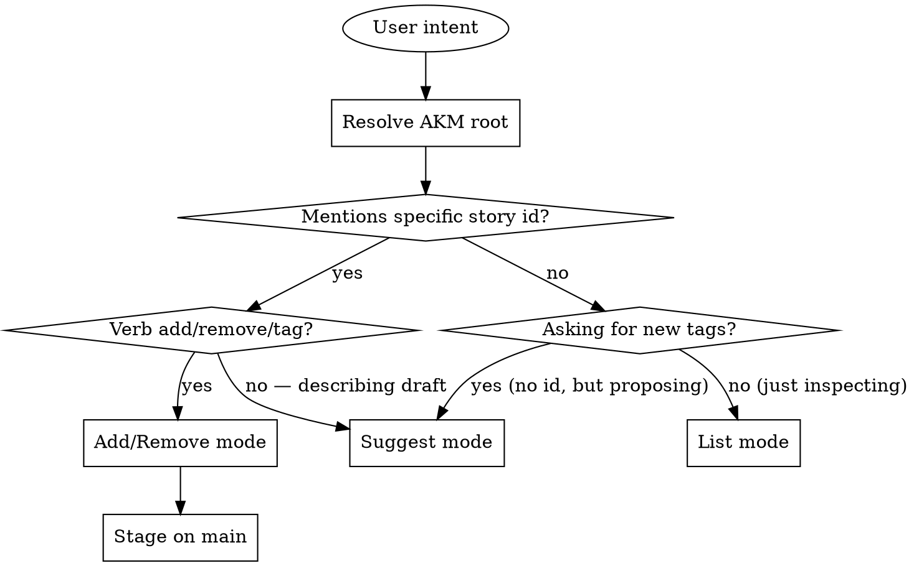

# Tag Manage

## Overview

Centralizes the tag layer of AKM story zettels (`docs/notes/us###.md`). Three modes:

1. **list** — show the current tag taxonomy with usage counts.
2. **add / remove** — modify the H1 tag wikilinks on a specific story by id.
3. **suggest** — given draft story content (role/want/because and optionally acceptance criteria), propose 1-4 tag wikilinks using the existing taxonomy first.

This skill is used directly by users and is also called by `story-write` whenever it needs to pick tags for a new story. Keeping the logic here means there is one source of truth for the taxonomy — when the rules evolve, only this skill changes.

**Announce at start:** "Using tag-manage skill to <list / add / remove / suggest> tags."

## AKM Workspace Resolution

Story zettels are shared product knowledge and live on **main**, even when
the agent's cwd is a feature-branch worktree. Tag-manage **mutates the H1
of an existing zettel in place** — if it reads/writes the wrong worktree,
the H1 edit lands on a feature branch and the main copy stays unchanged.
Resolve before any read or write:

```bash
AKM_ROOT="$(akm-root)"
```

`akm-root` returns the absolute path of the worktree on the project's
default branch (origin/HEAD → `main` → `master`); outside git, cwd.
Anchor every path on `$AKM_ROOT`:

- Scan: `$AKM_ROOT/docs/notes/us*.md`
- Read + write back: `$AKM_ROOT/docs/notes/us<id>.md`

If `akm-root` exits non-zero, surface its stderr and abort — never read
from one tree and write to another, and never silently mutate the feature
worktree's copy of a story.

**Commit policy:** this skill **stages on main without committing**.
Tag edits are micro-mutations that ride along with the caller's lifecycle
commit (story-write → draft, spec-writing → ready, etc.), so the post-edit
step is:

```bash
git -C "$AKM_ROOT" add docs/notes/us<id>.md
```

The next lifecycle skill that commits AKM picks the staged H1 change up.
See the per-stage commit table in `docs/notes/akm.md#workspace-resolution`.

## Storage

**Backend:** AKM (Agentic Knowledge Model).

- Story zettels: `$AKM_ROOT/docs/notes/us###.md`.
- Tags: wikilinks in the H1 of each story, **excluding `[[product]]`**. The `[[product]]` wikilink is structural (links to the workspace hub), not a tag.

**Example H1 carrying two tags:**

```markdown
# Story [[requestor-flow]] [[catalog]] [[product]]
```

Tags here: `requestor-flow`, `catalog`. (Drop `product`.)

**AKM-specific properties of story tags:**

- They are wikilinks, not free-text strings.
- They may **dangle** — `[[requestor-flow]]` is valid even without a backing `requestor-flow.md`. The moxide LSP flags dangling links as diagnostics, but users tolerate them when the tag is a conceptual grouping.
- Categories (`[[cat###]]`) used in Feature / Implementation / ADR zettels are a *separate* taxonomy — this skill operates only on story H1 tags, not category links. Use the same naming convention (lowercase kebab-case slugs), but don't conflate the two layers.

If `$AKM_ROOT/docs/notes/` does not exist or has no `us*.md` files: list returns an empty taxonomy, add/remove fail with "no story <id> found", suggest falls back to the bootstrap rules below.

## Mode Selection



## Tag Conventions

These conventions apply across all modes:

- **Lowercase, kebab-case nouns.** `auth`, `export`, `admin`, `account`, `reports`, `billing`, `notifications`, `data`, `security`, `onboarding`, `catalog`, `tracking`, `requestor-flow`, `approver-flow`.
- **System area or flow, not action.** Prefer `auth` over `password-reset`; the action belongs in the title and want, the area/flow belongs in tags.
- **1-4 tags per story.** More than 4 means the story is too broad — split it.
- **Reuse before invent.** Always prefer an existing tag from the taxonomy over creating a new one. Only invent when no existing tag fits.

## Mode 1: List

Scan every `$AKM_ROOT/docs/notes/us*.md`, read the H1, count occurrences of each wikilink slug (excluding `[[product]]`).

A reliable way: `grep -h '^# Story' "$AKM_ROOT/docs/notes/"us*.md`, then extract `[[...]]` slugs from each line. Or read each H1 with `head -10`.

**Output template:**

```markdown
## Tag taxonomy (docs/notes/us*.md H1 wikilinks)

| tag | count | example stories |
|-----|-------|-----------------|
| requestor-flow | 4 | us001, us003, us013 |
| catalog | 1 | us001 |
| tracking | 1 | us003 |
| approver-flow | 1 | us002 |
| import | 1 | us014 |

5 distinct tags across 5 stories. Most-used: requestor-flow (4).
```

Sort by count descending, then alphabetically. Show up to 3 example story ids per tag (truncate with `...` if more).

**Dangling vs backed.** Optionally also indicate whether a tag has a backing zettel (e.g. `requestor-flow.md` exists). If you check, render dangling tags with a `*` suffix and add a one-line note: `* = dangling (no backing zettel)`. This is informational — dangling tags are allowed per AKM.

If zero stories or zero H1 tags: "No tags found. The product backlog is empty or no stories have H1 tag wikilinks yet."

## Mode 2: Add / Remove

User says "add tag X to story Y" or "remove tag X from Y" (variations: "tag us013 as billing", "untag us013 billing").

**Process:**

1. Parse story id (`us###`) and tag slug(s).
2. Read `$AKM_ROOT/docs/notes/us<id>.md`. If not found: error out — "Story `us<id>` not found in `$AKM_ROOT`. Closest: us..., us..." (do not guess; let user pick).
3. **For add:**
   - Normalize tag to lowercase kebab-case.
   - Locate the H1 line (`# Story ...`).
   - If `[[<tag>]]` is already in the H1: report "Tag already present, nothing to do."
   - If tag is **not** in the existing taxonomy (per Mode 1 scan), warn: "Tag `<X>` is new — no other story uses it. Existing tags: a, b, c. Add anyway?" Wait for confirmation. (Skip this prompt under `auto` mode; proceed and note "new tag — added without taxonomy precedent" in the response.)
   - Insert `[[<tag>]]` into the H1 immediately before `[[product]]`, preserving the order of existing tags.
4. **For remove:**
   - If `[[<tag>]]` not in H1: "Tag `<X>` not on story `us<id>`."
   - Otherwise remove that wikilink (and the surrounding whitespace) from the H1.
5. Write the file back to `$AKM_ROOT/docs/notes/us<id>.md` — **not** the cwd. Touch only the H1 line — preserve all frontmatter and body content.
6. **Stage on main** so the caller's next lifecycle commit picks the edit up:

   ```bash
   git -C "$AKM_ROOT" add docs/notes/us<id>.md
   ```

   Do **not** commit — tag edits are micro-mutations that ride along with the story's draft/ready/done lifecycle commit.

**H1 manipulation rules:**

- Existing H1: `# Story [[requestor-flow]] [[catalog]] [[product]]`
- Add `tracking`: `# Story [[requestor-flow]] [[catalog]] [[tracking]] [[product]]`
- Remove `catalog`: `# Story [[requestor-flow]] [[product]]`
- `[[product]]` always stays last.
- One space between wikilinks. No trailing whitespace.

**Output:** show the story's id, the absolute path under `$AKM_ROOT` (so the user sees where the edit landed when invoked from a worktree), title (frontmatter `aliases[0]`), and the resulting H1 line, plus what was changed and that the file is staged on main.

```markdown
## us013 — resubmit a Rejected or Blocked request after revising it

**File:** `$AKM_ROOT/docs/notes/us013.md` (staged on main, not committed)

**H1:** `# Story [[requestor-flow]] [[tracking]] [[product]]`

Added: `tracking`. (New tag — no other story uses it yet.)
```

## Mode 3: Suggest

Given draft story content (role, want, because, optionally acceptance criteria), propose 1-4 tag wikilinks.

**Algorithm:**

1. Read the existing taxonomy (Mode 1 logic).
2. For each existing tag, check if any of its synonym keywords appears in the draft text. Use this lookup table — it is the canonical synonym map:

| Tag | Synonym keywords (case-insensitive substring) |
|-----|-----------------------------------------------|
| `auth` | authentication, login, signin, sign-in, password, credential, token, session, mfa, 2fa, totp, otp |
| `export` | export, download, csv, xlsx, pdf, json export |
| `import` | import, upload, spreadsheet, .xlsx, .csv, bulk-create |
| `admin` | admin, administrator, manager, moderator |
| `reports` | report, dashboard, analytic, chart, metric |
| `account` | account, profile, my settings, my data, locked out |
| `billing` | billing, payment, invoice, subscription, plan, charge |
| `notifications` | notification, alert, email me, push, sms |
| `data` | analyst, data, query, dataset, table |
| `security` | encrypt, audit, compliance, vulnerability, gdpr, pii, secret |
| `onboarding` | onboarding, signup, sign-up, registration, first time, welcome |
| `catalog` | catalog, browse, listing, products, items, inventory |
| `tracking` | track, status, dashboard, progress, lifecycle |
| `requestor-flow` | requestor, request, submit, order, create new |
| `approver-flow` | approver, approve, reject, review, queue |

3. Score each tag by how many synonym keywords matched (any field = 1 point; matches in title/want count double).
4. Return the top 1-4 tags with score ≥ 1.
5. If zero tags scored, fall back to: "No taxonomy match — propose a new tag from the system area. Suggested: `<short-noun-slug-from-want>`." (Render as `[[<slug>]]` since that's the wikilink form needed by `story-write`.)

**Output template:**

```markdown
## Suggested tags

For draft story:
> **As a** requestor, **I want** upload a spreadsheet to create many requests at once, **because** the per-row UI is slow.

**Suggested:** `[[requestor-flow]] [[import]]`

- `requestor-flow` — matched on "requestor", "create" (existing tag, used by 4 stories)
- `import` — matched on "upload", "spreadsheet" (existing tag, used by 1 story)

These are reused from the existing taxonomy. Confirm or revise.
```

The suggester returns wikilink form (`[[<slug>]]`) so the caller can drop them into the H1 directly. Bare slugs are fine in the bullet explanations.

## What This Skill Does NOT Do

- It does not edit anything other than the H1 of the target story. To change role/want/because/criteria, use `story-write` (re-emit with the same id) or edit the body manually.
- It does not rename or merge tags across the taxonomy in v1. (Future scope: a `rename` mode that replaces `[[X]]` with `[[Y]]` on every story.)
- It does not invent stories or fields outside the AKM schema.
- It does not validate that the tag has a backing zettel — dangling tags are allowed per AKM. It can *report* dangling status in List mode, but does not block.
- It does not touch `[[product]]` or any structural wikilink. It does not touch category wikilinks `[[cat###]]` (those belong to Feature / Implementation / ADR zettels, a separate taxonomy).

## When to Defer to Other Skills

- User wants to create a brand-new story (with role, want, because, criteria, AND tags) → `story-write`. (story-write will call this skill internally for the suggest step.)
- User wants to find stories by tag/area → `story-find`.
- User wants to view stories → `story-read`.
- User wants to manage Category taxonomy for ADRs / Features / Implementations → not in this skill's scope (cat### zettels are managed manually or via a future `category-manage` skill).
