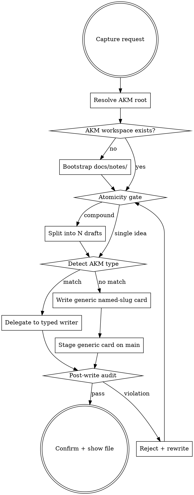

<skill_overview>
A zettel is one idea, kept short, connected to the rest of the graph. This skill is the front door for any knowledge-capture request: it forces the user (and the model) through a single-idea gate before any file is written, decides whether the capture matches a typed AKM zettel or a generic card, and emits the file with the required wikilink scaffolding. The discipline matters because the value of a zettelkasten lives in the graph, not in the prose — a long, compound, orphaned card is worse than no card.
</skill_overview>

<rigidity_level>
MEDIUM FREEDOM — two checks are non-negotiable because they are the things that decay first when capture is rushed:

1. **Atomicity gate.** Before any file is written, name the *one* claim the card makes. If the user description contains "and", "also", "plus", or multiple distinct claims, split into N drafts before continuing — don't try to fit them into one card and clean up later.
2. **Link scaffolding.** Every emitted file carries `[[product]]` in the H1 and `Index: [[product]]` footer (AKM invariant), plus at least one outbound wikilink to an existing zettel beyond `[[product]]`. A card that links nowhere is dead weight.

Type detection (which AKM writer to call) is flexible — guess from context, confirm if ambiguous.
</rigidity_level>

<quick_reference>

| Check | Hard? | Rule |
|-------|-------|------|
| Single idea | yes | One claim per card. Compound topics split before writing. |
| Body length | yes | ≤ 300 words / ~30 lines body (excluding frontmatter + footer). Typed AKM schemas with many sections get soft warning instead. |
| Line wrap | yes | Prose lines ≤ 80 chars. Exempt: code blocks, tables, link/URL lines that would break if wrapped. |
| Outbound wikilinks | yes | ≥ 1 link beyond `[[product]]` and `Index:`. Use `[[id]]` or `[[slug]]` to existing notes; surface dangling links via moxide LSP. |
| AKM invariants | yes | `[[product]]` in H1 + `Index: [[product]]` footer on every typed zettel. Filename = stable id. |
| Type routing | soft | Match request → AKM type → typed writer; else generic named-slug card. |

**Routing decision:**

| Request shape | Route to |
|---------------|----------|
| "as a … I want …" / backlog item / requirement | `infinifu:story-write` (`us###`) |
| Decision / "we chose X over Y" / architectural commitment | `infinifu:adr-write` (`adr####`) |
| Reusable capability / shared service / building block | `infinifu:feature-write` (`ft###`) |
| Story-specific solution shape / "how we build us###" | `infinifu:implementation-write` (`im###`) |
| User role / "for whom" | `infinifu:persona-write` (`pn###`) |
| Taxonomy bucket / category label | `infinifu:category-write` (`cat###`) |
| Free-form concept / glossary / external knowledge | generic named-slug card at `docs/notes/<slug>.md` (no numeric id, no schema beyond H1 + Index) |

</quick_reference>

<when_to_use>
**Use when:**

- User wants to capture knowledge but the type is not obvious ("write down what we learned about X")
- User explicitly invokes zettelkasten / atomic-note / card vocabulary
- User wants a free-form concept note that doesn't fit any AKM type
- Another skill (story-write, adr-write, …) finishes a write and an atomicity audit is warranted

**Don't use for:**

- Daily journaling — write directly to `docs/notes/daily/YYYY-MM-DD.md` per the moxide config; daily notes are intentionally non-atomic logs and don't go through this gate
- Updating the singleton `docs/product.md` — it's the hub, not a zettel
- Editing an existing zettel's content — re-invoke the typed writer for that type with the same id; this skill is for *new* captures
- Bulk imports — process them in series, one card at a time, so the atomicity gate fires per card
</when_to_use>

<workspace_resolution>
Zettels are shared knowledge — they live on **main**, even when the agent's cwd is a feature-branch worktree. Resolve before any file op:

```bash
AKM_ROOT="$(akm-root)"
```

`akm-root` returns the main-worktree path (default branch); outside git, cwd. Anchor every path on `$AKM_ROOT` (`$AKM_ROOT/docs/notes/<slug>.md`, `$AKM_ROOT/docs/product.md`). If `akm-root` errors, surface its stderr and abort — never silently land a card on the feature branch.

**Two-mode commit policy:**

- **Delegating to a typed writer** (story-write, adr-write, feature-write, implementation-write, persona-write, category-write) → the called skill owns its own resolution and commit policy. This skill stops at routing; do **not** stage or commit on its behalf.
- **Generic named-slug card** (no AKM type matched) → this skill **stages on main without committing**: `git -C "$AKM_ROOT" add docs/notes/<slug>.md`. Generic cards are draft-ish concept notes; they ride along with the next lifecycle commit from a typed write or get committed manually when the workspace is tidied.

See the per-stage commit table in `docs/notes/akm.md#workspace-resolution`.
</workspace_resolution>

<the_process>

## Flow



## Step 1 — Atomicity gate (before any file write)

Restate the capture as **one declarative sentence**. If you can't, the request is compound.

**Surface compounds** are obvious — the restated sentence contains "and", "also", "plus", "as well as", "while also", or two distinct nouns acting as the subject of two distinct verbs.

**Hidden compounds** are the dangerous case. The request looks atomic but a second idea is hiding in a comparison, a contrast, or a parenthetical. Watch for these patterns:

- *"X — how it differs from Y"* — definition of X **plus** comparison-of-X-and-Y are two cards (or three: X, Y, and the comparison principle).
- *"the right way to do X (in contrast to Z)"* — the contrast is a separate principle worth its own card.
- *"X, the kind we ran into during the Y incident"* — usually just X with provenance; **but** if the user wants the incident persisted too, that's a second card.
- *"X is great because Y"* where Y is itself a non-obvious claim — separate `[[X]]` and `[[Y]]` cards linked.

The cure for any of these is a wikilink between two atomic cards, not a section heading inside one compound card. When in doubt, propose the split — the user can tell you to merge, but the reverse takes longer.

When compound:

1. List the N atomic claims the user actually wants captured.
2. Show the list back: *"That's N cards by my read — A: …, B: …. Should I write them as separate zettels linked to each other?"*
3. After confirmation, write them in series, one card at a time, with mutual `[[…]]` links.

When single: proceed to type detection.

## Step 2 — Type detection (route, don't duplicate schema)

Use the routing table in `<quick_reference>`. Match by the *shape* of the request, not by surface keywords — "I want…" inside a description of an architectural decision is still an ADR, not a story.

When a request matches an AKM type **and** a typed writer skill exists, call that skill — it owns the schema, the id sequence, the type-specific lifecycle, **and its own workspace resolution + commit/stage call**. This skill stops at the handoff; do not stage or commit on the typed writer's behalf, it has already done so per its policy.

All six AKM types now have typed writers (`infinifu:story-write`, `infinifu:adr-write`, `infinifu:feature-write`, `infinifu:implementation-write`, `infinifu:persona-write`, `infinifu:category-write`). Always delegate; never duplicate the schema here. If a request matches a typed AKM bucket but the typed writer is somehow unreachable, fall back to writing the card raw under `$AKM_ROOT/docs/notes/` per `akm.md` (and stage it like a generic card) and flag the broken delegation.

**H1 tag wikilinks on typed zettels.** Many AKM types allow optional taxonomy tags in the H1 (`# Story [[flow-or-area]] [[theme]] [[product]]`). Add a tag only when a backing zettel for it already exists in `$AKM_ROOT/docs/notes/`, or when the user has explicitly named one to create. Never fabricate a tag wikilink just because the type's schema "allows" it — a dangling tag adds noise to the moxide diagnostics without adding any graph value. The required `[[product]]` link is non-negotiable; everything else is opt-in.

When the request fits no AKM type, write a generic named-slug card (next step).

## Step 3 — Generic named-slug card (when no AKM type fits)

Free-form concept notes, glossary entries, distilled external knowledge, principle cards. These have no numeric id, no rigid schema, no lifecycle status — just one idea, short, linked.

**Location:** `$AKM_ROOT/docs/notes/<kebab-slug>.md`. The slug *is* the wikilink target — pick it to read well inside `[[brackets]]` (e.g. `[[cap-theorem]]`, `[[bus-factor]]`, `[[atomic-commits]]`).

**Stage after writing** (do **not** commit — generic cards are draft-ish, the next typed-write lifecycle commit picks them up, or the user tidies the workspace later):

```bash
git -C "$AKM_ROOT" add "docs/notes/<slug>.md"
```

**Minimal schema:**

```markdown
---
aliases:
  - <one-line title — how this concept reads in prose>
created: YYYY-MM-DD
---
# <Title> [[product]]

<one paragraph: the single claim, the why, the bound>

## see also
- [[<slug-or-id>|<label>]]
- [[<slug-or-id>|<label>]]

---

Index: [[product]]
```

**Why this shape:**

- `aliases` + H1 title carry the human label; the slug stays as the stable handle.
- One paragraph body keeps the card honest — if a section starts feeling necessary, the card is already two ideas.
- `## see also` is the link surface. At least one entry is mandatory (atomicity check).
- `created` only, no `status` — generic concept notes don't have a workflow lifecycle; they exist or they don't.

## Step 4 — Post-write audit (hard gate before reporting "done")

Re-read the file you just wrote and check:

| Check | Pass condition | On fail |
|-------|----------------|---------|
| Single idea | One claim restatable in one sentence | Reject — go back to atomicity gate with split plan |
| Body length | ≤ 300 words / ~30 lines (typed AKM zettel: schema sections fit naturally — no padding) | Trim or split |
| Line wrap | Prose lines ≤ 80 chars (code blocks, tables, unbreakable URLs exempt) | Re-flow paragraph, do not silently leave long lines |
| Outbound wikilinks | ≥ 1 link beyond `[[product]]` and `Index:` line | Add a `## see also` link or reject as orphan |
| AKM invariants | `[[product]]` in H1, `Index: [[product]]` footer, valid filename | Fix and re-emit |
| Schema (typed only) | Matches `akm.md` for the type | Re-emit; do not "almost" the schema |

Quote violations back to the user — don't silently fix and pretend the card was clean. The point of a hard gate is that fixes are visible.

## Step 5 — Confirm

Show the absolute file path under `$AKM_ROOT` (so the user sees where it landed when invoked from a worktree), the one-sentence restatement of the claim, the outbound links, and — for generic cards — that the file was **staged** on main without a commit. End with: *"Wrote `$AKM_ROOT/docs/notes/<slug>.md` — one claim, N outbound links, staged on main. Anything to refine?"*

For delegated typed writes, the called skill owns its own confirmation; this skill just reports the handoff.

</the_process>

<examples>

**Example 1 — generic concept note**

Input: *"capture what we learned today: the bus factor is the number of people who can leave a project before it stalls, and it's an underused complement to test coverage when reviewing on-call rotations"*

After atomicity gate: one idea (definition of bus factor as a metric, with one use case). Single sentence: *"Bus factor is the count of people whose absence stalls a project; useful as a coverage-of-people complement to coverage-of-code when auditing on-call rotations."* ✓ atomic.

Type detection: not a story, not an ADR, not a feature → generic named-slug card.

File: `$AKM_ROOT/docs/notes/bus-factor.md`

```markdown
---
aliases:
  - bus factor — coverage-of-people metric
created: 2026-05-15
---
# Bus factor [[product]]

The number of people whose absence would stall a project. Treat it the way you treat code coverage: a low number is a leading indicator of risk, not a number to optimise for its own sake. Most useful when reviewing on-call rotations and inheritance plans, where coverage-of-people is the question and coverage-of-code does not answer it.

## see also
- [[on-call-rotation]]
- [[knowledge-silos]]

---

Index: [[product]]
```

**Example 2 — compound request gets split**

Input: *"write a zettel about CRDTs and operational transforms, they're both ways to handle concurrent edits but they have different trade-offs"*

After atomicity gate: TWO claims — (a) CRDTs as concurrent-edit primitive, (b) OT as concurrent-edit primitive, with a comparison. Compound.

Confirm split: *"Two cards by my read: A — `crdt`, B — `operational-transform`, with mutual `see also` links and an optional third `concurrent-edit-strategies` index card that points to both. OK?"*

After confirmation, write A then B (then optionally the index card), each with one claim.

**Example 3 — request routes to typed writer**

Input: *"as a field sales rep, I want to bulk-upload contact CSVs because typing them in the office is dead time"*

Atomicity: single ask, single persona, single motivation ✓.

Type detection: Connextra pattern, named persona, want, because → matches `us###` story.

Route: invoke `infinifu:story-write` and stop. The atomicity gate already passed; the typed writer owns the schema.

</examples>

<critical_rules>

- **One idea per card.** A card making two claims is two cards waiting to be split. The atomicity gate runs before any write — never after.
- **Wrap prose at 80 chars.** Long unbroken lines wreck diffs, terminal rendering, and vim navigation; the 80-char cap forces tight phrasing and keeps review noise low. Code blocks, tables, and unbreakable URLs are the only exceptions — wrap everything else by hand at sentence/clause boundaries, not mid-word.
- **Every card links.** A card with no outbound wikilink beyond `[[product]]` is an orphan and gets rejected. The graph is the value; the prose is the body.
- **Don't duplicate the AKM schema.** Typed writers own their schemas; this skill routes to them. `docs/notes/akm.md` is the canonical reference for every typed body shape.
- **Slugs are wikilink-shaped.** Read `[[bus-factor]]` aloud — it should sound like the concept. Avoid dates, owners, or context in the slug; those go in the aliases or body.
- **No status on generic cards.** Lifecycle states (`draft|ready|done|…`) belong to typed AKM zettels with workflows. Generic concept notes either exist or don't.
- **Reject visibly.** When a post-write check fails, quote the violation and rewrite — don't silently patch. The user learns the discipline from seeing the rejections.
- **Daily notes are exempt.** Journal entries under `docs/notes/daily/` are intentionally non-atomic logs; do not route them through this skill.

</critical_rules>

<verification_checklist>

Before reporting the capture complete:

- [ ] One-sentence restatement of the card's claim fits, no "and" / "also"
- [ ] Body ≤ 300 words / ~30 lines (typed schema sections fit naturally without padding)
- [ ] Prose lines wrapped at ≤ 80 chars (code blocks, tables, unbreakable URLs exempt)
- [ ] ≥ 1 outbound wikilink beyond `[[product]]` and `Index:` footer
- [ ] `[[product]]` present in H1, `Index: [[product]]` footer present
- [ ] Filename is stable (`us###` / `im###` / … for typed; `<kebab-slug>` for generic) — not date-stamped, not owner-stamped
- [ ] File lives under `$AKM_ROOT/docs/notes/` (resolved via `akm-root`), not under the feature-branch worktree's cwd
- [ ] If typed: schema matches `akm.md` exactly (sections, frontmatter keys); commit/stage on main was handled by the typed writer
- [ ] If generic: `## see also` present with at least one entry; file was **staged** on main (`git -C "$AKM_ROOT" add docs/notes/<slug>.md`) and **no commit** was created
- [ ] Confirmation surfaces the absolute `$AKM_ROOT/docs/notes/...` path so the user sees where it landed
- [ ] moxide LSP shows no unresolved diagnostics for the new wikilinks (or the dangles are deliberate and noted)

</verification_checklist>

<integration>

**Called by:** `infinifu:idea-brainstorming` when a discussion lands on a concept worth persisting; ad hoc by the user.

**Calls:**

- `infinifu:story-write` — when the request matches a `us###` user story
- `infinifu:adr-write` — `adr####` decisions
- `infinifu:feature-write` — `ft###` reusable capabilities
- `infinifu:implementation-write` — `im###` solution shape per story
- `infinifu:persona-write` — `pn###` user roles
- `infinifu:category-write` — `cat###` taxonomy buckets
- `infinifu:tag-manage` — after the card is written, when the user wants to attach H1 tag wikilinks
- `infinifu:story-map` — after an implementation card lands, to attach code paths

**Complements:**

- `infinifu:story-find` / `infinifu:story-read` — read-side counterparts; this skill writes, those skills query
- `infinifu:idea-brainstorming` — upstream design conversation; this skill captures the artifact when the design is concrete enough to persist

</integration>

<references>

- `docs/notes/akm.md` — canonical AKM schema for every typed zettel. Load when routing to a type or auditing a typed write against its schema.
- `infinifu:meta-skill-writing` — house style for this skill's own SKILL.md; load when refactoring this file.

</references>
